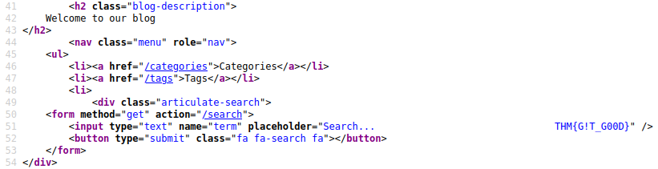
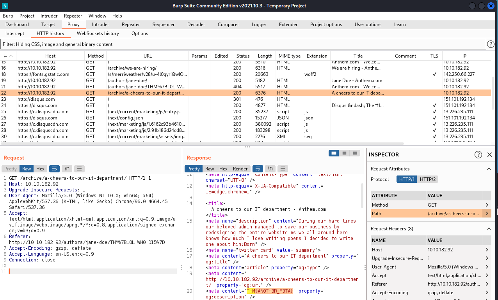
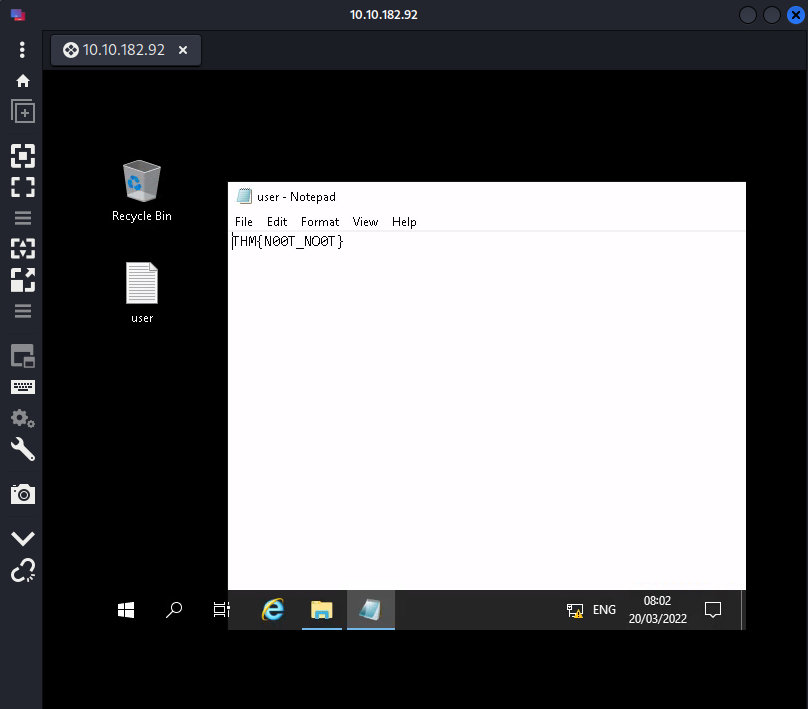
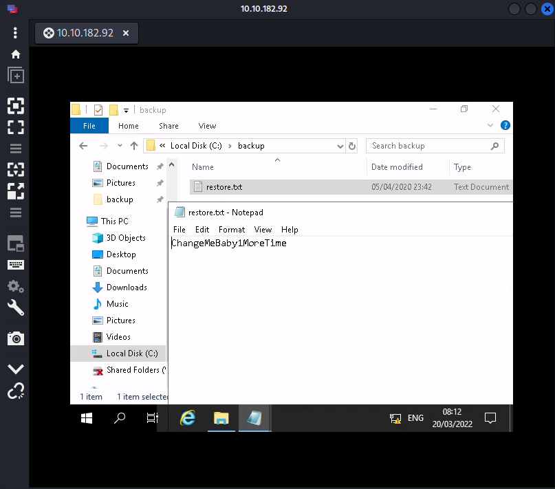
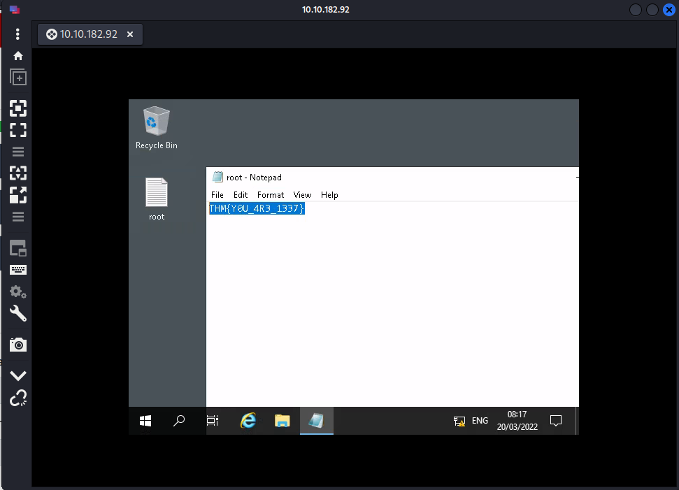

# THM - Anthem

A Windows based machine for a change.

## Date Commenced 17MAR2022


---
## IP Address
### Attempt 1
export IP=10.10.67.15

### Attempt 2 - 18MAR2022
export IP=10.10.161.36


---
## Open Ports
Basic **nmap** scan shows the following ports are open:

>80
>
>3389

> nmap $IP -vvv -oN Results/nmap01.log

```
Starting Nmap 7.92 ( https://nmap.org ) at 2022-03-17 10:48 EDT
Initiating Ping Scan at 10:48
Scanning 10.10.67.15 [2 ports]
Completed Ping Scan at 10:48, 0.22s elapsed (1 total hosts)
Initiating Parallel DNS resolution of 1 host. at 10:48
Completed Parallel DNS resolution of 1 host. at 10:48, 0.08s elapsed
DNS resolution of 1 IPs took 0.08s. Mode: Async [#: 1, OK: 0, NX: 1, DR: 0, SF: 0, TR: 1, CN: 0]
Initiating Connect Scan at 10:48
Scanning 10.10.67.15 [1000 ports]
Discovered open port 3389/tcp on 10.10.67.15
Discovered open port 80/tcp on 10.10.67.15
Completed Connect Scan at 10:49, 15.06s elapsed (1000 total ports)
Nmap scan report for 10.10.67.15
Host is up, received syn-ack (0.23s latency).
Scanned at 2022-03-17 10:48:55 EDT for 15s
Not shown: 998 filtered tcp ports (no-response)
PORT     STATE SERVICE       REASON
80/tcp   open  http          syn-ack
3389/tcp open  ms-wbt-server syn-ack

Read data files from: /usr/bin/../share/nmap
Nmap done: 1 IP address (1 host up) scanned in 15.40 seconds
```

More intensive **nmap** scan:

> nmap $IP -sC -sV -A -p 80,3389,6500,6501 -oN Results/nmap02.log

```
Starting Nmap 7.92 ( https://nmap.org ) at 2022-03-17 10:49 EDT
Nmap scan report for 10.10.67.15
Host is up (0.23s latency).

PORT     STATE    SERVICE       VERSION
80/tcp   open     http          Microsoft HTTPAPI httpd 2.0 (SSDP/UPnP)
3389/tcp open     ms-wbt-server Microsoft Terminal Services
| rdp-ntlm-info: 
|   Target_Name: WIN-LU09299160F
|   NetBIOS_Domain_Name: WIN-LU09299160F
|   NetBIOS_Computer_Name: WIN-LU09299160F
|   DNS_Domain_Name: WIN-LU09299160F
|   DNS_Computer_Name: WIN-LU09299160F
|   Product_Version: 10.0.17763
|_  System_Time: 2022-03-17T14:50:11+00:00
|_ssl-date: 2022-03-17T14:51:21+00:00; 0s from scanner time.
| ssl-cert: Subject: commonName=WIN-LU09299160F
| Not valid before: 2022-03-16T14:44:59
|_Not valid after:  2022-09-15T14:44:59
6500/tcp filtered boks
6501/tcp filtered boks_servc
Service Info: OS: Windows; CPE: cpe:/o:microsoft:windows

Service detection performed. Please report any incorrect results at https://nmap.org/submit/ .
Nmap done: 1 IP address (1 host up) scanned in 92.07 seconds
```


---
## Web Page

Possible user name on the website, *JD* from the blogger listed as *Jane Doe*


### Source Code
Found a possible flag in the source code:

> Flag2: THM{G!T_G00D}

Submitted as Flag 2:




### Robots.txt
Possible password in *robots.txt* and some possible directories to inspect:

```
UmbracoIsTheBest!

# Use for all search robots
User-agent: *

# Define the directories not to crawl
Disallow: /bin/
Disallow: /config/
Disallow: /umbraco/
Disallow: /umbraco_client/
```


---
## Gobuster
Running **gobuster** to find some directories:

> gobuster dir -u http://10.10.182.92  --wordlist=/usr/share/wordlists/dirbuster/directory-list-2.3-medium.txt -t 250 2> /dev/null

```
===============================================================
Gobuster v3.1.0
by OJ Reeves (@TheColonial) & Christian Mehlmauer (@firefart)
===============================================================
[+] Url:                     http://10.10.182.92
[+] Method:                  GET
[+] Threads:                 250
[+] Wordlist:                /usr/share/wordlists/dirbuster/directory-list-2.3-medium.txt
[+] Negative Status codes:   404
[+] User Agent:              gobuster/3.1.0
[+] Timeout:                 10s
===============================================================
2022/03/20 03:28:31 Starting gobuster in directory enumeration mode
===============================================================
/search               (Status: 200) [Size: 3418]
/rss                  (Status: 200) [Size: 1873]
/blog                 (Status: 200) [Size: 5394]
/sitemap              (Status: 200) [Size: 1041]
/archive              (Status: 301) [Size: 123] [--> /blog/]
/categories           (Status: 200) [Size: 3541]            
/Search               (Status: 200) [Size: 3468]            
/authors              (Status: 200) [Size: 4115]            
/tags                 (Status: 200) [Size: 3594]            
/install              (Status: 302) [Size: 126] [--> /umbraco/]
/RSS                  (Status: 200) [Size: 1873]               
/Blog                 (Status: 200) [Size: 5394]               
/Archive              (Status: 301) [Size: 123] [--> /blog/]   
/SiteMap              (Status: 200) [Size: 1041]               
/Rss                  (Status: 200) [Size: 1873]               
/Categories           (Status: 200) [Size: 3541]               
^C
[!] Keyboard interrupt detected, terminating.
===============================================================
2022/03/20 03:44:09 Finished
===============================================================
```


---
## Burpsuite
Used **Burpsuite** and ran each web page on the site through the proxxy and searched for "*THM*":



Got three more flags.

> Flag1: THM{L0L_WH0_US3S_M3T4}
>
> Flag3: THM{L0L_WH0_D15}
>
> Flag4: THM{AN0TH3R_M3TA}


---
## Remote Desktop
Guessing the following credentials and log into the Windows machine via *Remmina* to *Remote Desktop*:

> Username: SG
>
> Password: UmbracoIsTheBest!


---
## user.txt
The file *user.txt* was just sitting on the *Desktop*:




---
## PrivEsc
Just clicked around through the folders and found a *C:\backup* folder with a *restore.txt* file located within. tried to open but could not. Tried to change permissions on this file and success. Changed persmission to *Full Control* for *SG* user and opened:



Used the following creadentials to log in as root:

> Username: Administrator
>
> Password: ChangeMeBaby1MoreTime


---
## Root.txt
Again *root.txt* was just sitting on the Desktop:

> THM{Y0U_4R3_1337}



