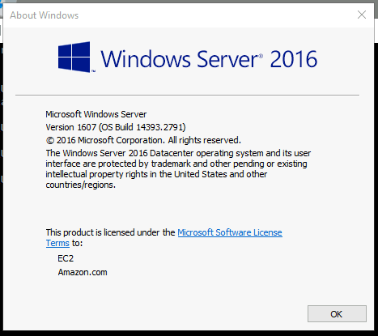

# THM - Investigating Windows 

## Date Commenced 26MAR2022

A different style machine, that is more about poking around in Windows.

---
## IP Address
### Attempt 1
export IP=10.1.222.5


---
## Whats the version and year of the windows machine?

> C:\winver



``
Windows Server 2016
```


## Which user logged in last?

>


## When did John log onto the system last?

> net user John | findstr /B /C:"Last logon"

```
C:\Users\Administrator>net user John | findstr /B /C:"Last logon"
Last logon                   3/2/2019 5:48:32 PM
```


## What IP does the system connect to when it first starts?


## What two accounts had administrative privileges (other than the Administrator user)?
Use the *Computer Management* tool to enumerate each user:

> Jenny, Guest


## Whats the name of the scheduled task that is malicous.
Scoured the tasks in *Task Scheduler* to find a *PowerShell* script that runs a *netcat* instance:

> Clean File System


## What file was the task trying to run daily?

> C:\TMP\nc.ps1


## What file was the task trying to run daily?
Read the argument passed from *Task Sheduler* to the *PowerShell* script

> 1348


## When did Jenny last logon

> Never


## At what date did the comprimise take place?
Read the creation date of the Scheduled Task:

> 03/02/2019


## At what time did Windows first assign special privileges to a new logon?


