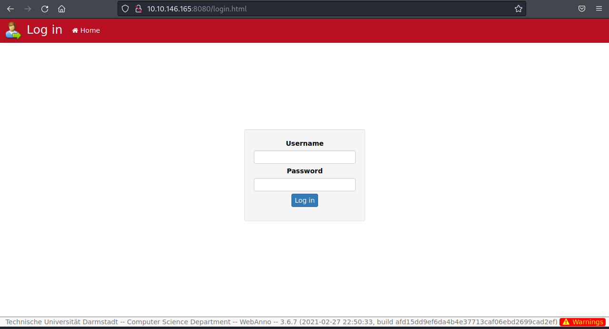
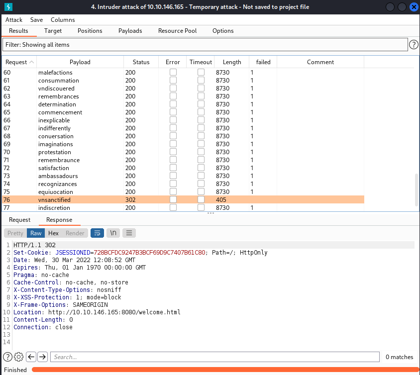

# THM - Hamlet 

## Date Commenced 30MAR2022


---
## IP Address
### Attempt 1
export IP=10.10.146.165

### Attempt 2
export IP=10.10.246.209


---
##Intitial Enumeration

### Open Ports
Perform Basic **rustscan** scan:

> 21 /tcp   open     ftp         vsftpd 3.0.3
>
> 22 /tcp   open     ssh         OpenSSH 7.6p1 Ubuntu 4ubuntu0.5 (Ubuntu Linux; protocol 2.0)
>
> 80 /tcp   open     http        lighttpd 1.4.45
>
> 501 /tcp  open     nagios-nsca Nagios NSCA


> `rustscan -a $IP | tee ./Results/01-rust-initial.log`

[Rustscan](Results/01-rust-initial.log)


### Services
Time for **nmap**

> `nmap -sV -sC -Pn -A -p $ports $IP -oN ./Results/02-nmap-initial.log`

[Nmapresults](Results/02-nmap-initial.log)


---
## Web page

### Main Page
Main page has a custom page with some basic text about the *Hamlet Annontation Project*:


There is a link to a text document with the entire script of Hamlet.

### Directories
Time for **feroxbuster**:

> `feroxbuster -u http://$IP/ -x php,pdf,txt,epub,html,cgi,css -w /usr/share/wordlists/dirbuster/directory-list-2.3-medium.txt -e -o ./Results/03-ferox-initial.log -t 200`

[FeroxResults](Results/03-ferox-initial.log)

### Robots.txt
Contains a flag:

```
User-agent: *
Allow: /

THM{1_most_mechanical_and_dirty_hand}
```


---
## FTP
It appears that *anonymous* login is enabled, plus some passwords are contained in the *Hamlet.txt* file:

``` 
******

To access Project Gutenberg etexts, use any Web browser
to view http://promo.net/pg.  This site lists Etexts by
author and by title, and includes information about how
to get involved with Project Gutenberg.  You could also
download our past Newsletters, or subscribe here.  This
is one of our major sites, please email hart@pobox.com,
for a more complete list of our various sites.

To go directly to the etext collections, use FTP or any
Web browser to visit a Project Gutenberg mirror (mirror
sites are available on 7 continents; mirrors are listed
at http://promo.net/pg).

Mac users, do NOT point and click, typing works better.

Example FTP session:

ftp sunsite.unc.edu
login: anonymous
password: your@login
cd pub/docs/books/gutenberg
cd etext90 through etext99
dir [to see files]
get or mget [to get files. . .set bin for zip files]
GET GUTINDEX.??  [to get a year's listing of books, e.g., GUTINDEX.99]
GET GUTINDEX.ALL [to get a listing of ALL books]

***
```

Straight *anonymous8 login to **FTP** gives access to two text files. The first file is a password policy and the other is for firewall status.

> `cat password-policy.md`

```
# Password Policy

## WebAnno

New passwords should be:

- lowercase
- between 12 and 14 characters long
```

> `cat ufw.status`

```
Status: active

To                         Action      From
--                         ------      ----
20/tcp                     ALLOW       Anywhere                  
21/tcp                     ALLOW       Anywhere                  
22/tcp                     ALLOW       Anywhere                  
80/tcp                     ALLOW       Anywhere                  
501/tcp                    ALLOW       Anywhere                  
8080/tcp                   ALLOW       Anywhere                  
8000/tcp                   ALLOW       Anywhere                  
1603/tcp                   ALLOW       Anywhere                  
1564/tcp                   ALLOW       Anywhere                  
50000:50999/tcp            ALLOW       Anywhere                  
20/tcp (v6)                ALLOW       Anywhere (v6)             
21/tcp (v6)                ALLOW       Anywhere (v6)             
22/tcp (v6)                ALLOW       Anywhere (v6)             
80/tcp (v6)                ALLOW       Anywhere (v6)             
501/tcp (v6)               ALLOW       Anywhere (v6)             
8080/tcp (v6)              ALLOW       Anywhere (v6)             
8000/tcp (v6)              ALLOW       Anywhere (v6)             
1603/tcp (v6)              ALLOW       Anywhere (v6)             
1564/tcp (v6)              ALLOW       Anywhere (v6)             
50000:50999/tcp (v6)       ALLOW       Anywhere (v6)
```

So **rustscan** lied again and now to perform another **nmap** scan on the above ports:

> `nmap -p 20,21,22,80,501,8080,8000,1603,1564,50000 -sV $IP -oN 04-nmap-moreports.log`

```
Starting Nmap 7.92 ( https://nmap.org ) at 2022-03-30 07:16 EDT
Nmap scan report for 10.10.146.165
Host is up (0.23s latency).

PORT      STATE  SERVICE      VERSION
20/tcp    closed ftp-data
21/tcp    open   ftp          vsftpd 3.0.3
22/tcp    open   ssh          OpenSSH 7.6p1 Ubuntu 4ubuntu0.5 (Ubuntu Linux; protocol 2.0)
80/tcp    open   http         lighttpd 1.4.45
501/tcp   open   stmf?
1564/tcp  closed pay-per-view
1603/tcp  closed picodbc
8000/tcp  open   http         Apache httpd 2.4.48 ((Debian))
8080/tcp  open   http-proxy
50000/tcp closed ibm-db2
1 service unrecognized despite returning data. If you know the service/version, please submit the following fingerprint at https://nmap.org/cgi-bin/submit.cgi?new-service :
```


---
## More Web Pages

### Port 8000
This only displays the *Hamlet.txt* file as a web page


### Port 8080
This is a login page. **WebAnno* version 3.6.7;



### Wordlist
Use **cewl** to make a wordlist:

> `cewl -w ./Results/05-cewlwordlist.log -m 12 -d 2 http://$IP`

Convert all words to lower case:

> `dd if=./Results/05-cewlwordlist.log of=./Results/06-wordlistlc.log conv=lcase`

### Brute Force
Using **burpsuite** to try and brute force login to **WebAnno** using the wordlist created previously, and we have some creds:



### Login Creds

> UN: ghost
>
> PW: vnsanctified


---
## WebAnno
Logs in OK. Appears to be a hash in the source code, but cannot crack it yet.

There is a section that can accept an uploaded file, will try *pentestmonkey*s **reverse-php-shell**. I will let you know how it goes. It didn't, kept saying it wasnt the correct zip file.

Found a *Users* sections and changed the password for the *admin* user. That was too easy. Logged in as *admin*.


