# THM - Biohazard 

## Date Commenced 26MAR2022


---
## IP Address
### Attempt 1
export IP=10.10.40.57


---
## Open Ports

### Initial Scan
Perform Basic **Rustscan** scan:

> 21
>
> 22
>
> 80

> rustscan -a $IP | tee ./Results/rustscan01.log

```
.----. .-. .-. .----..---.  .----. .---.   .--.  .-. .-.
| {}  }| { } |{ {__ {_   _}{ {__  /  ___} / {} \ |  `| |
| .-. \| {_} |.-._} } | |  .-._} }\     }/  /\  \| |\  |
`-' `-'`-----'`----'  `-'  `----'  `---' `-'  `-'`-' `-'
The Modern Day Port Scanner.
________________________________________
: https://discord.gg/GFrQsGy           :
: https://github.com/RustScan/RustScan :
 --------------------------------------
Nmap? More like slowmap.🐢

[~] The config file is expected to be at "/home/kali/.rustscan.toml"
[!] File limit is lower than default batch size. Consider upping with --ulimit. May cause harm to sensitive servers
[!] Your file limit is very small, which negatively impacts RustScan's speed. Use the Docker image, or up the Ulimit with '--ulimit 5000'. 
Open 10.10.40.57:21
Open 10.10.40.57:22
Open 10.10.40.57:80
[~] Starting Script(s)
[>] Script to be run Some("nmap -vvv -p {{port}} {{ip}}")

[~] Starting Nmap 7.92 ( https://nmap.org ) at 2022-03-26 08:56 EDT
Initiating Ping Scan at 08:56
Scanning 10.10.40.57 [2 ports]
Completed Ping Scan at 08:56, 0.27s elapsed (1 total hosts)
Initiating Parallel DNS resolution of 1 host. at 08:56
Completed Parallel DNS resolution of 1 host. at 08:56, 0.02s elapsed
DNS resolution of 1 IPs took 0.02s. Mode: Async [#: 1, OK: 0, NX: 1, DR: 0, SF: 0, TR: 1, CN: 0]
Initiating Connect Scan at 08:56
Scanning 10.10.40.57 [3 ports]
Discovered open port 22/tcp on 10.10.40.57
Discovered open port 80/tcp on 10.10.40.57
Discovered open port 21/tcp on 10.10.40.57
Completed Connect Scan at 08:56, 0.31s elapsed (3 total ports)
Nmap scan report for 10.10.40.57
Host is up, received syn-ack (0.28s latency).
Scanned at 2022-03-26 08:56:25 EDT for 1s

PORT   STATE SERVICE REASON
21/tcp open  ftp     syn-ack
22/tcp open  ssh     syn-ack
80/tcp open  http    syn-ack

Read data files from: /usr/bin/../share/nmap
Nmap done: 1 IP address (1 host up) scanned in 0.63 seconds
```

### More Intensive Scan
Use **nmap** this time:

>

```
Starting Nmap 7.92 ( https://nmap.org ) at 2022-03-26 08:56 EDT
Nmap scan report for 10.10.40.57
Host is up (0.23s latency).

PORT   STATE SERVICE VERSION
21/tcp open  ftp     vsftpd 3.0.3
22/tcp open  ssh     OpenSSH 7.6p1 Ubuntu 4ubuntu0.3 (Ubuntu Linux; protocol 2.0)
| ssh-hostkey: 
|   2048 c9:03:aa:aa:ea:a9:f1:f4:09:79:c0:47:41:16:f1:9b (RSA)
|   256 2e:1d:83:11:65:03:b4:78:e9:6d:94:d1:3b:db:f4:d6 (ECDSA)
|_  256 91:3d:e4:4f:ab:aa:e2:9e:44:af:d3:57:86:70:bc:39 (ED25519)
80/tcp open  http    Apache httpd 2.4.29 ((Ubuntu))
|_http-server-header: Apache/2.4.29 (Ubuntu)
|_http-title: Beginning of the end
Service Info: OSs: Unix, Linux; CPE: cpe:/o:linux:linux_kernel

Service detection performed. Please report any incorrect results at https://nmap.org/submit/ .
Nmap done: 1 IP address (1 host up) scanned in 16.20 seconds
```


---
## Enumerate the Web Server

### Directorires and Files
Using **feroxbuster** to see whats listed:

> feroxbuster -u http://$IP/ -x php,pdf,txt,epub,html,cgi,css -w /usr/share/wordlists/dirbuster/directory-list-2.3-medium.txt -e -o ./Results/feroxbuster01.log -t 150


```
|__  |__  |__) |__) | /  `    /  \ \_/ | |  \ |__
|    |___ |  \ |  \ | \__,    \__/ / \ | |__/ |___
by Ben "epi" Risher 🤓                 ver: 2.6.1
───────────────────────────┬──────────────────────
 🎯  Target Url            │ http://10.10.40.57/
 🚀  Threads               │ 150
 📖  Wordlist              │ /usr/share/wordlists/dirbuster/directory-list-2.3-medium.txt
 👌  Status Codes          │ [200, 204, 301, 302, 307, 308, 401, 403, 405, 500]
 💥  Timeout (secs)        │ 7
 🦡  User-Agent            │ feroxbuster/2.6.1
 💉  Config File           │ /etc/feroxbuster/ferox-config.toml
 🔎  Extract Links         │ true
 💾  Output File           │ ./Results/feroxbuster01.log
 💲  Extensions            │ [php, pdf, txt, epub, html, cgi, css]
 🏁  HTTP methods          │ [GET]
 🔃  Recursion Depth       │ 4
───────────────────────────┴──────────────────────
 🏁  Press [ENTER] to use the Scan Management Menu™
──────────────────────────────────────────────────
301      GET        9l       28w      311c http://10.10.40.57/images => http://10.10.40.57/images/
200      GET       55l      429w    22374c http://10.10.40.57/images/maxresdefault.jpg.2
200      GET       16l       86w      692c http://10.10.40.57/index.html
200      GET      843l     4984w   207914c http://10.10.40.57/images/gee.png
200      GET      300l     2143w    96533c http://10.10.40.57/images/maxresdefault.jpg.4
200      GET      103l      471w    27890c http://10.10.40.57/images/reheader.jpg
200      GET      669l     4169w   355166c http://10.10.40.57/images/Mainhall12.jpg
200      GET      498l     2813w   128186c http://10.10.40.57/images/zombie
200      GET      221l     1090w    71562c http://10.10.40.57/images/maxresdefault.jpg.1
200      GET      385l     2084w   120715c http://10.10.40.57/images/maxresdefault.jpg
200      GET      603l     3783w   185839c http://10.10.40.57/images/Mansion_front.jpg
200      GET      592l     3348w   144444c http://10.10.40.57/images/esr.jpg
200      GET      692l     3308w   184594c http://10.10.40.57/images/arr.jpg
200      GET      379l     1956w    83188c http://10.10.40.57/images/maxresdefault.jpg.3
200      GET      384l     2301w   113644c http://10.10.40.57/images/25-image21.jpg
200      GET      321l      754w    44730c http://10.10.40.57/images/16-Image33-1.jpg
200      GET       16l       86w      692c http://10.10.40.57/
301      GET        9l       28w      308c http://10.10.40.57/css => http://10.10.40.57/css/
200      GET     4402l    24773w  1244618c http://10.10.40.57/images/Vlcsnap-2015-01-26-08h54m37s183.png
200      GET       61l       74w      870c http://10.10.40.57/css/login.css
200      GET      495l     2855w   138861c http://10.10.40.57/images/maxresdefault.jpg.5
403      GET        9l       28w      276c http://10.10.40.57/.php
403      GET        9l       28w      276c http://10.10.40.57/.html
301      GET        9l       28w      307c http://10.10.40.57/js => http://10.10.40.57/js/
200      GET       21l       21w      385c http://10.10.40.57/js/login.js
301      GET        9l       28w      310c http://10.10.40.57/attic => http://10.10.40.57/attic/
200      GET        3l        7w       37c http://10.10.40.57/attic/unlock_door.php
200      GET       22l       49w      592c http://10.10.40.57/attic/index.php
403      GET        9l       28w      276c http://10.10.40.57/server-status
🚨 Caught ctrl+c 🚨 saving scan state to ferox-http_10_10_40_57_-1648305136.state ...
[#############>------] - 1h   2372568/3529104 45m     found:29      errors:102548 
[#################>--] - 1h   1585192/1764368 283/s   http://10.10.40.57/ 
[####################] - 16s  1764368/1764368 0/s     http://10.10.40.57/images => Directory listing
[####################] - 1s   1764368/1764368 0/s     http://10.10.40.57/css => Directory listing
[####################] - 1s   1764368/1764368 0/s     http://10.10.40.57/js => Directory listing
[###############>----] - 1h   1403648/1764368 269/s   http://10.10.40.57/attic 
[####################] - 0s   1764368/1764368 0/s     http://10.10.40.57/images/ => Directory listing
```

### Main Page
Is just an intro to a story and nothing really interesting in the source code. The text did contain one of the CTF answers:

> STARS Alpha Team

### /mansionmain/
Ok, so it appears to be a gaming website where there are tricks involved to find out how to move to the next page. For example, on the */mansionmain/* page, there is a question and the answer is in the source code. So moving on to the */diningroom/*:

```
<!doctype html>
        <head>
                <title>Main hall</title>
                <h1 align="center">Main hall</h1>
        </head>

        <body>
        

        <p>The team reach the mansion safe and sound. However, it appear that Chris is missing</p>
	<p>Jill try to open the door but stopped by Weasker</p>
        <p>Suddenly, a gunshot can be heard in the nearby room. Weaker order Jill to make an investigate on the gunshot. Where is the room?</p>
	<!-- It is in the /diningRoom/ -->
        </body>

</html>
```

### /diningRoom/
Oh my dear dog: the grammar and spelling are killing me. So i take the emblem and it leads to a page with the emblem flag:

> emblem{fec832623ea498e20bf4fe1821d58727}

Then I go back to the */diningRoom/* page and there is a text box wher I can enter the flag to continue:

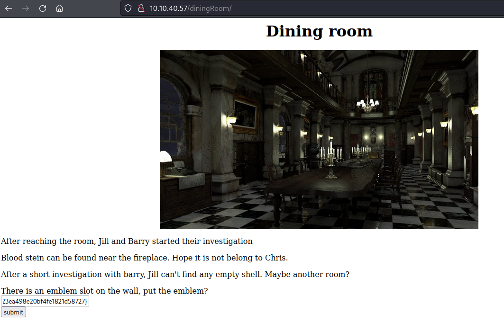

### Nothing Happen...
What an anticlimax. Put the flag in the right slot and the next page says *Nothing happen*:

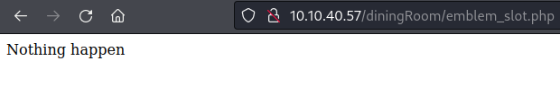

### /diningRoom/ again
So the source code contains a hash, probably *base64*:

> SG93IGFib3V0IHRoZSAvdGVhUm9vbS8=

```
echo "SG93IGFib3V0IHRoZSAvdGVhUm9vbS8=" | base64 -d                  
How about the /teaRoom/
```

### /teaRoom/
Has two options. Can visit the */artRoom/* or click the *LockPick* link.


### /artRoom/
The *artRoom* has a link as part of the game that links to a map of sorts:

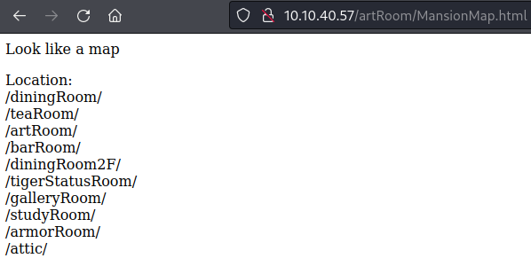

### LockPick
The *LockPick* page has the flag:

> lock_pick{037b35e2ff90916a9abf99129c8e1837}

### /barRoom/
Just going down the list in order. The */barRoom/* page has a locked door that can be opened by the *LockPick*:

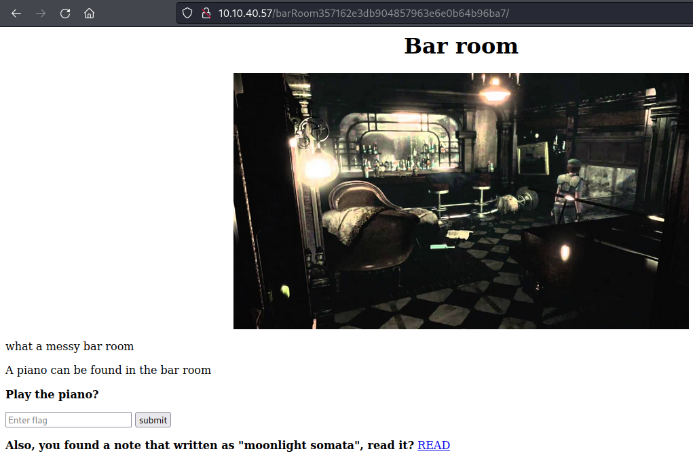

Another text box and a link. The link gives a "musical note":

> NV2XG2LDL5ZWQZLFOR5TGNRSMQ3TEZDFMFTDMNLGGVRGIYZWGNSGCZLDMU3GCMLGGY3TMZL5

Which *CyberChef* returns as:

> music_sheet{362d72deaf65f5bdc63daece6a1f676e}

Which takes us to the *Secret bar room*.

### Secret Bar Room


and links to the gold emblem:

> gold_emblem{58a8c41a9d08b8a4e38d02a4d7ff4843}

Back to the */barRoom/* to put the gold emblem into the slot. But again *Nothing happen*. And nothing in the source code. See how I go with other rooms.

OK, so I came back to this one and found that the text input box said *emblem* not *gold_emblem*. So I went back and grabbed the original flag and tried that. Got me a username methinks:

> rebecca

Not sure what this goes to though, maybe the SSH. Will try to brute force that later.

### /diningRoom2f/
Seemingly nothing here. Check the soource code.


Source code gives some gibberish:

> Lbh trg gur oyhr trz ol chfuvat gur fgnghf gb gur ybjre sybbe. Gur trz vf ba gur qvavatEbbz svefg sybbe. Ivfvg fnccuver.ugzy

Rot13 cipher decoded gives:

> You get the blue gem by pushing the status to the lower floor. The gem is on the diningRoom first floor. Visit sapphire.html

### sapphire.html
Hmmmm.... cannot find this yet...

ooops...yes I can.

> /diningRoom/sapphire.html

Which gives the blue jewel flag:

> blue_jewel{e1d457e96cac640f863ec7bc475d48aa} 

### /tigerStatusRoom/
I guess I use the blue sapphire flag here:


```
crest 1:
S0pXRkVVS0pKQkxIVVdTWUpFM0VTUlk9
Hint 1: Crest 1 has been encoded twice
Hint 2: Crest 1 contanis 14 letters
Note: You need to collect all 4 crests, combine and decode to reavel another path
The combination should be crest 1 + crest 2 + crest 3 + crest 4. Also, the combination is a type of encoded base and you need to decode it
```

*CyberChef* says that this decodes to:

> Crest1: RlRQIHVzZXI6IG

I am not yet convinced.

### /galleryRoom/


I guess I will examine the note:

```
crest 2:
GVFWK5KHK5WTGTCILE4DKY3DNN4GQQRTM5AVCTKE
Hint 1: Crest 2 has been encoded twice
Hint 2: Crest 2 contanis 18 letters
Note: You need to collect all 4 crests, combine and decode to reavel another path
The combination should be crest 1 + crest 2 + crest 3 + crest 4. Also, the combination is a type of encoded base and you need to decode it
```

So, *CyberChef* says:

> Crest2: h1bnRlciwgRlRQIHBh

### /studyRoom/
Locked Door!

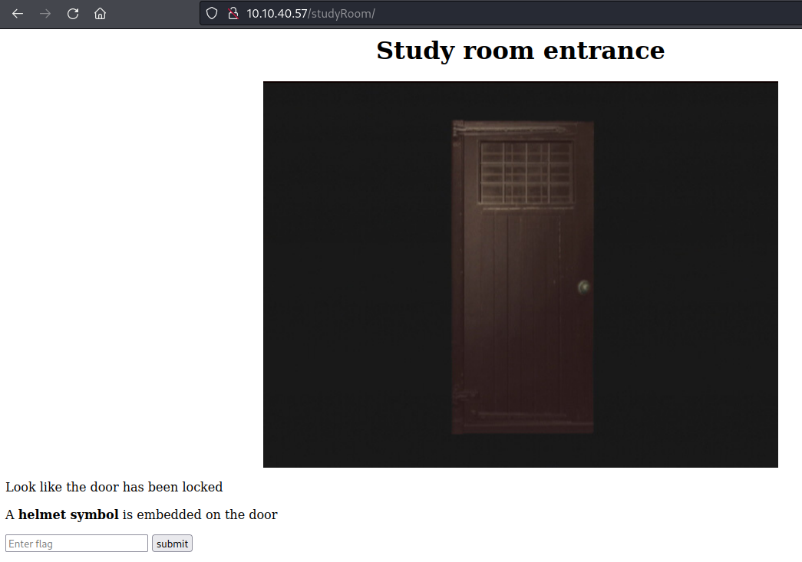

### /armorRoom/
Locked Door!

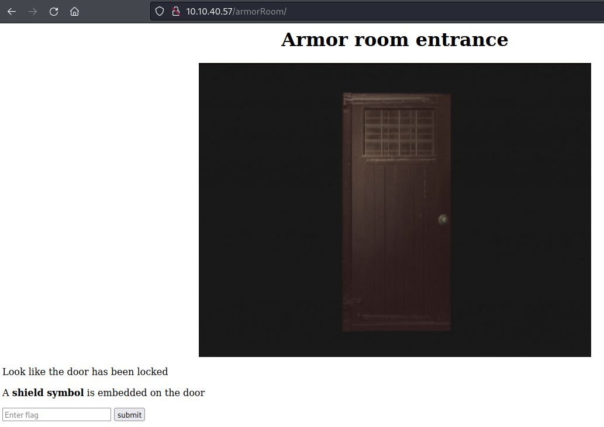

Using the shield flag we gain access:

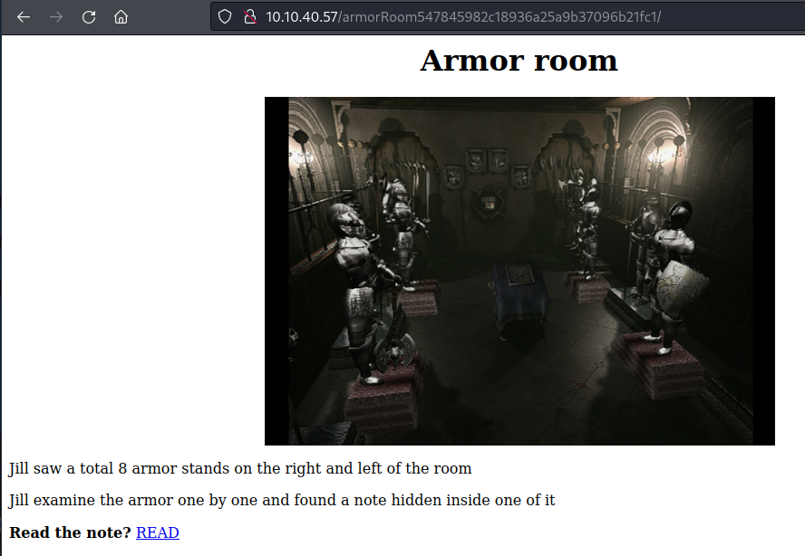

There is a note:

```
crest 3:
MDAxMTAxMTAgMDAxMTAwMTEgMDAxMDAwMDAgMDAxMTAwMTEgMDAxMTAwMTEgMDAxMDAwMDAgMDAxMTAxMDAgMDExMDAxMDAgMDAxMDAwMDAgMDAxMTAwMTEgMDAxMTAxMTAgMDAxMDAwMDAgMDAxMTAxMDAgMDAxMTEwMDEgMDAxMDAwMDAgMDAxMTAxMDAgMDAxMTEwMDAgMDAxMDAwMDAgMDAxMTAxMTAgMDExMDAwMTEgMDAxMDAwMDAgMDAxMTAxMTEgMDAxMTAxMTAgMDAxMDAwMDAgMDAxMTAxMTAgMDAxMTAxMDAgMDAxMDAwMDAgMDAxMTAxMDEgMDAxMTAxMTAgMDAxMDAwMDAgMDAxMTAwMTEgMDAxMTEwMDEgMDAxMDAwMDAgMDAxMTAxMTAgMDExMDAwMDEgMDAxMDAwMDAgMDAxMTAxMDEgMDAxMTEwMDEgMDAxMDAwMDAgMDAxMTAxMDEgMDAxMTAxMTEgMDAxMDAwMDAgMDAxMTAwMTEgMDAxMTAxMDEgMDAxMDAwMDAgMDAxMTAwMTEgMDAxMTAwMDAgMDAxMDAwMDAgMDAxMTAxMDEgMDAxMTEwMDAgMDAxMDAwMDAgMDAxMTAwMTEgMDAxMTAwMTAgMDAxMDAwMDAgMDAxMTAxMTAgMDAxMTEwMDA=
Hint 1: Crest 3 has been encoded three times
Hint 2: Crest 3 contanis 19 letters
Note: You need to collect all 4 crests, combine and decode to reavel another path
The combination should be crest 1 + crest 2 + crest 3 + crest 4. Also, the combination is a type of encoded base and you need to decode it
```

> crest3: c3M6IHlvdV9jYW50X2h

### /attic/
Locked Door!

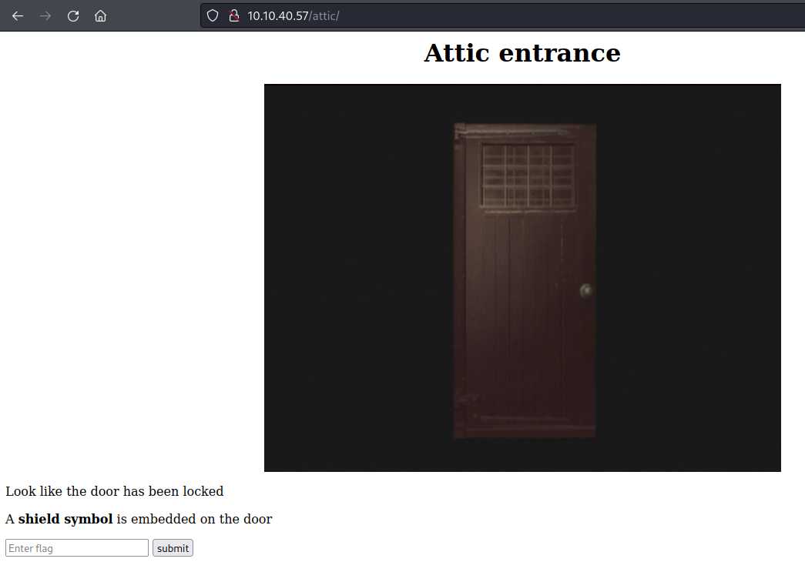

Using the shield flag I now have access:

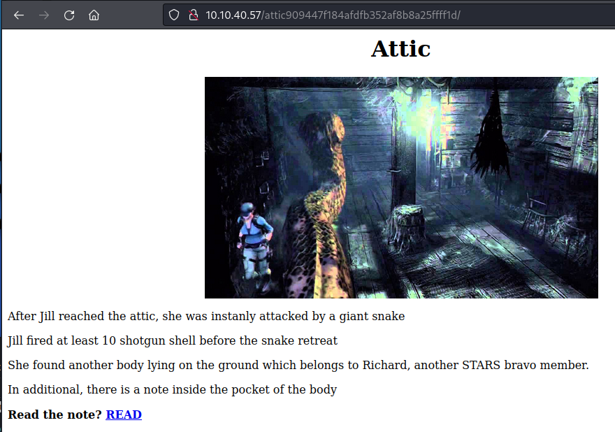

And...another note:

```
crest 4:
gSUERauVpvKzRpyPpuYz66JDmRTbJubaoArM6CAQsnVwte6zF9J4GGYyun3k5qM9ma4s
Hint 1: Crest 2 has been encoded twice
Hint 2: Crest 2 contanis 17 characters
Note: You need to collect all 4 crests, combine and decode to reavel another path
The combination should be crest 1 + crest 2 + crest 3 + crest 4. Also, the combination is a type of encoded base and you need to decode it
```

Not sure about this one. *CyberChef* seemed to struggle with it:

> NOT Crest4: u_BSc_h<|_]_ifb88

> Crest4: pZGVfZm9yZXZlcg==


### Breakthrough
Went back to the dining room and entered a flag in there (not sure which now):

> klfvg ks r wimgnd biz mpuiui ulg fiemok tqod. Xii jvmc tbkg ks tempgf tyi_hvgct_jljinf_kvc

Ah...it is a *Vigenere* cipher with the key *rebecca*:

> there is a shield key inside the dining room. The html page is called the_great_shield_key

So, going to:

> http://10.10.40.57/diningRoom/the_great_shield_key.html

gives:

> shield_key{48a7a9227cd7eb89f0a062590798cbac}

Onwards and upwards.


---
## Crests
Time to put all these crests together:

> RlRQIHVzZXI6IGh1bnRlciwgRlRQIHBhc3M6IHlvdV9jYW50X2hpZGVfZm9yZXZlcg==

Decoded gives:

> FTP+ACA-user:+ACA-hunter,+ACA-FTP+ACA-pass:+ACA-you+AF8-cant+AF8-hide+AF8-forever

So, **+AF8-** = an underscore.

> UN: hunter
>
> PW: you_cant_hide_forever


---
## FTP
Upon FTPing into the server with the above credentials, there are a number of files. Download and poke'em!

### important.txt

```
Jill,

I think the helmet key is inside the text file, but I have no clue on decrypting stuff. Also, I come across a /hidden_closet/ door but it was locked.

From,
Barry
```

### helmet_key.txt.gpg
Need the key to be able to decode this.

### Image files
As they are images of keys, I would assume that they contain parts of the key each. After much mucking around with **steghide**, **binwalk**, **zip** and others, I think this is the key to unlock the *gpg* file:

> cGxhbnQ0Ml9jYW5fYmVfZGVzdHJveV93aXRoX3Zqb2x0

Ohbladiohblada, that was correct. *CyberChef* says:

> plant42+AF8-can+AF8-be+AF8-destroy+AF8-with+AF8-vjolt

Which translates to:

> plant42_can_be_destroy_with_vjolt

```
001-key.jpg: was decrypted simply by using steghide with no password.

002-key.jpg: was decrypted with the "file" command, and the key was included in a comment.

003-key.jpg: used "binwalk" to determine that there was a hidden zip file inside, again used "binwalk" to extract. Then used unzip the "78A' file inside to give a text file containing the last art of the key.
```

Used the above passphrase to decrypt the *gpg* file to get the *helmet* flag:

```
gpg --decrypt helmet_key.txt.gpg
gpg: AES256.CFB encrypted data
gpg: encrypted with 1 passphrase
helmet_key{458493193501d2b94bbab2e727f8db4b}
```


---
## /hidden_closet/
The note from Barry to Jill makes reference to a *hidden_closet*, I am going to poke it:

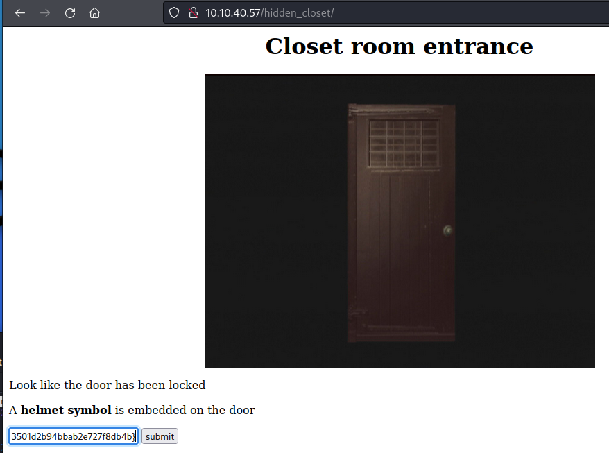

Entered the helmet flag to gain access:


Two notes. The first *MO disk 1*:

> wpbwbxr wpkzg pltwnhro, txrks_xfqsxrd_bvv_fy_rvmexa_ajk

The second is *wolf_medal.txt*

> SSH password: T_virus_rules


## /studyRoom/
Somehow missed this one:

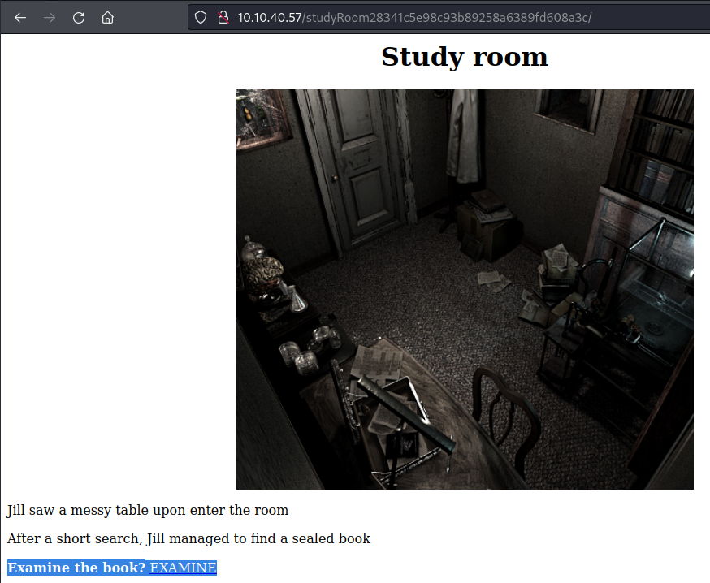

Another note, or a book rather. Book is downloaded, then *gunzip*ed, then un*tar*ed to give:

```
cat eagle_medal.txt 
SSH user: umbrella_guest
```


---
## Linux Enum
Got me some **SSH** access! Time to Poke the Penguin:

### sudo
No sudo access to anything

### SUID
Nothing out of the ordinary:

```
umbrella_guest@umbrella_corp:~$ find / -perm -4000 2> /dev/null
/bin/mount
/bin/umount
/bin/ping
/bin/su
/bin/fusermount
/usr/bin/traceroute6.iputils
/usr/bin/passwd
/usr/bin/vmware-user-suid-wrapper
/usr/bin/gpasswd
/usr/bin/chfn
/usr/bin/pkexec
/usr/bin/newgrp
/usr/bin/arping
/usr/bin/chsh
/usr/bin/sudo
/usr/lib/dbus-1.0/dbus-daemon-launch-helper
/usr/lib/xorg/Xorg.wrap
/usr/lib/snapd/snap-confine
/usr/lib/eject/dmcrypt-get-device
/usr/lib/policykit-1/polkit-agent-helper-1
/usr/lib/openssh/ssh-keysign
/usr/sbin/pppd
```

### Poking 
Found a *chris.txt* file:

```
umbrella_guest@umbrella_corp:~/.jailcell$ cat chris.txt 
Jill: Chris, is that you?
Chris: Jill, you finally come. I was locked in the Jail cell for a while. It seem that weasker is behind all this.
Jil, What? Weasker? He is the traitor?
Chris: Yes, Jill. Unfortunately, he play us like a damn fiddle.
Jill: Let's get out of here first, I have contact brad for helicopter support.
Chris: Thanks Jill, here, take this MO Disk 2 with you. It look like the key to decipher something.
Jill: Alright, I will deal with him later.
Chris: see ya.

MO disk 2: albert
```
Found another note:

```
Weaker: Finally, you are here, Jill.
Jill: Weasker! stop it, You are destroying the  mankind.
Weasker: Destroying the mankind? How about creating a 'new' mankind. A world, only the strong can survive.
Jill: This is insane.
Weasker: Let me show you the ultimate lifeform, the Tyrant.

(Tyrant jump out and kill Weasker instantly)
(Jill able to stun the tyrant will a few powerful magnum round)

Alarm: Warning! warning! Self-detruct sequence has been activated. All personal, please evacuate immediately. (Repeat)
Jill: Poor bastard
```

### linpeas.sh

```
umbrella_guest@umbrella_corp:~$ ./linpeas.sh 


                            ▄▄▄▄▄▄▄▄▄▄▄▄▄▄
                    ▄▄▄▄▄▄▄             ▄▄▄▄▄▄▄▄
             ▄▄▄▄▄▄▄      ▄▄▄▄▄▄▄▄▄▄▄▄▄▄▄▄▄▄▄▄  ▄▄▄▄
         ▄▄▄▄     ▄ ▄▄▄▄▄▄▄▄▄▄▄▄▄▄▄▄▄▄▄▄▄▄▄▄▄▄▄▄▄▄ ▄▄▄▄▄▄
         ▄    ▄▄▄▄▄▄▄▄▄▄▄▄▄▄▄▄▄▄▄▄▄▄▄▄▄▄▄▄▄▄▄▄▄▄▄▄▄▄▄▄▄▄▄▄▄
         ▄▄▄▄▄▄▄▄▄▄▄▄▄▄▄▄▄▄▄▄ ▄▄▄▄▄       ▄▄▄▄▄▄▄▄▄▄▄▄▄▄▄▄▄
         ▄▄▄▄▄▄▄▄▄▄▄          ▄▄▄▄▄▄               ▄▄▄▄▄▄ ▄
         ▄▄▄▄▄▄              ▄▄▄▄▄▄▄▄                 ▄▄▄▄ 
         ▄▄                  ▄▄▄ ▄▄▄▄▄                  ▄▄▄
         ▄▄                ▄▄▄▄▄▄▄▄▄▄▄▄                  ▄▄
         ▄            ▄▄ ▄▄▄▄▄▄▄▄▄▄▄▄▄▄▄▄▄▄▄▄▄▄▄▄▄▄▄▄▄   ▄▄
         ▄      ▄▄▄▄▄▄▄▄▄▄▄▄▄▄▄▄▄▄▄▄▄▄▄▄▄▄▄▄▄▄▄▄▄▄▄▄▄▄▄▄▄▄▄
         ▄▄▄▄▄▄▄▄▄▄▄▄▄▄                                ▄▄▄▄
         ▄▄▄▄▄  ▄▄▄▄▄                       ▄▄▄▄▄▄     ▄▄▄▄
         ▄▄▄▄   ▄▄▄▄▄                       ▄▄▄▄▄      ▄ ▄▄
         ▄▄▄▄▄  ▄▄▄▄▄        ▄▄▄▄▄▄▄        ▄▄▄▄▄     ▄▄▄▄▄
         ▄▄▄▄▄▄  ▄▄▄▄▄▄▄      ▄▄▄▄▄▄▄      ▄▄▄▄▄▄▄   ▄▄▄▄▄ 
          ▄▄▄▄▄▄▄▄▄▄▄▄▄▄        ▄          ▄▄▄▄▄▄▄▄▄▄▄▄▄▄▄ 
         ▄▄▄▄▄▄▄▄▄▄▄▄▄                       ▄▄▄▄▄▄▄▄▄▄▄▄▄▄
         ▄▄▄▄▄▄▄▄▄▄▄                         ▄▄▄▄▄▄▄▄▄▄▄▄▄▄
         ▄▄▄▄▄▄▄▄▄▄▄▄▄▄▄▄▄▄            ▄▄▄▄▄▄▄▄▄▄▄▄▄▄▄▄▄▄▄▄
          ▀▀▄▄▄   ▄▄▄▄▄▄▄▄▄▄▄▄▄▄▄▄▄▄▄▄▄▄▄▄▄▄ ▄▄▄▄▄▄▄▀▀▀▀▀▀
               ▀▀▀▄▄▄▄▄      ▄▄▄▄▄▄▄▄▄▄  ▄▄▄▄▄▄▀▀
                     ▀▀▀▄▄▄▄▄▄▄▄▄▄▄▄▄▄▄▄▄▀▀▀

    /---------------------------------------------------------------------------\
    |                             Do you like PEASS?                            |                                                                    
    |---------------------------------------------------------------------------|                                                                    
    |         Become a Patreon    :     https://www.patreon.com/peass           |                                                                    
    |         Follow on Twitter   :     @carlospolopm                           |                                                                    
    |         Respect on HTB      :     SirBroccoli & makikvues                 |                                                                    
    |---------------------------------------------------------------------------|                                                                    
    |                                 Thank you!                                |                                                                    
    \---------------------------------------------------------------------------/                                                                    
          linpeas-ng by carlospolop                                                                                                                  
                                                                                                                                                     
ADVISORY: This script should be used for authorized penetration testing and/or educational purposes only. Any misuse of this software will not be the responsibility of the author or of any other collaborator. Use it at your own computers and/or with the computer owner's permission.                
                                                                                                                                                     
Linux Privesc Checklist: https://book.hacktricks.xyz/linux-unix/linux-privilege-escalation-checklist
 LEGEND:                                                                                                                                             
  RED/YELLOW: 95% a PE vector
  RED: You should take a look to it
  LightCyan: Users with console
  Blue: Users without console & mounted devs
  Green: Common things (users, groups, SUID/SGID, mounts, .sh scripts, cronjobs) 
  LightMagenta: Your username

 Starting linpeas. Caching Writable Folders...

                                         ╔═══════════════════╗
═════════════════════════════════════════╣ Basic information ╠═════════════════════════════════════════                                              
                                         ╚═══════════════════╝                                                                                       
OS: Linux version 4.15.0-20-generic (buildd@lgw01-amd64-039) (gcc version 7.3.0 (Ubuntu 7.3.0-16ubuntu3)) #21-Ubuntu SMP Tue Apr 24 06:16:15 UTC 2018
User & Groups: uid=1001(umbrella_guest) gid=1001(umbrella) groups=1001(umbrella)
Hostname: umbrella_corp
Writable folder: /dev/shm
[+] /bin/ping is available for network discovery (linpeas can discover hosts, learn more with -h)
[+] /bin/nc is available for network discover & port scanning (linpeas can discover hosts and scan ports, learn more with -h)                        
                                                                                                                                                     

Caching directories . . . . . . . . . . . . . . . . . . . . . . . . . . . . . . . . . . . . . . . DONE
                                                                                                                                                     
                                        ╔════════════════════╗
════════════════════════════════════════╣ System Information ╠════════════════════════════════════════                                               
                                        ╚════════════════════╝                                                                                       
╔══════════╣ Operative system
╚ https://book.hacktricks.xyz/linux-unix/privilege-escalation#kernel-exploits                                                                        
Linux version 4.15.0-20-generic (buildd@lgw01-amd64-039) (gcc version 7.3.0 (Ubuntu 7.3.0-16ubuntu3)) #21-Ubuntu SMP Tue Apr 24 06:16:15 UTC 2018    
Distributor ID: Ubuntu
Description:    Ubuntu 18.04 LTS
Release:        18.04
Codename:       bionic

╔══════════╣ Sudo version
╚ https://book.hacktricks.xyz/linux-unix/privilege-escalation#sudo-version                                                                           
Sudo version 1.8.21p2                                                                                                                                


╔══════════╣ PATH
╚ https://book.hacktricks.xyz/linux-unix/privilege-escalation#writable-path-abuses                                                                   
/usr/local/sbin:/usr/local/bin:/usr/sbin:/usr/bin:/sbin:/bin:/usr/games:/usr/local/games:/snap/bin                                                   
New path exported: /usr/local/sbin:/usr/local/bin:/usr/sbin:/usr/bin:/sbin:/bin:/usr/games:/usr/local/games:/snap/bin

╔══════════╣ Date & uptime
Sat Mar 26 09:25:08 PDT 2022                                                                                                                         
 09:25:09 up  3:30,  1 user,  load average: 0.83, 0.19, 0.06

╔══════════╣ Any sd*/disk* disk in /dev? (limit 20)
disk                                                                                                                                                 

╔══════════╣ Unmounted file-system?
╚ Check if you can mount umounted devices                                                                                                            
sed: -e expression #1, char 358: unknown option to `s'                                                                                               

╔══════════╣ Environment
╚ Any private information inside environment variables?                                                                                              
LESSOPEN=| /usr/bin/lesspipe %s                                                                                                                      
HISTFILESIZE=0
MAIL=/var/mail/umbrella_guest
USER=umbrella_guest
SSH_CLIENT=10.9.2.170 51758 22
SHLVL=1
HOME=/home/umbrella_guest
OLDPWD=/
SSH_TTY=/dev/pts/0
DBUS_SESSION_BUS_ADDRESS=unix:path=/run/user/1001/bus
LOGNAME=umbrella_guest
_=./linpeas.sh
XDG_SESSION_ID=14
TERM=xterm-256color
PATH=/usr/local/sbin:/usr/local/bin:/usr/sbin:/usr/bin:/sbin:/bin:/usr/games:/usr/local/games:/snap/bin
XDG_RUNTIME_DIR=/run/user/1001
LANG=en_US.UTF-8
HISTSIZE=0
LS_COLORS=rs=0:di=01;34:ln=01;36:mh=00:pi=40;33:so=01;35:do=01;35:bd=40;33;01:cd=40;33;01:or=40;31;01:mi=00:su=37;41:sg=30;43:ca=30;41:tw=30;42:ow=34;42:st=37;44:ex=01;32:*.tar=01;31:*.tgz=01;31:*.arc=01;31:*.arj=01;31:*.taz=01;31:*.lha=01;31:*.lz4=01;31:*.lzh=01;31:*.lzma=01;31:*.tlz=01;31:*.txz=01;31:*.tzo=01;31:*.t7z=01;31:*.zip=01;31:*.z=01;31:*.Z=01;31:*.dz=01;31:*.gz=01;31:*.lrz=01;31:*.lz=01;31:*.lzo=01;31:*.xz=01;31:*.zst=01;31:*.tzst=01;31:*.bz2=01;31:*.bz=01;31:*.tbz=01;31:*.tbz2=01;31:*.tz=01;31:*.deb=01;31:*.rpm=01;31:*.jar=01;31:*.war=01;31:*.ear=01;31:*.sar=01;31:*.rar=01;31:*.alz=01;31:*.ace=01;31:*.zoo=01;31:*.cpio=01;31:*.7z=01;31:*.rz=01;31:*.cab=01;31:*.wim=01;31:*.swm=01;31:*.dwm=01;31:*.esd=01;31:*.jpg=01;35:*.jpeg=01;35:*.mjpg=01;35:*.mjpeg=01;35:*.gif=01;35:*.bmp=01;35:*.pbm=01;35:*.pgm=01;35:*.ppm=01;35:*.tga=01;35:*.xbm=01;35:*.xpm=01;35:*.tif=01;35:*.tiff=01;35:*.png=01;35:*.svg=01;35:*.svgz=01;35:*.mng=01;35:*.pcx=01;35:*.mov=01;35:*.mpg=01;35:*.mpeg=01;35:*.m2v=01;35:*.mkv=01;35:*.webm=01;35:*.ogm=01;35:*.mp4=01;35:*.m4v=01;35:*.mp4v=01;35:*.vob=01;35:*.qt=01;35:*.nuv=01;35:*.wmv=01;35:*.asf=01;35:*.rm=01;35:*.rmvb=01;35:*.flc=01;35:*.avi=01;35:*.fli=01;35:*.flv=01;35:*.gl=01;35:*.dl=01;35:*.xcf=01;35:*.xwd=01;35:*.yuv=01;35:*.cgm=01;35:*.emf=01;35:*.ogv=01;35:*.ogx=01;35:*.aac=00;36:*.au=00;36:*.flac=00;36:*.m4a=00;36:*.mid=00;36:*.midi=00;36:*.mka=00;36:*.mp3=00;36:*.mpc=00;36:*.ogg=00;36:*.ra=00;36:*.wav=00;36:*.oga=00;36:*.opus=00;36:*.spx=00;36:*.xspf=00;36:
SHELL=/bin/bash
LESSCLOSE=/usr/bin/lesspipe %s %s
PWD=/home/umbrella_guest
SSH_CONNECTION=10.9.2.170 51758 10.10.40.57 22
XDG_DATA_DIRS=/usr/local/share:/usr/share:/var/lib/snapd/desktop
HISTFILE=/dev/null

╔══════════╣ Searching Signature verification failed in dmesg
╚ https://book.hacktricks.xyz/linux-unix/privilege-escalation#dmesg-signature-verification-failed                                                    
dmesg Not Found                                                                                                                                      
                                                                                                                                                     
╔══════════╣ Executing Linux Exploit Suggester
╚ https://github.com/mzet-/linux-exploit-suggester                                                                                                   
sed: -e expression #1, char 27: unknown option to `s'                                                                                                

╔══════════╣ Executing Linux Exploit Suggester 2
╚ https://github.com/jondonas/linux-exploit-suggester-2                                                                                              
                                                                                                                                                     
╔══════════╣ Protections
═╣ AppArmor enabled? .............. You do not have enough privilege to read the profile set.                                                        
apparmor module is loaded.
═╣ grsecurity present? ............ grsecurity Not Found
═╣ PaX bins present? .............. PaX Not Found                                                                                                    
═╣ Execshield enabled? ............ Execshield Not Found                                                                                             
═╣ SELinux enabled? ............... sestatus Not Found                                                                                               
═╣ Is ASLR enabled? ............... Yes                                                                                                              
═╣ Printer? ....................... No
═╣ Is this a virtual machine? ..... Yes (xen)                                                                                                        

                                             ╔═══════════╗
═════════════════════════════════════════════╣ Container ╠═════════════════════════════════════════════                                              
                                             ╚═══════════╝                                                                                           
╔══════════╣ Container related tools present
╔══════════╣ Container details                                                                                                                       
═╣ Is this a container? ........... No                                                                                                               
═╣ Any running containers? ........ No                                                                                                               
                                                                                                                                                     

                          ╔════════════════════════════════════════════════╗
══════════════════════════╣ Processes, Crons, Timers, Services and Sockets ╠══════════════════════════                                               
                          ╚════════════════════════════════════════════════╝                                                                         
╔══════════╣ Cleaned processes
╚ Check weird & unexpected proceses run by root: https://book.hacktricks.xyz/linux-unix/privilege-escalation#processes                               
root         1  0.1  1.3 225284  6524 ?        Ss   05:54   0:23 /sbin/init auto noprompt                                                            
root       228  0.2  1.9 158664  9688 ?        S<s  05:55   0:27 /lib/systemd/systemd-journald
root       236  0.0  0.8  46320  4124 ?        Ss   05:55   0:02 /lib/systemd/systemd-udevd
systemd+   282  0.0  0.7  80044  3464 ?        Ss   05:55   0:00 /lib/systemd/systemd-networkd
  └─(Caps) 0x0000000000003c00=cap_net_bind_service,cap_net_broadcast,cap_net_admin,cap_net_raw
systemd+   327  0.0  0.6  70756  3388 ?        Ss   05:55   0:00 /lib/systemd/systemd-resolved
systemd+   328  0.0  0.1 143988   900 ?        Ssl  05:55   0:00 /lib/systemd/systemd-timesyncd
  └─(Caps) 0x0000000002000000=cap_sys_time
root       334  0.0  0.7 297516  3752 ?        Ssl  05:55   0:01 /usr/lib/accountsservice/accounts-daemon[0m
root       336  0.0  0.5  38892  2672 ?        Ss   05:55   0:00 /usr/sbin/cron -f
root       339  0.0  1.9 552904  9704 ?        Ssl  05:55   0:00 /usr/lib/snapd/snapd
root       341  0.0  0.1   4552   776 ?        Ss   05:55   0:00 /usr/sbin/acpid
root       343  0.0  0.7  70608  3728 ?        Ss   05:55   0:00 /lib/systemd/systemd-logind
message+   345  0.2  0.8  50832  4100 ?        Ss   05:55   0:36 /usr/bin/dbus-daemon --system --address=systemd: --nofork --nopidfile --systemd-activation --syslog-only
  └─(Caps) 0x0000000020000000=cap_audit_write
root       363  0.0  0.4  45228  2368 ?        Ss   05:55   0:00 /sbin/wpa_supplicant -u -s -O /run/wpa_supplicant
root       365  0.0  2.2 178088 10876 ?        Ssl  05:55   0:01 /usr/bin/python3 /usr/bin/networkd-dispatcher
syslog     368  0.0  0.6 269332  3132 ?        Ssl  05:55   0:06 /usr/sbin/rsyslogd -n
root       370  0.0  0.9 502640  4556 ?        Ssl  05:55   0:00 /usr/lib/udisks2/udisksd
avahi      401  0.0  0.0  47076   340 ?        S    05:55   0:00  _ avahi-daemon: chroot helper
root       379  0.0  0.7 427252  3872 ?        Ssl  05:55   0:00 /usr/sbin/ModemManager
root       380  0.0  1.3 487984  6608 ?        Ssl  05:55   0:01 /usr/sbin/NetworkManager --no-daemon[0m
root       409  0.1  1.1 292836  5652 ?        Ssl  05:55   0:15 /usr/lib/policykit-1/polkitd --no-debug
root       473  0.0  0.4  29148  2020 ?        Ss   05:55   0:03 /usr/sbin/vsftpd /etc/vsftpd.conf
root       489  0.0  0.6  72296  3288 ?        Ss   05:55   0:00 /usr/sbin/sshd -D
umbrell+  9099  0.0  0.7 110208  3712 ?        S    09:12   0:00      _ sshd: umbrella_guest@pts/0
umbrell+  9100  0.0  1.0  30128  4932 pts/0    Ss   09:12   0:00          _ -bash
umbrell+  9187  0.1  0.5   5516  2728 pts/0    S+   09:24   0:00              _ /bin/sh ./linpeas.sh
umbrell+ 12060  0.0  0.2   5516  1092 pts/0    S+   09:25   0:00                  _ /bin/sh ./linpeas.sh
umbrell+ 12064  0.0  0.7  47388  3700 pts/0    R+   09:25   0:00                  |   _ ps fauxwww
umbrell+ 12063  0.0  0.2   5516  1092 pts/0    S+   09:25   0:00                  _ /bin/sh ./linpeas.sh
root       490  0.0  0.7 364332  3652 ?        Ssl  05:55   0:00 /usr/sbin/lightdm
root       500  0.0  4.9 334416 24504 tty7     Ssl+ 05:55   0:03  _ /usr/lib/xorg/Xorg -core :0 -seat seat0 -auth /var/run/lightdm/root/:0 -nolisten tcp vt7 -novtswitch
root       681  0.0  0.8 246432  4068 ?        Sl   05:55   0:00  _ lightdm --session-child 16 19
lightdm    719  0.0  0.1   4628   716 ?        Ss   05:55   0:00  |   _ /bin/sh /usr/lib/lightdm/lightdm-greeter-session /usr/sbin/lightdm-gtk-greeter
lightdm    720  0.1  8.3 635600 41188 ?        Sl   05:55   0:16  |       _ /usr/sbin/lightdm-gtk-greeter
root       784  0.0  0.7 102956  3496 ?        S    05:56   0:00  _ lightdm --session-child 12 19
root       492  0.0  0.3  23752  1724 tty1     Ss+  05:55   0:00 /sbin/agetty -o -p -- u --noclear tty1 linux
whoopsie   502  0.0  0.8 377016  4244 ?        Ssl  05:55   0:00 /usr/bin/whoopsie -f
kernoops   509  0.0  0.0  56940   416 ?        Ss   05:55   0:00 /usr/sbin/kerneloops --test
kernoops   515  0.0  0.0  56940   420 ?        Ss   05:55   0:00 /usr/sbin/kerneloops
root       529  0.0  1.6 331280  8044 ?        Ss   05:55   0:03 /usr/sbin/apache2 -k start
www-data  1125  0.1  1.4 335936  7036 ?        S    06:00   0:23  _ /usr/sbin/apache2 -k start
www-data  1205  0.1  1.3 336152  6592 ?        S    06:00   0:21  _ /usr/sbin/apache2 -k start
www-data  1208  0.1  1.5 336308  7408 ?        S    06:00   0:20  _ /usr/sbin/apache2 -k start
www-data  1221  0.1  1.4 335936  7084 ?        S    06:00   0:21  _ /usr/sbin/apache2 -k start
www-data  1227  0.1  1.4 336308  6980 ?        S    06:00   0:22  _ /usr/sbin/apache2 -k start
www-data  1230  0.1  1.6 336308  7996 ?        S    06:00   0:24  _ /usr/sbin/apache2 -k start
www-data  1243  0.1  1.5 336308  7372 ?        S    06:00   0:22  _ /usr/sbin/apache2 -k start
www-data  1254  0.1  1.4 336300  7188 ?        S    06:00   0:23  _ /usr/sbin/apache2 -k start
www-data  1276  0.1  1.4 336436  7284 ?        S    06:00   0:21  _ /usr/sbin/apache2 -k start
www-data  1301  0.1  1.4 336436  7336 ?        S    06:00   0:21  _ /usr/sbin/apache2 -k start
root       539  0.0  0.3  23528  1856 ttyS0    Ss+  05:55   0:00 /sbin/agetty -o -p -- u --keep-baud 115200,38400,9600 ttyS0 vt220
lightdm    702  0.0  0.8  76780  4352 ?        Ss   05:55   0:00 /lib/systemd/systemd --user
lightdm    703  0.0  0.4 195824  2420 ?        S    05:55   0:00  _ (sd-pam)
lightdm    722  0.0  0.6  49912  3060 ?        Ss   05:55   0:00  _ /usr/bin/dbus-daemon --session --address=systemd: --nofork --nopidfile --systemd-activation --syslog-only
lightdm    723  0.0  0.5 349192  2776 ?        Ssl  05:55   0:00  _ /usr/lib/at-spi2-core/at-spi-bus-launcher
lightdm    728  0.0  0.5  49796  2652 ?        S    05:56   0:00  |   _ /usr/bin/dbus-daemon --config-file=/usr/share/defaults/at-spi2/accessibility.conf --nofork --print-address 3
lightdm    730  0.0  0.4 220648  2404 ?        Sl   05:56   0:00  _ /usr/lib/at-spi2-core/at-spi2-registryd --use-gnome-session
lightdm    734  0.0  0.6 292436  3396 ?        Ssl  05:56   0:00  _ /usr/lib/gvfs/gvfsd
lightdm    739  0.0  0.5 350580  2468 ?        Sl   05:56   0:00  _ /usr/lib/gvfs/gvfsd-fuse /run/user/110/gvfs -f -o big_writes
root      1096  0.0  0.7 108152  3776 ?        Ss   06:00   0:00 /usr/sbin/cupsd -l
root      1097  0.0  0.8 303656  4304 ?        Ssl  06:00   0:05 /usr/sbin/cups-browsed
umbrell+  9000  0.0  1.3  76640  6496 ?        Ss   09:12   0:00 /lib/systemd/systemd --user
umbrell+  9001  0.0  0.4 261360  2432 ?        S    09:12   0:00  _ (sd-pam)

╔══════════╣ Binary processes permissions (non 'root root' and not beloging to current user)
╚ https://book.hacktricks.xyz/linux-unix/privilege-escalation#processes                                                                              
                                                                                                                                                     
╔══════════╣ Files opened by processes belonging to other users
╚ This is usually empty because of the lack of privileges to read other user processes information                                                   
COMMAND     PID  TID             USER   FD      TYPE             DEVICE SIZE/OFF       NODE NAME                                                     

╔══════════╣ Processes with credentials in memory (root req)
╚ https://book.hacktricks.xyz/linux-unix/privilege-escalation#credentials-from-process-memory                                                        
gdm-password Not Found                                                                                                                               
gnome-keyring-daemon Not Found                                                                                                                       
lightdm process found (dump creds from memory as root)                                                                                               
vsftpd process found (dump creds from memory as root)
apache2 process found (dump creds from memory as root)
sshd: process found (dump creds from memory as root)

╔══════════╣ Cron jobs
╚ https://book.hacktricks.xyz/linux-unix/privilege-escalation#scheduled-cron-jobs                                                                    
/usr/bin/crontab                                                                                                                                     
incrontab Not Found
-rw-r--r-- 1 root root     722 Nov 15  2017 /etc/crontab                                                                                             

/etc/cron.d:
total 32
drwxr-xr-x   2 root root  4096 Sep 19  2019 .
drwxr-xr-x 132 root root 12288 Sep 20  2019 ..
-rw-r--r--   1 root root   285 May 29  2017 anacron
-rw-r--r--   1 root root   712 Jan 17  2018 php
-rw-r--r--   1 root root   102 Nov 15  2017 .placeholder
-rw-r--r--   1 root root   190 Sep 18  2019 popularity-contest

/etc/cron.daily:
total 72
drwxr-xr-x   2 root root  4096 Sep 19  2019 .
drwxr-xr-x 132 root root 12288 Sep 20  2019 ..
-rwxr-xr-x   1 root root   311 May 29  2017 0anacron
-rwxr-xr-x   1 root root   539 Jul 16  2019 apache2
-rwxr-xr-x   1 root root   376 Nov 20  2017 apport
-rwxr-xr-x   1 root root  1478 Apr 20  2018 apt-compat
-rwxr-xr-x   1 root root   355 Dec 29  2017 bsdmainutils
-rwxr-xr-x   1 root root  1176 Nov  2  2017 dpkg
-rwxr-xr-x   1 root root   372 Aug 21  2017 logrotate
-rwxr-xr-x   1 root root  1065 Apr  7  2018 man-db
-rwxr-xr-x   1 root root   538 Mar  1  2018 mlocate
-rwxr-xr-x   1 root root   249 Jan 25  2018 passwd
-rw-r--r--   1 root root   102 Nov 15  2017 .placeholder
-rwxr-xr-x   1 root root  3477 Feb 20  2018 popularity-contest
-rwxr-xr-x   1 root root   246 Mar 21  2018 ubuntu-advantage-tools
-rwxr-xr-x   1 root root   214 Jul 12  2013 update-notifier-common

/etc/cron.hourly:
total 20
drwxr-xr-x   2 root root  4096 Apr 26  2018 .
drwxr-xr-x 132 root root 12288 Sep 20  2019 ..
-rw-r--r--   1 root root   102 Nov 15  2017 .placeholder

/etc/cron.monthly:
total 24
drwxr-xr-x   2 root root  4096 Apr 26  2018 .
drwxr-xr-x 132 root root 12288 Sep 20  2019 ..
-rwxr-xr-x   1 root root   313 May 29  2017 0anacron
-rw-r--r--   1 root root   102 Nov 15  2017 .placeholder

/etc/cron.weekly:
total 32
drwxr-xr-x   2 root root  4096 Apr 26  2018 .
drwxr-xr-x 132 root root 12288 Sep 20  2019 ..
-rwxr-xr-x   1 root root   312 May 29  2017 0anacron
-rwxr-xr-x   1 root root   723 Apr  7  2018 man-db
-rw-r--r--   1 root root   102 Nov 15  2017 .placeholder
-rwxr-xr-x   1 root root   211 Jul 12  2013 update-notifier-common

/var/spool/anacron:
total 20
drwxr-xr-x 2 root root 4096 Sep 18  2019 .
drwxr-xr-x 8 root root 4096 Sep 20  2019 ..
-rw------- 1 root root    9 Mar 26 06:00 cron.daily
-rw------- 1 root root    9 Mar 26 06:10 cron.monthly
-rw------- 1 root root    9 Mar 26 06:05 cron.weekly

SHELL=/bin/sh
PATH=/usr/local/sbin:/usr/local/bin:/sbin:/bin:/usr/sbin:/usr/bin


SHELL=/bin/sh
PATH=/usr/local/sbin:/usr/local/bin:/sbin:/bin:/usr/sbin:/usr/bin
HOME=/root
LOGNAME=root

1       5       cron.daily      run-parts --report /etc/cron.daily
7       10      cron.weekly     run-parts --report /etc/cron.weekly
@monthly        15      cron.monthly    run-parts --report /etc/cron.monthly

╔══════════╣ Systemd PATH
╚ https://book.hacktricks.xyz/linux-unix/privilege-escalation#systemd-path-relative-paths                                                            
PATH=/usr/local/sbin:/usr/local/bin:/usr/sbin:/usr/bin:/sbin:/bin                                                                                    

╔══════════╣ Analyzing .service files
╚ https://book.hacktricks.xyz/linux-unix/privilege-escalation#services                                                                               
/etc/systemd/system/emergency.target.wants/friendly-recovery.service is executing some relative path                                                 
/etc/systemd/system/rescue.target.wants/friendly-recovery.service is executing some relative path
/etc/systemd/system/sysinit.target.wants/friendly-recovery.service is executing some relative path
You can't write on systemd PATH

╔══════════╣ System timers
╚ https://book.hacktricks.xyz/linux-unix/privilege-escalation#timers                                                                                 
NEXT                         LEFT           LAST                         PASSED       UNIT                         ACTIVATES                         
Sat 2022-03-26 09:39:00 PDT  13min left     Sat 2022-03-26 09:09:01 PDT  16min ago    phpsessionclean.timer        phpsessionclean.service
Sat 2022-03-26 10:01:54 PDT  36min left     Sat 2022-03-26 09:01:44 PDT  23min ago    anacron.timer                anacron.service
Sat 2022-03-26 13:20:22 PDT  3h 55min left  Sat 2022-03-26 05:55:18 PDT  3h 29min ago apt-daily.timer              apt-daily.service
Sat 2022-03-26 19:32:17 PDT  10h left       Sat 2022-03-26 06:33:50 PDT  2h 51min ago motd-news.timer              motd-news.service
Sun 2022-03-27 06:09:31 PDT  20h left       Sat 2022-03-26 06:09:31 PDT  3h 15min ago systemd-tmpfiles-clean.timer systemd-tmpfiles-clean.service
Sun 2022-03-27 06:15:15 PDT  20h left       Sat 2022-03-26 06:10:14 PDT  3h 14min ago apt-daily-upgrade.timer      apt-daily-upgrade.service
Mon 2022-03-28 00:00:00 PDT  1 day 14h left Sat 2022-03-26 05:55:18 PDT  3h 29min ago fstrim.timer                 fstrim.service
n/a                          n/a            n/a                          n/a          snapd.snap-repair.timer      snapd.snap-repair.service
n/a                          n/a            n/a                          n/a          ureadahead-stop.timer        ureadahead-stop.service

╔══════════╣ Analyzing .timer files
╚ https://book.hacktricks.xyz/linux-unix/privilege-escalation#timers                                                                                 
                                                                                                                                                     
╔══════════╣ Analyzing .socket files
╚ https://book.hacktricks.xyz/linux-unix/privilege-escalation#sockets                                                                                
/etc/systemd/system/sockets.target.wants/avahi-daemon.socket is calling this writable listener: /run/avahi-daemon/socket                             
/etc/systemd/system/sockets.target.wants/uuidd.socket is calling this writable listener: /run/uuidd/request
/lib/systemd/system/avahi-daemon.socket is calling this writable listener: /run/avahi-daemon/socket
/lib/systemd/system/dbus.socket is calling this writable listener: /var/run/dbus/system_bus_socket
/lib/systemd/system/sockets.target.wants/dbus.socket is calling this writable listener: /var/run/dbus/system_bus_socket
/lib/systemd/system/sockets.target.wants/systemd-journald-dev-log.socket is calling this writable listener: /run/systemd/journal/dev-log
/lib/systemd/system/sockets.target.wants/systemd-journald.socket is calling this writable listener: /run/systemd/journal/stdout
/lib/systemd/system/sockets.target.wants/systemd-journald.socket is calling this writable listener: /run/systemd/journal/socket
/lib/systemd/system/syslog.socket is calling this writable listener: /run/systemd/journal/syslog
/lib/systemd/system/systemd-journald-dev-log.socket is calling this writable listener: /run/systemd/journal/dev-log
/lib/systemd/system/systemd-journald.socket is calling this writable listener: /run/systemd/journal/stdout
/lib/systemd/system/systemd-journald.socket is calling this writable listener: /run/systemd/journal/socket
/lib/systemd/system/uuidd.socket is calling this writable listener: /run/uuidd/request

╔══════════╣ Unix Sockets Listening
╚ https://book.hacktricks.xyz/linux-unix/privilege-escalation#sockets                                                                                
/run/acpid.socket                                                                                                                                    
  └─(Read Write)
/run/avahi-daemon/socket
  └─(Read Write)
/run/cups/cups.sock
  └─(Read Write)
/run/dbus/system_bus_socket
  └─(Read Write)
/run/snapd-snap.socket
  └─(Read Write)
/run/snapd.socket
  └─(Read Write)
/run/systemd/fsck.progress
/run/systemd/journal/dev-log
  └─(Read Write)
/run/systemd/journal/socket
  └─(Read Write)
/run/systemd/journal/stdout
  └─(Read Write)
/run/systemd/journal/syslog
  └─(Read Write)
/run/systemd/notify
  └─(Read Write)
/run/systemd/private
  └─(Read Write)
/run/udev/control
/run/user/1001/bus
  └─(Read Write)
/run/user/1001/gnupg/S.dirmngr
  └─(Read Write)
/run/user/1001/gnupg/S.gpg-agent
  └─(Read Write)
/run/user/1001/gnupg/S.gpg-agent.browser
  └─(Read Write)
/run/user/1001/gnupg/S.gpg-agent.extra
  └─(Read Write)
/run/user/1001/gnupg/S.gpg-agent.ssh
  └─(Read Write)
/run/user/1001/systemd/notify
  └─(Read Write)
/run/user/1001/systemd/private
  └─(Read Write)
/run/user/110/bus
/run/user/110/gnupg/S.dirmngr
/run/user/110/gnupg/S.gpg-agent
/run/user/110/gnupg/S.gpg-agent.browser
/run/user/110/gnupg/S.gpg-agent.extra
/run/user/110/gnupg/S.gpg-agent.ssh
/run/user/110/systemd/private
/run/uuidd/request
  └─(Read Write)
/tmp/dbus-1skNQmNyZt
/tmp/.X11-unix/X0
  └─(Read Write)
/var/run/dbus/system_bus_socket
  └─(Read Write)
/var/spool/postfix/dev/log
  └─(Read Write)

╔══════════╣ D-Bus config files
╚ https://book.hacktricks.xyz/linux-unix/privilege-escalation#d-bus                                                                                  
Possible weak user policy found on /etc/dbus-1/system.d/avahi-dbus.conf (  <policy user="avahi">)                                                    
Possible weak user policy found on /etc/dbus-1/system.d/avahi-dbus.conf (  <policy group="netdev">)
Possible weak user policy found on /etc/dbus-1/system.d/bluetooth.conf (  <policy group="bluetooth">
  <policy group="lp">)
Possible weak user policy found on /etc/dbus-1/system.d/dnsmasq.conf (        <policy user="dnsmasq">)
Possible weak user policy found on /etc/dbus-1/system.d/kerneloops.conf (  <policy user="kernoops">)
Possible weak user policy found on /etc/dbus-1/system.d/org.freedesktop.ColorManager.conf (  <policy user="colord">)
Possible weak user policy found on /etc/dbus-1/system.d/org.freedesktop.NetworkManager.conf (        <policy user="whoopsie">)
Possible weak user policy found on /etc/dbus-1/system.d/org.freedesktop.RealtimeKit1.conf (  <policy user="rtkit">)
Possible weak user policy found on /etc/dbus-1/system.d/org.freedesktop.thermald.conf (        <policy group="power">)
Possible weak user policy found on /etc/dbus-1/system.d/pulseaudio-system.conf (  <policy user="pulse">)
Possible weak user policy found on /etc/dbus-1/system.d/wpa_supplicant.conf (        <policy group="netdev">)

╔══════════╣ D-Bus Service Objects list
╚ https://book.hacktricks.xyz/linux-unix/privilege-escalation#d-bus                                                                                  
NAME                                                      PID PROCESS         USER             CONNECTION    UNIT                      SESSION    DESCRIPTION        
:1.0                                                      282 systemd-network systemd-network  :1.0          systemd-networkd.service  -          -                  
:1.1                                                      327 systemd-resolve systemd-resolve  :1.1          systemd-resolved.service  -          -                  
:1.10                                                     373 avahi-daemon    avahi            :1.10         avahi-daemon.service      -          -                  
:1.13                                                     409 polkitd         root             :1.13         polkit.service            -          -                  
:1.15                                                     380 NetworkManager  root             :1.15         NetworkManager.service    -          -                  
:1.2                                                        1 systemd         root             :1.2          init.scope                -          -                  
:1.21                                                     490 lightdm         root             :1.21         lightdm.service           -          -                  
:1.22                                                     509 kerneloops      kernoops         :1.22         kerneloops.service        -          -                  
:1.23                                                     500 Xorg            root             :1.23         lightdm.service           -          -                  
:1.24                                                     502 whoopsie        whoopsie         :1.24         whoopsie.service          -          -                  
:1.25                                                     515 kerneloops      kernoops         :1.25         kerneloops.service        -          -                  
:1.26                                                     365 networkd-dispat root             :1.26         networkd-dispatcher.se…ce -          -                  
:1.3                                                      343 systemd-logind  root             :1.3          systemd-logind.service    -          -                  
:1.34                                                     681 lightdm         root             :1.34         session-c1.scope          c1         -                  
:1.37                                                     702 systemd         lightdm          :1.37         user@110.service          -          -                  
:1.38                                                     720 lightdm-gtk-gre lightdm          :1.38         session-c1.scope          c1         -                  
:1.4                                                      334 accounts-daemon[0m root             :1.4          accounts-daemon.service   -          -                  
:1.42                                                    1096 cupsd           root             :1.42         cups.service              -          -                  
:1.43                                                    1097 cups-browsed    root             :1.43         cups-browsed.service      -          -                  
:1.44                                                    1097 cups-browsed    root             :1.44         cups-browsed.service      -          -                  
:1.5884                                                 15479 busctl          umbrella_guest   :1.5884       session-14.scope          14         -                  
:1.6                                                      363 wpa_supplicant  root             :1.6          wpa_supplicant.service    -          -                  
:1.7                                                      370 udisksd         root             :1.7          udisks2.service           -          -                  
:1.9                                                      379 ModemManager    root             :1.9          ModemManager.service      -          -                  
com.hp.hplip                                                - -               -                (activatable) -                         -         
com.ubuntu.LanguageSelector                                 - -               -                (activatable) -                         -         
com.ubuntu.SoftwareProperties                               - -               -                (activatable) -                         -         
fi.epitest.hostap.WPASupplicant                           363 wpa_supplicant  root             :1.6          wpa_supplicant.service    -          -                  
fi.w1.wpa_supplicant1                                     363 wpa_supplicant  root             :1.6          wpa_supplicant.service    -          -                  
org.blueman.Mechanism                                       - -               -                (activatable) -                         -         
org.bluez                                                   - -               -                (activatable) -                         -         
org.debian.apt                                              - -               -                (activatable) -                         -         
org.freedesktop.Accounts                                  334 accounts-daemon[0m root             :1.4          accounts-daemon.service   -          -                  
org.freedesktop.Avahi                                     373 avahi-daemon    avahi            :1.10         avahi-daemon.service      -          -                  
org.freedesktop.ColorManager                                - -               -                (activatable) -                         -         
org.freedesktop.DBus                                        1 systemd         root             -             init.scope                -          -                  
org.freedesktop.DisplayManager                            490 lightdm         root             :1.21         lightdm.service           -          -                  
org.freedesktop.ModemManager1                             379 ModemManager    root             :1.9          ModemManager.service      -          -                  
org.freedesktop.NetworkManager                            380 NetworkManager  root             :1.15         NetworkManager.service    -          -                  
org.freedesktop.PackageKit                                  - -               -                (activatable) -                         -         
org.freedesktop.PolicyKit1                                409 polkitd         root             :1.13         polkit.service            -          -                  
org.freedesktop.RealtimeKit1                                - -               -                (activatable) -                         -         
org.freedesktop.SystemToolsBackends                         - -               -                (activatable) -                         -         
org.freedesktop.SystemToolsBackends.GroupConfig2            - -               -                (activatable) -                         -         
org.freedesktop.SystemToolsBackends.GroupsConfig2           - -               -                (activatable) -                         -         
org.freedesktop.SystemToolsBackends.HostsConfig             - -               -                (activatable) -                         -         
org.freedesktop.SystemToolsBackends.IfacesConfig            - -               -                (activatable) -                         -         
org.freedesktop.SystemToolsBackends.NFSConfig               - -               -                (activatable) -                         -         
org.freedesktop.SystemToolsBackends.NTPConfig               - -               -                (activatable) -                         -         
org.freedesktop.SystemToolsBackends.Platform                - -               -                (activatable) -                         -         
org.freedesktop.SystemToolsBackends.SMBConfig               - -               -                (activatable) -                         -         
org.freedesktop.SystemToolsBackends.SelfConfig2             - -               -                (activatable) -                         -         
org.freedesktop.SystemToolsBackends.ServiceConfig2          - -               -                (activatable) -                         -         
org.freedesktop.SystemToolsBackends.ServicesConfig          - -               -                (activatable) -                         -         
org.freedesktop.SystemToolsBackends.TimeConfig              - -               -                (activatable) -                         -         
org.freedesktop.SystemToolsBackends.UserConfig2             - -               -                (activatable) -                         -         
org.freedesktop.SystemToolsBackends.UsersConfig2            - -               -                (activatable) -                         -         
org.freedesktop.UDisks2                                   370 udisksd         root             :1.7          udisks2.service           -          -                  
org.freedesktop.UPower                                      - -               -                (activatable) -                         -         
org.freedesktop.fwupd                                       - -               -                (activatable) -                         -         
org.freedesktop.hostname1                                   - -               -                (activatable) -                         -         
org.freedesktop.locale1                                     - -               -                (activatable) -                         -         
org.freedesktop.login1                                    343 systemd-logind  root             :1.3          systemd-logind.service    -          -                  
org.freedesktop.network1                                  282 systemd-network systemd-network  :1.0          systemd-networkd.service  -          -                  
org.freedesktop.nm_dispatcher                               - -               -                (activatable) -                         -         
org.freedesktop.resolve1                                  327 systemd-resolve systemd-resolve  :1.1          systemd-resolved.service  -          -                  
org.freedesktop.systemd1                                    1 systemd         root             :1.2          init.scope                -          -                  
org.freedesktop.thermald                                    - -               -                (activatable) -                         -         
org.freedesktop.timedate1                                   - -               -                (activatable) -                         -         
org.opensuse.CupsPkHelper.Mechanism                         - -               -                (activatable) -                         -         


                                        ╔═════════════════════╗
════════════════════════════════════════╣ Network Information ╠════════════════════════════════════════                                              
                                        ╚═════════════════════╝                                                                                      
╔══════════╣ Hostname, hosts and DNS
umbrella_corp                                                                                                                                        
127.0.0.1       localhost
127.0.1.1       ubuntu

::1     ip6-localhost ip6-loopback
fe00::0 ip6-localnet
ff00::0 ip6-mcastprefix
ff02::1 ip6-allnodes
ff02::2 ip6-allrouters

nameserver 127.0.0.53
options edns0
search eu-west-1.compute.internal

╔══════════╣ Interfaces
# symbolic names for networks, see networks(5) for more information                                                                                  
link-local 169.254.0.0
eth0: flags=4163<UP,BROADCAST,RUNNING,MULTICAST>  mtu 9001
        inet 10.10.40.57  netmask 255.255.0.0  broadcast 10.10.255.255
        inet6 fe80::a2:c3ff:fe69:c0ef  prefixlen 64  scopeid 0x20<link>
        ether 02:a2:c3:69:c0:ef  txqueuelen 1000  (Ethernet)
        RX packets 3669531  bytes 444978988 (444.9 MB)
        RX errors 0  dropped 0  overruns 0  frame 0
        TX packets 3679715  bytes 1271795069 (1.2 GB)
        TX errors 0  dropped 0 overruns 0  carrier 0  collisions 0

lo: flags=73<UP,LOOPBACK,RUNNING>  mtu 65536
        inet 127.0.0.1  netmask 255.0.0.0
        inet6 ::1  prefixlen 128  scopeid 0x10<host>
        loop  txqueuelen 1000  (Local Loopback)
        RX packets 1465  bytes 141106 (141.1 KB)
        RX errors 0  dropped 0  overruns 0  frame 0
        TX packets 1465  bytes 141106 (141.1 KB)
        TX errors 0  dropped 0 overruns 0  carrier 0  collisions 0


╔══════════╣ Active Ports
╚ https://book.hacktricks.xyz/linux-unix/privilege-escalation#open-ports                                                                             
tcp        0      0 127.0.0.53:53           0.0.0.0:*               LISTEN      -                                                                    
tcp        0      0 0.0.0.0:22              0.0.0.0:*               LISTEN      -                   
tcp        0      0 127.0.0.1:631           0.0.0.0:*               LISTEN      -                   
tcp6       0      0 :::80                   :::*                    LISTEN      -                   
tcp6       0      0 :::21                   :::*                    LISTEN      -                   
tcp6       0      0 :::22                   :::*                    LISTEN      -                   
tcp6       0      0 ::1:631                 :::*                    LISTEN      -                   

╔══════════╣ Can I sniff with tcpdump?
No                                                                                                                                                   
                                                                                                                                                     


                                         ╔═══════════════════╗
═════════════════════════════════════════╣ Users Information ╠═════════════════════════════════════════                                              
                                         ╚═══════════════════╝                                                                                       
╔══════════╣ My user
╚ https://book.hacktricks.xyz/linux-unix/privilege-escalation#users                                                                                  
uid=1001(umbrella_guest) gid=1001(umbrella) groups=1001(umbrella)                                                                                    

╔══════════╣ Do I have PGP keys?
/usr/bin/gpg                                                                                                                                         
netpgpkeys Not Found
netpgp Not Found                                                                                                                                     
                                                                                                                                                     
╔══════════╣ Checking 'sudo -l', /etc/sudoers, and /etc/sudoers.d
╚ https://book.hacktricks.xyz/linux-unix/privilege-escalation#sudo-and-suid                                                                          
                                                                                                                                                     
╔══════════╣ Checking sudo tokens
╚ https://book.hacktricks.xyz/linux-unix/privilege-escalation#reusing-sudo-tokens                                                                    
ptrace protection is enabled (1)                                                                                                                     
gdb was found in PATH

╔══════════╣ Checking Pkexec policy
╚ https://book.hacktricks.xyz/linux-unix/privilege-escalation/interesting-groups-linux-pe#pe-method-2                                                
                                                                                                                                                     
[Configuration]
AdminIdentities=unix-user:0
[Configuration]
AdminIdentities=unix-group:sudo;unix-group:admin

╔══════════╣ Superusers
root:x:0:0:root:/root:/bin/bash                                                                                                                      

╔══════════╣ Users with console
hunter:x:1002:1002:hunter,1,1,1,1:/home/hunter/FTP:/bin/bash                                                                                         
root:x:0:0:root:/root:/bin/bash
umbrella_guest:x:1001:1001:umbrella,1,0,0,0:/home/umbrella_guest:/bin/bash
weasker:x:1000:1000:Biohazard,,,:/home/weasker:/bin/bash

╔══════════╣ All users & groups
uid=0(root) gid=0(root) groups=0(root)                                                                                                               
uid=1000(weasker) gid=1000(weasker) groups=1000(weasker),4(adm),24(cdrom),27(sudo),30(dip),46(plugdev),118(lpadmin),126(sambashare)
uid=1001(umbrella_guest) gid=1001(umbrella) groups=1001(umbrella)
uid=1002(hunter) gid=1002(hunter) groups=1002(hunter)
uid=100(systemd-network) gid=102(systemd-network) groups=102(systemd-network)
uid=101(systemd-resolve) gid=103(systemd-resolve) groups=103(systemd-resolve)
uid=102(syslog) gid=106(syslog) groups=106(syslog),4(adm)
uid=103(messagebus) gid=107(messagebus) groups=107(messagebus)
uid=104(_apt) gid=65534(nogroup) groups=65534(nogroup)
uid=105(uuidd) gid=110(uuidd) groups=110(uuidd)
uid=106(avahi-autoipd) gid=111(avahi-autoipd) groups=111(avahi-autoipd)
uid=107(usbmux) gid=46(plugdev) groups=46(plugdev)
uid=108(dnsmasq) gid=65534(nogroup) groups=65534(nogroup)
uid=109(rtkit) gid=114(rtkit) groups=114(rtkit)
uid=10(uucp) gid=10(uucp) groups=10(uucp)
uid=110(lightdm) gid=115(lightdm) groups=115(lightdm)
uid=111(speech-dispatcher) gid=29(audio) groups=29(audio)
uid=112(whoopsie) gid=119(whoopsie) groups=119(whoopsie)
uid=113(kernoops) gid=65534(nogroup) groups=65534(nogroup)
uid=114(saned) gid=121(saned) groups=121(saned),120(scanner)
uid=115(pulse) gid=122(pulse) groups=122(pulse),29(audio)
uid=116(avahi) gid=124(avahi) groups=124(avahi)
uid=117(colord) gid=125(colord) groups=125(colord)
uid=118(hplip) gid=7(lp) groups=7(lp)
uid=119(sshd) gid=65534(nogroup) groups=65534(nogroup)
uid=120(ftp) gid=127(ftp) groups=127(ftp)
uid=121(postfix) gid=128(postfix) groups=128(postfix)
uid=13(proxy) gid=13(proxy) groups=13(proxy)
uid=1(daemon[0m) gid=1(daemon[0m) groups=1(daemon[0m)
uid=2(bin) gid=2(bin) groups=2(bin)
uid=33(www-data) gid=33(www-data) groups=33(www-data)
uid=34(backup) gid=34(backup) groups=34(backup)
uid=38(list) gid=38(list) groups=38(list)
uid=39(irc) gid=39(irc) groups=39(irc)
uid=3(sys) gid=3(sys) groups=3(sys)
uid=41(gnats) gid=41(gnats) groups=41(gnats)
uid=4(sync) gid=65534(nogroup) groups=65534(nogroup)
uid=5(games) gid=60(games) groups=60(games)
uid=65534(nobody) gid=65534(nogroup) groups=65534(nogroup)
uid=6(man) gid=12(man) groups=12(man)
uid=7(lp) gid=7(lp) groups=7(lp)
uid=8(mail) gid=8(mail) groups=8(mail)
uid=9(news) gid=9(news) groups=9(news)

╔══════════╣ Login now
 09:25:15 up  3:30,  1 user,  load average: 1.01, 0.24, 0.08                                                                                         
USER     TTY      FROM             LOGIN@   IDLE   JCPU   PCPU WHAT
umbrella pts/0    10.9.2.170       09:12   27.00s  0.16s  0.00s /bin/sh ./linpeas.sh

╔══════════╣ Last logons
umbrella_guest pts/0        Sat Mar 26 09:12:50 2022   still logged in                       10.9.2.170                                              

wtmp begins Sat Mar 26 09:12:50 2022

╔══════════╣ Last time logon each user
Username         Port     From             Latest                                                                                                    
umbrella_guest   pts/0    10.9.2.170       Sat Mar 26 09:12:50 -0700 2022
hunter           pts/1    127.0.0.1        Thu Sep 19 05:17:30 -0700 2019

╔══════════╣ Do not forget to test 'su' as any other user with shell: without password and with their names as password (I can't do it...)
                                                                                                                                                     
╔══════════╣ Do not forget to execute 'sudo -l' without password or with valid password (if you know it)!!
                                                                                                                                                     


                                       ╔══════════════════════╗
═══════════════════════════════════════╣ Software Information ╠═══════════════════════════════════════                                               
                                       ╚══════════════════════╝                                                                                      
╔══════════╣ Useful software
/usr/bin/base64                                                                                                                                      
/usr/bin/gdb
/bin/nc
/bin/netcat
/usr/bin/perl
/usr/bin/php
/bin/ping
/usr/bin/python
/usr/bin/python2
/usr/bin/python2.7
/usr/bin/python3
/usr/bin/python3.6
/usr/bin/sudo
/usr/bin/wget
/usr/bin/xterm

╔══════════╣ Installed Compilers
/usr/share/gcc-8                                                                                                                                     

╔══════════╣ Searching mysql credentials and exec
                                                                                                                                                     
╔══════════╣ Analyzing Apache Files (limit 70)
Version: Server version: Apache/2.4.29 (Ubuntu)                                                                                                      
Server built:   2019-09-16T12:58:48
httpd Not Found
                                                                                                                                                     
══╣ PHP exec extensions
/etc/apache2/mods-available/php7.2.conf-<FilesMatch ".+\.ph(ar|p|tml)$">                                                                             
/etc/apache2/mods-available/php7.2.conf:    SetHandler application/x-httpd-php
--
/etc/apache2/mods-available/php7.2.conf-<FilesMatch ".+\.phps$">
/etc/apache2/mods-available/php7.2.conf:    SetHandler application/x-httpd-php-source
--
/etc/apache2/mods-enabled/php7.2.conf-<FilesMatch ".+\.ph(ar|p|tml)$">
/etc/apache2/mods-enabled/php7.2.conf:    SetHandler application/x-httpd-php
--
/etc/apache2/mods-enabled/php7.2.conf-<FilesMatch ".+\.phps$">
/etc/apache2/mods-enabled/php7.2.conf:    SetHandler application/x-httpd-php-source
drwxr-xr-x 2 root root 4096 Sep 19  2019 /etc/apache2/sites-enabled
drwxr-xr-x 2 root root 4096 Sep 19  2019 /etc/apache2/sites-enabled
lrwxrwxrwx 1 root root 35 Sep 19  2019 /etc/apache2/sites-enabled/000-default.conf -> ../sites-available/000-default.conf


-rw-r--r-- 1 root root 1332 Jul 16  2019 /etc/apache2/sites-available/000-default.conf
<VirtualHost *:80>
        # The ServerName directive sets the request scheme, hostname and port that
        # the server uses to identify itself. This is used when creating
        # redirection URLs. In the context of virtual hosts, the ServerName
        # specifies what hostname must appear in the request's Host: header to
        # match this virtual host. For the default virtual host (this file) this
        # value is not decisive as it is used as a last resort host regardless.
        # However, you must set it for any further virtual host explicitly.
        #ServerName www.example.com
        ServerAdmin webmaster@localhost
        DocumentRoot /var/www/html
        # Available loglevels: trace8, ..., trace1, debug, info, notice, warn,
        # error, crit, alert, emerg.
        # It is also possible to configure the loglevel for particular
        # modules, e.g.
        #LogLevel info ssl:warn
        ErrorLog ${APACHE_LOG_DIR}/error.log
        CustomLog ${APACHE_LOG_DIR}/access.log combined
        # For most configuration files from conf-available/, which are
        # enabled or disabled at a global level, it is possible to
        # include a line for only one particular virtual host. For example the
        # following line enables the CGI configuration for this host only
        # after it has been globally disabled with "a2disconf".
        #Include conf-available/serve-cgi-bin.conf
</VirtualHost>
# vim: syntax=apache ts=4 sw=4 sts=4 sr noet
lrwxrwxrwx 1 root root 35 Sep 19  2019 /etc/apache2/sites-enabled/000-default.conf -> ../sites-available/000-default.conf
<VirtualHost *:80>
        # The ServerName directive sets the request scheme, hostname and port that
        # the server uses to identify itself. This is used when creating
        # redirection URLs. In the context of virtual hosts, the ServerName
        # specifies what hostname must appear in the request's Host: header to
        # match this virtual host. For the default virtual host (this file) this
        # value is not decisive as it is used as a last resort host regardless.
        # However, you must set it for any further virtual host explicitly.
        #ServerName www.example.com
        ServerAdmin webmaster@localhost
        DocumentRoot /var/www/html
        # Available loglevels: trace8, ..., trace1, debug, info, notice, warn,
        # error, crit, alert, emerg.
        # It is also possible to configure the loglevel for particular
        # modules, e.g.
        #LogLevel info ssl:warn
        ErrorLog ${APACHE_LOG_DIR}/error.log
        CustomLog ${APACHE_LOG_DIR}/access.log combined
        # For most configuration files from conf-available/, which are
        # enabled or disabled at a global level, it is possible to
        # include a line for only one particular virtual host. For example the
        # following line enables the CGI configuration for this host only
        # after it has been globally disabled with "a2disconf".
        #Include conf-available/serve-cgi-bin.conf
</VirtualHost>
# vim: syntax=apache ts=4 sw=4 sts=4 sr noet

-rw-r--r-- 1 root root 71908 Aug 12  2019 /etc/php/7.2/apache2/php.ini
allow_url_fopen = On
allow_url_include = Off
odbc.allow_persistent = On
ibase.allow_persistent = 1
mysqli.allow_persistent = On
pgsql.allow_persistent = On
-rw-r--r-- 1 root root 71520 Aug 12  2019 /etc/php/7.2/cli/php.ini
allow_url_fopen = On
allow_url_include = Off
odbc.allow_persistent = On
ibase.allow_persistent = 1
mysqli.allow_persistent = On
pgsql.allow_persistent = On

╔══════════╣ Analyzing Rsync Files (limit 70)
-rw-r--r-- 1 root root 1044 Dec 12  2017 /usr/share/doc/rsync/examples/rsyncd.conf                                                                   
[ftp]
        comment = public archive
        path = /var/www/pub
        use chroot = yes
        lock file = /var/lock/rsyncd
        read only = yes
        list = yes
        uid = nobody
        gid = nogroup
        strict modes = yes
        ignore errors = no
        ignore nonreadable = yes
        transfer logging = no
        timeout = 600
        refuse options = checksum dry-run
        dont compress = *.gz *.tgz *.zip *.z *.rpm *.deb *.iso *.bz2 *.tbz


╔══════════╣ Analyzing Wifi Connections Files (limit 70)
drwxr-xr-x 2 root root 4096 Mar 26  2018 /etc/NetworkManager/system-connections                                                                      
drwxr-xr-x 2 root root 4096 Mar 26  2018 /etc/NetworkManager/system-connections


╔══════════╣ Analyzing Ldap Files (limit 70)
The password hash is from the {SSHA} to 'structural'                                                                                                 
drwxr-xr-x 2 root root 4096 Apr 26  2018 /etc/ldap


╔══════════╣ Searching ssl/ssh files
╔══════════╣ Analyzing SSH Files (limit 70)                                                                                                          
                                                                                                                                                     

-rw-r--r-- 1 umbrella_guest umbrella 222 Sep 20  2019 /home/umbrella_guest/.ssh/known_hosts
|1|tDc4WRSXB4lt37zPmyrg5LioXH4=|pwqUiXkg28BbiN+UlMfO8FYor2E= ecdsa-sha2-nistp256 AAAAE2VjZHNhLXNoYTItbmlzdHAyNTYAAAAIbmlzdHAyNTYAAABBBNy83txF27peDYxMhrPqfipXwZtBNY9H4fww7f2FRCkt09tEcp5f5BKhOE4cNo033XYpmaowy1r4qgFpIqKjf64=


PermitRootLogin no
ChallengeResponseAuthentication no
UsePAM yes
        PasswordAuthentication no

══╣ Possible private SSH keys were found!
/etc/ImageMagick-6/mime.xml

══╣ Some certificates were found (out limited):
/etc/pki/fwupd/LVFS-CA.pem                                                                                                                           
/etc/pki/fwupd-metadata/LVFS-CA.pem
9187PSTORAGE_CERTSBIN

══╣ Some home ssh config file was found
/usr/share/openssh/sshd_config                                                                                                                       
ChallengeResponseAuthentication no
UsePAM yes
X11Forwarding yes
PrintMotd no
AcceptEnv LANG LC_*
Subsystem       sftp    /usr/lib/openssh/sftp-server

══╣ /etc/hosts.allow file found, trying to read the rules:
/etc/hosts.allow                                                                                                                                     


Searching inside /etc/ssh/ssh_config for interesting info
Host *
    SendEnv LANG LC_*
    HashKnownHosts yes
    GSSAPIAuthentication yes

╔══════════╣ Analyzing PAM Auth Files (limit 70)
drwxr-xr-x 2 root root 4096 Sep 19  2019 /etc/pam.d                                                                                                  
-rw-r--r-- 1 root root 2133 Mar  4  2019 /etc/pam.d/sshd


╔══════════╣ Passwords inside pam.d
/etc/pam.d/lightdm:auth    sufficient      pam_succeed_if.so user ingroup nopasswdlogin                                                              


╔══════════╣ Analyzing Keyring Files (limit 70)
drwx------ 2 umbrella_guest umbrella 4096 Sep 19  2019 /home/umbrella_guest/.local/share/keyrings                                                    
drwxr-xr-x 3 root root 4096 Apr 26  2018 /usr/lib/python3/dist-packages/keyrings
drwxr-xr-x 2 root root 4096 Apr 26  2018 /usr/share/keyrings

-rw------- 1 umbrella_guest umbrella 105 Sep 19  2019 /home/umbrella_guest/.local/share/keyrings/login.keyring

-rw------- 1 umbrella_guest umbrella 207 Sep 19  2019 /home/umbrella_guest/.local/share/keyrings/user.keystore


╔══════════╣ Searching uncommon passwd files (splunk)
passwd file: /etc/pam.d/passwd                                                                                                                       
passwd file: /etc/passwd
passwd file: /usr/share/bash-completion/completions/passwd
passwd file: /usr/share/lintian/overrides/passwd

╔══════════╣ Analyzing PGP-GPG Files (limit 70)
/usr/bin/gpg                                                                                                                                         
netpgpkeys Not Found
netpgp Not Found                                                                                                                                     
                                                                                                                                                     
-rw-r--r-- 1 root root 2796 Feb  6  2018 /etc/apt/trusted.gpg.d/ubuntu-keyring-2012-archive.gpg
-rw-r--r-- 1 root root 2794 Feb  6  2018 /etc/apt/trusted.gpg.d/ubuntu-keyring-2012-cdimage.gpg
-rw-r--r-- 1 root root 121 Sep 19  2019 /home/hunter/FTP/helmet_key.txt.gpg
-rw-r--r-- 1 root root 3267 Jan 10  2019 /usr/share/gnupg/distsigkey.gpg
-rw-r--r-- 1 root root 5106 Jan 16  2018 /usr/share/keyrings/debian-archive-jessie-automatic.gpg
-rw-r--r-- 1 root root 5115 Jan 16  2018 /usr/share/keyrings/debian-archive-jessie-security-automatic.gpg
-rw-r--r-- 1 root root 2763 Jan 16  2018 /usr/share/keyrings/debian-archive-jessie-stable.gpg
-rw-r--r-- 1 root root 36729 Jan 16  2018 /usr/share/keyrings/debian-archive-keyring.gpg
-rw-r--r-- 1 root root 17302 Jan 16  2018 /usr/share/keyrings/debian-archive-removed-keys.gpg
-rw-r--r-- 1 root root 7443 Jan 16  2018 /usr/share/keyrings/debian-archive-stretch-automatic.gpg
-rw-r--r-- 1 root root 7452 Jan 16  2018 /usr/share/keyrings/debian-archive-stretch-security-automatic.gpg
-rw-r--r-- 1 root root 2263 Jan 16  2018 /usr/share/keyrings/debian-archive-stretch-stable.gpg
-rw-r--r-- 1 root root 3752 Jan 16  2018 /usr/share/keyrings/debian-archive-wheezy-automatic.gpg
-rw-r--r-- 1 root root 2835 Jan 16  2018 /usr/share/keyrings/debian-archive-wheezy-stable.gpg
-rw-r--r-- 1 root root 5622 Oct 27  2016 /usr/share/keyrings/ubuntu-archive-keyring.gpg
-rw-r--r-- 1 root root 6713 Oct 27  2016 /usr/share/keyrings/ubuntu-archive-removed-keys.gpg
-rw-r--r-- 1 root root 4097 Feb  6  2018 /usr/share/keyrings/ubuntu-cloudimage-keyring.gpg
-rw-r--r-- 1 root root 0 Jan 17  2018 /usr/share/keyrings/ubuntu-cloudimage-removed-keys.gpg
-rw-r--r-- 1 root root 2253 Mar 21  2018 /usr/share/keyrings/ubuntu-esm-keyring.gpg
-rw-r--r-- 1 root root 1139 Mar 21  2018 /usr/share/keyrings/ubuntu-fips-keyring.gpg
-rw-r--r-- 1 root root 1139 Mar 21  2018 /usr/share/keyrings/ubuntu-fips-updates-keyring.gpg
-rw-r--r-- 1 root root 1227 May 27  2010 /usr/share/keyrings/ubuntu-master-keyring.gpg
-rw-r--r-- 1 root root 2867 Feb 21  2018 /usr/share/popularity-contest/debian-popcon.gpg

drwx------ 3 umbrella_guest umbrella 4096 Mar 26 09:25 /home/umbrella_guest/.gnupg
drwx------ 3 weasker weasker 4096 Sep 19  2019 /home/weasker/.gnupg

╔══════════╣ Kubernetes information
                                                                                                                                                     
╔══════════╣ Analyzing Postfix Files (limit 70)
-rwxr-xr-x 1 root root 3624 Oct 11  2018 /etc/init.d/postfix                                                                                         

-rw-r--r-- 1 root root 30 Oct 11  2018 /etc/insserv.conf.d/postfix

-rwxr-xr-x 1 root root 800 Oct 11  2018 /etc/network/if-down.d/postfix

-rwxr-xr-x 1 root root 1117 Oct 11  2018 /etc/network/if-up.d/postfix

drwxr-xr-x 2 root root 4096 Sep 20  2019 /etc/postfix
-rw-r--r-- 1 root root 6143 Sep 20  2019 /etc/postfix/master.cf
  flags=DRhu user=vmail argv=/usr/bin/maildrop -d ${recipient}
#  user=cyrus argv=/cyrus/bin/deliver -e -r ${sender} -m ${extension} ${user}
#  flags=R user=cyrus argv=/cyrus/bin/deliver -e -m ${extension} ${user}
  flags=Fqhu user=uucp argv=uux -r -n -z -a$sender - $nexthop!rmail ($recipient)
  flags=F user=ftn argv=/usr/lib/ifmail/ifmail -r $nexthop ($recipient)
  flags=Fq. user=bsmtp argv=/usr/lib/bsmtp/bsmtp -t$nexthop -f$sender $recipient
  flags=R user=scalemail argv=/usr/lib/scalemail/bin/scalemail-store ${nexthop} ${user} ${extension}
  flags=FR user=list argv=/usr/lib/mailman/bin/postfix-to-mailman.py

-rwxr-xr-x 1 root root 800 Oct 11  2018 /etc/ppp/ip-down.d/postfix

-rwxr-xr-x 1 root root 1117 Oct 11  2018 /etc/ppp/ip-up.d/postfix

-rwxr-xr-x 1 root root 439 Oct 11  2018 /etc/resolvconf/update-libc.d/postfix

-rw-r--r-- 1 root root 361 Oct 11  2018 /etc/ufw/applications.d/postfix

-rw-r--r-- 1 root root 675 Apr  1  2018 /usr/share/bash-completion/completions/postfix

drwxr-xr-x 2 postfix postfix 4096 Sep 20  2019 /var/lib/postfix

drwxr-xr-x 18 root root 4096 Sep 20  2019 /var/spool/postfix
find: ‘/var/spool/postfix/incoming’: Permission denied
find: ‘/var/spool/postfix/saved’: Permission denied
find: ‘/var/spool/postfix/bounce’: Permission denied
find: ‘/var/spool/postfix/defer’: Permission denied
find: ‘/var/spool/postfix/flush’: Permission denied
find: ‘/var/spool/postfix/hold’: Permission denied
find: ‘/var/spool/postfix/private’: Permission denied
find: ‘/var/spool/postfix/deferred’: Permission denied
find: ‘/var/spool/postfix/active’: Permission denied
find: ‘/var/spool/postfix/corrupt’: Permission denied
find: ‘/var/spool/postfix/public’: Permission denied
find: ‘/var/spool/postfix/maildrop’: Permission denied
find: ‘/var/spool/postfix/trace’: Permission denied


╔══════════╣ Analyzing FTP Files (limit 70)
                                                                                                                                                     

-rw-r--r-- 1 root root 69 Aug 12  2019 /etc/php/7.2/mods-available/ftp.ini
-rw-r--r-- 1 root root 69 Aug 12  2019 /usr/share/php7.2-common/common/ftp.ini


╔══════════╣ Analyzing Bind Files (limit 70)
-rw-r--r-- 1 root root 856 Apr  1  2018 /usr/share/bash-completion/completions/bind                                                                  
-rw-r--r-- 1 root root 856 Apr  1  2018 /usr/share/bash-completion/completions/bind


╔══════════╣ Analyzing Windows Files Files (limit 70)
                                                                                                                                                     


-rw-r--r-- 1 root root 516413 Feb 10  2018 /usr/share/gutenprint/5.2/xml/printers.xml


╔══════════╣ Analyzing Other Interesting Files Files (limit 70)
-rw-r--r-- 1 root root 3771 Apr  4  2018 /etc/skel/.bashrc                                                                                           
-rw-r--r-- 1 hunter hunter 3771 Sep 19  2019 /home/hunter/.bashrc
-rw-r--r-- 1 umbrella_guest umbrella 3771 Sep 19  2019 /home/umbrella_guest/.bashrc
-rw-r--r-- 1 weasker weasker 3771 Sep 18  2019 /home/weasker/.bashrc


-rw-r--r-- 1 root root 807 Apr  4  2018 /etc/skel/.profile
-rw-r--r-- 1 hunter hunter 807 Sep 19  2019 /home/hunter/.profile
-rw-r--r-- 1 umbrella_guest umbrella 807 Sep 19  2019 /home/umbrella_guest/.profile
-rw-r--r-- 1 weasker weasker 807 Sep 18  2019 /home/weasker/.profile


-rw-r--r-- 1 weasker weasker 0 Sep 20  2019 /home/weasker/.sudo_as_admin_successful


                                         ╔═══════════════════╗
═════════════════════════════════════════╣ Interesting Files ╠═════════════════════════════════════════                                              
                                         ╚═══════════════════╝                                                                                       
╔══════════╣ SUID - Check easy privesc, exploits and write perms
╚ https://book.hacktricks.xyz/linux-unix/privilege-escalation#sudo-and-suid                                                                          
-rwsr-xr-x 1 root root 43K Mar 15  2018 /bin/mount  --->  Apple_Mac_OSX(Lion)_Kernel_xnu-1699.32.7_except_xnu-1699.24.8                              
-rwsr-xr-x 1 root root 27K Mar 15  2018 /bin/umount  --->  BSD/Linux(08-1996)
-rwsr-xr-x 1 root root 63K Mar  9  2017 /bin/ping
-rwsr-xr-x 1 root root 44K Jan 25  2018 /bin/su
-rwsr-xr-x 1 root root 31K Aug 11  2016 /bin/fusermount
-rwsr-xr-x 1 root root 19K Mar  9  2017 /usr/bin/traceroute6.iputils
-rwsr-xr-x 1 root root 59K Jan 25  2018 /usr/bin/passwd  --->  Apple_Mac_OSX(03-2006)/Solaris_8/9(12-2004)/SPARC_8/9/Sun_Solaris_2.3_to_2.5.1(02-1997)                                                                                                                                                    
-rwsr-xr-x 1 root root 11K May 14  2019 /usr/bin/vmware-user-suid-wrapper
-rwsr-xr-x 1 root root 75K Jan 25  2018 /usr/bin/gpasswd
-rwsr-xr-x 1 root root 75K Jan 25  2018 /usr/bin/chfn  --->  SuSE_9.3/10
-rwsr-xr-x 1 root root 22K Mar 27  2019 /usr/bin/pkexec  --->  Linux4.10_to_5.1.17(CVE-2019-13272)/rhel_6(CVE-2011-1485)
-rwsr-xr-x 1 root root 40K Jan 25  2018 /usr/bin/newgrp  --->  HP-UX_10.20
-rwsr-xr-x 1 root root 22K Mar  9  2017 /usr/bin/arping
-rwsr-xr-x 1 root root 44K Jan 25  2018 /usr/bin/chsh
-rwsr-xr-x 1 root root 146K Jan 17  2018 /usr/bin/sudo  --->  check_if_the_sudo_version_is_vulnerable
-rwsr-xr-- 1 root messagebus 42K Jun 10  2019 /usr/lib/dbus-1.0/dbus-daemon-launch-helper
-rwsr-sr-x 1 root root 10K Apr 13  2018 /usr/lib/xorg/Xorg.wrap
-rwsr-sr-x 1 root root 99K Apr 16  2018 /usr/lib/snapd/snap-confine  --->  Ubuntu_snapd<2.37_dirty_sock_Local_Privilege_Escalation(CVE-2019-7304)
-rwsr-xr-x 1 root root 10K Mar 27  2017 /usr/lib/eject/dmcrypt-get-device
-rwsr-xr-x 1 root root 14K Mar 27  2019 /usr/lib/policykit-1/polkit-agent-helper-1
-rwsr-xr-x 1 root root 427K Mar  4  2019 /usr/lib/openssh/ssh-keysign
-rwsr-xr-- 1 root dip 370K Jun 12  2018 /usr/sbin/pppd  --->  Apple_Mac_OSX_10.4.8(05-2007)

╔══════════╣ SGID
╚ https://book.hacktricks.xyz/linux-unix/privilege-escalation#sudo-and-suid                                                                          
-rwxr-sr-x 1 root tty 31K Mar 15  2018 /usr/bin/wall                                                                                                 
-rwxr-sr-x 1 root shadow 71K Jan 25  2018 /usr/bin/chage
-rwxr-sr-x 1 root ssh 355K Mar  4  2019 /usr/bin/ssh-agent
-rwxr-sr-x 1 root shadow 23K Jan 25  2018 /usr/bin/expiry
-rwxr-sr-x 1 root mlocate 43K Mar  1  2018 /usr/bin/mlocate
-rwxr-sr-x 1 root tty 14K Jan 17  2018 /usr/bin/bsd-write
-rwxr-sr-x 1 root crontab 39K Nov 15  2017 /usr/bin/crontab
-rwsr-sr-x 1 root root 10K Apr 13  2018 /usr/lib/xorg/Xorg.wrap
-rwsr-sr-x 1 root root 99K Apr 16  2018 /usr/lib/snapd/snap-confine  --->  Ubuntu_snapd<2.37_dirty_sock_Local_Privilege_Escalation(CVE-2019-7304)
-rwxr-sr-x 1 root utmp 10K Mar 11  2016 /usr/lib/x86_64-linux-gnu/utempter/utempter
-rwxr-sr-x 1 root shadow 34K Apr  5  2018 /sbin/unix_chkpwd
-rwxr-sr-x 1 root shadow 34K Apr  5  2018 /sbin/pam_extrausers_chkpwd

╔══════════╣ Checking misconfigurations of ld.so
╚ https://book.hacktricks.xyz/linux-unix/privilege-escalation#ld-so                                                                                  
/etc/ld.so.conf                                                                                                                                      
include /etc/ld.so.conf.d/*.conf

/etc/ld.so.conf.d
  /etc/ld.so.conf.d/libc.conf
/usr/local/lib
  /etc/ld.so.conf.d/x86_64-linux-gnu.conf
/usr/local/lib/x86_64-linux-gnu
/lib/x86_64-linux-gnu
/usr/lib/x86_64-linux-gnu

╔══════════╣ Capabilities
╚ https://book.hacktricks.xyz/linux-unix/privilege-escalation#capabilities                                                                           
Current capabilities:                                                                                                                                
Current: =
CapInh: 0000000000000000
CapPrm: 0000000000000000
CapEff: 0000000000000000
CapBnd: 0000003fffffffff
CapAmb: 0000000000000000

Shell capabilities:
0x0000000000000000=
CapInh: 0000000000000000
CapPrm: 0000000000000000
CapEff: 0000000000000000
CapBnd: 0000003fffffffff
CapAmb: 0000000000000000

Files with capabilities (limited to 50):
/usr/bin/mtr-packet = cap_net_raw+ep
/usr/bin/gnome-keyring-daemon = cap_ipc_lock+ep
/usr/lib/x86_64-linux-gnu/gstreamer1.0/gstreamer-1.0/gst-ptp-helper = cap_net_bind_service,cap_net_admin+ep

╔══════════╣ Users with capabilities
╚ https://book.hacktricks.xyz/linux-unix/privilege-escalation#capabilities                                                                           
                                                                                                                                                     
╔══════════╣ Files with ACLs (limited to 50)
╚ https://book.hacktricks.xyz/linux-unix/privilege-escalation#acls                                                                                   
files with acls in searched folders Not Found                                                                                                        
                                                                                                                                                     
╔══════════╣ .sh files in path
╚ https://book.hacktricks.xyz/linux-unix/privilege-escalation#script-binaries-in-path                                                                
/usr/bin/gettext.sh                                                                                                                                  

╔══════════╣ Unexpected in root
/initrd.img                                                                                                                                          
/swapfile
/initrd.img.old
/vmlinuz

╔══════════╣ Files (scripts) in /etc/profile.d/
╚ https://book.hacktricks.xyz/linux-unix/privilege-escalation#profiles-files                                                                         
total 36                                                                                                                                             
drwxr-xr-x   2 root root  4096 Apr 26  2018 .
drwxr-xr-x 132 root root 12288 Sep 20  2019 ..
-rw-r--r--   1 root root   580 Apr 16  2018 apps-bin-path.sh
-rw-r--r--   1 root root   664 Apr  1  2018 bash_completion.sh
-rw-r--r--   1 root root  1003 Dec 29  2015 cedilla-portuguese.sh
-rw-r--r--   1 root root   652 Feb 13  2018 input-method-config.sh
-rw-r--r--   1 root root  1941 Apr 10  2018 vte-2.91.sh

╔══════════╣ Permissions in init, init.d, systemd, and rc.d
╚ https://book.hacktricks.xyz/linux-unix/privilege-escalation#init-init-d-systemd-and-rc-d                                                           
                                                                                                                                                     
═╣ Hashes inside passwd file? ........... No
═╣ Writable passwd file? ................ No                                                                                                         
═╣ Credentials in fstab/mtab? ........... No                                                                                                         
═╣ Can I read shadow files? ............. No                                                                                                         
═╣ Can I read shadow plists? ............ No                                                                                                         
═╣ Can I write shadow plists? ........... No                                                                                                         
═╣ Can I read opasswd file? ............. No                                                                                                         
═╣ Can I write in network-scripts? ...... No                                                                                                         
═╣ Can I read root folder? .............. No                                                                                                         
                                                                                                                                                     
╔══════════╣ Searching root files in home dirs (limit 30)
/home/                                                                                                                                               
/home/hunter/FTP/001-key.jpg
/home/hunter/FTP/important.txt
/home/hunter/FTP/002-key.jpg
/home/hunter/FTP/003-key.jpg
/home/hunter/FTP/helmet_key.txt.gpg
/home/weasker/weasker_note.txt
/root/

╔══════════╣ Searching folders owned by me containing others files on it (limit 100)
/sys/fs/cgroup/systemd/user.slice/user-1001.slice/user@1001.service                                                                                  
/sys/fs/cgroup/unified/user.slice/user-1001.slice/user@1001.service

╔══════════╣ Readable files belonging to root and readable by me but not world readable
                                                                                                                                                     
╔══════════╣ Modified interesting files in the last 5mins (limit 100)
/home/umbrella_guest/.gnupg/trustdb.gpg                                                                                                              
/home/umbrella_guest/.gnupg/pubring.kbx
/var/log/kern.log
/var/log/journal/c81befbae58e490d8b65d673a9a8df2d/system.journal
/var/log/journal/c81befbae58e490d8b65d673a9a8df2d/user-1001.journal
/var/log/lightdm/seat0-greeter.log
/var/log/syslog
/var/log/auth.log

╔══════════╣ Writable log files (logrotten) (limit 100)
╚ https://book.hacktricks.xyz/linux-unix/privilege-escalation#logrotate-exploitation                                                                 
Writable: /home/umbrella_guest/.cache/xfce4-indicator-plugin.log                                                                                     
Writable: /home/umbrella_guest/.local/share/gvfs-metadata/home-941d9fae.log                                                                          
                                                                                                                                                     
╔══════════╣ Files inside /home/umbrella_guest (limit 20)
total 812                                                                                                                                            
drwxr-xr-x  8 umbrella_guest umbrella   4096 Mar 26 09:16 .
drwxr-xr-x  5 root           root       4096 Sep 20  2019 ..
-rw-r--r--  1 umbrella_guest umbrella    220 Sep 19  2019 .bash_logout
-rw-r--r--  1 umbrella_guest umbrella   3771 Sep 19  2019 .bashrc
drwxrwxr-x  6 umbrella_guest umbrella   4096 Sep 20  2019 .cache
drwxr-xr-x 11 umbrella_guest umbrella   4096 Sep 19  2019 .config
-rw-r--r--  1 umbrella_guest umbrella     26 Sep 19  2019 .dmrc
drwx------  3 umbrella_guest umbrella   4096 Mar 26 09:25 .gnupg
-rw-------  1 umbrella_guest umbrella    346 Sep 19  2019 .ICEauthority
drwxr-xr-x  2 umbrella_guest umbrella   4096 Sep 20  2019 .jailcell
-rwxr-xr-x  1 umbrella_guest umbrella 762915 Mar 26 09:15 linpeas.sh
drwxr-xr-x  3 umbrella_guest umbrella   4096 Sep 19  2019 .local
-rw-r--r--  1 umbrella_guest umbrella    807 Sep 19  2019 .profile
drwx------  2 umbrella_guest umbrella   4096 Sep 20  2019 .ssh
-rw-------  1 umbrella_guest umbrella    109 Sep 19  2019 .Xauthority
-rw-------  1 umbrella_guest umbrella   7546 Sep 19  2019 .xsession-errors

╔══════════╣ Files inside others home (limit 20)
/home/hunter/.bashrc                                                                                                                                 
/home/hunter/.Xdefaults
/home/hunter/FTP/001-key.jpg
/home/hunter/FTP/important.txt
/home/hunter/FTP/002-key.jpg
/home/hunter/FTP/003-key.jpg
/home/hunter/FTP/helmet_key.txt.gpg
/home/hunter/.config/libreoffice/4/user/registrymodifications.xcu
/home/hunter/.config/Trolltech.conf
/home/hunter/.bash_logout
/home/hunter/.profile
/home/hunter/.xscreensaver
/home/weasker/.sudo_as_admin_successful
/home/weasker/weasker_note.txt
/home/weasker/.xsession-errors.old
/home/weasker/.cache/xfce4-indicator-plugin.log
/home/weasker/.cache/update-manager-core/meta-release-lts
/home/weasker/.cache/gstreamer-1.0/registry.x86_64.bin
/home/weasker/.cache/blueman-applet-1000
/home/weasker/.cache/fontconfig/a41116dafaf8b233ac2c61cb73f2ea5f-le64.cache-7

╔══════════╣ Searching installed mail applications
postfix                                                                                                                                              

╔══════════╣ Mails (limit 50)
                                                                                                                                                     
╔══════════╣ Backup folders
                                                                                                                                                     
╔══════════╣ Backup files (limited 100)
-rw-r--r-- 1 root root 7838 Apr 23  2018 /lib/modules/4.15.0-20-generic/kernel/drivers/power/supply/wm831x_backup.ko                                 
-rw-r--r-- 1 root root 7886 Apr 23  2018 /lib/modules/4.15.0-20-generic/kernel/drivers/net/team/team_mode_activebackup.ko
-rw-r--r-- 1 root root 18010 Sep 20  2019 /var/log/Xorg.0.log.old
-rw-r--r-- 1 root root 7867 Nov  7  2016 /usr/share/doc/telnet/README.telnet.old.gz
-rw-r--r-- 1 root root 361345 Feb  1  2018 /usr/share/doc/manpages/Changes.old.gz
-rwxr-xr-x 1 root root 1513 Oct 19  2013 /usr/share/doc/libipc-system-simple-perl/examples/rsync-backup.pl
-rw-r--r-- 1 root root 755 Mar 16  2018 /usr/share/help-langpack/en_AU/org.gnome.DejaDup/backup-first.page
-rw-r--r-- 1 root root 974 Mar 16  2018 /usr/share/help-langpack/en_AU/org.gnome.DejaDup/backup-auto.page
-rw-r--r-- 1 root root 755 Mar 16  2018 /usr/share/help-langpack/en_GB/org.gnome.DejaDup/backup-first.page
-rw-r--r-- 1 root root 974 Mar 16  2018 /usr/share/help-langpack/en_GB/org.gnome.DejaDup/backup-auto.page
-rw-r--r-- 1 root root 2543 Apr 13  2018 /usr/share/help-langpack/en_GB/evolution/backup-restore.page
-rw-r--r-- 1 root root 14468 Sep 19  2019 /usr/share/info/dir.old
-rw-r--r-- 1 root root 76 Mar 21  2018 /usr/share/lightdm/lightdm.conf.d/50-disable-log-backup.conf
-rw-r--r-- 1 root root 5565 Oct 30  2018 /usr/lib/libreoffice/share/config/soffice.cfg/dbaccess/ui/backuppage.ui
-rw-r--r-- 1 root root 35544 May 14  2019 /usr/lib/open-vm-tools/plugins/vmsvc/libvmbackup.so
-rw-r--r-- 1 root root 216818 Apr 23  2018 /usr/src/linux-headers-4.15.0-20-generic/.config.old
-rw-r--r-- 1 root root 0 Apr 23  2018 /usr/src/linux-headers-4.15.0-20-generic/include/config/net/team/mode/activebackup.h
-rw-r--r-- 1 root root 0 Apr 23  2018 /usr/src/linux-headers-4.15.0-20-generic/include/config/wm831x/backup.h
-rw-r--r-- 1 root root 2923 Sep 18  2019 /etc/apt/sources.bak

╔══════════╣ Searching tables inside readable .db/.sql/.sqlite files (limit 100)
Found: /etc/aliases.db: Berkeley DB (Hash, version 9, native byte-order)                                                                             
Found: /etc/hddtemp.db: UTF-8 Unicode text
Found: /var/lib/mlocate/mlocate.db: regular file, no read permission
Found: /var/lib/PackageKit/transactions.db: SQLite 3.x database, last written using SQLite version 3022000
Found: /var/lib/postfix/smtpd_scache.db: regular file, no read permission
Found: /var/lib/postfix/smtp_scache.db: regular file, no read permission

 -> Extracting tables from /var/lib/PackageKit/transactions.db (limit 20)
                                                                                                                                                     


╔══════════╣ Web files?(output limit)
/var/www/:                                                                                                                                           
total 12K
drwxr-xr-x  3 root root 4.0K Sep 19  2019 .
drwxr-xr-x 15 root root 4.0K Sep 19  2019 ..
drwxr-xr-x 22 root root 4.0K Sep 20  2019 html

/var/www/html:
total 92K
drwxr-xr-x 22 root root 4.0K Sep 20  2019 .
drwxr-xr-x  3 root root 4.0K Sep 19  2019 ..

╔══════════╣ All hidden files (not in /sys/ or the ones listed in the previous check) (limit 70)
-rw-r--r-- 1 hunter hunter 1600 Sep 19  2019 /home/hunter/.Xdefaults                                                                                 
-rw-r--r-- 1 hunter hunter 220 Sep 19  2019 /home/hunter/.bash_logout
-rw-r--r-- 1 hunter hunter 14 Sep 19  2019 /home/hunter/.xscreensaver
-rw------- 1 umbrella_guest umbrella 7546 Sep 19  2019 /home/umbrella_guest/.xsession-errors
-rw-r--r-- 1 umbrella_guest umbrella 26 Sep 19  2019 /home/umbrella_guest/.dmrc
-rw-r--r-- 1 umbrella_guest umbrella 220 Sep 19  2019 /home/umbrella_guest/.bash_logout
-rw------- 1 umbrella_guest umbrella 109 Sep 19  2019 /home/umbrella_guest/.Xauthority
-rw------- 1 umbrella_guest umbrella 346 Sep 19  2019 /home/umbrella_guest/.ICEauthority
-rw------- 1 weasker weasker 6749 Sep 20  2019 /home/weasker/.xsession-errors.old
-rw------- 1 weasker weasker 5548 Sep 20  2019 /home/weasker/.xsession-errors
-rw-r--r-- 1 weasker weasker 220 Sep 18  2019 /home/weasker/.bash_logout
-rw------- 1 weasker weasker 109 Sep 20  2019 /home/weasker/.Xauthority
-rw------- 1 weasker weasker 346 Sep 20  2019 /home/weasker/.ICEauthority
-r--r--r-- 1 root root 11 Mar 26 05:55 /tmp/.X0-lock
-rw-r--r-- 1 root root 1600 Feb 28  2018 /etc/skel/.Xdefaults
-rw-r--r-- 1 root root 220 Apr  4  2018 /etc/skel/.bash_logout
-rw-r--r-- 1 root root 14 Feb 28  2018 /etc/skel/.xscreensaver
-rw------- 1 root root 0 Apr 26  2018 /etc/.pwd.lock
-rw-r--r-- 1 root root 1531 Sep 19  2019 /etc/apparmor.d/cache/.features

╔══════════╣ Readable files inside /tmp, /var/tmp, /private/tmp, /private/var/at/tmp, /private/var/tmp, and backup folders (limit 70)
-r--r--r-- 1 root root 11 Mar 26 05:55 /tmp/.X0-lock                                                                                                 
-rw-r--r-- 1 root root 552 Sep 18  2019 /var/backups/dpkg.diversions.1.gz
-rw-r--r-- 1 root root 11 Sep 18  2019 /var/backups/dpkg.arch.0
-rw-r--r-- 1 root root 43 Sep 18  2019 /var/backups/dpkg.arch.2.gz
-rw-r--r-- 1 root root 361 Sep 19  2019 /var/backups/apt.extended_states.2.gz
-rw-r--r-- 1 root root 2628 Sep 19  2019 /var/backups/apt.extended_states.0
-rw-r--r-- 1 root root 372 Sep 19  2019 /var/backups/apt.extended_states.1.gz
-rw-r--r-- 1 root root 445844 Sep 18  2019 /var/backups/dpkg.status.2.gz
-rw-r--r-- 1 root root 265 Sep 20  2019 /var/backups/dpkg.statoverride.0
-rw-r--r-- 1 root root 71680 Sep 20  2019 /var/backups/alternatives.tar.0
-rw-r--r-- 1 root root 195 Sep 19  2019 /var/backups/dpkg.statoverride.1.gz
-rw-r--r-- 1 root root 1648064 Sep 20  2019 /var/backups/dpkg.status.0
-rw-r--r-- 1 root root 3507 Sep 19  2019 /var/backups/alternatives.tar.1.gz
-rw-r--r-- 1 root root 179 Apr 26  2018 /var/backups/dpkg.statoverride.2.gz
-rw-r--r-- 1 root root 4338 Sep 18  2019 /var/backups/dpkg.diversions.0
-rw-r--r-- 1 root root 459417 Sep 19  2019 /var/backups/dpkg.status.1.gz
-rw-r--r-- 1 root root 552 Sep 18  2019 /var/backups/dpkg.diversions.2.gz
-rw-r--r-- 1 root root 43 Sep 18  2019 /var/backups/dpkg.arch.1.gz

╔══════════╣ Interesting writable files owned by me or writable by everyone (not in Home) (max 500)
╚ https://book.hacktricks.xyz/linux-unix/privilege-escalation#writable-files                                                                         
/dev/mqueue                                                                                                                                          
/dev/shm
/home/hunter/FTP
/home/umbrella_guest
/run/lock
/run/user/1001
/run/user/1001/gnupg
/run/user/1001/systemd
/tmp
/tmp/.font-unix
/tmp/.ICE-unix
/tmp/.Test-unix
/tmp/VMwareDnD
/tmp/.X11-unix
#)You_can_write_even_more_files_inside_last_directory

/var/crash
/var/lib/php/sessions
/var/metrics
/var/tmp
/var/www/html/barRoom357162e3db904857963e6e0b64b96ba7/emblem_slot.txt
/var/www/html/diningRoom/emblem_slot.txt

╔══════════╣ Interesting GROUP writable files (not in Home) (max 500)
╚ https://book.hacktricks.xyz/linux-unix/privilege-escalation#writable-files                                                                         
                                                                                                                                                     
╔══════════╣ Searching passwords in history files
                                                                                                                                                     
╔══════════╣ Searching *password* or *credential* files in home (limit 70)
/bin/systemd-ask-password                                                                                                                            
/bin/systemd-tty-ask-password-agent
/etc/brlapi.key
/etc/pam.d/common-password
/usr/lib/grub/i386-pc/legacy_password_test.mod
/usr/lib/grub/i386-pc/password.mod
/usr/lib/grub/i386-pc/password_pbkdf2.mod
/usr/lib/libreoffice/program/libpasswordcontainerlo.so
/usr/lib/libreoffice/share/config/soffice.cfg/cui/ui/password.ui
/usr/lib/libreoffice/share/config/soffice.cfg/dbaccess/ui/password.ui
/usr/lib/libreoffice/share/config/soffice.cfg/modules/scalc/ui/retypepassworddialog.ui
/usr/lib/libreoffice/share/config/soffice.cfg/sfx/ui/password.ui
/usr/lib/libreoffice/share/config/soffice.cfg/uui/ui/masterpassworddlg.ui
/usr/lib/libreoffice/share/config/soffice.cfg/uui/ui/password.ui
/usr/lib/libreoffice/share/config/soffice.cfg/uui/ui/setmasterpassworddlg.ui
/usr/lib/libreoffice/share/config/soffice.cfg/vcl/ui/cupspassworddialog.ui
/usr/lib/pppd/2.4.7/passwordfd.so
/usr/lib/python3/dist-packages/keyring/credentials.py
/usr/lib/python3/dist-packages/keyring/__pycache__/credentials.cpython-36.pyc
/usr/lib/python3/dist-packages/launchpadlib/credentials.py
/usr/lib/python3/dist-packages/launchpadlib/__pycache__/credentials.cpython-36.pyc
/usr/lib/python3/dist-packages/launchpadlib/tests/__pycache__/test_credential_store.cpython-36.pyc
/usr/lib/python3/dist-packages/launchpadlib/tests/test_credential_store.py
/usr/lib/x86_64-linux-gnu/libsamba-credentials.so.0
/usr/lib/x86_64-linux-gnu/libsamba-credentials.so.0.0.1
/usr/lib/x86_64-linux-gnu/samba/libcmdline-credentials.so.0
/usr/share/dns/root.key
/usr/share/doc/p7zip/DOC/MANUAL/cmdline/switches/password.htm
/usr/share/help/bg/zenity/figures/zenity-password-screenshot.png
/usr/share/help/bg/zenity/password.page
/usr/share/help/ca/zenity/figures/zenity-password-screenshot.png
/usr/share/help/ca/zenity/password.page
/usr/share/help/C/onboard/password-dialogs.page
/usr/share/help/cs/zenity/figures/zenity-password-screenshot.png
/usr/share/help/cs/zenity/password.page
/usr/share/help/C/zenity/figures/zenity-password-screenshot.png
/usr/share/help/C/zenity/password.page
/usr/share/help/da/zenity/figures/zenity-password-screenshot.png
/usr/share/help/da/zenity/password.page
/usr/share/help/de/zenity/figures/zenity-password-screenshot.png
/usr/share/help/de/zenity/password.page
/usr/share/help/el/zenity/figures/zenity-password-screenshot.png
/usr/share/help/el/zenity/password.page
/usr/share/help/en_GB/zenity/figures/zenity-password-screenshot.png
/usr/share/help/en_GB/zenity/password.page
/usr/share/help/es/zenity/figures/zenity-password-screenshot.png
/usr/share/help/es/zenity/password.page
/usr/share/help/eu/zenity/figures/zenity-password-screenshot.png
/usr/share/help/eu/zenity/password.page
/usr/share/help/fi/zenity/figures/zenity-password-screenshot.png
/usr/share/help/fi/zenity/password.page
/usr/share/help/fr/zenity/figures/zenity-password-screenshot.png
/usr/share/help/fr/zenity/password.page
/usr/share/help/gl/zenity/figures/zenity-password-screenshot.png
/usr/share/help/gl/zenity/password.page
/usr/share/help/hu/zenity/figures/zenity-password-screenshot.png
/usr/share/help/hu/zenity/password.page
/usr/share/help/ja/zenity/figures/zenity-password-screenshot.png
/usr/share/help/ja/zenity/password.page
/usr/share/help-langpack/en_GB/empathy/irc-nick-password.page
/usr/share/help-langpack/en_GB/evince/password.page
/usr/share/help-langpack/en_GB/zenity/password.page
/usr/share/help/oc/zenity/figures/zenity-password-screenshot.png
/usr/share/help/oc/zenity/password.page
/usr/share/help/pl/zenity/figures/zenity-password-screenshot.png
/usr/share/help/pl/zenity/password.page
/usr/share/help/pt_BR/zenity/figures/zenity-password-screenshot.png
/usr/share/help/pt_BR/zenity/password.page
/usr/share/help/ru/zenity/figures/zenity-password-screenshot.png
/usr/share/help/ru/zenity/password.page

╔══════════╣ Checking for TTY (sudo/su) passwords in audit logs
                                                                                                                                                     
╔══════════╣ Searching passwords inside logs (limit 70)
2018-04-26 18:17:59 configure base-passwd:amd64 3.5.44 3.5.44                                                                                        
2018-04-26 18:17:59 install base-passwd:amd64 <none> 3.5.44
2018-04-26 18:17:59 status half-configured base-passwd:amd64 3.5.44
2018-04-26 18:17:59 status half-installed base-passwd:amd64 3.5.44
2018-04-26 18:17:59 status installed base-passwd:amd64 3.5.44
2018-04-26 18:17:59 status unpacked base-passwd:amd64 3.5.44
2018-04-26 18:18:01 status half-configured base-passwd:amd64 3.5.44
2018-04-26 18:18:01 status half-installed base-passwd:amd64 3.5.44
2018-04-26 18:18:01 status unpacked base-passwd:amd64 3.5.44
2018-04-26 18:18:01 upgrade base-passwd:amd64 3.5.44 3.5.44
2018-04-26 18:18:05 install passwd:amd64 <none> 1:4.5-1ubuntu1
2018-04-26 18:18:05 status half-installed passwd:amd64 1:4.5-1ubuntu1
2018-04-26 18:18:05 status unpacked passwd:amd64 1:4.5-1ubuntu1
2018-04-26 18:18:07 configure base-passwd:amd64 3.5.44 <none>
2018-04-26 18:18:07 status half-configured base-passwd:amd64 3.5.44
2018-04-26 18:18:07 status installed base-passwd:amd64 3.5.44
2018-04-26 18:18:07 status unpacked base-passwd:amd64 3.5.44
2018-04-26 18:18:08 configure passwd:amd64 1:4.5-1ubuntu1 <none>
2018-04-26 18:18:08 status half-configured passwd:amd64 1:4.5-1ubuntu1
2018-04-26 18:18:08 status installed passwd:amd64 1:4.5-1ubuntu1
2018-04-26 18:18:08 status unpacked passwd:amd64 1:4.5-1ubuntu1
 base-passwd depends on libc6 (>= 2.8); however:
 base-passwd depends on libdebconfclient0 (>= 0.145); however:
Binary file /var/log/installer/initial-status.gz matches
Binary file /var/log/journal/c81befbae58e490d8b65d673a9a8df2d/user-1001.journal matches
dpkg: base-passwd: dependency problems, but configuring anyway as you requested:
Preparing to unpack .../base-passwd_3.5.44_amd64.deb ...
Preparing to unpack .../passwd_1%3a4.5-1ubuntu1_amd64.deb ...
Selecting previously unselected package base-passwd.
Selecting previously unselected package passwd.
Setting up base-passwd (3.5.44) ...
Setting up passwd (1:4.5-1ubuntu1) ...
Shadow passwords are now on.
Unpacking base-passwd (3.5.44) ...
Unpacking base-passwd (3.5.44) over (3.5.44) ...
Unpacking passwd (1:4.5-1ubuntu1) ...
```
### MO Disks
So using the *MO Disk 1* cipher text and the key from *MO disk 2* (albert), I get:

> weasker login password, stars_members_are_my_guinea_pig


---
## PrivEsc
So I now have *weasker*'s password so **su** to his account. found *weasker* can run all commands as **sudo**:

```
umbrella_guest@umbrella_corp:/home/weasker$ su weasker
Password: 
weasker@umbrella_corp:~$ whomai

Command 'whomai' not found, did you mean:

  command 'whoami' from deb coreutils

Try: sudo apt install <deb name>

weasker@umbrella_corp:~$ whoami
weasker
weasker@umbrella_corp:~$ ls
Desktop  weasker_note.txt
weasker@umbrella_corp:~$ groups
weasker adm cdrom sudo dip plugdev lpadmin sambashare
weasker@umbrella_corp:~$ sudo -l
[sudo] password for weasker: 
Matching Defaults entries for weasker on umbrella_corp:
    env_reset, mail_badpass, secure_path=/usr/local/sbin\:/usr/local/bin\:/usr/sbin\:/usr/bin\:/sbin\:/bin\:/snap/bin

User weasker may run the following commands on umbrella_corp:
    (ALL : ALL) ALL
weasker@umbrella_corp:~$ sudo /bin/bash
root@umbrella_corp:~# ls 
Desktop  weasker_note.txt
root@umbrella_corp:~# cd
root@umbrella_corp:~# ls
Desktop  weasker_note.txt
root@umbrella_corp:~# cd /root
root@umbrella_corp:/root# ls
root.txt
root@umbrella_corp:/root# cat root.txt
In the state of emergency, Jill, Barry and Chris are reaching the helipad and awaiting for the helicopter support.

Suddenly, the Tyrant jump out from nowhere. After a tough fight, brad, throw a rocket launcher on the helipad. Without thinking twice, Jill pick up the launcher and fire at the Tyrant.

The Tyrant shredded into pieces and the Mansion was blowed. The survivor able to escape with the helicopter and prepare for their next fight.

The End

flag: 3c5794a00dc56c35f2bf096571edf3bf
```


